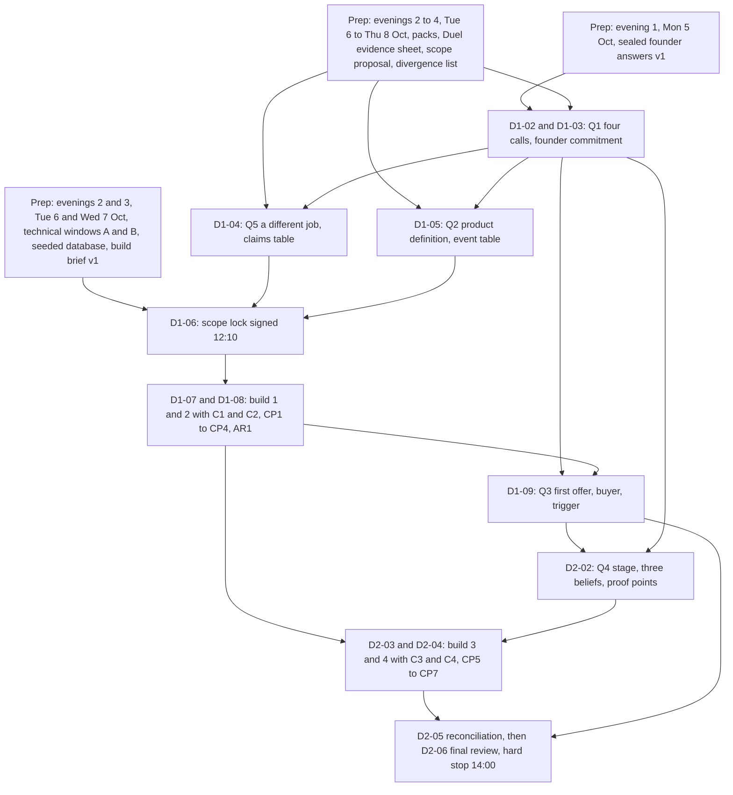
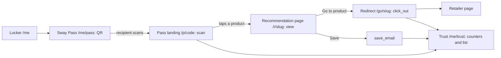

# Sway Barcelona Programme

Planning on four evenings, Mon 5 to Thu 8 Oct 2026. Workshop Sat 10 and Sun 11 Oct 2026 in Barcelona. Follow-through to Sun 18 Oct 2026.
Prepared for Blake (product lead) and Tori (sales lead). Provisional where labelled; see "Read this first".

## Read this first

Prepared Wed 16 Sep 2026. Answer the five questions by Fri 25 Sep 20:00 UK, the same deadline as the three admin anchors; nothing else is required before Mon 5 Oct, and the four preparation evenings run on the provisional assumptions below until you reply.

### What this programme is and what it produces

It is a preparation plan of four evenings (Mon 5, Tue 6, Wed 7 and Thu 8 Oct 2026), with three admin anchors due Fri 25 Sep 20:00 UK and a travel day on Fri 9 Oct, a two-day workshop in Barcelona (Sat 10 and Sun 11 Oct 2026, from 09:00 CEST) and a follow-through week (Mon 12 to Sun 18 Oct), for two founders with day jobs and no facilitator. It produces shared, specific, defensible answers to five questions, decided in this order: what Sway is (D1-02, Sat 09:10), how it is dramatically better than a platform like Duel (D1-04, Sat 10:30), what it does (D1-05, Sat 11:10), how it is sold (D1-09, Sat 17:20) and how capital is raised (D2-02, Sun 09:05); and eight outputs: company thesis, product definition, differentiation thesis, sales strategy, fundraising narrative and deck draft, product priorities, prototype with demo script and known limitations, execution plan. The prototype shows one journey: the advocate (Maya) builds a Locker from My 5 and shows a Sway Pass; the recipient (Sam) scans it and acts on a recommendation page; the advocate sees the outcome as Trust. It is a Demonstration, never evidence of demand. Because preparation is four evenings in the week of the trip, no customer or community conversation happens before the workshop, so the Saturday answer to how it is sold rests on founder hypotheses and leaves the room Provisional. Every decision leaves the room with one of six labels, and every claim in a document carries one of the labels in the glossary in section 6.0 (claim labels, log labels, evidence grades); every Provisional decision leaves with a review trigger (observation, date, owner). The glossary in `00_programme` fixes the spelling of My 5, Locker, Sway Pass, Sway Link, Trust, Sway Points, Trust Map, Founding Member Collective, Brand Collective and brand service package.

### Five questions to answer now

Reply by message; the calendar applies each assumption until you do.

| # | Question | Why it matters | Provisional assumption | If different, what moves |
|---|---|---|---|---|
| 1 | Return flight time, airline, flight number, terminal, checked bag; accommodation checkout time and Sunday bag hold | Day 2 works back from the boarding pass; a locker across town costs 30 to 45 minutes of Sunday | The 18:30 row below: work ends 14:30; D2-06 12:50 to 13:30, hard deadline 14:00; leave 15:00; terminal 16:00; venue is the accommodation, checkout before 09:00, bags held | 20:00 or later: nothing before 12:50 moves; D2-04X 12:50 to 13:55, D2-06 13:55 to 14:50, D2-CT 14:50 to 15:30, D2-07 15:30 to 16:00. Between 18:30 and 20:00: the primary schedule. Between 18:00 and 18:30: the reserve shrinks by the difference (18:20: D2-CT 13:30 to 13:50, D2-07 13:50 to 14:20, leave 14:50). Between 17:00 and 18:00: the early-flight variant (D2-06 12:00 to 12:30, D2-07 12:30 to 13:00; D2-TR, the reserve and the afternoon break lost; CP5 09:50, CP6 10:30, CP7 10:55). Public transport: leave by 14:30; D2-CT dropped, D2-06 stops 13:30, D2-07 13:30 to 14:00. Checked bag or Ryanair: leave 14:45, not 15:00. Bags not held: the accommodation answers in writing by Fri 25 Sep 20:00 UK; if no, a locker is booked by Wed 30 Sep 22:00 UK and 30 minutes are added to the transfer. Different flights: the earlier one sets the cutoff |
| 2 | Which of the four evenings Mon 5, Tue 6, Wed 7 and Thu 8 Oct can each of you protect to 22:00 UK; can the three admin anchors (both flights, the accommodation with a written Sunday bag hold, the passport and EES or ETIAS check) be done by Fri 25 Sep 20:00 UK; and what travel or commitments fall in the week of 5 Oct? | All the preparation sits in those four evenings: 7h15 for Blake (435 minutes) and 6h35 for Tori (395 minutes). Tuesday gates Wednesday, because the My 5 catalogue must reach Blake by Tue 6 Oct 21:00 UK for the seeding | All four evenings protected to 22:00 UK, 90 to 125 minutes each; the three admin anchors done by Fri 25 Sep 20:00 UK; Tori on the same terms as Blake; no required work on any date from Thu 17 Sep to Sun 4 Oct | If an evening is lost, cut in this order: (1) Tori's affiliate coverage spot check, (2) Tori's pricing hypotheses, moved into C1 on Saturday, (3) Tori's alternative desk test, (4) Blake's product pack trimmed to the journey strip and the assumptions list, (5) both divergence columns, so the differences surface live in D1-02, which is slower. Never cut: founder answers v1, technical windows A and B, the My 5 catalogue reaching Blake by Tue 6 Oct 21:00 UK, the flight and accommodation confirmations, and the scope proposal. If both technical windows are lost, the Saturday build starts from nothing, the ordered cut list is applied from item 3 onward at the scope lock, and D1-06 says so. If an anchor slips past Fri 25 Sep, the Sunday cutoff row stays on the 18:30 default and is confirmed on the Thu 8 Oct 21:00 UK call |
| 3 | Confirm "Duel" means duel.tech; say which public materials you can gather yourselves | Q5 (D1-04) uses public pages only; the research holds search snippets, not primary pages; Blake abstains on anything non-public, logged each time | Duel Holdings Limited, trading as Duel at duel.tech, company 08318527 (https://find-and-update.company-information.service.gov.uk/company/08318527, search snippet); not duel.com, a crypto casino (https://en.wikipedia.org/wiki/Duel.com, search snippet) | The reply is the single confirmation point; the identity line Tori writes at the top of the Tue 6 Oct evidence sheet is the written record. Different company: Tori rebuilds the Duel public evidence sheet (Tue 6 Oct 22:00 UK) and the D1-04 comparison set; no time moves. Gather on Tue 6 Oct the ten items in duel_public_offering.md section 7: your own dated screenshots of duel.tech pages, the 2026 report microsite, the Monica Vinader PDF, the 23 Sep 2025 press release, a consumer-side walkthrough of a public Duel-powered sign-up, the Shopify, G2 and Capterra listings, Companies House filings; never a pricing sheet, sales deck, roadmap, internal metric or customer list |
| 4 | Which AI coding tool and accounts exist; whether you can open and export sway-alpha-0-prototype.vjbrillaud.chatgpt.site and who "vjbrillaud" is; whether a Supabase or similar account exists; your phone models | Technical window A (Tue 6 Oct) and technical window B (Wed 7 Oct) are sized for starting from nothing; the clickable prototype is the last-resort demo and its screenshots feed the product prep pack (Thu 8 Oct 22:00 UK); scanning is tested phone to phone | No accounts; Blake creates Lovable Pro, Supabase, GitHub and Bolt.new on a personal email in technical window A on Tue 6 Oct (plans from search snippets, prototype_feasibility.md section 1); the prototype's host and exportability [UNVERIFIED] (context_audit.md 6.2 item 9); one iPhone and one Android between you (programme choice); EU roaming on both | Accounts exist: window A shortens by about 30 minutes. Another tool: build brief v1 (Wed 7 Oct 22:00 UK) names it, dates unchanged. Prototype not exportable or held by a third party: screenshot every screen by Thu 8 Oct 22:00 UK and write 'no export' under heading 4 of the product prep pack; the last resort becomes a static recipient page plus the printed QR. One phone platform: borrow one for the Tue 6 Oct scan test (programme choice). No roaming: laptop hotspot, checked by both on the Thu 8 Oct 21:00 UK call |
| 5 | Your constraints in your own words: employment obligations, intellectual property in the existing materials, non-compete or outside-activity considerations, hours per week, budget for the follow-through week | D1-03 (Sat 10:00 to 10:15) logs hours, full-time trigger, five ownership areas and a disclosure date; D2-02 and the Sat 17 Oct 10:00 UK call and founder agreement (21:00 UK) build on it; the package states none of it (context_audit.md 6.2 items 1 to 8). These are diligence items to confirm with your own legal advice; this programme does not assess them | Day jobs kept through Sun 18 Oct; weekday tasks at most 90 minutes; Blake books independent advice by Tue 13 Oct 22:00 UK at his own cost; no contract content discussed in any session; personal emails for every account; nothing non-public about Duel in any document; spend limited to tools and a credit top-up; no pilot or reward budget | A known obligation: write it under heading 7(e) of answers v1 (Mon 5 Oct 22:00 UK); D1-03 logs it as Provisional with the advice date as trigger; no time moves. An earlier full-time date: D1-03 records it; D2-05 (Sun 11:20) and Sat 17 Oct absorb it. A budget: enters the execution plan at D2-05 and the 30-day plan on Sat 17 Oct; none: Founding Member Collective rewards stay a HYPOTHESIS, unpriced |

### Provisional assumptions this calendar rests on

Each is marked [ASSUMPTION] in the calendar until a founder confirms it.

| Assumption | Used where | If wrong, what changes |
|---|---|---|
| Preparation is four evenings, Mon 5 to Thu 8 Oct, 90 to 125 minutes each, deadline 22:00 UK | Every preparation row | The cut order in question 2; the three admin anchors still stand at Fri 25 Sep 20:00 UK |
| Departure 18:30 from BCN on Sun 11 Oct by taxi. Rule: work ends 4 hours before departure by taxi, 4 hours 30 minutes by public transport, plus 15 minutes for Ryanair or a checked bag (logistics.md section 11 recommended default; transfer times [UNVERIFIED]; booking 20:00 or later is recommended) | Day 2 schedule; D2-01; deadline register; Fri 25 Sep 20:00 UK logistics lock; leave 15:00 by taxi (14:45 with a bag or Ryanair), 14:30 by public transport | Extension variant (20:00 or later), early-flight variant (17:00), or the public-transport row |
| Venue is the accommodation; checkout before 09:00 Sunday; bags held | Day 2 before 09:00; D1-10; Fri 9 Oct venue check | Sunday-night booking or written late checkout; else a locker booked by Wed 30 Sep and 30 minutes more transfer |
| Lovable Pro on your own Supabase project; Bolt.new fallback on the same database; clickable prototype plus static page plus printed QR as last resort | Technical windows A and B; D1-06 build brief v2; D1-07 to D2-04 | Build brief v1 names the other tool, dates unchanged; if CP1 has not passed by 13:30 on Sat 10 Oct, switch to the tool's own built-in backend and note it in known limitations |
| Tori has a day job on the same terms as Blake | Preparation calendar totals; the cut order | Cut order applies; never-cut list stands |
| Neither founder has yet held a brand or community conversation, and none is held before the workshop | D1-09, where the sales answer rests on founder hypotheses and leaves the room Provisional; the Mon 12 Oct outreach to eight to ten marketers; the three conversations due Fri 16 Oct 22:00 UK | Existing notes go into the commercial prep pack (Wed 7 Oct 22:00 UK); the D1-09 answer stays Provisional until the first three conversations are logged (check Fri 23 Oct 22:00 UK, owner Tori) |
| EES exit checks apply; ETIAS may be live by Oct 2026 ([UNVERIFIED], https://travel-europe.europa.eu/ees_en blocked) | 2 hours 30 minutes airport buffer; the Fri 25 Sep passport and EES or ETIAS check | Buffer never shrinks; ETIAS applications in the week of 28 Sep |
| Persona names are fixed as Maya (advocate) and Sam (recipient); D1-05 only confirms them, so founder names never appear on a screen | D1-05; D1-06; build brief v2; demo script | Nothing moves |

### What was verified and how

Only public search evidence and two travel connectors were available, so confirm every logistics figure and every Duel quote yourselves.

| What | How | What it means for you |
|---|---|---|
| Duel's offering, customers, funding, positioning | Web search snippets only; direct fetches of duel.tech, info.duel.tech, g2.com, capterra.com, businesswire.com, crunchbase.com, linkedin.com and about 60 more domains returned 403 (duel_public_offering.md section 7); no internal Duel material used | No primary page read end to end; your own dated screenshots replace the snippets (Tue 6 Oct 22:00 UK); Blake abstains on non-public content |
| Sun 11 Oct flights and Fri 9 Oct arrivals | Kiwi.com and lastminute.com connectors, 16 Sep 2026 [SOURCED] | Real schedules; book on the airline's site; code BCN, not GRO or REU |
| Transfers, terminals, check-in rules, EES, checkout norms, luggage storage, weather | [UNVERIFIED] general knowledge; aena.es, tmb.cat, renfe.com, gov.uk, travel-europe.europa.eu, aemet.es and the airline sites blocked | Confirm the ten items in logistics.md section 11 by Fri 25 Sep 20:00 UK |
| Sun times, holidays, time zones | astral 3.2, holidays 0.104, zoneinfo [COMPUTED] | Reliable |
| Prototype tooling | Apple Wallet pages and the qrcode.react README (primary page fetched); Lovable, Bolt.new and Supabase plans (search snippets) | Prices and credit limits indicative; check the checkout page |
| Gmail and Google Calendar | Could not be read in this session (calendar connector not authorised; Gmail not opened) | Flights, availability and commitments unconfirmed: questions 1 and 2 |
| The clickable prototype | chatgpt.site blocked; not opened | Content, author, hosting [UNVERIFIED]; screenshot every screen by Thu 8 Oct 22:00 UK |
| The founders' package (four PDFs and the current strategy files) | Read in full by the context audit | The 80/20 split and the USD 30K, 75K and 150K packages are HYPOTHESES, never facts |
| Customer and community conversations | None held; the four preparation evenings carry no calls, and the outreach list is only sent on Mon 12 Oct | No customer conversation happens before the workshop; the Saturday sales answer rests on founder hypotheses, is recorded Provisional and is reopened if the first three brand marketers name a different buyer or budget line (check Fri 23 Oct 22:00 UK, owner Tori) |

### How to use this document

- Fri 25 Sep 20:00 UK: answer the five questions and finish the three admin anchors (both flights told to the other founder, the accommodation with a written Sunday bag hold and a confirmed work surface, the passport and EES or ETIAS check), then open section 2 (master calendar and deadline register). Nothing else is required before Mon 5 Oct.
- Mon 5 to Thu 8 Oct: open the Preparation tab (section 3) at your own column each evening; the 22:00 UK deadline is the only fixed element.
- The shared call on Thu 8 Oct 21:00 UK: open the logistics rows and the readiness checklist, confirm the Sunday cutoff row against the booked flights, confirm the venue and bag hold, confirm both technical windows passed and read the cut list aloud.
- Sat 10 and Sun 11 Oct: open the Saturday 10 Oct and Sunday 11 Oct tabs (sections 4A and 4B) for the scannable table, then the runbook of the session in progress; Blake keeps the Prototype plan tab (section 5) open in build blocks, Tori the Templates tab (section 6) in commercial blocks.
- From Sun 11 Oct 12:50 and through Mon 12 to Sun 18 Oct: open the final review runbook (4B.11) and the After the workshop tab (section 7) for the seven-day follow-through.


## 1. Success criteria and programme logic

The workshop succeeds if, by 14:00 on Sun 11 Oct, each of the five questions has one answer both founders would say to a stranger, every answer and log entry carries a trust label, and a prototype shows the decided journey on two phones without being mistaken for evidence of demand.

### 1.1 How the programme answers the five questions

Each question is decided in one named session; the last column is the test D2-06 applies.

| Question | Sessions that produce the answer | Preparation inputs (deadline) | Artefact that holds the answer | What "defensible" means |
|---|---|---|---|---|
| Q1 What is Sway? | D1-02; D1-03 | Sealed founder answers v1 (Mon 5 Oct 22:00 UK); divergence list (Thu 8 Oct 22:00 UK) | One-page company thesis (Q1 block under 120 words); four logged calls | Both would say it to a stranger; names a customer and a behaviour; ShopMy, LTK or Duel could not truthfully say it |
| Q2 What does it do? | D1-05; D1-06; D2-05 | Product prep pack (Thu 8 Oct 22:00 UK), including the journey strip with its event column and Tori's A, D and U marks; scope proposal (Thu 8 Oct 22:00 UK). The full attribution event table is not pre-drafted; it is built live at D1-05, which sets aside 14 of its 40 minutes for it | Product definition v1 with the event table; Q2 block under 150 words | One journey; eight or more exclusions; every event row fakeable and counts-once; matches the frozen prototype |
| Q3 How do we sell it? | C1 and C2; D1-09 | Commercial prep pack (Wed 7 Oct 22:00 UK); pricing and packaging hypotheses (Thu 8 Oct 22:00 UK) | Initial sales strategy v1 (Demonstrable / Hypothetical column); Q3 block under 150 words | One line each for user, buyer, budget holder, trigger, first offer; no unlabelled price; Provisional, because no customer conversation happens before the workshop, with the first three brand conversations due Fri 16 Oct 22:00 UK and the trigger checked Fri 23 Oct 22:00 UK, owner Tori; the launch city named or "not yet chosen"; a currency on every number |
| Q4 How do we raise capital? | C2; D2-02; C3 | Duel public evidence sheet (Tue 6 Oct 22:00 UK); commercial prep pack (Wed 7 Oct 22:00 UK) | Ten-line narrative and 14-slide deck draft; Q4 block under 150 words | No amount, valuation, traction or market size; every headline labelled with a dated gap; slide 11 dated facts only |
| Q5 Dramatically better than Duel? | D1-04; C2; D2-05 | Duel public evidence sheet (Tue 6 Oct 22:00 UK); one alternative desk test (Tue 6 Oct 22:00 UK) | Differentiation thesis (comparison set, ownership paragraph, claims table); Q5 block under 150 words | Three or more demonstrable claims tied to demo beats; Duel from public pages only; "not found publicly"; "better" only inside the question |

### 1.2 Programme logic

Preparation is four evenings, Mon 5 to Thu 8 Oct, with no weekend work and nothing required before Mon 5 Oct: it produces sealed positions and a seeded build environment, Saturday morning spends them on the hardest decisions before the first prompt at 12:55, and Sunday brings product, sales and investor story back into one audited record.



### 1.3 Minimum successful outcome, stretch goals and exclusions

The Saturday ladder (4A.14) and the Sunday ladder (4B.14) fix the floor; nothing below, and no break, dinner or reserve, is traded for time.

At 14:00 on Sun 11 Oct these must exist:

1. Five answers in one document, each labelled; Q1, Q2 and Q5 at least Provisional; Q3 and Q4 at least Draft with owner and date.
2. Decision log with no unlabelled entry and a three-part trigger on every Provisional decision and Open question; signed scope lock (the T9 form, `04_prototype/scope_lock.md`); cut list as struck.
3. The never-cut four on a phone, namely the QR to the recipient (Sam) page, one dominant action, the scan and click_out events, and the scan count for the advocate (Maya); or recording 2 plus the Supabase table; known limitations v1; demo script v2.
4. Product definition v1; differentiation paragraph and comparison set; sales strategy first offer, buyer and trigger; narrative and 14 headlines; product priorities (at least the MVP boundary plus the prototype as built).
5. Execution plan v1 for Mon 12 Oct to Sun 18 Oct with owner and date per action; a status against all eight outputs.

Stretch: six acceptance tests passing at CP5 (Sun 09:55); three clean cold runs at CP7 (11:15); the map, wallet sheet and "What is Sway?" page only while the fix list is empty. Q3 cannot be a Decision this weekend and no Validated finding is available, because the four preparation evenings observe no real users; the five-observation floor is first reachable in the follow-through week.

Out of scope: validating demand, retention, affiliate economics or brand interest; any amount, valuation, market size or traction number; real affiliate links, payouts, Wallet passes, sign-up, Sway Points, Collectives; the substance of either employment contract (legal advice booked Tue 13 Oct 22:00 UK); equity, vesting and the founder agreement (Sat 17 Oct 21:00 UK); anything about Duel not on a public page.

### 1.4 Deliverable maturity at the end of the workshop

Nothing leaves Barcelona above Decision and most deliverables sit at Draft, because preparation is four evenings that observe no real users and no customer conversation happens before the workshop. Follow-through deadlines fall at 22:00 UK on weekdays and 21:00 UK on Sat 17 and Sun 18 Oct; the Fri 16 Oct review call is at 20:00 UK and the Sat 17 Oct call at 10:00 UK (programme choice).

| Deliverable | Maturity at 14:00 Sun 11 Oct | What raises it after the workshop | Owner |
|---|---|---|---|
| 1 One-page company thesis | Decision on the Q1 block; "what we know" lines Draft | Six cold tests (Wed 14 Oct 22:00 UK; Sun 18 Oct 21:00 UK); hero-mechanic review (Sun 18 Oct 21:00 UK) | Tori |
| 2 Product definition | Decision on journey, exclusions and second screen; deferred event rows Draft | Recipient-page cold tests Wed 14 Oct 22:00 UK; Alpha outline Thu 15 Oct 22:00 UK | Blake |
| 3 Differentiation thesis | Draft; demonstrable claims are Demonstrations, the rest Hypothesis | Five community members asked "what does Sway let you do that these do not?" by Fri 20 Nov 22:00 UK (challenge_investor-skeptic.md section 3) | Tori |
| 4 Initial sales strategy | Provisional on the buyer and on the ICP, because no customer conversation happens before the workshop; the rest Draft | Three brand conversations by Fri 16 Oct 22:00 UK, notes in the conversation template, then the trigger checked Fri 23 Oct 22:00 UK; first-offer one-pager Wed 14 Oct 22:00 UK | Tori |
| 5 Fundraising narrative and deck draft | Decision on stage word, three beliefs, proof points, do-not-claim list; slides Draft | Deck v2 with screenshot-backed statistics Fri 16 Oct 22:00 UK | Tori |
| 6 Product priorities | Decision on three columns and the do-not-build list | Alpha outline Thu 15 Oct 22:00 UK; a contract engineer conversation | Blake |
| 7 Working prototype, demo script, known limitations | Demonstration; never evidence of demand | Six cold tests with strangers (Wed 14 Oct 22:00 UK; Sun 18 Oct 21:00 UK) | Blake (prototype); Tori (script); both (limitations) |
| 8 Execution plan | Decision on owners and dates; Open questions carry triggers | Fri 16 Oct review call (20:00 UK) checking each trigger; weekly cadence set Sun 18 Oct 21:00 UK | Tori |

### 1.5 The decision rule and how uncertain decisions are recorded

The rules card signed at D1-01 (Sat 10 Oct 09:00) fixes nine rules; rule 6 is how a disagreement leaves the room.

1. Positions are written before they are spoken; nothing is edited after the swap.
2. The timebox is the arbiter; a logged decision is not reopened the same day unless a new fact appears.
3. The domain owner decides provisionally after restating the other's objection: Blake on product definition, UX, journey, prototype scope, priorities and the do-not-build list (Q2); Tori on positioning, ICP, buyer, offer, pricing hypotheses, first customers and the deck's argument (Q3). Q1, Q4, Q5, the launch city, founder commitment and decision rights are joint, Tori's originator view recorded verbatim, Blake abstaining on non-public Duel content.
4. A joint item unresolved at the timebox takes the option cheaper to reverse with evidence sooner, or if tied the option closer to the source-of-truth documents, labelled Provisional with dissent verbatim.
5. One of six labels per entry: Decision, Provisional, Draft, Demonstration, Validated finding (count, date, founder's name; under five observations stays a Hypothesis), Open question; a working demo or founder agreement validates nothing.
6. Every Provisional decision or Open question carries a three-part trigger: observation in numbers, check date, reporting founder. Worked example: "Hero mechanic = Sway Pass. Provisional. Dissent: Tori expects the card in the chat to be used more. Trigger: reopen if the Pass is offered in fewer than one in five recommendation moments in the six post-workshop cold tests and the first cohort's first two weeks, or if median scan-to-page exceeds 15 seconds; check Sun 18 Oct 2026 21:00 UK and Fri 20 Nov 2026 22:00 UK; owner Blake." Other trigger forms the workshop should use: "reopen if fewer than 3 of 10 cold-test recipients tap the dominant action first, by Fri 20 Nov 22:00 UK, owner Blake"; "reopen if the first brand marketer to hear the offer names a different budget line, by Fri 23 Oct 22:00 UK, owner Tori".
7. The prototype wins in the room, the evidence afterwards: claims downgrade to Hypothesis and the scope lock is never reopened to rescue one.
8. No decisions by exhaustion: nothing strategic after 18:00 on Sat 10 Oct or inside a reserve; the Sunday hard stop is fixed.
9. Build tie-breakers: Tori strikes from the cut list, Blake cannot add; Blake decides whether a fix is attempted or moved to known limitations.

A provisional decision is one line in the log, in this exact form:

"[Topic] = [option chosen]. Provisional. Dissent: [founder] [position, verbatim]. Trigger: reopen if [observation, in numbers where possible]; check [Day DD Mon YYYY HH:MM UK]; owner [founder]."

### 1.6 The three tensions resolved first, and why

D1-02 settles four calls from sealed positions, hardest first, because every later session inherits them; three are the tensions below, and the fourth, the single-player value sentence, is the test each must pass (challenge_consumer-behaviour.md objection 3).

1. Sway Pass versus Sway Link as the hero (context_audit.md tension 5.2; challenge_consumer-behaviour.md objection 1). HYPOTHESIS: a personal QR gets scanned in real social moments, the audit's top-ranked untested assumption. FACT (search snippet, https://get.talkable.com/wallet-pass): brand-scoped QR referral exists, so only the person-owned, cross-brand version is, as far as found, unclaimed. First because it sets the D1-05 journey strip, the demo's first beat and the D1-04 comparison set, and the same routes serve either choice.

2. Who pays first and when brands enter (context_audit.md tension 5.1; challenge_brand-buyer.md objection 1; challenge_investor-skeptic.md objection 2). Current lean on paper: consumer-first (FOUNDER DECISION in 04_COMMERCIAL_AND_LAUNCH.md); treated as a HYPOTHESIS until D1-02 call (c) decides. The buyer's chair finds no budget line for "seeing" and cites a Duel reviewer's "difficulty in proving emotional advocacy's financial worth to the business" (search snippet, https://www.g2.com/products/duel/reviews); the investor's chair says Tori then has nothing to sell for months. Each option on the card changes Tori's C1 first-offer work, the D1-09 buyer and the D2-02 stage framing.

3. Money shown or hidden in the first cohort (context_audit.md tensions 5.4 and 5.14; challenge_consumer-behaviour.md objection 4). HOKA's programme is reported at 5 per cent full price and 3 per cent sale (https://www.hoka.com/en/us/hoka-affiliate-program.html, search snippet; conflicting third-party figures; [UNVERIFIED] until the affiliate coverage spot check, Wed 7 Oct 22:00 UK), so a GBP 100 purchase would leave about GBP 1 for Sway (ILLUSTRATIVE under the 80/20 HYPOTHESIS). A visible commission changes what a recommendation means between friends, and the disclosure line makes it visible regardless. First because it decides the Locker's first screen, the earnings label, the disclosure line in build brief v2 at 12:10 and the D2-02 do-not-claim list.

The divergence list excludes these calls, so each founder first reads the other's position at the D1-02 swap step.

### 1.7 The numbers, audited

Every clock chain, timebox and workload figure in the programme closes, and the sums below are the ones to check on the wall if a block moves.

Day totals:

| Schedule | Blocks in order (minutes) | Sum | Runs | Clock chain |
|---|---|---|---|---|
| Sat 10 Oct, primary | 10+50+15+15+40+40+20+45+120+15+125+5+30+10+30 | 570 (9h30) | 09:00 to 18:30 (18:00 if D1-CT is unused) | 09:10, 10:00, 10:15, 10:30, 11:10, 11:50, 12:10, 12:55, 14:55, 15:10, 17:15, 17:20, 17:50, 18:00, 18:30 |
| Sun 11 Oct, primary (18:30 departure) | 5+25+55+15+35+5+30+45+15+40+30+30 | 330 (5h30) | 09:00 to 14:30 | 09:05, 09:30, 10:25, 10:40, 11:15, 11:20, 11:50, 12:35, 12:50, 13:30, 14:00, 14:30 |
| Sun 11 Oct, extension (departure 20:00 or later) | 5+25+55+15+35+5+30+45+15+65+55+40+30 | 420 (7h00) | 09:00 to 16:00 | unchanged to 12:50, then 13:55, 14:50, 15:30, 16:00 |
| Sun 11 Oct, early flight (departure 17:00 to 18:00) | 5+20+50+15+25+20+45+30+30 | 240 (4h00) | 09:00 to 13:00 | 09:05, 09:25, 10:15, 10:30, 10:55, 11:15, 12:00, 12:30, 13:00 |

Hands-on build: 120 + 125 + 55 + 35 = 335 minutes (5h35) against the 5 hours 30 minutes floor in prototype_feasibility.md; 400 minutes (6h40) in the extension; 320 minutes (5h20) in the early-flight variant, below the floor, which is why the flight booking asks for 18:30 or later. Inside the 335, checkpoints, runs and the cheat test take 5 + 5 + 10 + 5 + 15 + 10 + 13 + 10 = 73 minutes (CP1, CP2, CP3, CP4, AR1, CP5, the three cold runs, the cheat test), leaving 262 minutes of pure prompting.

Checkpoint clock on hands-on minutes: CP1 at 0:25 (13:20); CP2 at 1:25 (14:20); build 1 ends at 2:00 (14:55); CP3 at 2:40 to 2:50 (15:50 to 16:00); CP4 at 3:45 to 3:50 (16:55 to 17:00); AR1 at 3:50 to 4:05 (17:00 to 17:15); CP5 at 4:30 to 4:40 (09:55 to 10:05); build 3 ends at 5:00 (10:25); CP6 at 5:00 (10:40); CP7 at 5:35 (11:15).

Internal timebox sums (every session closes at its block length):

| Session | Steps (minutes) | Sum |
|---|---|---|
| D1-01 | 3+3+2+2 | 10 |
| D1-02 | 6+6+28+6+4; the 28 is four calls at 7 (4 to state, 2 on the D marks, 1 to decide and write the trigger) | 50 |
| D1-03 | 3+3+6+3 | 15 |
| D1-04 | 5+15+8+8+4; the 15 is sheets A 3, B 3, C 4, D 2, E 2, close 1 | 40 |
| D1-05 | 5+6+14+9+6; the 14 is 4 to read the marks, 8 to resolve every D and U cell, 2 to confirm a counts-once rule on every row | 40 |
| D1-06 | 4+5+5+4+2 | 20 |
| D1-07 | Blake 25+5+55+5+30; Tori 25+5+25+30+5+20+10 | 120 |
| D1-08 | Blake 40+10+55+5+15; Tori 40+10+20+35+5+15 | 125 |
| D1-09 | 6+6+12+6 | 30 |
| D1-10 | 4+3+3 | 10 |
| D2-01 | 2+2+1 | 5 |
| D2-02 | 4+4+11+6; the 11 is stage word 1, beliefs 3, proof points 3, why us 3, do-not-claim 1 | 25 |
| D2-03 | Blake 25+10+20; Tori 25+10+20 | 55 |
| D2-04 | 2+13+10+10 (CP6; three cold runs; cheat test; reset re-run, exports, sync and CP7) | 35 |
| D2-05 | 4+12+7+7 | 30 |
| D2-06 | 6+14+12+8; the 14 is about 2 minutes 45 seconds per question (5 x 2.75 = 13.75) | 40 |
| D2-07 | 10+10+10 | 30 |
| D2-04X (extension only) | 30+20+15 | 65 |

Two people can do it: Blake's build minutes never overlap with a session he leads; Tori's checkpoint duties total 40 minutes on Saturday (CP1 5, CP2 5, CP3 10, CP4 5, AR1 15) and 45 minutes on Sunday (CP5 10 and the whole of D2-04, 35), all inside her commercial blocks; every checkpoint falls inside a build block where Blake is already at the laptop; no session needs a third person.

Dependencies: D1-02 (hero mechanic, single-player value, money default) precedes D1-05 (journey, event table), which precedes D1-06 (scope lock), which precedes the first build minute at 12:55; D1-03 (full-time date, owners) precedes D2-02 (why us) and D2-05 (execution plan); D1-04 (demonstrable claims) precedes D1-06 so the demo beats map to claims; D1-02 call (c) precedes D1-09 (first offer); D1-09 and D1-04 precede C2's narrative and headlines, which precede D2-02; D2-02 precedes C3 (slide table); CP4 precedes AR1, which precedes the Sunday fix list; CP7 and C3 precede D2-05; everything precedes D2-06; no session depends on a later one.

Preparation: Blake 435 minutes (7h15) and Tori 395 minutes (6h35) over four evenings, Mon 5 to Thu 8 Oct, each with a 22:00 UK deadline; no preparation falls on a weekend and nothing is required before Mon 5 Oct. Blake 90, 100, 120 and 125 minutes; Tori 90, 105, 105 and 95 minutes; longest evenings Blake Thu 8 Oct 125 minutes and Tori Tue 6 Oct and Wed 7 Oct 105 minutes each. The shared 30-minute call on Thu 8 Oct 21:00 UK sits inside both Thursday budgets, and the category breakdown is the table in section 3.1.

Follow-through week: Blake 540 minutes (9h00; 9h45 with the conditional recipient-page iteration) and Tori 690 minutes (11h30; 12h30 if brand calls 4 and 5 take the Wednesday evening and the offer moves to Sat 17 Oct 21:00 UK). Tori carries the customer conversations that moved out of preparation: 30 minutes of outreach on Mon 12 Oct and three conversations of about 40 minutes by Fri 16 Oct 22:00 UK. Both totals are a proposed workload, pending each founder's availability.


## 2. Master calendar and deadline register

Every date from Mon 5 Oct to Sun 18 Oct 2026 has an owner, an output and a dated deadline, and the whole calendar works back from one fixed point: on the default 18:30 departure from BCN, all work ends 14:30 on Sun 11 Oct. Nothing is required before Mon 5 Oct except the three admin anchors due Fri 25 Sep 20:00 UK.

Conventions for every table in this section:

- Preparation and follow-through deadlines are UK time (BST), written "22:00 UK"; workshop times are Barcelona local (CEST), one hour ahead. Minutes are in brackets.
- "Same evening" for a brand conversation means 22:00 UK that day. Follow-through deadlines are 22:00 UK on weekdays and 21:00 UK on Sat 17 and Sun 18 Oct; the Fri 16 Oct review call is 20:00 UK, the Sat 17 Oct call 10:00 UK, the Thu 8 Oct shared readiness call 21:00 to 21:30 UK (all programme choice).
- Departure 18:30 from BCN on Sun 11 Oct is an ASSUMPTION until both flights are booked and `05_logistics/flights.md` is complete (Fri 25 Sep 20:00 UK). The venue is the accommodation, bags held on Sunday (ASSUMPTION until the accommodation confirms it in writing by Fri 25 Sep 20:00 UK).
- Preparation slots are SUGGESTED, not confirmed; the 22:00 UK deadline is the fixed element. Optional items never count towards the totals in 2.5.

### 2.1 Dated overview

The 18 rows below are the whole programme on one page: one collapsed row of no required work to Sun 4 Oct, the three admin anchors on Fri 25 Sep, four preparation evenings, a travel day, two workshop days and seven follow-through days.

| Date | Phase | Required? | Blake | Tori | Output due | Deadline |
|---|---|---|---|---|---|---|
| Thu 17 Sep to Sun 4 Oct | Preparation | No required work | None | None | None (anything done early is optional and named as such) | None |
| Fri 25 Sep | Admin anchor | Required (15) | Book his flight and tell Tori: airline, number, time, terminal, BCN, bag or no bag | Book her flight and tell Blake: airline, number, time, terminal, BCN, bag or no bag | `05_logistics/flights.md`; the Sunday cutoff row chosen from 2.4 | Fri 25 Sep 20:00 UK |
| Fri 25 Sep | Admin anchor | Required (15) | Book the accommodation if he is the booker | Book the accommodation if she is the booker | Accommodation booked, a written answer on Sunday bag hold, and the work surface confirmed (table, power, Wi-Fi) | Fri 25 Sep 20:00 UK |
| Fri 25 Sep | Admin anchor | Required (10) | Passport validity and EES or ETIAS status check | Passport validity and EES or ETIAS status check | Both checks done and confirmed by message | Fri 25 Sep 20:00 UK |
| Mon 5 Oct | Preparation | Required (evening, 90) | Founder answers v1, alone and sealed (60); read this programme's Read this first and section 1, shared folder opened (30) | Founder answers v1, alone and sealed (90) | `01_answers/blake_v1.md` and `01_answers/tori_v1.md` on each founder's own device, sealed until D1-02, with receipts in `01_answers`; which Duel confirmed by message | Mon 5 Oct 22:00 UK |
| Tue 6 Oct | Preparation | Required (evening; Blake 100, Tori 105) | Technical window A (90): accounts on a personal email, project created, hello-world page with a QR published, scanned phone to phone over mobile data both ways, one paper QR printed; flight and venue details confirmed into the plan (10) | Duel public evidence sheet from public pages only, dated screenshots (45); My 5 list and twelve-product catalogue with image URLs sent to Blake (35); one desk test of ShopMy or LTK, dated screenshot (25) | `05_logistics/readiness.md` part 1 with the published URL and the note that the scan worked; `03_commercial/duel_evidence.md`; `04_prototype/my5_and_catalogue.md`; `03_commercial/alternative_test.md` | Tue 6 Oct 22:00 UK; the catalogue reaches Blake by 21:00 UK |
| Wed 7 Oct | Preparation | Required (evening; Blake 120, Tori 105) | Technical window B (120): six tables created, twelve products seeded from Tori's catalogue with image URLs, build brief v1 under 600 words with the real URL and pass code, seeded Locker published and checked on a phone | Commercial prep pack (75): buyer map, ICP, user, buyer and budget holder, purchase trigger, first-offer options, objections; affiliate coverage spot check on five wellness brands (30) | `04_prototype/build_brief_v1.md` and the seed CSVs; `03_commercial/commercial_pack.md`; `03_commercial/affiliate_coverage.md` | Wed 7 Oct 22:00 UK |
| Thu 8 Oct | Preparation | Required (evening; Blake 125, Tori 95; shared call) | Product prep pack (60); prototype scope proposal (25); read Tori's commercial pack (20); divergence list, his column (20); shared call 21:00 UK | Read Blake's product pack (20); divergence list, her column plus three written challenges to the scope proposal (30); pricing and packaging hypotheses, labelled (30); print and seal both answer sets and pack the paper (15); shared call 21:00 UK | `02_product/product_pack.md`; `04_prototype/scope_proposal.md`; `06_decision_log/divergence_list.md` with both columns; `03_commercial/pricing_hypotheses.md`; both answer sets printed and sealed; one `/hello` load on the call | Thu 8 Oct 22:00 UK; call 21:00 to 21:30 UK |
| Fri 9 Oct | Travel | Required (light, morning); venue check optional on arrival | GitHub sync confirmed; seed CSVs exported (10); travel; venue and transfer check (15) if first to land | Travel; venue check if first to land | Repo commit dated today; seed CSVs on the laptop and in the shared folder; "venue checked" message | Fri 9 Oct 09:00 UK or from the airport; venue check optional (whoever lands first; Sat 08:45 if either lands after 21:00) |
| Sat 10 Oct | Workshop | Required | Leads D1-01, D1-03, D1-05, D1-09; records the others; builds D1-07 and D1-08 (4h05 hands-on) through CP1 to CP4; writes and runs the reset note before AR1; books the taxi at D1-10 for the leave time of the cutoff row in `05_logistics/flights.md` (14:45 on the 18:30 default) | Leads D1-02, D1-04, D1-06, D1-10; records the others; commercial blocks C1 and C2; leads CP1 to CP4 and AR1; signs the scope lock and owns the cut list | Q1, Q5, Q2, Q3 answer blocks; four calls and founder commitment logged; `04_prototype/scope_lock.md` signed and build brief v2 in the tool; CP3 recording 1; `04_prototype/reset_note.md`; fix list v1; differentiation thesis v1; sales strategy v1; thesis one-pager v1; narrative and 14 headlines; demo script v1; Day 1 log closed | Q1 10:00; scope lock 12:10; CP3 16:00; AR1 17:15; Q3 17:50; log closed 18:00; latest end 18:30; dinner 20:30 (protected) |
| Sun 11 Oct | Workshop; Travel | Required | Leads D2-01, D2-05, D2-07; records D2-02 and D2-06; builds D2-03 and D2-04 (1h30 hands-on) through CP5 to CP7; demonstrates as the advocate (Maya) in the final cold run; exports the prototype pack | Leads D2-02 and D2-06; records the others; commercial blocks C3 and C4; leads CP5 to CP7; acts as the recipient (Sam) in every cold run; sends the log and the single source document | Q4 answer block; CP5; deck draft v1; frozen prototype with three clean runs, recording 2 (run 3) and the reset re-run; demo script v2; known limitations v1; product priorities v1; sales strategy final; execution plan v1 with the go-or-no-go metric; eight output statuses; decision log final; single source document | Q4 09:30; CP5 10:05; CP7 11:15; D2-05 11:50; review 13:30 (hard deadline 14:00); all work ends 14:30; leave by 15:00 (14:45 with a bag or Ryanair); terminal 16:00; departure 18:30 (ASSUMPTION) |
| Mon 12 Oct | Follow-through | Required | Prototype archive checked in `04_prototype`; reset procedure run; `access_note.md` updated (30); invitations to five cold-test candidates (10) | Decision log final, five answers, output statuses and execution plan v1 circulated as the single source document; review-trigger tracker opened (60); outreach to eight to ten brand marketers (30) | Single source document; `review_triggers.md`; archive and `access_note.md`; five invitations sent; `03_commercial/outreach_log.md` with eight to ten messages sent | Mon 12 Oct 22:00 UK |
| Tue 13 Oct | Follow-through | Required | Independent legal advice booked (employment contract, IP in existing materials); disclosure note started (60) | Chase the outreach list and book the three brand conversations, each message carrying the one ask (45) | Appointment booked; disclosure draft v0; messages sent with the ask, logged with dates | Tue 13 Oct 22:00 UK |
| Wed 14 Oct | Follow-through | Required | Recipient page cold test with three people not at the workshop and not colleagues (60) | Brand conversations 1 and 2 if booked, else the first-offer one-pager for the D1-09 buyer role (60) | `evidence_prototype_tests.md` (three entries); `offer_v1.md` | Wed 14 Oct 22:00 UK |
| Thu 15 Oct | Follow-through | Required | Alpha specification outline with the one-page data map (90) | Three community leaders in the D1-09 city or the D2-05 candidate city (45); nine-prompt sales-strategy self-check (20) | `alpha_outline_v1.md`; leader outreach log; `sales_strategy.md` with any OPEN QUESTION rows added | Thu 15 Oct 22:00 UK |
| Fri 16 Oct | Follow-through | Required (shared call) | Review call (30); Wallet Create a Pass check on an iPhone (5) | Deck draft v2, verified statistics only, slide 11 as a dated ledger (60); brand conversation 3 if outstanding (40); review call (30) | Deck draft v2; `weekly_review_2026-10-16.md`; the first three brand conversations logged, or a dated no for each name; marketer replies logged; Create a Pass verified or the slide 3 wallet point dropped | Fri 16 Oct 22:00 UK; call 20:00 UK |
| Sat 17 Oct | Follow-through | Required (shared call) | Review call (90): open questions, 30-day plan skeleton, day-90 member number; founder agreement drafted (60) | Same | Founder agreement draft v1; 30-day plan v1 | Sat 17 Oct 21:00 UK; call 10:00 UK |
| Sun 18 Oct | Follow-through | Required | Three more cold tests (six in total); hero-mechanic review against the D1-02 trigger with numbers written (90); recipient-page iteration only if tests 1 to 6 agree on one fault (up to 45); weekly cadence set (15) | Wizard of Oz plan (45); cadence (15) | Six cold-test notes; hero-mechanic outcome; Wizard of Oz plan or result; calendar invites | Sun 18 Oct 21:00 UK |

### 2.2 Essential deadline sequence

Each deadline names what it needs, so a slip shows one step ahead rather than in the room; the never-cut items are listed at the end of 2.5.

1. Fri 25 Sep 20:00 UK: the three admin anchors. Both flights booked and told to the other founder (airline, number, time, terminal, BCN, bag or no bag); the accommodation booked with a written answer on Sunday bag hold and a confirmed work surface; passport validity and EES or ETIAS status checked. Needs: nothing. Sets the Sunday cutoff row in 2.4 and gates nothing else.
   - 1a. Wed 30 Sep 22:00 UK: if bags cannot be held, a locker near Plaça de Catalunya is booked (adds 30 minutes to the Sunday transfer). Needs: the accommodation's written answer.
2. Mon 5 Oct 22:00 UK: founder answers v1 sealed, both, with receipts in `01_answers`; which Duel confirmed by message; Blake has read Read this first and section 1. Needs: nothing (written alone). There is no second pass: v1 is the only version and D1-02 opens those envelopes.
3. Tue 6 Oct 21:00 UK: the My 5 list and the twelve-product catalogue with image URLs reach Blake. Needs: nothing. Gates the Wednesday seeding, so this hour is never moved.
4. Tue 6 Oct 22:00 UK: technical window A (hello-world page with a QR published, scanned phone to phone over mobile data in both directions, paper QR printed); Duel public evidence sheet; the alternative desk test; flight and venue details in the plan. Needs: accounts on a personal email; both phones on mobile data. Gates window B.
5. Wed 7 Oct 22:00 UK: technical window B (six tables, twelve seeded products, the seeded Locker checked on a phone); build brief v1 under 600 words with the real URL and pass code; commercial prep pack; affiliate coverage spot check. Needs: window A; the catalogue from Tue 6 Oct 21:00 UK.
6. Thu 8 Oct 21:00 to 21:30 UK: the shared call. The Sunday cutoff row confirmed against the booked flights; venue and bag hold confirmed; both technical windows confirmed passed; the cut list read aloud; one `/hello` load. No content is discussed. Needs: items 1, 4 and 5. If a founder cannot make it, the checklist is exchanged by message.
7. Thu 8 Oct 22:00 UK: product prep pack; prototype scope proposal; both packs read; divergence list with both columns and Tori's three written challenges; pricing and packaging hypotheses; both answer sets printed and sealed, paper packed. Needs: build brief v1; the two packs exchanged the same evening.
8. Fri 9 Oct 09:00 UK: GitHub sync current; seed CSVs exported. Needs: window B.
9. Sat 10 Oct 10:00: four hardest calls logged; Q1 answer block. Needs: the sealed answers v1; the divergence list; the rules card signed at 09:10.
10. Sat 10 Oct 12:10: scope lock signed (`04_prototype/scope_lock.md`); build brief v2 in the tool. Needs: the Q5 claims table v1 (11:10); product definition v1 (11:50); the scope proposal and Tori's challenges; build brief v1.
11. Sat 10 Oct 16:00: CP3 minimum demo with recording 1. Needs: the scope lock; the seeded database; CP1 (13:25) and CP2 (14:25).
12. Sat 10 Oct 17:15: AR1 fix list v1; reset note written and run once before AR1; claims table complete and differentiation thesis v1; narrative and 14 headlines; demo script v1. Needs: CP4 (17:00); the D1-04 claims table; the Duel public evidence sheet.
13. Sat 10 Oct 17:50: Q3 answer block; sales strategy v1 (launch city named or "not yet chosen"; currency on every number); thesis one-pager v1. Needs: C1 and C2; the commercial pack and the pricing hypotheses; the affiliate coverage spot check; D1-02 call (c); the prototype at CP4.
14. Sat 10 Oct 18:00: Day 1 log closed and labelled; taxi booked for the cutoff row's leave time (14:45 on the 18:30 default). Needs: D1-09; fix list v1.
15. Sun 11 Oct 09:30: Q4 answer block; headlines confirmed. Needs: the C2 narrative and headlines; the Duel public evidence sheet; the D1-03 full-time date; the D1-09 first offer.
16. Sun 11 Oct 10:25: CP5 passed or a reduced fix list; deck draft v1. Needs: fix list v2 from D2-01; the Q4 decisions; the 4B.6 slide table.
17. Sun 11 Oct 11:15: CP7 (frozen prototype, three clean cold runs, recording 2 as run 3, reset re-run); demo script v2; known limitations v1. Needs: CP5; the CP6 freeze at 10:40.
18. Sun 11 Oct 11:50: product priorities v1; execution plan v1 with the go-or-no-go metric; sales strategy final; conflicts decided or logged. Needs: CP7; deck draft v1; sales strategy v1; known limitations v1.
19. Sun 11 Oct 13:30 (hard deadline 14:00): final review: eight output statuses, five answers labelled, log audited. Needs: everything above; the reset procedure (written at D1-08) for the final cold run.
20. Sun 11 Oct 14:30: decision log final sent; single source document on both phones; prototype pack archived; all work ends; leave by 15:00 (14:45 with a bag or Ryanair), terminal by 16:00. Needs: D2-06; taxi at 14:45.
21. Mon 12 Oct 22:00 UK: single source document circulated; review-trigger tracker; archive and access note updated; five cold-test invitations sent; outreach sent to eight to ten brand marketers. Needs: the D2-07 exports.
22. Fri 16 Oct 22:00 UK: deck draft v2, verified statistics only; weekly review with every trigger checked; the first three brand conversations logged, or a dated no for each name; marketer replies logged. Needs: the Mon 12 Oct outreach; the Duel public evidence sheet; the Wed 14 Oct cold tests.
23. Sun 18 Oct 21:00 UK: six cold tests; hero-mechanic review with the numbers; weekly cadence set. Needs: the Wed 14 Oct tests; the D1-02 trigger (Pass offered in fewer than one in five moments, or median scan-to-page over 15 seconds).

### 2.3 Deadline register

Every essential output has one owner, one reviewer (the founder who checks the completion criterion, not a co-author), a dated deadline, a criterion that needs no judgement, and a fallback that never touches breaks, dinner or the departure. The eight required outputs are numbered 1 to 8.

| Deliverable | Owner | Reviewer | Inputs required | Due date and time | Completion criterion | Fallback |
|---|---|---|---|---|---|---|
| The three admin anchors: flights, accommodation, passport checks | Each founder (own flight, own passport); whoever books (accommodation) | Each other | logistics.md section 11 checklist; the cutoff table in 2.4 | Fri 25 Sep 20:00 UK | Airline, flight number, departure, terminal, BCN code and bag told to the other founder; accommodation booked with a written answer on Sunday bag hold and a confirmed work surface (table, power, Wi-Fi); passport validity and EES or ETIAS status checked; the cutoff row chosen | Sunday stays on the 18:30 default; no written bag hold: a locker near Plaça de Catalunya booked by Wed 30 Sep 22:00 UK (adds 30 min); anchors not done by Fri 25 Sep are confirmed on the Thu 8 Oct call |
| Founder answers v1 (each) | Each founder | None (sealed until D1-02) | Seven headings including the five calls; `01_answers/blake_v1.md` and `01_answers/tori_v1.md` stay on the founder's own device, with `01_answers/blake_v1_receipt.md` and `01_answers/tori_v1_receipt.md` in the folder | Mon 5 Oct 22:00 UK | One page, seven headings, five calls in one line each with reasoning, receipt in the folder, sealed until D1-02; there is no second pass, so v1 is the version D1-02 opens | Written on Tue 6 Oct at the cost of the alternative desk test; still missing on Sat 10 Oct: six minutes in-room at D1-02 |
| Which Duel confirmed (Duel Holdings Limited, trading as Duel at duel.tech, company number 08318527) | Both, by message (read-first question 3) | Each other | duel_public_offering.md section 1 | Mon 5 Oct 22:00 UK | Both have replied "confirmed"; the identity line at the top of the Tue 6 Oct evidence sheet is the written record | Until confirmed, an ASSUMPTION; nothing is decided on the Thu 8 Oct call |
| Technical window A: hello-world QR published and scanning | Blake | Tori (scans it) | Accounts on a personal email (the AI build tool, the database, GitHub); both phones on mobile data | Tue 6 Oct 22:00 UK | Page published; scans from both phones over mobile data in both directions; paper QR scans; `05_logistics/readiness.md` part 1 carries the published URL and the note that the scan worked | Never cut; if it will not connect, window B starts on the tool's own built-in backend and the limitation is noted |
| Duel public evidence sheet | Tori | Blake (reads only) | duel_public_offering.md section 7 page list; public duel.tech pages only | Tue 6 Oct 22:00 UK | Identity line at the top; screenshots dated; case-study figures labelled [VENDOR-PUBLISHED]; nothing non-public | Snippets labelled [SNIPPET] and re-verified after the workshop |
| My 5 list and twelve-product catalogue | Tori | Blake (seeds it) | Real products for a Locker, each with an image URL | Tue 6 Oct 21:00 UK | Five products with one-sentence personal reasons; twelve catalogue rows with product URLs and image URLs, in Blake's hands by 21:00 UK | Never cut; illustrative catalogue from prototype_feasibility.md section 5, reasons replaced at D1-06 |
| Alternative desk test (ShopMy or LTK consumer profile) | Tori | Blake | One alternative's public consumer product | Tue 6 Oct 22:00 UK | The same My 5 tried in one alternative; one dated screenshot; findings labelled desk-based | Cut order item 3; alternatives_landscape.md description at search-snippet grade, re-verified after the workshop |
| Technical window B: seeded database and build brief v1 | Blake | Tori (reads the brief) | The catalogue by Tue 6 Oct 21:00 UK; schema in prototype_feasibility.md section 7; section 9 brief | Wed 7 Oct 22:00 UK | Six tables created; twelve products seeded with image URLs; the seeded Locker checked on a phone; brief under 600 words with the real URL and pass code; seed CSVs saved | Never cut; if the database will not connect after two attempts, use the tool's own built-in backend and note it in known limitations; brief verbatim from section 9 |
| Commercial prep pack | Tori | Blake (reads Thu 8 Oct) | The brief's Tori prep list; founder hypotheses only, because no conversation has happened | Wed 7 Oct 22:00 UK | Buyer map; ICP; user, buyer and budget holder; purchase trigger; first-offer options; objections; "none yet" where no evidence exists; every number labelled | Complete by Thu 8 Oct 22:00 UK at the cost of the divergence column |
| Affiliate coverage spot check | Tori | Blake | The My 5 list and the catalogue; five wellness brand pages | Wed 7 Oct 22:00 UK | Five wellness brands each have programme, rate, cookie and approval, or "none found" | Cut order item 1; dropped, the D1-09 answer says "not checked" and the claim is not made |
| Product prep pack | Blake | Tori (reads Thu 8 Oct) | 02_PRODUCT_MODEL.md; screenshots of the existing clickable prototype; context_audit.md 6.2 items 9 to 14 | Thu 8 Oct 22:00 UK | Product hypothesis and core journey on one page; the journey strip; candidate first experiences and scope boundaries; major product assumptions labelled; prototype screenshots attached | Cut order item 4: trimmed to the journey strip and the assumptions list |
| Prototype scope proposal | Blake | Tori (three written challenges the same evening) | Build brief v1; prototype_feasibility.md sections 9 and 10 | Thu 8 Oct 22:00 UK | Journey; six screens with routes; six tests (test 6 without the map); must / mocked / deferred; cut list; personas already fixed as Maya (advocate) and Sam (recipient); the open choice for D1-05 (personal Pass or product-specific QR first) | Never cut; presented verbally, D1-06 takes 30 minutes and every later Saturday block shifts 10 minutes, absorbed by D1-CT (4A.8) |
| Divergence list | Both | Both | The two packs; the scope proposal | Thu 8 Oct 22:00 UK | Up to eight rows each with "what would change my mind" and a deciding session; Tori's three challenges written | Cut order item 5; dropped, the differences surface live in D1-02, which is slower, plus a three-minute find-the-disagreement step per session |
| Pricing and packaging hypotheses | Tori | Blake | The commercial pack; the first-offer options | Thu 8 Oct 22:00 UK | Each option labelled HYPOTHESIS with one line of reasoning and the currency stated | Cut order item 2: moved into C1 on Sat 10 Oct (costs 15 min in the room) |
| Shared readiness call and printed paper | Both (call); Tori (printing and sealing) | Each other | The booked flights; the accommodation answer; both technical windows; the cut list; both answer sets; the cards, fact slips, lock form and D2-06 sheets | Call Thu 8 Oct 21:00 to 21:30 UK; paper Thu 8 Oct 22:00 UK | Cutoff row confirmed against the booked flights; venue and bag hold confirmed; both windows confirmed passed; cut list read aloud; one `/hello` load; Saturday dinner booked for 20:30; both answer sets printed and sealed in signed envelopes and the paper packed | Checklist exchanged by message, no content discussed; cards and sheets kept on the laptops |
| Friday export | Blake | None | The window B project | Fri 9 Oct 09:00 UK or from the airport | Repo last commit dated Fri 9 Oct; seed CSVs on the laptop and in the shared folder | Exported from the airport; nothing else needed |
| Five answers document (`01_answers/five_answers.md`: Q1, Q2, Q5, Q3, Q4 blocks) | Tori | Blake | D1-02, D1-05, D1-04, D1-09, D2-02 | Blocks in session (Sat 10 Oct 10:00, 11:50, 11:10, 17:50; Sun 11 Oct 09:30); reviewed Sun 11 Oct 12:50 to 13:30; sent 14:30 | Each under 150 words (Q1 under 120); each labelled Decision, Provisional or Draft; both would say each to a stranger | Q1, Q2 and Q5 complete; Q3 and Q4 labelled Draft with owner and date |
| Scope lock (`04_prototype/scope_lock.md`, the signed T9 form, with the cut list and checkpoint card) | Tori (signs; cut-list owner) | Blake (recorder) | Scope proposal; Tori's three challenges; product definition v1; the D1-04 demonstrable claims | Sat 10 Oct 12:10 | Tori's signature; every acceptance test observable on a phone; the never-cut four written; checkpoint times on the wall card | Not signed by 12:10: the scope proposal as written becomes the scope with persona names updated; the build starts 12:55 regardless; no claims table from D1-04: beats mapped to the one job and the comparison set, completed at D1-09 |
| Build brief v2 (locked) | Blake | Tori (signs the lock) | Build brief v1; the scope lock; the persona confirmation, disclosure line and copy changes from D1-05 | Sat 10 Oct 12:10 | Under 600 words; every screen names a route; pasted into the tool's project instructions | Brief v1 as written, with Maya and Sam already in it; no additions after 12:10 |
| 1 One-page company thesis (`01_answers/thesis_one_pager.md`) | Tori | Blake | Q1, Q5 and Q2 answer blocks; the C1 scaffold; D1-09 step 4 (T1.9 and T1.11) | Scaffold C1; v1 Sat 10 Oct 17:50; final Sun 11 Oct 13:30 | One page: a sentence no incumbent could truthfully say, customer, insight, positioning, reason to exist, what we know, what we do not know; every claim labelled | Scaffold plus the answer blocks, labelled Draft, finished Mon 12 Oct |
| 2 Product definition (`02_product/product_definition.md`) | Blake | Tori | D1-05, D1-06, D2-05 | v1 Sat 10 Oct 11:50; final Sun 11 Oct 13:30 | One journey; at least eight exclusions; attribution event table complete with the fakeable and counts-once columns; matches the frozen prototype | Journey and exclusions only; event rows for scan, view and click |
| 3 Differentiation thesis (`03_commercial/differentiation_thesis.md`) | Tori | Blake (public-only check) | D1-04, C2 | v0 (draft) Sat 10 Oct 11:10 at D1-04; v1 Sat 10 Oct 17:15 after C2 completes the claims table; final Sun 11 Oct 13:30 | At least three demonstrable claims tied to demo beats; comparison set; ownership paragraph; no "better"; "not found publicly" wording; Duel from public pages only | Paragraph and comparison set only; finished Wed 14 Oct |
| 4 Initial sales strategy (`03_commercial/sales_strategy.md`, fields T4.1 to T4.11) | Tori | Blake | C1 (T4.1 to T4.6, T4.9), C2 (T4.7, T4.8, T4.10), D1-09 (T4.11) | v1 Sat 10 Oct 17:50; final Sun 11 Oct 11:50; nine-prompt self-check Thu 15 Oct 22:00 UK | Nine elements each with at least one line; every number labelled; Demonstrable / Hypothetical column complete; launch city named or "not yet chosen"; currency stated on every number; the whole answer labelled Provisional because no customer conversation preceded it, with the trigger "reopen if the first three brand marketers name a different buyer or budget line; check Fri 23 Oct 22:00 UK; owner Tori" | First offer, buyer and trigger only; Provisional with the Fri 23 Oct 22:00 UK trigger |
| 5 Fundraising narrative and slide-by-slide deck draft (`03_commercial/fundraising_narrative.md`; `deck_draft_v1.md`) | Tori | Blake | C2 narrative and headlines; D2-02; C3; the 4B.6 slide table | Narrative and headlines Sat 10 Oct 17:15; v2 Sun 11 Oct 09:30; slide table into `deck_draft_v1.md` Sun 11 Oct 10:25; final Sun 11 Oct 13:30; deck v2 Fri 16 Oct 22:00 UK | Ten-line narrative; 14 slides with headline, key points, evidence label, gap and closure date; proof points M0 to M3; no amount, valuation, traction or market size; slide 11 dated facts only | Narrative plus headlines; slide detail Fri 16 Oct |
| 6 Product priorities (`02_product/product_priorities_v1.md`) | Blake | Tori | The product prep pack (Thu 8 Oct 22:00 UK); D1-05; D1-06; `scope_lock.md` as applied; D2-05 | Sun 11 Oct 11:50 | Three columns with at least five items each; do-not-build list; prototype column copied from `scope_lock.md` as applied and matching the frozen build | Source-of-truth MVP boundary plus the prototype as built |
| 7 Working prototype with reset note (`04_prototype/reset_note.md`), recordings (`04_prototype/recordings/recording_1_<HHMM>.mp4`, `recording_2_<HHMM>.mp4`) and known limitations (`04_prototype/known_limitations_v1.md`) | Blake (prototype, reset note, recordings); both (limitations) | The other | Build brief v2; CP1 to CP7 and AR1; the reset note written at D1-08 before AR1; the cheat test | CP3 Sat 10 Oct 16:00; reset note written and run once inside D1-08 before AR1; AR1 17:15; CP5 Sun 11 Oct 10:05; CP7 11:15; demo 12:50 | Six acceptance tests pass on two phones, or the never-cut four pass; three clean cold runs under four minutes; reset run once before AR1 and again at CP7; recording 2 is CP7 run 3; limitations list with five headings including cheat findings | Recipient page plus scan plus the Supabase table as the outcome view; recording 2 (or 1) as the demo |
| Demo script v1 and v2 (`04_prototype/demo_script_v1.md`; `04_prototype/demo_script_v2.md`) | Tori | Blake | The six acceptance tests (v1, during AR1); the real screens after CP5 and CP7 and the D1-02 hero choice (v2) | v1 Sat 10 Oct 17:15; v2 Sun 11 Oct 11:15 | Six beats, one per acceptance test, plus the "what this proves and does not" line; v2 timed under four minutes with the recorded run-3 time, leading with the hero mechanic | Recording 2 narrated; a failing run becomes a spoken caveat |
| 8 Execution plan (`06_decision_log/execution_plan_v1.md`, seven columns; Mon 12 to Sun 18 Oct) | Tori | Blake | Decision log; D2-05; the seven follow-through rows in 2.1 | v1 Sun 11 Oct 11:50; final 14:30 inside the single source document | Every decision has an owner; every open question a trigger, a date and an owner; seven daily rows in the seven columns (date, owner, task, time estimate, output, completion criterion, decision or Open question it tests); the go-or-no-go metric for the first cohort written as a row (observation, number, check date) | The follow-through rows adopted as-is with owners confirmed |
| Decision log (all entries labelled) | Tori | Blake | Every session; kept as a sheet of `06_decision_log/live_tables.xlsx` during the workshop and exported to `decision_log.md` at D2-07 | Sun 11 Oct 14:30 | No unlabelled entry; every Provisional decision and Open question has a three-part trigger; sent to both before leaving | None; protected. Labels not done move to Mon 12 Oct; unsigned answers to a Tue 13 Oct 19:00 UK video call |
| Single source document (`00_programme/sway_workshop_record_2026-10-11.md`), review-trigger tracker, prototype archive, `04_prototype/access_note.md` updated, cold-test invitations | Tori (document, tracker); Blake (archive, note, invitations) | Each other | The D2-07 export (decision log final, five answers, eight output statuses, execution plan v1); the log's Provisional and Open rows | Mon 12 Oct 22:00 UK | Both confirm receipt in writing; the archive opens on a clean machine; access note updated; every Provisional decision has a tracker row; five invitations sent to people who are not colleagues | Tue 13 Oct 22:00 UK; the D2-07 export stands as the source meanwhile (programme choice) |
| Brand marketer outreach (eight to ten names) | Tori | Blake | The D1-09 buyer role and first offer; Tori's network | Mon 12 Oct 22:00 UK | Eight to ten messages sent, each naming the one ask, logged with dates in `03_commercial/outreach_log.md` | Sent Tue 13 Oct with the chasers; fewer than eight names: the list is topped up on the Fri 16 Oct call |
| First three brand conversations logged | Tori | Blake | The Mon 12 Oct outreach; the 6a questions; the D1-09 first offer | Fri 16 Oct 22:00 UK | Three conversations logged, one row each: role, brand type, date, verbatim answers, budget line, threshold, what they would pay to see; or a dated no against each name | Fewer than three: the sales answer stays Provisional with the trigger "reopen if the first three brand marketers name a different buyer or budget line; check Fri 23 Oct 22:00 UK; owner Tori" |
| Legal advice appointment, disclosure draft v0, marketer chasers | Blake (advice, disclosure); Tori (chasers) | Each other | The D1-03 log entry; the Mon 12 Oct outreach log | Tue 13 Oct 22:00 UK | Appointment date in the tracker; disclosure v0 dated; every name on the outreach list chased with the one ask and logged with dates | Request sent even if no date is offered; replies (yes or dated no) logged by Fri 16 Oct 22:00 UK; unanswered marketers chased on the call |
| Three prototype cold tests and first-offer one-pager | Blake (tests); Tori (offer, or the first brand conversations) | Each other | The frozen prototype and reset procedure; the five invitations sent Mon 12 Oct; the D1-09 buyer role | Wed 14 Oct 22:00 UK | Three dated entries with first tap, time and verbatim; the one-pager names role, trigger, deliverable and term with no invented price | Tests move to Sun 18 Oct (six in one go); offer to Sat 17 Oct 21:00 UK |
| Alpha outline v1, community leader outreach, sales-strategy self-check | Blake (outline); Tori (outreach, self-check) | Each other | Product priorities; the event table; the D1-09 launch city or the D2-05 candidate city; the nine prompts in 4B.10 | Thu 15 Oct 22:00 UK | Outline covers the seven durable-core elements and the data map; three messages sent with dates; self-check adds OPEN QUESTION rows only | Outline reduced to journey and event table; outreach Sun 18 Oct (programme choice) |
| Deck draft v2, weekly review, Wallet Create a Pass check | Tori (deck); both (call); Blake (Wallet check) | Blake (deck); each other (call) | The Duel public evidence sheet; review-trigger tracker; brand replies; an iPhone | Fri 16 Oct 22:00 UK; call 20:00 UK | No planning-assumption number on any slide; every statistic screenshot-backed or deleted; every Provisional decision has a status; the first three brand conversations logged, or a dated no for each name; marketer replies logged (yes or dated no); Create a Pass verified on an iPhone or the slide 3 wallet point dropped | Unverified statistics deleted, not deferred; the call folds into Sat 17 Oct (programme choice) |
| Founder agreement draft v1 and 30-day plan v1 | Both | Both | The D1-03 log entry; the open questions; the day-90 member number each believes | Sat 17 Oct 21:00 UK; call 10:00 UK | Every open question has an owner and a date; the agreement has all six elements; both have read it | Agreement from the D1-03 entry with placeholders; 30-day plan to Sun 18 Oct (programme choice) |
| Six cold-test notes, hero-mechanic review, Wizard of Oz plan, weekly cadence | Blake (tests, review); Tori (Wizard of Oz); both (cadence) | Each other | The Wed 14 Oct entries; the D1-02 trigger | Sun 18 Oct 21:00 UK | Six tests logged with the same fields; hero-mechanic decision confirmed or re-decided with the numbers written; recipient-page iteration only if tests 1 to 6 agree on one fault; cadence in both calendars; a start date for the first behavioural test | Review with however many tests exist, count stated; Wizard of Oz plan to the first weekly call (programme choice) |

### 2.4 Travel cutoff table

Sunday's end time is a function of the boarding pass, not a preference: the workshop ends four hours before departure by taxi and four hours 30 minutes by Aerobus, metro or train (logistics.md section 11).

The rule: at the terminal by departure minus 2 hours 30 minutes (EES exit checks on a long-weekend Sunday); leave the accommodation 60 minutes before that by taxi (45 driving plus 15 contingency) or 90 minutes by public transport; laptops closed 30 minutes before leaving for packing and bags. Add 15 minutes if flying Ryanair (document check desk) or checking a bag. If the two departures differ, the earlier one sets the shared cutoff unless the founders agree in advance that one leaves first and the other closes the record alone. With a checked bag or a Ryanair flight the 14:45 taxi is the leave time, not 15:00: if it is late at 14:50 take Cabify or Free Now immediately, not the Aerobus. For any other booked departure: between 18:30 and 20:00 run the primary schedule; between 18:00 and 18:30 run the primary with D2-CT shortened by (18:30 minus departure) and D2-07 moved earlier (18:20: D2-CT 13:30 to 13:50, D2-07 13:50 to 14:20, taxi 14:35, leave 14:50); between 17:00 and 18:00 run the early-flight variant; earlier than 17:00 rebook.

| Assumed departure (CEST) | Latest leave accommodation | Latest workshop end | Notes |
|---|---|---|---|
| 17:00 | 13:30 by taxi; 13:00 by Aerobus, metro or train | 13:00 by taxi; 12:30 by public transport | Terminal by 14:30. Early-flight variant from D2-01: half day, review 12:00 to 12:30, no reserve, hands-on build 5h20, below the 5 hours 30 minutes floor in prototype_feasibility.md. Matches easyJet 17:15 to Luton, BA 17:15 to London City, Ryanair UK 17:35 to Manchester. Only if a later flight is impossible. |
| 18:30 (DEFAULT, ASSUMPTION) | 15:00 by taxi; 14:30 by Aerobus, metro or train | 14:30 by taxi; 14:00 by public transport | Terminal by 16:00. The primary schedule: review 12:50 to 13:30, hard stop 14:00, record and pack to 14:30, taxi 14:45. By public transport D2-CT is dropped and D2-07 runs 13:30 to 14:00. Matches Vueling and BA 18:35 to Heathrow, Vueling 18:40 to Manchester. Vueling 18:20 to Gatwick runs the 18:20 sub-rule above. Planning default until flights are booked. |
| 20:00 | 16:30 by taxi; 16:00 by Aerobus, metro or train | 16:00 by taxi; 15:30 by public transport | Terminal by 17:30. Extension variant: build block 5 12:50 to 13:55, review 13:55 to 14:50, hard stop 15:30, all work ends 16:00; nothing before 12:50 changes. Matches easyJet 20:25 to Gatwick and BA 20:40 to Heathrow; BA 19:30 to Heathrow, Ryanair 19:30 to Birmingham, Ryanair 19:35 to Stansted and Vueling or BA 19:40 to Gatwick run the primary schedule (the extension needs 20:00 or later). The recommended booking. |
| 21:30 | 18:00 by taxi; 17:30 by Aerobus, metro or train | 17:30 by taxi; 17:00 by public transport | Terminal by 19:00. The extension variant runs unchanged (work still ends 16:00); the extra 90 minutes are departure slack, never new features (programme choice). Matches BA 21:20 to Heathrow, easyJet 21:40 to Gatwick, 22:00 to Luton, 22:05 to Manchester. Home after midnight for most of London. |

Evidence status. Flight times are [SOURCED] from the Kiwi.com and lastminute.com flight search connectors queried on 16 Sep 2026 (logistics.md section 2); schedules can change, and any booking must show airport code BCN, not GRO or REU, which the same search also returned. Transfer times, the 2 hours 30 minutes buffer and the EES effect are [UNVERIFIED] because the primary pages were blocked; confirm at https://www.aena.es/en/josep-tarradellas-barcelona-el-prat.html, https://www.aerobusbarcelona.es/en, https://travel-europe.europa.eu/ees_en and https://www.gov.uk/guidance/eu-entry-exit-system before Fri 25 Sep. Terminal allocations (Vueling, BA and Iberia at T1; easyJet, Ryanair and Jet2 at T2) are [UNVERIFIED]; the boarding pass is authoritative. Heavy rain or a Rodalies or metro notice on Sunday morning: the reserve is cut to 15 minutes (13:30 to 13:45), D2-07 runs 13:45 to 14:15, the taxi is moved to 14:30 and the founders leave by 14:45; the review keeps 12:50 to 13:30. Taxi not at the pick-up point at 14:50: book Cabify or Free Now at once. The Aerobus from Plaça de Catalunya is the last resort: leaving at 15:00 it reaches the terminal about 16:30 under the 90-minute public-transport rule, 2 hours before an 18:30 departure, acceptable only with hand luggage, online check-in and no Ryanair document check.

### 2.5 Preparation hours per founder

Essential preparation is 7h15 for Blake (435 minutes) and 6h35 for Tori (395 minutes), all of it in four evenings, Mon 5 to Thu 8 Oct, with a 22:00 UK deadline each evening. The three admin anchors on Fri 25 Sep are not planning work and are not counted; each is under 20 minutes. The shared call on Thu 8 Oct 21:00 UK is 30 minutes counted inside both founders' Thursday budgets, and optional items are excluded. The category table (independent strategic thinking, customer conversations, competitive research, material gathering and reading, technical setup) is in 3.1; the split below is the whole of it.

Blake, 435 minutes: independent strategic thinking (founder answers v1) 60; customer conversations 0; competitive research 0; material gathering and reading 165 (product prep pack 60, scope proposal 25, divergence column 20, this programme's Read this first and section 1 30, Tori's commercial pack 20, flight and venue details into the plan 10); technical setup 210 (window A 90, window B 120). Tori, 395 minutes: independent strategic thinking (founder answers v1) 90; customer conversations 0; competitive research 100 (Duel public evidence sheet 45, affiliate coverage spot check 30, alternative desk test 25); material gathering and reading 205 (commercial prep pack 75, divergence column and three challenges 30, pricing and packaging hypotheses 30, My 5 and catalogue 35, Blake's product pack 20, print and seal both answer sets and pack the paper 15); technical setup 0.

Customer conversations are zero for both founders before the workshop. No brand call and no community intercept happens in the preparation evenings, so the Saturday answer to how it is sold rests on founder hypotheses and leaves the room Provisional, with this review trigger: reopen if the first three brand marketers name a different buyer or budget line; check Fri 23 Oct 22:00 UK; owner Tori. The conversations themselves sit in the follow-through week: outreach to eight to ten marketers on Mon 12 Oct and three conversations logged by Fri 16 Oct 22:00 UK.

Evening load: Blake 90, 100, 120 and 125 minutes; Tori 90, 105, 105 and 95 minutes. Longest evening: Blake Thu 8 Oct (2h05); Tori Tue 6 Oct and Wed 7 Oct (1h45 each). No weekend day carries any required work. Reviewer checks add nothing to the totals: they sit inside the budgeted reading and scan steps, and the rest (a row count, a file exists) take under a minute each on the Thu 8 Oct call.

If an evening is lost, cut in this order: (1) Tori's affiliate coverage spot check (30); (2) Tori's pricing and packaging hypotheses (30; moved into C1 on Sat 10 Oct, costing 15 minutes in the room); (3) Tori's alternative desk test (25; alternatives stay at search-snippet grade, re-verified after the workshop); (4) Blake's product prep pack trimmed to the journey strip and the assumptions list (saves about 35); (5) both divergence columns (50 in total; the differences then surface live in D1-02, which is slower). Never cut: founder answers v1, technical windows A and B, the My 5 catalogue reaching Blake by Tue 6 Oct 21:00 UK, the flight and accommodation confirmations, and the scope proposal. If both technical windows are lost, the Saturday build starts from nothing, the ordered cut list is applied from item 3 onward at the scope lock, and D1-06 says so.

Two standing rules follow from the compressed preparation. There is no dress rehearsal of the build tool: Tuesday's hello-world and Wednesday's seeded check are the only proving steps, so if checkpoint CP1 has not passed by 13:30 on Sat 10 Oct, switch immediately to the tool's own built-in backend rather than debugging the external database connection, and note it in known limitations. Competitive evidence is thinner: one desk test of one alternative plus the Duel public evidence sheet, with everything else in the competitive section labelled research-file evidence at search-snippet grade, to be re-verified after the workshop.

Database keep-alive: activity on Tue 6 Oct, Wed 7 Oct, one `/hello` load on the Thu 8 Oct call and the build itself on Sat 10 Oct; the longest gap is two days.


## 3. Daily preparation agendas

Preparation is four evenings, Mon 5 to Thu 8 Oct, and nothing before that except three admin anchors. Open this section on any date from Mon 5 Oct to Fri 9 Oct, find the date, and do what your column says; only the deadlines are fixed. Preparation deadlines are UK time (BST), as in the master calendar, because the work happens in the UK; workshop times are Barcelona (CEST). Paths are relative to the shared folder in 3.2. Journey roles are "the advocate (Maya)" and "the recipient (Sam)"; the founders are Blake and Tori. Every number in a preparation file carries one label: FACT (with source), FOUNDER DECISION, HYPOTHESIS, ASSUMPTION or OPEN QUESTION; the 80/20 split and the USD 30K, 75K and 150K packages are HYPOTHESES wherever they appear. Every slot below is suggested, not confirmed.

### 3.1 Preparation at a glance

Essential work is 435 minutes for Blake (7h15) and 395 minutes for Tori (6h35), across four evenings. No evening asks Blake for more than 125 minutes or Tori for more than 105. Deadlines are 22:00 UK on the evening named, with one exception: Tori's catalogue must reach Blake by Tue 6 Oct 21:00 UK so his Wednesday seeding can use it. Three admin anchors sit before the planning week; each is under 20 minutes, none is planning work, and they are listed at the top of 3.4 rather than counted here.

Essential individual:

| Task | Owner | Minutes | Deadline |
|---|---|---|---|
| Founder answers v1, written alone and sealed | Blake | 60 | Mon 5 Oct 22:00 UK |
| Read "Read this first" and section 1 of this programme | Blake | 30 | Mon 5 Oct 22:00 UK |
| Technical window A (3.3 checks A1 to A5) | Blake | 90 | Tue 6 Oct 22:00 UK |
| Flight and venue details confirmed into the plan | Blake | 10 | Tue 6 Oct 22:00 UK |
| Technical window B (3.3 checks B1 to B4) | Blake | 120 | Wed 7 Oct 22:00 UK |
| Product prep pack | Blake | 60 | Thu 8 Oct 22:00 UK |
| Prototype scope proposal | Blake | 25 | Thu 8 Oct 22:00 UK |
| Read Tori's commercial pack | Blake | 20 | Thu 8 Oct 22:00 UK |
| Divergence list, Blake's column | Blake | 20 | Thu 8 Oct 22:00 UK |
| Founder answers v1, written alone and sealed | Tori | 90 | Mon 5 Oct 22:00 UK |
| Duel public evidence sheet with dated screenshots | Tori | 45 | Tue 6 Oct 22:00 UK |
| My 5 list and twelve-product catalogue, sent to Blake | Tori | 35 | Tue 6 Oct 21:00 UK |
| One desk test of an alternative | Tori | 25 | Tue 6 Oct 22:00 UK |
| Commercial prep pack | Tori | 75 | Wed 7 Oct 22:00 UK |
| Affiliate coverage spot check, five wellness brands | Tori | 30 | Wed 7 Oct 22:00 UK |
| Read Blake's product pack | Tori | 20 | Thu 8 Oct 22:00 UK |
| Divergence list, Tori's column, plus three challenges | Tori | 30 | Thu 8 Oct 22:00 UK |
| Pricing and packaging hypotheses, labelled | Tori | 30 | Thu 8 Oct 22:00 UK |
| Print and seal both answer sets, pack the paper | Tori | 15 | Thu 8 Oct 22:00 UK |

Essential shared (one call only; the pack swap and the divergence list are shared files but individual time, counted above):

| Task | Owner | Minutes | When |
|---|---|---|---|
| Readiness call: cutoff row, venue and bag hold, both technical windows, cut list read aloud; no content | Both; Tori runs it | 30 | Thu 8 Oct 21:00 UK |

Optional (named as optional; nothing here is required and nothing here is assumed done):

| Task | Owner | Minutes | Window |
|---|---|---|---|
| Read duel_customer_evidence.md sections 6a and 6b | Tori | 60 | Any evening before Mon 5 Oct |
| A second or third alternative desk test, 15 minutes each | Either | 30 | Any evening before Thu 8 Oct |
| Arrival evening: venue check 15, stopwatch scan 10 | Either | 25 | Fri 9 Oct, after landing |

Essential minutes by category (optional items excluded; the shared call counted for both).

| Category | Blake | Tori |
|---|---|---|
| Independent strategic thinking (founder answers v1) | 60 | 90 |
| Customer conversations | 0 | 0 |
| Competitive research | 0 | 100 |
| Material gathering and reading | 165 | 205 |
| Technical setup | 210 | 0 |
| Essential total | 435 minutes, 7h15 | 395 minutes, 6h35 |

Three notes on the split. Customer conversations are zero before the workshop: the three brand-marketer conversations and any community intercepts move to the follow-through week (Mon 12 to Fri 16 Oct), where outreach goes out on Mon 12 Oct and the three conversations are due Fri 16 Oct 22:00 UK. Material gathering and reading also carries the small logistics steps inside the planning week, which are Blake's 10 minutes of flight and venue confirmation on Tue 6 Oct and Tori's 15 minutes of printing, sealing and packing on Thu 8 Oct. Competitive research is all Tori's: the Duel public evidence sheet (45), the one alternative desk test (25) and the affiliate coverage spot check (30).

The 30-minute shared call on Thu 8 Oct is counted inside both Thursday budgets and adds no minutes to either total. Reviewer checks add nothing either: they sit inside the budgeted reading and scan steps and the Thu 8 Oct call, and the rest (a row count, a file exists) take under a minute each on the call.

### 3.2 Shared workspace structure

One shared cloud-drive folder of plain files, not a wiki, so everything can be downloaded and opened offline on a phone (programme choice: Google Drive, or Dropbox if both already have it on their phones; Notion with identically named pages only if exported to files before the offline copies are taken on Thu 8 Oct). Blake creates it on Mon 5 Oct, before he starts writing, in the first five minutes of his reading block; both have edit rights; nobody else is invited. Files marked "(created in the room)" are written during the workshop and "(follow-through)" in the week after; they get a status board row from Mon 5 Oct so nothing is invented on the day.

```
Sway_Barcelona_2026/
  00_programme/     WORKSHOP_PACK.md; glossary.md; rules_card.md; checkpoint_card.md; programme.md (this document);
                    output_status.md; consistency_checklist.md; sway_workshop_record_2026-10-11.md (created in the room)
  01_answers/       blake_v1_receipt.md; tori_v1_receipt.md;
                    blake_v1.md; tori_v1.md (arrive at D1-02 from each founder's device);
                    thesis_one_pager.md; five_answers.md (created in the room)
  02_product/       product_pack.md; product_definition.md; product_priorities_v1.md (created in the room);
                    alpha_outline_v1.md (follow-through)
  03_commercial/    commercial_pack.md; duel_evidence.md; alternative_test.md; affiliate_coverage.md; pricing_hypotheses.md;
                    differentiation_thesis.md; sales_strategy.md; deck_draft_v1.md; fundraising_narrative.md (created in the room);
                    outreach_log.md; call_notes_1.md to call_notes_3.md; brand_notes_v1.md; deck_draft_v2.md; offer_v1.md (follow-through)
  04_prototype/     hello_world_qr/; clickable_prototype_screenshots/; my5_and_catalogue.md; build_brief_v1.md; scope_proposal.md;
                    access_note.md; seed_csv/ (six files); build_brief_v2.md; scope_lock.md; cut_list.md;
                    checkpoint_log.md; fix_list_v1.md; fix_list_v2.md; reset_note.md; known_limitations_v1.md;
                    demo_script_v1.md; demo_script_v2.md; recordings/ (created in the room)
  05_logistics/     checklist.md; flights.md; readiness.md
  06_decision_log/  decision_log_template.md; parking_lot.md; divergence_list.md;
                    live_tables.xlsx (decision log, parking lot, checkpoint log and fix lists as one sheet each during the workshop;
                    exported to .md at D2-07); decision_log.md; ownership_v1.md; execution_plan_v1.md; review_register.md (created in the room);
                    review_triggers.md; weekly_review_2026-10-16.md; founder_agreement_v1.md; 30_day_plan_v1.md (follow-through)
  07_evidence/      duel_screenshots/; side_by_side_screenshots/; evidence_prototype_tests.md; wall_D2/ (created in the room);
                    intercept_notes.md (follow-through)
```

Naming convention: folders keep the two-digit prefix; files are lower_snake_case, `.md` for text, `.csv` for data, `.png` for screenshots; versions are suffixes `_v1`, `_v2`, never overwritten; dated evidence starts with the capture date, for example `2026-10-06_duel_tech_home.png`; nothing about Duel that is not on a public page, and nothing from either founder's employer, goes in any file. Sealed files stay on each founder's own device until D1-02; the only shared trace is a one-line receipt such as `01_answers/blake_v1_receipt.md` reading "written Mon 5 Oct, one page, seven headings, sealed" (programme choice). Each founder also prints their own v1 on Thu 8 Oct and seals it in an envelope signed across the flap. The four live tables are kept in one spreadsheet during the workshop (programme choice) because a thirteen-column table cannot be typed live in markdown; the `.md` exports at D2-07 are the archive.

The Workshop pack index, `00_programme/WORKSHOP_PACK.md`, is the one file to open first, with five headings: 1 Status board (File; Owner; Deadline; Status as Not started, Draft, Done or Sealed; Reviewer tick; one row per file above); 2 Links (published prototype URL, Supabase project, GitHub repo, Lovable project); 3 Read order for Sat 10 Oct 08:30 (divergence list, own sealed answers, scope proposal); 4 Contacts (accommodation, taxi app, dinner, both airlines); 5 Kit list. Finishing a task means changing its Status cell; that is the only progress report anyone sends, and the Thu 8 Oct call reads the board line by line.

### 3.3 Technical readiness check (Blake)

There are two windows now, both on weekday evenings, and every check has a pass criterion that can be ticked. Window A is Tue 6 Oct, 90 minutes, and proves the tool chain and the scan. Window B is Wed 7 Oct, 120 minutes, and proves the data and the brief. Check A3 gates everything after it (from prototype_feasibility.md section 8; plan and credit figures there are search snippets, so confirm them on the checkout page). There is no dress rehearsal and no backup-tool test, so the two windows are the only proving steps.

Window A, Tue 6 Oct, 22:00 UK:

| # | Check | Exact steps | Pass criterion | Minutes | Fallback |
|---|---|---|---|---|---|
| A1 | Accounts | Create or log in to Lovable (Pro), Supabase and GitHub, all on a personal email; confirm the plan and credit figures on the checkout page | Logged in to all three; plan and credits written down | 10 | Pro checkout fails: stay free for hello-world and upgrade on Wed 7 Oct before window B |
| A2 | Database | Supabase project `sway-proto`; copy the project URL and the anon key's location (Settings, API) into `04_prototype/access_note.md` | Project shows Active | 10 | None needed |
| A3 | Build project | Lovable project `sway-proto` connected to the Supabase project; GitHub sync to a private repo | Supabase shows connected; repo exists | 15 | Fails twice: switch to the tool's own built-in backend (Lovable Cloud) and note it in `access_note.md` |
| A4 | Hello-world with QR | Prompt: "Create a mobile-first page at /hello that says 'Sway hello' with the current time, and a page at /qr that shows a QR code (qrcode.react, SVG, 240px) encoding the public URL of /hello. Insert one row into a table called hello_events each time /hello loads and show the count on the page." Publish | The published /qr scanned by an iPhone camera and an Android camera opens /hello over mobile data with Wi-Fi off; the count rises on refresh | 35 | Count static: prompt "allow anonymous inserts on hello_events"; QR blank: api.qrserver.com image fallback |
| A5 | Two-way scan and paper QR | /qr on the laptop and on one phone, each scanned from the other phone, both directions; note distance and brightness; print one A4 paper QR for the travel folder; send Tori the published URL and a photo of /qr and ask her to open it over mobile data | Both scans inside 5 seconds; paper QR scans; Tori reports "opened" | 20 | QR to 300 px and brightness to maximum; Tori's check by message before 22:00 UK |

Window B, Wed 7 Oct, 22:00 UK:

| # | Check | Exact steps | Pass criterion | Minutes | Fallback |
|---|---|---|---|---|---|
| B1 | Six tables | Prompt "Create these tables exactly as follows" with the schema from prototype_feasibility.md section 7 (required path); pasting the schema into the SQL editor is an alternative [ASSUMPTION: Blake is comfortable with it]; then prompt "allow anonymous reads on all six tables and anonymous inserts on events, locker_items and recommendations" | Table editor shows all six tables; an anonymous read returns rows | 30 | Access rules are the usual reason a scan count stays at zero; re-run the anonymous-reads prompt before debugging anything else |
| B2 | Twelve products seeded with images | From Tori's catalogue, seed products (twelve rows, each with an image URL that opens, JPG or PNG under 500 KB, uploaded to a public Supabase Storage bucket `product-images` where the brand has no usable URL), users (one advocate, placeholder display name), locker_items (the My 5, is_my5 true), passes (one code), and 6 to 10 events with is_demo_seed true across cities; export each table to `04_prototype/seed_csv/` | Twelve product rows whose image URLs open on a phone; six CSVs saved | 35 | Placeholder image where none is good; catalogue missing: seed the illustrative catalogue from prototype_feasibility.md section 5 and Tori replaces the reasons at D1-06 |
| B3 | Build brief v1 | Write section 9 of prototype_feasibility.md with the real published URL, the pass code, the twelve product names and the recipient-page disclosure line "[Maya] may earn if you buy"; save as `04_prototype/build_brief_v1.md` and as `.txt` on the laptop | Under 600 words; every screen names a route | 35 | Section 9 verbatim with the URL and pass code pasted in |
| B4 | Seeded Locker on a phone | Publish; open `/me` on your phone over mobile data with Wi-Fi off; check the five My 5 products render with images and reasons; screenshot into `04_prototype/hello_world_qr/` | Five products with images and reasons on a phone over mobile data | 20 | Images do not load: check the bucket is public, then fall back to placeholder images and note it in `access_note.md` |

One keep-alive load is enough now. Supabase free projects pause after about seven days without database activity (search snippet, https://supabase.com/pricing), so Blake loads `/hello` from his phone at the start of the Thu 8 Oct call; with windows A and B on Tue 6 and Wed 7 Oct, the longest gap before Sat 10 Oct is two days. If the project shows Paused, restore it from the Supabase dashboard first (one click, a few minutes).

Standing rule for the build, because there is no dress rehearsal: if checkpoint CP1 has not passed by 13:30 on Saturday, switch immediately to the tool's own built-in backend rather than debugging the external database connection, and note it in known limitations.

### 3.4 Agenda by date

Every date from Thu 17 Sep to Sun 4 Oct has no required work. Each working date below gives, per founder, the task, numbered instructions, the output file with its headings, and one row of duration, deadline, workshop use, fallback and reviewer; a suggested slot is a suggestion.

Admin anchors before the planning week. These are not planning work, each is under 20 minutes, and none of them counts towards the 435 and 395 totals.

| Anchor | Owner | Deadline | Note |
|---|---|---|---|
| Book both flights (airline, number, time, terminal, airport code BCN, bag or no bag) and tell the other founder | Each founder | Fri 25 Sep 20:00 UK | Sets the Sunday cutoff row |
| Book accommodation with a written answer on Sunday bag hold, and confirm the work surface (table, power, Wi-Fi) | Whoever books | Fri 25 Sep 20:00 UK | If bags cannot be held, book a locker by Wed 30 Sep |
| Passport validity and EES or ETIAS status check | Each founder | Fri 25 Sep 20:00 UK | 10 minutes |

Nothing else is required before Mon 5 Oct. If the founders want to do more earlier, it is optional and named as such in 3.1.

### Mon 5 Oct

Suggested slot (confirm availability): Blake 19:30 to 21:00 UK; Tori 19:30 to 21:00 UK, each alone, no messages about the content. This is the brief's independent strategic thinking block, and it happens once; there is no second pass.

Both, separately: founder answers v1, sealed. Blake writes for 45 minutes, Tori for 75; the seven headings are the same for both.

1. Write one page on your own device under seven headings: (1) Sway in one sentence, as you would say it to a stranger; (2) the customer problem that matters most, naming the customer and the moment; (3) why a customer would choose Sway over doing nothing; (4) ambitions, constraints and biggest doubts, three short lists; (5) what the other founder may see differently, in your words; (6) what evidence would change my mind, as observations with numbers where you can; (7) the five hardest calls, one line each with reasoning and "what would change my mind": (a) hero mechanic: Sway Pass, Sway Link, or a card sent into the chat with the Pass second; (b) the single-player value sentence: what one person gets on day one with nobody else on it; (c) who pays first and when brands enter: consumer-first alone, consumer-first with two named design-partner brands as unpaid observers, or a paid discovery study as the first offer; (d) money shown or hidden in the first cohort: earnings label on or off by default, the disclosure line present either way; (e) founder commitment: hours per week now, the trigger and date for one founder going full time, and who owns product, pilot recruitment, commercial outreach, operations and fundraising. (Blake 45 min; Tori 75 min)
2. Label every claim FOUNDER DECISION, HYPOTHESIS or OPEN QUESTION; do not edit after saving; do not read the other's. (10 min)
3. Keep the file off the shared drive; add `01_answers/<name>_v1_receipt.md` reading "written Mon 5 Oct, one page, seven headings, sealed". (5 min)

| Duration | Output | Deadline | Workshop use | Fallback | Reviewer |
|---|---|---|---|---|---|
| Blake 60 min; Tori 90 min | `blake_v1.md` and `tori_v1.md` on each founder's device; both receipts in `01_answers/` | Mon 5 Oct 22:00 UK | D1-02 (envelopes opened there); D1-03 | Missing on Fri 9 Oct: six minutes of in-room writing at D1-02, which is the only recovery left | None (sealed) |

Blake, second task: create the folder and read the programme.

1. Create the tree in 3.2 and `WORKSHOP_PACK.md` with its five headings and a status board row per file, including the room-created and follow-through files; paste the glossary from context_audit.md section 8, and the rules card and the checkpoint card from this programme, into their files. (5 min, inside the 30)
2. Read this programme's "Read this first" and section 1, then skim your own column of 3.4 so you know what Tuesday to Thursday ask of you; write one line under Read order in `WORKSHOP_PACK.md`: the assumption most likely wrong. (25 min)

| Duration | Output | Deadline | Workshop use | Fallback | Reviewer |
|---|---|---|---|---|---|
| 30 min | Folder live; `WORKSHOP_PACK.md` with the status board and one line under Read order | Mon 5 Oct 22:00 UK | Every later file; D1-01 | Folder before window A on Tue 6 Oct at the latest, because the Tuesday outputs need somewhere to go; reading trimmed to section 1 only (saves 15 min) | Tori (opens the folder) |

### Tue 6 Oct

Suggested slot (confirm availability): Blake 19:00 to 20:40 UK; Tori 18:45 to 20:30 UK.

Blake: technical window A, then the flight and venue confirmation.

1. Run 3.3 checks A1 to A5 in order; A4 does not start until A3 passes. If the Supabase connection fails twice, switch to the tool's own built-in backend and note it in `access_note.md` rather than spending the evening on it. (90 min)
2. Write both booked flights into `05_logistics/flights.md` under Outbound; Return; Cutoff row (18:30 default; 20:00 or later the extension variant; 18:00 to 18:30 the shortened reserve; 17:00 to 18:00 the early-flight variant); Taxi owner and leave time (15:00 on the 18:30 default; 14:45 with a checked bag or a Ryanair flight). Copy the accommodation bag-hold line and the work-surface answer into `05_logistics/checklist.md`. (10 min)

Output `05_logistics/readiness.md` part 1, headings: 1 Accounts and plan; 2 Project and repo; 3 Published URL; 4 Two-way scan (device, distance, seconds, worked or not); 5 Paper QR; 6 Tori's phone; 7 Open items. The published URL and the line that the scan worked are the two things that must be in it.

| Duration | Output | Deadline | Workshop use | Fallback | Reviewer |
|---|---|---|---|---|---|
| 100 min | `readiness.md` part 1 with the published URL and the scan result; `access_note.md`; `flights.md` with the cutoff row | Tue 6 Oct 22:00 UK | D1-07 (data connection already proven); D2-01 and the Day 2 schedule (the cutoff row) | Slips to Wed 7 Oct and pushes window B into Thu 8 Oct, which costs Blake the product pack; if both windows are lost see 3.6 | Tori (scans the QR and confirms by message) |

Tori: Duel public evidence sheet, the My 5 and catalogue, one alternative desk test.

1. Duel public evidence sheet, public pages only. (a) Open every duel.tech page with the date visible (home, /how-it-works/social-affiliates, /ambassadors, /advocate-portal, /brand-dashboard, /automations, /solutions/ugc-management-platform, /solutions/brand-advocacy-software, /about-us, /customer-stories) and screenshot each to `07_evidence/duel_screenshots/` as `2026-10-06_duel_<page>.png` (20 min). (b) From G2, Capterra, TrustRadius, GetApp and the Shopify app listing copy verbatim, with date, role and company size where shown, the five most recent reviews per site plus every review under four stars, and the total count per site from the listing header; stop at 12 minutes and write "capped" (12 min). (c) Copy the 23 Sep 2025 Series A release and record the named customers and investors (4 min). (d) Write the case-study figures (ELEMIS 11x ROI, Monica Vinader 19x ROAS, Beekman 1802 4x ROAS, Charlotte Tilbury 10x ROI) labelled [VENDOR-PUBLISHED] with their duel.tech URLs, and "pricing not published" (third-party, https://www.affililist.com/software/duel) (5 min). (e) Add the State of Brand Advocacy 2026 microsite with its methodology page and the Monica Vinader PDF (4 min). (45 min)
2. My 5 and the catalogue. Five products you would genuinely put in a Locker, each with a one-sentence personal reason that sounds like a person ("Only sunscreen I will actually wear on a long run"), then twelve catalogue products, each with an image URL that opens. Send the file to Blake by 21:00 UK so his Wednesday seeding can use it. (35 min)
3. One desk test of an alternative, ShopMy or LTK consumer profile. (5) Sign up as a consumer, make the profile public and copy the URL; (8) build a list of the same My 5, timing each product and noting any that cannot be added; (5) send the URL to Blake cold and ask him by message whether it says who you are and why you chose each item, and whether tapping reaches the retailer with any credit to you; (4) look for earning, rewards or recognition for a consumer profile, and for any QR or in-person share option, writing "none found" if there is none; (3) screenshot each step with the date visible into `07_evidence/side_by_side_screenshots/`. (25 min)

Outputs. `03_commercial/duel_evidence.md`, headings: 1 Pages captured (page; URL; date; file); 2 Reviews verbatim (site; date; role; size; quote; URL) with the count per site and "capped" where the cap was reached; 3 Press release; 4 Case-study figures [VENDOR-PUBLISHED]; 4a Microsite, methodology and PDF; 5 Not public (pricing, full integrations list, releases after Oct 2025); 6 Abstentions. The identity line at the top of the sheet is Duel Holdings Limited, trading as Duel at duel.tech, company number 08318527. Duel evidence rules, unchanged: Blake reads the sheet and adds nothing; anything he knows that is not on a public page is written nowhere, and each time it comes up he adds one line under Abstentions naming the topic only; nothing from either founder's employer goes in any file. `04_prototype/my5_and_catalogue.md`, headings: 1 My 5 (product; brand; product URL; image URL; my reason in one sentence); 2 Catalogue (twelve rows, same columns); 3 Products I could not find an image for. `03_commercial/alternative_test.md`, headings: Date and device; Steps with time per step; Where I hesitated; Screenshots; One line: what would Sway have to do better here.

| Duration | Output | Deadline | Workshop use | Fallback | Reviewer |
|---|---|---|---|---|---|
| 105 min | `duel_evidence.md` with screenshots; `my5_and_catalogue.md`; `alternative_test.md` | Tue 6 Oct 22:00 UK; the catalogue to Blake by 21:00 UK | D1-04; D1-02 call (a); the catalogue seeds check B2 | Evidence sheet capped at the pages and the case-study figures (saves 20 min) and the rest stays [SNIPPET]; desk test skipped: alternatives_landscape.md sections 1 to 4 stand as desk evidence, labelled; catalogue late: Blake seeds the illustrative catalogue from prototype_feasibility.md section 5 | Blake (reads the sheet and adds nothing; counts the catalogue rows) |

### Wed 7 Oct

Suggested slot (confirm availability): Blake 19:00 to 21:00 UK; Tori 19:00 to 20:45 UK.

Blake: technical window B.

1. Run 3.3 checks B1 to B4 in order, using Tori's catalogue from Tuesday. B1 is the one to get right: row-level security silently blocking reads or inserts is the usual reason a screen looks empty and a scan count stays at zero, so re-run the anonymous-access prompt before debugging anything else. (120 min)

Output `04_prototype/build_brief_v1.md` (under 600 words, every screen naming a route, the real published URL, the pass code, the twelve product names and the disclosure line "[Maya] may earn if you buy"), plus the six seed CSVs in `04_prototype/seed_csv/` and a table-editor screenshot.

| Duration | Output | Deadline | Workshop use | Fallback | Reviewer |
|---|---|---|---|---|---|
| 120 min | `build_brief_v1.md`; `seed_csv/` (six files); seeded Locker screenshot from a phone | Wed 7 Oct 22:00 UK | D1-06 (brief v2); D1-07 | Brief unwritten: section 9 verbatim with the URL and pass code pasted in; seeding unfinished: the Saturday build starts from empty tables and CP1 carries the seeding as well; project shows Paused: restore it from the Supabase dashboard first | Tori (reads the brief) |

Tori: commercial prep pack, then the affiliate coverage spot check.

1. Founding insight and what must stay true, one page: what prompted the idea (the moment, the person, the product); what "a million times better" meant when you first said it, chosen from outcomes, experience, speed, economics and capability, and for whom; three sentences on what must remain true for Sway to be worth doing; what would make you stop; every line FOUNDER DECISION or HYPOTHESIS. (15 min)
2. Buyer map and ICP: a table (Segment; User; Buyer role; Budget holder; Budget line; Purchase trigger; Signing limit without procurement) with rows for a footwear or apparel brand with retail distribution, a DTC supplement brand, and the consumer advocate; then the ICP in five lines. (20 min)
3. First-offer options: three (paid discovery study; recruitment feed into an existing programme; two unpaid design-partner brands), each with what it needs from the product and the trigger that makes a buyer act. (15 min)
4. Objections and alternatives: at least eight rows (Alternative; What it does well; Where Sway differs, HYPOTHESIS; Objection you expect; Best honest answer) covering ShopMy, LTK, Beacons or Linktree, WhatsApp and doing nothing, Mention Me Name Share, impact.com/advocate, direct run-club sponsorship, and Duel from the public sheet only, writing "not found publicly" rather than "does not have". (20 min)
5. Evidence of demand log: every conversation to date, one row each (Date; Who and role; Context; What they said, verbatim; Label: Validated finding only with a count, a date and your name, otherwise HYPOTHESIS); write "none yet" if it is empty, which it will be until the follow-through week. (5 min)
6. Affiliate coverage spot check: one row per five wellness brands from the catalogue (Brand; Programme, brand-direct or network; Network; Rate; Cookie window; Approval requirement; Sub-ID support) or "none found", searching Awin, impact.com, Rakuten, Amazon Associates and the brand's own site for a UK programme (20 min); then one line of arithmetic, Sway's 20 per cent on GBP 100 of purchases at the real rates found, with the network fee written as an ASSUMPTION (Awin describes a network fee but publishes no rate, search snippet, https://www.awin.com/us/faqs) and HOKA's reported 5 per cent full price and 3 per cent sale kept [UNVERIFIED] until this sheet records the rate from the page itself (10 min). (30 min)

Outputs. `03_commercial/commercial_pack.md`, headings: 1 Founding insight; 2 Buyer map and ICP; 3 First-offer options; 4 Objections and alternatives; 5 Evidence of demand log. `03_commercial/affiliate_coverage.md`, headings: 1 Coverage rows; 2 The arithmetic; 3 What I could not find.

| Duration | Output | Deadline | Workshop use | Fallback | Reviewer |
|---|---|---|---|---|---|
| 105 min | `commercial_pack.md`; `affiliate_coverage.md` | Wed 7 Oct 22:00 UK | C1, C2, D1-09 | Pack trimmed to headings 2 and 4, which are what C1 opens with (saves 35 min); coverage sheet is the first cut in 3.6 and its rows then become a follow-through row | Blake (reads it Thu 8 Oct) |

### Thu 8 Oct

Suggested slot (confirm availability): Blake 18:00 to 21:00 UK and the call at 21:00; Tori 19:00 to 21:00 UK and the call at 21:00. The 30-minute call is counted inside both Thursday budgets and adds no minutes to either total.

Blake: product prep pack, scope proposal, read Tori's pack, divergence column. The attribution event table and the fifteen-row priorities draft are not written in preparation any more; they are filled live at D1-05 and D2-05.

1. Product hypothesis and core journey, one page: the one thing as it stands ("Sway turns trusted product recommendations into measurable commerce", FOUNDER DECISION, 01_CURRENT_STRATEGY.md), the customer, the outcome for the advocate (Maya) and the outcome for the recipient (Sam). (12 min)
2. The journey strip as a table (Step; Who; What the recipient sees; Event logged as scan, view, click_out or save_email; Label): five advocate steps (My 5, Locker, Sway Pass or Sway Link, recommend, see the outcome as Trust) and three recipient steps (scan or open, recommendation page with one dominant action, continue to the product or save). (10 min)
3. Candidate first experiences and scope boundaries: the three-option table below, then the durable core verbatim from 00_SOURCE_OF_TRUTH.md and at least eight exclusions (Sway Points, Collectives, sign-up, affiliate rails, discovery, brand screens, notifications, payments). (15 min)
4. Major product assumptions: at least ten, each labelled FOUNDER DECISION, HYPOTHESIS, ASSUMPTION or OPEN QUESTION (an external fact keeps its evidence grade), starting from context_audit.md section 4 items 1, 2, 3, 7 and 8; one line of "cheapest test" per HYPOTHESIS. (13 min)
5. Screenshots of the existing clickable prototype: open https://sway-alpha-0-prototype.vjbrillaud.chatgpt.site/ and screenshot every screen to `04_prototype/clickable_prototype_screenshots/` as `2026-10-08_screen_01.png` onwards; record who holds the hosting account ("vjbrillaud" is [UNVERIFIED], context_audit.md 6.2 item 9), whether the source can be exported, and whether anything confidential sits on that domain; if the site will not open, screenshot the error and write "not reachable on Thu 8 Oct". (10 min)

Three-option comparison for heading 3 (every cell a HYPOTHESIS until D1-02 call (a) decides):

| Option | Recipient sees first | Advocate does in the moment | Screens needed | Social friction | Cut-list effect |
|---|---|---|---|---|---|
| A Personal Sway Pass first | Pass landing with the My 5, then picks a product | Shows the Pass QR | All six | Phone out, one scan, two taps | Item 4 (Feature a product) is the default cut |
| B Product-specific QR or Sway Link first | The recommendation page directly | Features a product; shows or sends its QR or link | 1, 2, 4, 5, 6; Pass landing optional | One scan or tap, one tap | Item 4 is the hero and cannot be cut |
| C Card sent into the chat, Pass second | A card in WhatsApp, then the recommendation page | Sends the Sway Link later | 1, 4, 5, 6 plus a share sheet | None in the moment; the moment is deferred | Items 1 and 4 cut early; in-person attribution becomes a claim, not a demo |

6. Prototype scope proposal, `04_prototype/scope_proposal.md`, one page, headings: 1 The journey in one sentence; 2 Six screens with routes (`/me`, `/me/pass`, `/p/<code>`, `/r/<slug>`, `/go/<slug>`, `/me/trust`); 3 Six acceptance tests, test 6 without the map (at least one scan, the event list with a city, "1 pending"); 4 Must work, may be mocked, deferred; 5 Cut list 1 to 7 and the never-cut four; 6 Persona names, fixed as Maya (advocate) and Sam (recipient), which D1-05 only confirms so that founder names never appear on a screen; 7 The open choice for D1-05: personal Pass or product-specific QR first (the hero mechanic itself is D1-02 call (a)). (25 min)
7. Read `03_commercial/commercial_pack.md`, `03_commercial/duel_evidence.md` and `03_commercial/affiliate_coverage.md`; write nothing in them, and add nothing to the Duel sheet. (20 min)
8. From the two packs and the scope proposal, not the sealed answers, fill your column of `06_decision_log/divergence_list.md`: up to eight rows (Topic; Blake's position; Tori's position; Evidence that would settle it; What would change my mind, each founder; Deciding session: D1-02, D1-03, D1-04, D1-05, D1-06, D1-09 or D2-02); the five sealed calls are not on it. (20 min)

| Duration | Output | Deadline | Workshop use | Fallback | Reviewer |
|---|---|---|---|---|---|
| 125 min | `02_product/product_pack.md`; `04_prototype/scope_proposal.md`; `06_decision_log/divergence_list.md` (Blake's column) | Thu 8 Oct 22:00 UK | D1-05, D1-06, D2-05 (pack); D1-06 (proposal); every shared session (divergence) | Pack trimmed to the journey strip and the assumptions list (saves 37 min); proposal given verbally, which makes D1-06 30 minutes and shifts every later Saturday block 10 minutes, absorbed by D1-CT; divergence columns cut and the differences surface live in D1-02, which is slower | Tori (three written challenges the same evening) |

Tori: read Blake's pack, divergence column and challenges, pricing hypotheses, print and pack.

1. Read `02_product/product_pack.md` and its screenshots; mark nothing in the file itself. (20 min)
2. Fill your column of `06_decision_log/divergence_list.md` from the two packs and the scope proposal, not the sealed answers, using the same eight-row format as Blake; then add up to three written challenges to the scope proposal under their own heading, for example "does the demo show what we say differentiates us?" and "which claims in my pack does the prototype not support?". (30 min)
3. Pricing and packaging hypotheses, `03_commercial/pricing_hypotheses.md`: the buyer-facing line as it stands ("Sway helps wellness brands turn real customers and community members into measurable advocates", FOUNDER DECISION); three packages with what each includes; every number labelled HYPOTHESIS with the benchmark it rests on (for example Social Snowball USD 249 per month plus 3 per cent, search snippet, https://www.socialsnowball.io/pricing; Duel custom and unpublished, third-party, https://www.affililist.com/software/duel); no number without a label. (30 min)
4. Print and seal both answer sets and pack the paper. Print your own v1 and seal it in an envelope signed across the flap, and confirm on the call that Blake has done the same with his, so the files never cross before D1-02 (5 min); print two copies each of the rules card, the checkpoint card, the decision-log template, the T9 scope lock form, the five-answers sheet and the T12 Part 1 consistency checklist (7 min); pack the paper QR, blank A5 cards, A3 sheets, tape, pens and envelopes (3 min). (15 min)

| Duration | Output | Deadline | Workshop use | Fallback | Reviewer |
|---|---|---|---|---|---|
| 95 min | `divergence_list.md` (Tori's column and three challenges); `pricing_hypotheses.md`; two sealed envelopes; printed cards and sheets | Thu 8 Oct 22:00 UK | D1-06 (challenges); D1-09 and C2 (pricing); D1-01 (cards) | Pricing hypotheses move into C1 on Saturday, which costs 15 minutes of the buyer map; cards and sheets read off laptops; envelopes unsealed: the files stay closed on each device until D1-02 | Blake (reads the challenges) |

Both: 30-minute readiness call at 21:00 UK, Tori runs it, counted inside both Thursday totals.

1. Blake loads `/hello` from his phone so the database records activity. (1 min)
2. Confirm the Sunday cutoff row in `flights.md` against the two booked flights. (5 min)
3. Confirm the venue: bag hold in writing, work surface, power, Wi-Fi. (5 min)
4. Confirm technical windows A and B both passed, naming the published URL and reading the four window B pass criteria aloud. (10 min)
5. Read the cut list in 3.6 aloud, then "Day 1 starts 09:00". (9 min)

No content is discussed. If a founder cannot make the call, the same five-point checklist is exchanged by message by 22:00 UK.

| Duration | Output | Deadline | Workshop use | Fallback | Reviewer |
|---|---|---|---|---|---|
| 30 min | `05_logistics/checklist.md` ticked; status board read; both windows confirmed | Thu 8 Oct 21:30 UK | D1-01 (cutoff, rules card); D2-01 | Checklist exchanged by message by 22:00 UK | Each other |

### Fri 9 Oct

Travel day. One 10-minute job for Blake, nothing for Tori.

| Task | Who | Minutes | Deadline | Used at | Fallback |
|---|---|---|---|---|---|
| Confirm the GitHub sync is current and export the seed CSVs | Blake | 10 | Fri 9 Oct 09:00 UK, or from the airport | D1-07, the first build block | Not done by boarding: it is the first five minutes of D1-07 on Saturday, and the reserve absorbs it |

Done when the repository's last commit is dated Fri 9 Oct and the seed CSVs are on the laptop and in the shared folder. Without them, Saturday's first build block has no product data to build from.

The arrival evening is section 4 of this programme: light, optional, 25 minutes at most, and the sealed answers stay sealed. Optional on arrival: whoever lands first does the 15-minute venue check (moved to Sat 10 Oct 08:45 if either lands after 21:00), and the 10-minute stopwatch scan.

### 3.5 What this costs

The compressed plan buys back nine hours each and pays for it in five places. These consequences are stated here and repeated wherever the programme discusses preparation, evidence or the sales answer.

1. No customer or community conversations happen before the workshop. The three to five brand-marketer conversations and any community intercepts move into the follow-through week (Mon 12 to Fri 16 Oct). The Saturday answer to "how do we sell it" therefore rests on founder hypotheses only. It is recorded as Provisional, with this review trigger: "reopen if the first three brand marketers name a different buyer or budget line; check Fri 23 Oct 22:00 UK; owner Tori."
2. There is no second pass on the founder answers. Only v1 exists, written Mon 5 Oct. D1-02 opens the v1 envelopes.
3. The dress rehearsal of the build tool is gone. Tuesday's hello-world and Wednesday's seeded check are the only proving steps, so the Saturday build carries more risk. New standing rule: if checkpoint CP1 has not passed by 13:30 on Saturday, switch immediately to the tool's own built-in backend rather than debugging the external database connection, and note it in known limitations.
4. Competitive evidence is thinner. One desk test of one alternative, plus the Duel public evidence sheet. Everything else in the competitive section stays labelled as research-file evidence at search-snippet grade, to be re-verified after the workshop.
5. Preparation totals fall from about 15h30 and 17h10 to 7h15 (Blake) and 6h35 (Tori).

### 3.6 What to cut if an evening is lost

Cut in this order, and stop as soon as the evening fits: (1) Tori's affiliate coverage spot check; (2) Tori's pricing hypotheses, which move into C1 on Saturday; (3) Tori's alternative desk test; (4) Blake's product pack trimmed to the journey strip and the assumptions list; (5) both divergence columns, after which the differences surface live in D1-02, which is slower.

Never cut: founder answers v1, technical windows A and B, the My 5 catalogue reaching Blake by Tue 6 Oct 21:00 UK, the flight and accommodation confirmations, and the scope proposal.

If both technical windows are lost, the Saturday build starts from nothing and the ordered cut list is applied from item 3 onward at the scope lock; say so at D1-06.


## 4A. Saturday 10 October: schedule and runbooks

Saturday takes the five answers in the order that removes the most uncertainty first, locks the prototype scope by 12:10 and protects 4 hours 05 minutes of build so a fix list exists before dinner. Times are Barcelona local (CEST); session IDs, times, roles and outputs are the skeleton's. Journey roles are the advocate (Maya) and the recipient (Sam); the founders are Blake and Tori. Details the skeleton leaves open are marked "(programme choice)". Prompt citations: CB is challenge_consumer-behaviour.md, BB challenge_brand-buyer.md, IS challenge_investor-skeptic.md, plus the prompt number.

### 4A.1 Friday 9 October: arrival evening preface (optional, 25 minutes at most: 15 venue check, 10 stopwatch scan; dinner not counted)

The arrival evening is for checking the room and sleeping; nothing shared is required and the sealed notes stay sealed.

1. (15 min) Whoever lands first checks the venue: table, power, Wi-Fi, wall space; the published URL opens on both phones over mobile data; the paper QR scans; the taxi pick-up point is reachable; Sunday checkout and bag hold confirmed [ASSUMPTION: bags held free].
2. (10 min, optional) Tori scans Blake's paper QR three times, stopwatch from "can I see that?" to page; times into `07_evidence/alt_test_notes.md`.
3. (Optional) Both in by 20:30: dinner about 21:00 nearby; no workshop content.
4. Either in after 21:00 (EES checks can add an hour [ASSUMPTION]): sleep; the venue check moves to 08:45 on Sat 10 Oct. Day 1 starts at 09:00 regardless.

### 4A.2 The Saturday schedule at a glance

The day runs 09:00 to 18:30 at the latest (18:00 if the reserve is unused), with dinner at 20:30 protected. "My role" means Blake's. Overruns push later blocks back equally and are absorbed by D1-CT; beyond 30 minutes the Saturday ladder in 4A.14 applies. Breaks, lunch and dinner are never shortened; no strategic decision is made after 18:00. Tori tests only the published URL from a cleared tab; Blake reads no commercial file before the session that names it.

| Time | Activity | My role | Tori's role | Output or decision due |
|---|---|---|---|---|
| 09:00 to 09:10 | D1-01 Open | Lead | Recorder | Rules card signed; log open; cutoff confirmed |
| 09:10 to 10:00 | D1-02 Q1 What is Sway: the four hardest calls | Recorder | Lead | Four calls logged with triggers; Q1 block under 120 words |
| 10:00 to 10:15 | D1-03 Founder commitment and decision rights | Lead | Recorder | Five owners, hours and dates logged |
| 10:15 to 10:30 | D1-BR1 Morning break, away from the table | Break | Break | None |
| 10:30 to 11:10 | D1-04 Q5 A different job, not better features | Recorder; abstains on non-public Duel content | Lead | Comparison set; ownership paragraph; claims table; Q5 block |
| 11:10 to 11:50 | D1-05 Q2 What does it do | Lead | Recorder | Product definition v1; event table v1; Q2 block |
| 11:50 to 12:10 | D1-06 Scope lock; Tori signs at 12:10 | Presents the proposal; recorder | Lead; signs; cut-list owner | Signed scope lock (the T9 form); no additions after 12:10 |
| 12:10 to 12:55 | D1-LU Lunch, real, no laptops; Sunday's food bought | Lunch | Lunch | None |
| 12:55 to 14:55 | D1-07 Build block 1 (screens 1 to 3; CP1 13:20; CP2 14:20) and C1 commercial block 1 | Builds | Leads checkpoints; recorder; drafts T4.1 to T4.6 and T4.9 | CP1: five products with images on Tori's phone. CP2: her scan opens the Pass landing and logs a row |
| 14:55 to 15:10 | D1-BR2 Afternoon break | Break | Break | None |
| 15:10 to 17:15 | D1-08 Build block 2 (screens 4 to 6; CP3 15:50; CP4 16:55; AR1 17:00) and C2 commercial block 2 | Builds | Leads CP3, CP4, AR1; recorder; drafts T4.7, T4.8, T4.10, claims table, narrative, headlines | CP3: scan to retailer, four event rows. CP4: counters change. AR1: fix list v1 |
| 17:15 to 17:20 | D1-TR Transition | Saves and syncs | Lays out `sales_strategy.md` v1 | None |
| 17:20 to 17:50 | D1-09 Q3 How do we sell it: compare and decide | Lead | Recorder | Q3 block under 150 words; sales strategy v1, every number labelled |
| 17:50 to 18:00 | D1-10 Close | Recorder; books the taxi | Lead | Day 1 log closed; fix list v1 on the wall; taxi booked for the cutoff row's leave time (14:45 on the 18:30 default) |
| 18:00 to 18:30 | D1-CT Contingency reserve; unused means the day ends at 18:00 | Builds only if CP3 is still missing at 17:15 | Spends it only as lead of an overrunning session | Nothing new; no strategic decision |
| 20:30 | Dinner, booked Fri 25 Sep 20:00 UK; protected; no laptops | Dinner | Dinner | None |

Sum check: 570 minutes; hands-on build 245 minutes.

### 4A.3 D1-01 Open (09:00 to 09:10, 10 minutes)

**Purpose and question to resolve.** Fix how the two days run so no later minute goes on process: sign the rules, open the record, confirm the seals and the Sunday cutoff; can both state the decision rule and the Sunday end time?

**Required inputs.** Printed rules card, checkpoint card, log template, the 4A.6 fact sheet as cut-out slips; `06_decision_log/divergence_list_v1.md` (Thu 8 Oct 22:00 UK); the sealed "Before we talk" notes (founder answers v1, written Mon 5 Oct 22:00 UK, file on each device plus the printed envelope sealed on Thu 8 Oct); boarding passes.

**Steps.**
1. (3 min) Blake reads the rules card aloud; both sign and date it.
2. (3 min) Tori opens the live tables spreadsheet `06_decision_log/live_tables.xlsx` (decision log and parking lot sheets, exported to `decision_log.md` and `parking_lot.md` at D2-07); checkpoint card and fact sheet on the wall; divergence list on the table.
3. (2 min) Each says aloud "I have not opened the other's notes"; envelopes face down; the Sunday cutoff read against boarding passes [ASSUMPTION: 18:30 departure; work ends 14:30].
4. (2 min) Phones on mobile data and silent; published URL open on both; timer set; entry D1-01-01.

**The reveal method for the sealed "Before we talk" notes (programme choice).** There is one sealed version only. Each founder brings their v1, written alone on Mon 5 Oct, as a file on their own device, unseen by the other, and as a printed copy in an envelope signed across the flap on Thu 8 Oct; at D1-01 the envelopes lie face down. The reveal is at D1-02 step 2: on Tori's call, both open the other's envelope at the same moment and read silently for six minutes, marking each line A (agree), D (differ) or U (unsure); the Q1 card from D1-02 step 1 is handed over with it. Nothing is edited after opening; both files then go into the folder as `01_answers/blake_v1.md` and `01_answers/tori_v1.md` and the marked pages are photographed. No printout: the file is opened on the other's laptop and the lapse logged.

**Discussion prompts.** (One-sentence answers to prove the rules are understood.)
- "State the decision rule for a joint item tied at the timebox."
- "When does work end on Sunday, and when do we leave?"
- "Which six labels exist, and which needs a count, a date and a name?"
- "Who strikes items from the cut list, and who cannot add?"
- "What happens to a new feature idea after 12:10?"
- "Who abstains on non-public Duel statements, and how is that logged?"

**Lead, recorder, artefact owner.** Blake; Tori; Tori (rules card, decision log).

**Tangible output.** The decision log sheet of `06_decision_log/live_tables.xlsx` with entry D1-01-01 and the parking lot sheet open (headings: Idea; Raised by; Time; Session; Triaged at; Outcome), exported to `06_decision_log/decision_log.md` and `06_decision_log/parking_lot.md` at D2-07; the signed rules card photographed.

**Completion criteria.** Six prompts answered without looking; log open; envelopes unopened; URL open on both phones.

**Fallback if we disagree, get stuck, or run late.** A founder is late: D1-02 starts at 09:15; the reserve absorbs five minutes. A rule is disputed: it stands as read on the Thu 8 Oct 21:00 UK checklist call; the objection goes to the parking lot.

### 4A.4 D1-02 Q1 What is Sway: the four hardest calls (09:10 to 10:00, 50 minutes)

**Purpose and question to resolve.** Settle, from sealed positions, the four calls every later session inherits: (a) the hero mechanic (Sway Pass, Sway Link, or a card into the chat; Pass second); (b) the single-player value sentence; (c) who pays first and when brands enter; (d) money shown or hidden in the first cohort; then answer Q1. All four are HYPOTHESES; the outputs are FOUNDER DECISIONS.

**Required inputs.** Sealed v1 (each), written Mon 5 Oct 22:00 UK; a blank A5 Q1 card each (programme choice); divergence rows tagged D1-02 (`06_decision_log/divergence_list_v1.md`, Thu 8 Oct 22:00 UK); the current one thing, "Sway turns trusted product recommendations into measurable commerce" (FOUNDER DECISION, 01_CURRENT_STRATEGY.md, confirmed or rewritten here).

**The divergence list may be thin.** It was written on Thu 8 Oct, the last planning evening, so it may carry fewer rows than planned. A difference found live in this session is handled exactly like a listed one: seven minutes on the call, then rule 4.

**Steps.**
1. (6 min) Alone: re-read own v1; write the Q1 card (description; customer problem; calls (a) to (d) with reasoning and "what would change my mind").
2. (6 min) The reveal (4A.3); swap Q1 card and v1; read silently; mark A, D or U.
3. (28 min) Seven minutes per call, order (a), (c), (b), (d) (programme choice): two minutes per founder to state (4), two minutes on the D marks, one minute to decide or apply rule 4 and write the trigger. Call (a) carries the section 1.5 worked trigger (Pass offered in fewer than one in five moments, or median scan-to-page over 15 seconds; check Sun 18 Oct 21:00 UK and Fri 20 Nov 22:00 UK; owner Blake). Calls (a), (c), (d) are joint; (b) is Blake's for the product sentence, Tori's for the buyer's.
4. (6 min) Write the Q1 block together; test: "could ShopMy, LTK or Duel truthfully say this? If yes, rewrite".
5. (4 min) Blake logs the four calls with labels, triggers and dissent verbatim, Tori's originator view verbatim where they differ.

**Discussion prompts.**
- "The last three times someone asked what you use: where, and when would a QR appear?" (CB 1)
- "If nobody else joined Sway, what would you use your Locker for?" (CB 2)
- "Pass or card as hero? If the scan takes over fifteen seconds, what changes?" (CB 11)
- "Duel has the brand in the room from day one; we do not. What replaces it?" (CB 14)
- "Is a paid word-of-mouth study for one brand a betrayal of consumer-first?" (BB 10)
- "Your run-club friend learns you earned a small commission from her shoes. What does she say?" (CB 4)

**Lead, recorder, artefact owner.** Tori; Blake; Tori (one-page company thesis).

**Tangible output.** `01_answers/thesis_one_pager.md`, "Q1 answer block" (headings: Category; Target customer; Founding insight; Positioning line; Reason to exist; Label; Evidence basis); log entries D1-02-a to d and D1-02-Q1.

**Completion criteria.** Q1 under 120 words, sayable to a stranger, naming a customer and a behaviour, free of the context_audit.md section 8 avoid list; every call labelled, every Provisional one with a trigger.

**Fallback if we disagree, get stuck, or run late.** A call unresolved at seven minutes goes to rule 4 (Provisional, dissent verbatim). Two calls open at 09:45 become Open questions. No sentence by 09:58: the current one thing stands as Provisional, trigger the Fri 16 Oct 20:00 UK review call, owner Tori.

### 4A.5 D1-03 Founder commitment and decision rights (10:00 to 10:15, 15 minutes)

**Purpose and question to resolve.** Settle call (e), which feeds the why-us slide and the execution plan: hours per week now and for the next 90 days; the full-time trigger and date; owners for product, pilot recruitment, commercial outreach, operations and fundraising; the date Blake's written disclosure will exist.

**Required inputs.** Each founder's v1 heading 7(e), now open; IS objection 7; context_audit.md 6.2 items 1 to 8; a blank ownership sheet (programme choice).

**Steps.**
1. (3 min) Alone: hours now and next 90 days; full-time trigger and date; a name per area; disclosure date; technical partner or the plan to find one.
2. (3 min) Swap and read.
3. (6 min) Decide names and dates only; anything awaiting legal advice is Provisional with the advice date as trigger; no contract's substance is discussed.
4. (3 min) Tori logs D1-03-01; the founder agreement (equity, vesting) is drafted on the Sat 17 Oct 10:00 UK call.

**Discussion prompts.**
- "Who is full time on Sway, from what date, funded how, and when will the disclosure exist?" (after IS 13)
- "Who builds the production product: who, hours, cost, start date?" (IS 14)
- "Who is at the launch node weekly for twelve weeks, and what if they cannot be?" (CB 15)
- "What does Tori sell in November, December and January? If nothing, what instead?" (IS 3)
- "If an investor funded the attribution layer but not the network, who takes the money?" (IS 15)
- "Write the day-90 member number we believe; divide it by our evenings per week." (IS 4)

**Lead, recorder, artefact owner.** Blake; Tori; Tori (log entry, feeding D2-02 and D2-05).

**Tangible output.** Log entry D1-03-01 plus `06_decision_log/ownership_v1.md` (headings: the five areas; Hours now and next 90 days; Full-time trigger and date; Disclosure date; Technical partner; Label; Trigger).

**Completion criteria.** One name per area; the full-time trigger is a date or a dated event; the disclosure date is written; hours are numbers.

**Fallback if we disagree, get stuck, or run late.** Not settled at 10:15: logged Provisional with today's split (Blake product; Tori commercial outreach; the rest as first written), trigger the Sat 17 Oct 10:00 UK call; no extension.

### 4A.6 D1-04 Q5 A different job, not better features (10:30 to 11:10, 40 minutes)

**Purpose and question to resolve.** Turn "a million times better" into one job for one customer, using only what is public about Duel: separate what Duel demonstrably offers; what its customers value or struggle with, with evidence; where Sway could be meaningfully different; why someone would switch, use Sway alongside, or adopt it first; what might be hard to copy. Question: what job does Sway do that a brand-owned programme cannot, for whom?

**Required inputs.** `03_commercial/duel_evidence.md` (Tue 6 Oct 22:00 UK); `07_evidence/side_by_side_screenshots/`; `03_commercial/commercial_pack.md` (Wed 7 Oct 22:00 UK); the fact sheet below; D1-02 calls (a) and (c); divergence rows tagged D1-04; sticky notes.

**The Duel fact sheet for the wall.** Every row is public, from duel_public_offering.md at its evidence grade, printed as eight cut-out slips on Thu 8 Oct; Tori reads it, Blake adds nothing; a row Tori cannot match to her own screenshot is struck.

| # | Public fact about Duel | Source URL | Evidence label |
|---|---|---|---|
| 1 | Duel Holdings Limited, company 08318527, London; "A Brand Advocacy Platform for consumer retail brands" | https://find-and-update.company-information.service.gov.uk/company/08318527 | [SNIPPET] |
| 2 | Social Affiliates and Ambassadors programmes; "tasks, missions and briefs that are completed to earn points that unlock rewards"; Advocate Portal with a "shoppable, personalized storefront" and "personalized affiliate and referral links" | https://www.duel.tech/how-it-works/ambassadors; https://www.duel.tech/how-it-works/advocate-portal | [SNIPPET] |
| 3 | Commission statuses: Paid, Unclaimed, Returned, Failed, Onhold, Blocked, Refunded | https://info.duel.tech/help/commission | [SNIPPET] (knowledge base) |
| 4 | Brand Dashboard: social connections, UGC gallery, reach and engagement, ecommerce and CRM integration | https://www.duel.tech/how-it-works/brand-dashboard | [SNIPPET] |
| 5 | Gross Advocacy Value combines "tracked affiliate or conversion data" with "earned media value (EMV)"; "proprietary Advocate Intelligence Graph" (detail [NEEDS SOURCE]) | https://www.duel.tech/glossary/gross-advocacy-value; https://www.g2.com/products/duel/reviews | [SNIPPET] |
| 6 | Series A of USD 16 million, 23 Sep 2025; customers Lush, ELEMIS, Victoria's Secret, Abercrombie & Fitch | https://www.businesswire.com/news/home/20250923705563/en/Brand-Advocacy-Platform-Duel-Raises-$16M-in-Series-A | [PRESS RELEASE] |
| 7 | Monica Vinader "16,608 members (as of Sep 2023)", "19x ROAS"; ELEMIS 11x ROI and Charlotte Tilbury 10x ROI (duel.tech case-study pages; URLs captured on the sheet, Tue 6 Oct); pricing "custom", not published | https://www.duel.tech/case-studies/monica-vinader; https://www.affililist.com/software/duel | [VENDOR-PUBLISHED]; [THIRD-PARTY] via snippet |
| 8 | A personal, cross-brand QR or wallet pass attributing an in-person recommendation to a named recipient: not found publicly (49 searches) | alternatives_landscape.md section 4 | [NEEDS SOURCE] for absence |

Beside it, one customer struggle from duel_customer_evidence.md: "the difficulty in proving emotional advocacy's financial worth to the business" (https://www.g2.com/products/duel/reviews, search snippet, September 2024). A brand wanting in-person attribution is not found publicly; it is a HYPOTHESIS.

**Steps.**
1. (5 min) Swap and read the memos and replies; cross out any reply line relying on a feature outside the MVP boundary; Blake writes nothing about Duel and Tori logs the abstention (D1-04-abstain).
2. (15 min) Five sheets A to E on the wall, one sticky note per item, initials on each:
   - A, What Duel demonstrably offers (3 min): Tori sticks the pre-printed fact-sheet slips that match her own screenshots; nothing else enters A; Blake reads only.
   - B, What customers value or struggle with (3 min): one note per item from the Duel evidence sheet and the commercial prep pack, each with a URL and a label; no brand conversation happened before the workshop, so founder-held items are [FOUNDER ASSERTION] and the brand conversations run in the follow-through week.
   - C, Where Sway could be meaningfully different (4 min): two minutes alone, then merge; every note names the customer and the advantage type (outcomes, experience, speed, economics or capability); candidates: who can be an advocate; where recommendation is observed; who pays first; who owns the record. Anything Duel could truthfully claim is struck.
   - D, Why switch, use alongside, or adopt first (2 min): switch defaults to "no brand replaces a supported programme in 2027"; alongside is a feed of people outside the brand's programme and CRM; first is a brand with no programme or a member with no brand; "doing nothing" (say the name; send the link) written honestly.
   - E, What might be hard to copy (2 min): each note ends "because" and names a test; density in one node (IS objection 5) is a HYPOTHESIS.
   - (1 min) Tori closes by reading aloud the one job, for whom, the comparison set (consumer side ShopMy, LTK, Linktree or Beacons, WhatsApp; brand side Duel, Mention Me, impact.com, Extole, Talkable, doing nothing) and the claims the prototype can show.
3. (8 min) Write the "who owns the advocate" paragraph: identity, consent, export, what a brand keeps when a contract ends; Blake the product half, Tori the commercial half.
4. (8 min) Claims table v1 from C, D and E: claim; versus whom; demonstrable Sunday?; evidence label; hard to copy because. Claims about alternatives cite a URL or a founder's test note and say "not found publicly"; "better" is struck.
5. (4 min) Q5 answer block under 150 words; Blake logs D1-04-Q5, Tori's originator view verbatim.

**Discussion prompts.**
- "What does a Sway page give a recipient that an LTK List over WhatsApp does not?" (IS 2)
- "Duel already says the lever is 'the people who already love you'. What do we believe that it does not?" (IS 10)
- "Public information only: why is our Trust Map different from an incumbent's intelligence graph?" (BB 13)
- "Who owns the advocate when a brand's contract ends? Write the contract paragraph." (BB 7)
- "List the data we hold on day ninety; cross out what an incumbent could get. Moat, feature, or report?" (IS 9)
- "If a brand says 'send me the list and I will invite them', do we say yes, at what price?" (BB 2)

**Lead, recorder, artefact owner.** Tori; Blake; Tori (differentiation thesis).

**Tangible output.** `03_commercial/differentiation_thesis.md` v0 (draft; v1 at 17:15 once C2 completes the claims table) (headings: The one job and for whom; Comparison set; Who owns the advocate; Claims table (Claim | Versus whom | Demonstrable Sunday? | Evidence label | Hard to copy because); Q5 answer block; What we do not know); log entries D1-04-abstain, D1-04-Q5.

**Completion criteria.** At least three claims labelled demonstrable, each tied to a prototype beat or a prep artefact; nothing non-public about Duel; the answer names the customer, the advantage type and the alternative it beats; "better" only inside the question.

**Fallback if we disagree, get stuck, or run late.** Step 2 overruns: record the one job and the comparison set; the claims table goes to C2. No agreement on the one job: adopt duel_customer_evidence.md section 7's three-part difference as Provisional, trigger "reopen if the first three marketers name a different difference, by Fri 23 Oct 22:00 UK, owner Tori". A tie goes to rule 4. The memos are not written in preparation: they are written in the room, 8 minutes, so every later clock time shifts back 8 minutes and D1-CT absorbs it.

### 4A.7 D1-05 Q2 What does it do (11:10 to 11:50, 40 minutes)

**Purpose and question to resolve.** Answer Q2 (core experience, primary journey, outcome, exclusions); define the attribution events, which move Trust and which move Sway Points, how each can be faked; decide the recipient's second screen, sign-up moment, earnings label and disclosure line, and confirm the persona names, so the scope lock at 11:50 is a signature.

**Required inputs.** D1-02 calls (a), (b), (d); `02_product/product_pack.md` (Thu 8 Oct 22:00 UK: the journey strip as a table with its event column, carrying Tori's A, D and U marks and her pre-filled brand column from her Thu 8 Oct read; the full attribution event table is built here, not brought in pre-drafted); prototype_feasibility.md sections 7 and 9; divergence rows tagged D1-05.

**Steps.**
1. (5 min) Alone: mark the journey strip (keep, move, strike); list exclusions; tick the events that should count as Trust.
2. (6 min) Compare strips step by step; the hero mechanic is decided, so only ordering and the second screen are open.
3. (14 min) Event table, edit and agree, from Blake's pre-drafted table in the product prep pack (seven rows: scan; view; save; click; purchase where visible; repeat; downstream recommendation; seven data columns: what is known; what is inferred; how it can be faked and the counts-once rule; moves Trust?; moves Sway Points?; shown to the advocate as; claimable to a brand as, auditable by a finance team without an integration) with Tori's A, D and U marks and her pre-filled brand column from her Thu 8 Oct read: 4 minutes reading the marks aloud, 8 minutes resolving every D and U cell, 2 minutes confirming a counts-once rule on every row.
4. (9 min) Decide, Blake's domain after hearing Tori: second screen (product page, or the rest of the Locker); sign-up moment; Sway Points in the Alpha or not; earnings label ("N pending, eligibility not yet confirmed", no currency) or off, per call (d); the disclosure line "[persona] may earn if you buy"; the persona names, fixed as Maya (advocate) and Sam (recipient) and only confirmed here, so no founder's name appears on a screen or in a script line.
5. (6 min) Q2 answer block (core experience; how it works, the event chain in one sentence; outcome; what is in the first product and what is excluded); Tori logs D1-05-Q2 and one row per decision.

**Discussion prompts.**
- "Second screen: the product page, or the rest of the advocate's Sway? Which grows Sway, which earns?" (CB 7)
- "Which action first moves Sway Points, and how would two housemates fake it?" (CB 6)
- "Which events need the recipient to identify themselves, and what do we hold if nobody does?" (IS 7)
- "Which of scan, view, save, click or purchase could a finance team audit without an integration?" (BB 4)
- "Ship only Locker, card, Pass and recipient page, no Sway Points or Earn: what do we lose?" (CB 13)
- "A recipient buys via a coupon site three days after scanning: what does Sway show?" (IS 6)

**Lead, recorder, artefact owner.** Blake; Tori; Blake (product definition).

**Tangible output.** `02_product/product_definition.md` v1 (headings: Core experience; Primary journey; Outcome; Explicit exclusions; Attribution event table; Decisions from D1-05; Q2 answer block; Open questions).

**Completion criteria.** One journey; at least eight exclusions; every event row complete including the fakeable column and a counts-once rule; Q2 under 150 words.

**Fallback if we disagree, get stuck, or run late.** Table overruns: scan, view and click rows only; the rest at D2-05. Second screen not agreed: the product page stands as Provisional, trigger the six cold tests checked Sun 18 Oct 21:00 UK with Wed 14 Oct as an interim read, owner Blake. Sway Points not agreed: out of the Alpha as Provisional, trigger "week-two return below the go-or-no-go number set at D2-05; check Fri 20 Nov 22:00 UK; owner Blake".

### 4A.8 D1-06 Scope lock (11:50 to 12:10, 20 minutes)

**Purpose and question to resolve.** Lock the journey, six screens, six acceptance tests, cut list, never-cut four and checkpoints before any building, and make the lock a signature rather than a debate; does Tori sign at 12:10?

**Required inputs.** `04_prototype/scope_proposal.md` (Thu 8 Oct 22:00 UK); Tori's three written challenges (Thu 8 Oct 22:00 UK); product definition v1; `04_prototype/build_brief_v1.md` (Wed 7 Oct 22:00 UK); the D1-04 demonstrable claims; the checkpoint card; the T9 scope lock form (section 6.10), printed with the cards.

**Steps.**
1. (4 min) Blake reads the scope proposal aloud; Tori's three challenges answered in one line each on the form (T9.7).
2. (5 min) Must work, mocked and deferred rows filled (T9.3); each demo beat mapped to a D1-04 claim (T9.2); the confirmed persona names, disclosure line and D1-05 copy changes applied to the brief (T9.6); test 6 in its no-map form (T9.4).
3. (5 min) Cut list 1 to 7 and the never-cut four confirmed; checkpoint times on the wall card (T9.5).
4. (4 min) Blake pastes brief v2 into the tool's project instructions; Tori signs; both say aloud "no new features after 12:10" (T9.8).
5. (2 min) Blake logs "scope locked 12:10" (D1-06-01) and photographs the signed form.

**The scope lock sheet.** The sheet is the T9 form (section 6.10, fields T9.1 to T9.8); the cut-list order, the never-cut four and the checkpoint times on it are copied from 5.8 and the checkpoint card; the D1-05 decisions (persona names, disclosure line, earnings label) fill T9.1 and T9.6.

**If both technical windows were lost.** If neither technical window A (Tue 6 Oct) nor technical window B (Wed 7 Oct) was completed, the Saturday build starts from nothing. The ordered cut list is applied from item 3 onward at this session, before Tori signs, and the reduced scope is what goes on the T9 form.

**The rule that nothing enters the build after the lock.** From 12:10 on Sat 10 Oct until CP6 at 10:40 on Sun 11 Oct, the only permitted changes are a fix to something on the sheet that is broken, a cut from the cut list in order, and copy changes to an existing screen from Tori's five-second test at CP3 (at most three, logged, batched into one prompt in the first 5 minutes of the screen-6 slot or deferred to fix list v1; never a separate interruption). A new screen, route, field, event type, integration or persona is a feature: it goes on the parking lot, triaged at D1-10, D2-01 or D2-06. Tori may strike at any checkpoint; Blake may not add; neither reopens the lock to rescue a claim (card rules 7 and 9).

**Discussion prompts.**
- "Does the demo show what we say differentiates us?" (Tori's first challenge)
- "Which claims in my pack does the prototype not support?" (Tori's second challenge)
- "Which acceptance test, failing at 17:00, would make us cancel the live demo?"
- "Read the never-cut four aloud. Is there a secret fifth? Say it now."
- "If CP3 slips to 16:30, which cut-list items go first?"
- "Personal Pass first or product-specific QR first: which can we demonstrate?" (context_audit.md 5.10)

**Lead, recorder, artefact owner.** Tori (signs; cut-list owner); Blake; Blake (build brief v2) and Tori (cut list, checkpoint card).

**Tangible output.** `04_prototype/build_brief_v2.md` (under 600 words; headings: Goal; Users; Data; Screens 1 to 6; Must work; Mocked; Out of scope; Style; Acceptance tests); `04_prototype/scope_lock.md` (the signed T9 form); `04_prototype/cut_list.md`; log entry D1-06-01.

**Completion criteria.** Tori's signature at 12:10; every screen names a route; every test observable on a phone; the never-cut four written; the brief in the tool.

**Fallback if we disagree, get stuck, or run late.** Not signed by 12:10: the proposal as written is the scope; the build starts at 12:55 regardless; disagreements logged Provisional. Morning more than 15 minutes behind: lock the proposal unchanged; lunch stays 45 minutes; every later clock time shifts back by the overrun and D1-CT absorbs it. Proposal missing: Blake presents it verbally and D1-06 takes 30 minutes; every clock time after it shifts back 10 minutes (lunch 12:20 to 13:05; build 1 13:05 to 15:05 with CP1 13:30 and CP2 14:30; break 15:05 to 15:20; build 2 15:20 to 17:25 with CP3 16:00, CP4 17:05, AR1 17:10; D1-TR 17:25; D1-09 17:30 to 18:00; D1-10 18:00 to 18:10; D1-CT 18:10 to 18:30) and the checkpoint card is re-marked at lunch. No claims table from D1-04: beats are mapped to the one job and the comparison set; the mapping is completed at D1-09.

### 4A.9 D1-07 Build block 1 and C1 commercial block 1 (12:55 to 14:55, 120 minutes)

**Purpose and question to resolve.** Reach CP1 (data connection) and CP2 (scan loop) while Tori drafts sales strategy fields T4.1 to T4.6 and T4.9 and the thesis scaffold.

**Required inputs.** Build brief v2 in the tool; the Supabase project `sway-proto`, seeded in technical window B on Wed 7 Oct; `03_commercial/commercial_pack.md` (Wed 7 Oct 22:00 UK); D1-02 call (c); the claims table; the Q1, Q5 and Q2 blocks; BB objection 7 and section 3.

**Standing rule on CP1.** Only one attempt is made at the anonymous read. If CP1 has not passed by 13:30, switch at once to the build tool's own built-in backend rather than debugging the external database connection, and record the switch in known limitations.

**Steps, Blake (build track, 120 minutes).**
1. (25 min) Open the project; prompt screen 1 (`/me` Locker from the seeded tables); publish.
2. (5 min) CP1 at 13:20: Tori opens the published URL over mobile data; five products with images and reasons.
3. (55 min) Screen 2 (`/me/pass`: card, QR encoding `/p/<code>`; "Feature a product" only while cut-list item 4 holds) and screen 3 (`/p/<code>`, scan insert); publish.
4. (5 min) CP2 at 14:20: Tori scans Blake's screen; `/p/<code>` opens; a scan row appears in the table editor.
5. (30 min) Start screen 4 (`/r/<slug>`); publish; sync GitHub.

**Steps, Tori (commercial track, 120 minutes).**
1. (25 min) T4.1 Buyer map for two archetypes (footwear or apparel brand with retail distribution; DTC supplement brand): role, KPI, budget line, trigger; rows are HYPOTHESIS (inferred) unless a dated brand call said it.
2. (5 min) CP1 on the published URL from a cleared tab; Pass, Fix or Cut logged.
3. (25 min) T4.2 ICP in five lines; T4.3 user, buyer, budget holder; T4.4 purchase trigger (reuse T11.13); T4.5 positioning line for the buyer.
4. (30 min) T4.6 First-offer options against call (c) (paid discovery study; recruitment feed; two unpaid design-partner brands), each with what it changes for product, sales and the deck; no prices.
5. (5 min) CP2: scan, check, log.
6. (20 min) T4.9 Objections with the best honest answer (BB section 1).
7. (10 min) Thesis one-pager scaffold from the Q1, Q5 and Q2 blocks.

**Discussion prompts.** (Tori writes against these alone; nothing is discussed with Blake until D1-09.)
- "Who, by job title, signs Sway's first invoice, from which budget line, and what opens it?" (BB 1)
- "How many members holding one brand's products in one city gets a meeting, and how many a purchase?" (BB 3)
- "What can a community manager at a mid-sized brand (illustrative) spend without procurement? Does our offer fit?" (BB 15)
- "Which KPI a community manager already reports does Connector activation move?" (BB 12)
- "Which brand conversations have happened, with whom, when, and what would they pay for?" (BB 14)
- At CP1 and CP2 Tori asks only: "Published URL or preview?"; "Is the row in the table?"; "Pass, fix or cut?"

**Lead, recorder, artefact owner.** Blake (build), Tori (checkpoints); Tori (checkpoint log); Blake (prototype) and Tori (sales strategy T4.1 to T4.6 and T4.9, thesis scaffold).

**Tangible output.** The prototype at CP2; the checkpoint log sheet of `06_decision_log/live_tables.xlsx` (columns: Checkpoint; Time; Test; Result; Fix; Cut; Credits; exported to `04_prototype/checkpoint_log.md` at D2-07); `03_commercial/sales_strategy.md` fields T4.1 buyer map, T4.2 ICP, T4.3 user, buyer, budget holder, T4.4 purchase trigger, T4.5 positioning line, T4.6 first-offer options, T4.9 objections; `01_answers/thesis_one_pager.md` scaffold.

**Completion criteria.** Five products with images on Tori's phone at CP1; Tori's scan creates a row with today's timestamp at CP2; fields T4.1 to T4.6 and T4.9 each have a line and no unlabelled number.

**Fallback if we disagree, get stuck, or run late.** CP1 failed: one attempt at the anonymous read; if CP1 has not passed by 13:30 the standing rule applies, the build moves to the tool's own built-in backend, the switch goes into known limitations, cut items 1 and 2, CP2 at 15:10. CP2 failed: "allow anonymous inserts on events", 10 minutes; still failing at 14:55, cut items 1, 3 and 4 so the QR points only to the Pass landing; retry at 15:10. Lovable unusable for 20 minutes: the Bolt.new fallback (free tier) on the same database, 45 minutes to return to the last checkpoint. Credits under 60: top up, else cut items 1 to 3.

### 4A.10 D1-08 Build block 2 and C2 commercial block 2 (15:10 to 17:15, 125 minutes)

**Purpose and question to resolve.** Reach CP3 (minimum demo) and CP4 (outcome counters); run AR1 so a fix list exists before dinner; finish the sales strategy, complete the claims table, draft the narrative and headlines.

**Required inputs.** CP2 state; the claims table; the event table; Tori's C1 draft; `03_commercial/affiliate_coverage.md` (Wed 7 Oct 22:00 UK); `03_commercial/pricing_hypotheses.md` (Thu 8 Oct 22:00 UK); investor_lens.md section 2.

**Steps, Blake (build track, 125 minutes).**
1. (40 min) Finish screen 4 (`/r/<slug>`: image, brand, name, "Recommended by [persona]", reason, one dominant button, save field, disclosure line) and screen 5 (`/go/<slug>`: click_out, redirect); publish.
2. (10 min) CP3 at 15:50: Tori as recipient from a cold tab runs scan to recommendation page to retailer; four event rows checked; recording 1 saved to `04_prototype/recordings/recording_1_<HHMM>.mp4`; GitHub synced.
3. (55 min) Screen 6 (`/me/trust`: three counters; event list with time, type, city, product; earnings label; default city): the first 5 minutes are one batched prompt for Tori's CP3 copy suggestions (at most three); the last 2 minutes write `04_prototype/reset_note.md` (delete `events` where `is_demo_seed` is false; keep the seeds) and run it once, so AR1 starts from the seeded baseline; publish.
4. (5 min) CP4 at 16:55: counters change after Tori scans again.
5. (15 min) AR1 17:00 to 17:15: Tori runs the six tests from a cleared tab; Blake writes `04_prototype/fix_list_v1.md` in demo-impact order; sync.

**Steps, Tori (commercial track, 125 minutes).**
1. (40 min) T4.7 Pricing and packaging hypotheses, each HYPOTHESIS or sourced to a dated conversation (the 80/20 split and the USD 30K, 75K and 150K packages are HYPOTHESES from the PDFs; rates keep the coverage sheet's label, for example HOKA, reported at 5 per cent full price and 3 per cent sale, https://www.hoka.com/en/us/hoka-affiliate-program.html, search snippet, conflicting third-party figures, [UNVERIFIED] until the affiliate coverage sheet (Wed 7 Oct 22:00 UK) settles it); T4.8 acquisition through community nodes; T4.10 first-customer plan as three brand types with triggers.
2. (10 min) CP3 test plus the five-second clarity test (product, who, why, one action); at most three copy suggestions, logged for the batched prompt.
3. (20 min) Complete the D1-04 claims table (differentiation thesis v1 at 17:15).
4. (35 min) Fundraising narrative in ten lines (pre-seed framing; three beliefs; proof points M0 to M3, no amounts; why us with the disclosure line and the D1-03 full-time date; five risks) and 14 slide headlines, each with an evidence label and a gap; no amount, valuation, traction or market size.
5. (5 min) CP4: scan again; watch the counters; log.
6. (15 min) AR1: run the six tests, calling each result; one demo-script beat per test into `04_prototype/demo_script_v1.md`.

**Discussion prompts.** (Tori writes against the first five alone; the sixth is the CP3 test.)
- "For your own My 5: programme, rate, cookie window, approved today? What is Sway's twenty per cent on GBP 100?" (IS 5)
- "Would we accept 3 to 5 per cent, flagged friends-and-family, for all of 2027? What is EARN then?" (BB 6)
- "Do we sell intelligence, or give it away to sell activation?" (BB 9; both drafted, D1-09 decides)
- "What is the earliest month a brand invoice could be paid, and can we last until then?" (BB 16)
- "Which brand appears most often in the first fifty Lockers, and who do we call if under five?" (IS 12)
- At CP3, five seconds on the recommendation page, then: "What is the product, who recommends it, why, and what is the one thing to do?"

**Lead, recorder, artefact owner.** Blake (build), Tori (CP3, CP4, AR1); Tori; Blake (prototype, recording 1, reset note, fix list v1) and Tori (T4.7, T4.8, T4.10, claims table, narrative and headlines, demo script v1).

**Tangible output.** The prototype at CP4 with recording 1 (`04_prototype/recordings/recording_1_<HHMM>.mp4`); `04_prototype/reset_note.md` (written and run once before AR1); `04_prototype/fix_list_v1.md` (kept as a sheet of `06_decision_log/live_tables.xlsx` until the D2-07 export; columns: Rank; Test; What failed; Screen; Fix; Cut instead?; Status); `03_commercial/sales_strategy.md` fields T4.7 pricing and packaging, T4.8 acquisition, T4.10 first-customer plan; the claims table (`03_commercial/differentiation_thesis.md` v1); `03_commercial/fundraising_narrative.md` (headings: Stage; Three beliefs; Proof points; Why us; Five risks; 14 headlines (Slide | Headline | Evidence label | Gap)); `04_prototype/demo_script_v1.md`.

**Completion criteria.** Scan to retailer works on Tori's phone with four event rows; the scan count changes on refresh; the reset has run once and AR1 started from the seeded baseline; the fix list is in demo-impact order by 17:15; the narrative has no amount, valuation, traction or market size; every rate is labelled.

**Fallback if we disagree, get stuck, or run late.** CP3 missed at 16:00: cut items 1 to 5; everything to 17:00 goes on the recipient page, the scan and the click; AR1 still runs. CP4 missed at 17:00: AR1 runs tests 1 to 5; Sunday build 3 spends its first 25 minutes on counters and list; items 2, 5 and 6 struck; D1-CT is not drawn. CP3 still missing at 17:15: the reserve goes to the build; D1-09 runs 17:20 to 17:40 (first offer shape only); D1-10 17:40 to 17:50; Blake builds 17:50 to 18:30; still missing at 18:30, stop; Sunday runs in never-cut-four mode with the Supabase table as the outcome view.

### 4A.11 D1-09 Q3 How do we sell it: compare and decide (17:20 to 17:50, 30 minutes)

**Purpose and question to resolve.** Turn Tori's draft into the shared Q3 answer: agree user, buyer, budget holder, purchase trigger, value demonstration, pricing hypotheses and first customers; close the two calls D1-02 call (c) left open, the first offer's exact shape and the first buyer role and trigger; name the launch city (or "not yet chosen"), the first three node types and the currency on every number. Q3 is Tori's domain; Blake brings objections.

**Required inputs.** `03_commercial/sales_strategy.md` v1 (fields T4.1 to T4.10, read in file order; there is no separate summary); `03_commercial/pricing_hypotheses.md` (Thu 8 Oct 22:00 UK); the affiliate coverage sheet (Wed 7 Oct 22:00 UK); D1-02 call (c); the claims table; the prototype at CP4; divergence rows tagged D1-09. There are no brand notes, so "no brand evidence" heads the sales strategy file.

**How the answer is recorded.** No brand conversation happened before the workshop, so Q3 rests on founder hypotheses only. The Q3 answer block and the sales strategy leave the room labelled Provisional with this trigger: reopen if the first three brand marketers name a different buyer or budget line; check Fri 23 Oct 22:00 UK; owner Tori. The three to five brand conversations run in the follow-through week, Mon 12 to Fri 16 Oct.

**Steps.**
1. (6 min) Blake reads the file in field order silently; writes three objections and one thing missing.
2. (6 min) Tori answers; both mark each element FACT (with call date), HYPOTHESIS or OPEN QUESTION, and Demonstrable or Hypothetical against the prototype at CP4.
3. (12 min) Decide, Tori provisionally after restating Blake's objection: first offer shape (paid discovery study; recruitment feed; unpaid design-partner observers) (T4.6); first buyer role and trigger (T4.3, T4.4); pricing hypotheses to test in 30 days (no number unless from a conversation); first-customer plan as brand types (T4.10); the next five conversations by role; the launch city, or "not yet chosen" logged as an Open question with the Fri 23 Oct 22:00 UK leader replies as trigger and a candidate city named at D2-05 for the Thu 15 Oct outreach; the first three node types; the currency used on every number (GBP unless the city is outside the UK).
4. (6 min) Q3 answer block under 150 words (T4.11); Tori logs D1-09-Q3 and lists what changes in the deck tomorrow; Tori updates the thesis one-pager fields T1.9 (what we know) and T1.11 (Q5 and Q2 in one line each) so thesis v1 exists at 17:50.

**Discussion prompts.**
- "Who, by job title, signs Sway's first invoice, from which line, and what opens it?" (BB 1, from the C1 buyer map)
- "If a brand says 'send me the list and I will invite them', do we say yes, at what price?" (BB 2)
- "Do we sell intelligence, or give it away to sell activation?" (BB 9)
- "Has any marketer told us what they would pay for and from which line? If not, why write packages?" (BB section 5)
- "A Sway-attributed sale is an existing customer via a friend's link: what do we tell the brand?" (BB 5)
- "Which of the fields T4.1 to T4.10 could the demo show tomorrow, and which are taken on trust?"

**Lead, recorder, artefact owner.** Blake; Tori; Tori (initial sales strategy; thesis v1).

**Tangible output.** `03_commercial/sales_strategy.md` v1 (fields T4.1 to T4.11, with T4.3, T4.4, T4.6 and T4.10 decided, a Demonstrable or Hypothetical column, the launch city or "not yet chosen", the first three node types, a currency on every number, and the Q3 answer block as T4.11); `01_answers/thesis_one_pager.md` v1 (T1.9 and T1.11 updated); log entries D1-09-Q3, first offer, first buyer, launch city.

**Completion criteria.** User, buyer, budget holder, trigger and first offer each have one line; no unlabelled price or rate; the first-customer plan names roles and brand types; the first offer fits one role's signing limit as a stated HYPOTHESIS; the launch city is named or written "not yet chosen" with its trigger; a currency is stated; thesis v1 has T1.9 and T1.11.

**Fallback if we disagree, get stuck, or run late.** Decide only the first offer shape; the rest moves to D2-05. No brand conversation held: Q3 is Provisional by default, trigger "reopen if the first three brand marketers name a different buyer or budget line; check Fri 23 Oct 22:00 UK; owner Tori". Still differing at 17:44: Tori decides provisionally, Blake's objection verbatim, trigger "the first marketer to hear the offer names a different budget line, by Fri 23 Oct 22:00 UK, owner Tori". Launch city not agreed: "not yet chosen" is logged as an Open question with the Fri 23 Oct 22:00 UK leader replies as trigger and a candidate city is named at D2-05.

### 4A.12 D1-10 Close (17:50 to 18:00, 10 minutes)

**Purpose and question to resolve.** Verify that Saturday's outputs exist and are labelled, confirm the build state, fix Sunday's first prompt and book the taxi; is any log entry unlabelled?

**Required inputs.** The decision log; the checkpoint log; fix list v1; the cut list as applied; the parking lot; the taxi app; `05_logistics/flights.md` (the cutoff row); the checkout and bag confirmation.

**Steps.**
1. (4 min) Tori reads the log aloud; every entry gets one of the six labels; each parking-lot item triaged to Sunday, the follow-through week, or dropped.
2. (3 min) CP3, CP4 and AR1 status; fix list v1 read in demo-impact order; cuts taken; Sunday's order confirmed (fixes first, CP5 at 09:55, map only if the fix list is empty); Sunday's first prompt on the checkpoint card.
3. (3 min) Blake books the taxi for the leave time of the cutoff row in `05_logistics/flights.md` (14:45 on the 18:30 default) on Sun 11 Oct; checkout and bags confirmed; Sunday food bought; each names one thing to think about at dinner, not decide.

**Discussion prompts.**
- "Which entry would you be uncomfortable reading to an investor, and why?"
- "Which decision today was made by exhaustion rather than by the rule? Relabel it Provisional."
- "Which cohort number would make us change the mechanic: scans per member, Pass moments used, unprompted joins, or month-two return?" (CB 10; else first at D2-05)
- "If CP5 fails tomorrow on a never-cut item, what do we demo at 12:50?"
- "What does each of us think about at dinner, and what do we promise not to decide?"
- "Is anything on the parking lot a blocker for one of the eight outputs?"

**Lead, recorder, artefact owner.** Tori; Blake; Tori (decision log).

**Tangible output.** The Day 1 log closed; `04_prototype/fix_list_v1.md` on the wall; the checkpoint card with Sunday's first prompt; the taxi confirmation in `05_logistics/`.

**Completion criteria.** No unlabelled entry; Sunday's first prompt on the card; taxi confirmed for the leave time of the cutoff row in `05_logistics/flights.md` (14:45 on the 18:30 default) on Sun 11 Oct; checkout and bags confirmed.

**Fallback if we disagree, get stuck, or run late.** None; this session is protected. A second overrun earlier shortens it to the log read-aloud and the Sunday order, the taxi booked at dinner. Dinner booking lost: any restaurant nearby at 21:00; dinner is never skipped. Taxi not at the pick-up point at 14:50 on Sunday: book Cabify or Free Now at once. The Aerobus from Plaça de Catalunya is the last resort: leaving at 15:00 it reaches the terminal about 16:30 under the 90-minute public-transport rule, 2 hours before an 18:30 departure, acceptable only with hand luggage, online check-in and no Ryanair document check.

### 4A.13 Non-working blocks and the reserve

Each non-working block has one rule and is never traded for time.

| Block | Time | Length | Rule |
|---|---|---|---|
| D1-BR1 | 10:15 to 10:30 | 15 | Away from the table. Not shortened for any reason. |
| D1-LU | 12:10 to 12:55 | 45 | Real lunch, no laptops; Sunday's food bought on the way back (shops shut on Sunday). The first prompt waits until 12:55. |
| D1-BR2 | 14:55 to 15:10 | 15 | As D1-BR1. |
| D1-TR | 17:15 to 17:20 | 5 | Blake saves and syncs; Tori lays out `sales_strategy.md` v1. |
| D1-CT | 18:00 to 18:30 | 30 | Reserve. Drawn first by the build only if CP3 is still missing at 17:15 (a CP4 miss goes to Sunday build 3), then by overruns in order of occurrence; unused means the day ends at 18:00; never spent on features. |
| Dinner | 20:30 | | Booked in advance (Fri 25 Sep 20:00 UK); protected; no decisions. |

### 4A.14 If we are running late: the Saturday ladder

Each rung is triggered at an exact clock time by the session lead, and each cut protects what Saturday must produce (a signed scope lock, a fix list before dinner, the Q1, Q5, Q2 and Q3 answers, the audited log); breaks, lunch, dinner and the Sunday departure are never used to recover time.

Never removed under any recovery step: lunches, breaks, dinner, the Sunday reserve before 14:00, the 14:00 to 14:30 record-and-pack block, the travel cutoff, the five answers in their one-paragraph forms, the decision log, the four never-cut prototype items. Order of cuts when time is short anywhere: 1 prototype polish and stretch items (cut list 1 to 7 in order); 2 Sunday build 4 down to a two-minute freeze and one run-through; 3 the Q4 slide table (keep the narrative and headlines); 4 Q3 detail (keep first offer, buyer, trigger); 5 the differentiation claims table (keep the paragraph and the comparison set); 6 the product priorities table (default to the source-of-truth boundary plus the prototype as built).

| Trigger time | Condition | Cut taken | What is protected |
|---|---|---|---|
| 11:50 | Morning more than 15 minutes behind at the end of D1-05 | D1-06 locks the scope proposal unchanged with the confirmed persona names, 20 minutes; lunch stays 45 minutes; every later clock time shifts back by the overrun and D1-CT absorbs it; the checkpoint card is re-marked at lunch | Lunch at 45 minutes |
| 12:10 | Scope lock not signed | The proposal as written is the scope; the build starts at 12:55 regardless; disagreements logged Provisional with Tori's cut-list authority intact | Build 1 starts 12:55 |
| 13:25 | CP1 missed | One attempt at the anonymous read; if CP1 has not passed by 13:30 the standing rule applies: switch to the build tool's own built-in backend rather than debugging the external database connection, record it in known limitations, cut items 1 and 2, CP2 moves to 15:10 | The never-cut four |
| 14:25 | CP2 missed | The anonymous-insert prompt, 10 minutes at most; still failing at 14:55, cut items 1, 3 and 4 so the QR points only to the Pass landing; CP2 retried at 15:10 before anything else is built | The break at 14:55; the scan event |
| 16:00 | CP3 missed | Cut items 1 to 5; everything to 17:00 goes to the recipient page, the scan and the click; AR1 still runs at 17:00 on whatever exists | AR1 at 17:00 |
| 17:00 | CP4 missed | AR1 runs tests 1 to 5; Sunday build 3 spends its first 25 minutes on counters and list; items 2, 5 and 6 struck; D1-CT is not drawn; Q3 and the close run as scheduled | D1-09 at 17:20 |
| 17:15 | CP3 still missing | The reserve goes to the build; D1-09 runs 17:20 to 17:40 deciding only the first offer shape; D1-10 runs 17:40 to 17:50; Blake builds 17:50 to 18:30 | The first offer shape; the log; dinner |
| 18:30 | CP3 still missing | Stop; Sunday runs in never-cut-four mode; the Supabase table on the laptop is the outcome view; the demo script is rewritten in C4; nobody works after dinner | Dinner; the never-cut four |
| Any time | Lovable unusable for more than 20 minutes | The Bolt.new fallback (free tier) on the same database; 45 minutes to return to the last checkpoint; the next checkpoint is treated as missed for cut-list purposes | The never-cut four |
| Any checkpoint | Credits below 60 | A top-up bought immediately; if the purchase fails, cut items 1 to 3 to reduce prompt volume | The build |
| Any shared session | The session overruns | The lead calls the decision at the timebox under rule 3; the overrun is charged to D1-CT; a second overrun shortens D1-10 to the log read-aloud and the Sunday order only | D1-10 runs |
| 20:30 | Dinner booking lost | Any restaurant near the accommodation at 21:00; dinner is never skipped | Dinner |
| Any time | A founder unwell, or a phone or laptop fails | The other founder runs the session from the recorder's notes; the prototype is demonstrated from the last recording; every affected output is labelled Draft with a date in the follow-through week | The five answers; the decision log |


## 4B. Sunday 11 October: schedule and runbooks

Sunday settles Q4 with fresh heads before a single prompt is typed, spends its 90 minutes of build on fixes and cold runs rather than features, reconciles the commercial drafts with what was actually built, and finishes the final review by 14:00 so that all work ends at 14:30, four hours before the assumed 18:30 departure. Every time below is Barcelona local (CEST). Session IDs, times, roles and outputs are those of the agreed programme skeleton; nothing here adds a session or moves one. Journey roles are written as the advocate (Maya) and the recipient (Sam), the personas of the package documents; the founders are Blake and Tori. In the demo, founder Blake plays the advocate and founder Tori plays the recipient, as the skeleton assigns; the names on screen are the fixed persona names, Maya (advocate) and Sam (recipient), which D1-05 only confirms, so no founder's name ever appears on a screen. Where the skeleton is silent on a detail, the simplest option is chosen and marked "(programme choice)".

### 4B.1 Before 09:00: pack, check out, bags held

The room is cleared before the first session so that no working minute is spent on luggage. Both founders pack and check out before 09:00; bags go to the accommodation's storage (ASSUMPTION: bags held free on checkout day, confirmed in writing by the accommodation by Fri 25 Sep 20:00 UK and re-checked at the Fri 9 Oct venue check; if not, the locker near Plaça de Catalunya booked by Wed 30 Sep 22:00 UK is used and 30 minutes are added to the transfer, which removes the reserve). Blake confirms the taxi for the cutoff row's leave time (14:45 on the 18:30 default) in the app and that the pick-up point is a street a taxi can reach. Tori checks the weather forecast and the Rodalies or metro notices at 08:30 (logistics.md section 11, checklist item 10). Laptop and both phones are charged to full; the power bank is in the day bag, not the held luggage. If the accommodation is booked through Sunday night or a written late checkout exists, packing still happens before 09:00 (programme choice) so that the 14:00 to 14:30 block is packing the room, not the suitcases.

### 4B.2 The Sunday schedule at a glance

The day runs 09:00 to 14:30 against the default ASSUMPTION of an 18:30 departure from BCN by taxi; the final review finishes by 14:00, the founders leave the accommodation by 15:00 and are at the terminal by 16:00. 'My role' means Blake's.

| Time | Activity | My role | Tori's role | Output or decision due |
|---|---|---|---|---|
| Before 09:00 | Pack, check out, bags to storage; taxi pick-up confirmed in the app for the cutoff row's leave time (14:45 on the 18:30 default); weather and transport notices checked at 08:30 | Taxi confirmation; laptop and both phones charged | Reception, bags, notices | Bags held; taxi confirmed |
| 09:00 to 09:05 | D2-01 Stand-up: cutoff confirmed against boarding passes; fix list v2 order; credits; Supabase active; URL opens on both phones; "a Saturday decision I would reopen, if any" (parked unless it blocks an output) | Lead | Recorder | Cutoff confirmed; fix list v2; reopen list parked |
| 09:05 to 09:30 | D2-02 Q4 How do we raise capital: compare and decide on Tori's Saturday narrative and headlines (stage word; the three beliefs; milestone proof points without amounts; why us with the full-time date; the do-not-claim list) | Recorder; writes objections first | Lead; artefact owner (fundraising narrative and deck) | Q4 answer block under 150 words; headlines confirmed with evidence labels and gaps |
| 09:30 to 10:25 | D2-03 (build 3) and C3: build block 3 (55 min): fix list first; CP5 09:55 to 10:05 (six acceptance tests re-run); map only if the fix list is empty at CP5; wallet sheet and "What is Sway?" page only if still empty at 10:15. Tori: commercial block 3 (14-slide table from the Q4 decisions; demo script v2 skeleton) | Builds and fixes; artefact owner (prototype) | Leads CP5; recorder (fix list); artefact owner (deck draft v1) | CP5: six tests pass on two phones, or failures on never-cut items at the top of the list; deck v1 |
| 10:25 to 10:40 | D2-BR1 Morning break, away from the table | | | |
| 10:40 to 11:15 | D2-04 (build 4) and C4: build block 4 (35 min): CP6 freeze 10:40; three cold run-throughs with a stopwatch; cheat test (10 min, both founders); reset procedure re-run; recording 2 (run 3); GitHub sync; CP7 11:15. Tori: recipient in the runs, cheat test, known-limitations list v1, demo script v2 timed | Fixes only what breaks a run; artefact owner (prototype, reset note) | Leads runs and CP7; recorder; artefact owner (demo script, known limitations) | CP6: no new features. CP7: three clean cold runs; limitations list with cheat findings and the counts-once rule |
| 11:15 to 11:20 | D2-TR Transition: Blake closes the build; Tori lays out deck v1, demo script v2, known limitations and the log's action rows | Closes the build; syncs GitHub | Lays out the drafts | |
| 11:20 to 11:50 | D2-05 Product priorities (vision, MVP, prototype as built, do-not-build list) from the prep draft; scope reconciliation (every sales and deck claim labelled Demonstration, Draft, HYPOTHESIS or Validated finding; conflicts decided or logged); sales strategy finalised; execution plan Mon 12 to Sun 18 Oct confirmed with owners | Lead; artefact owner (product priorities) | Recorder; artefact owner (execution plan) | Product priorities v1; conflicts resolved or logged; execution plan v1 |
| 11:50 to 12:35 | D2-LU Lunch, real, food bought on Saturday, no laptops | | | |
| 12:35 to 12:50 | D2-BR2 Afternoon break: a walk outside, no screens (back to back with lunch so there are 60 minutes away from screens before the last session) | | | |
| 12:50 to 13:30 | D2-06 Final review: reset, then the final cold run with a stopwatch; five answers read aloud and challenged; eight outputs against completion criteria; decision log audit. HARD DEADLINE FOR THE REVIEW: 14:00 | Demonstrates as the advocate; recorder | Lead; recipient in the demo; artefact owner (decision log, answers document) | Every output has a status; every answer labelled; no unlabelled log entry |
| 13:30 to 14:00 | D2-CT Contingency reserve protecting the final review; anything unreviewed continues here; HARD STOP 14:00 whatever is unfinished; unused reserve means D2-07 starts early | | | Unreviewed items labelled Draft at 14:00 |
| 14:00 to 14:30 | D2-07 Decision log finalised and sent; five answers, output statuses and execution plan v1 exported as one document; GitHub sync, seed CSVs and both recordings saved; wall paper photographed; room packed; bags collected. TRAVEL CUTOFF: ALL WORK ENDS 14:30 (departure minus 4 hours by taxi) | Lead; exports the prototype pack | Recorder; sends the log and answers | Both founders have the document on their phones; all work ends 14:30 |
| 14:30 to 15:00 | Departure logistics: leave the accommodation by 15:00 (taxi booked for 14:45; with a checked bag or a Ryanair flight 14:45 is the leave time; taxi not there at 14:50: Cabify or Free Now at once; the Aerobus from Plaça de Catalunya is the last resort: leaving at 15:00 it reaches the terminal about 16:30 under the 90-minute public-transport rule, 2 hours before departure, acceptable only with hand luggage, online check-in and no Ryanair document check) | Taxi; hotspot off | Bags; keys returned | Out of the door by 15:00 |
| 15:00 to 16:00 | Taxi to BCN: 45 minutes driving plus 15 minutes contingency (ASSUMPTION: logistics.md section 3, [UNVERIFIED] typical ranges); both terminals if the airlines differ; add 15 minutes if flying Ryanair or checking a bag | | | |
| 16:00 | At the terminal, 2 hours 30 minutes before an 18:30 departure (ASSUMPTION: EES exit checks on a long-weekend Sunday, logistics.md section 5, [UNVERIFIED]) | | | |
| 18:30 | Assumed departure (ASSUMPTION; replaced by the booked time once `05_logistics/flights.md` is complete on Fri 25 Sep 20:00 UK; a booking at 20:00 or later applies the extension variant in 4B.3) | | | |

Sum check: 5 + 25 + 55 + 15 + 35 + 5 + 30 + 45 + 15 + 40 + 30 + 30 = 330 minutes = 5 hours 30 minutes = 09:00 to 14:30. Sunday hands-on build: 55 + 35 = 90 minutes. The review runs 12:50 to 13:30 and finishes by 14:00 even if it uses the whole reserve. Two facts fix the day's shape: Sunday 11 October runs on the normal Sunday transport timetable and Monday 12 October is a national public holiday, which makes the Sunday evening airport busy (FACT: logistics.md sections 1 and 10, [COMPUTED] with holidays 0.104); most shops are closed on Sunday outside tourist zones, which is why Sunday's food is bought on Saturday (logistics.md section 10, [UNVERIFIED] general practice).

If the founders travel by Aerobus, metro or train instead of taxi the cutoff is 14:00: D2-CT is dropped, the review stops at 13:30, D2-07 runs 13:30 to 14:00 and the founders leave by 14:30. If a boarding pass shows a departure between 17:00 and 18:00, the early-flight variant in 4B.3 applies from D2-01; between 18:00 and 18:30 the primary schedule runs with the reserve shortened (4B.3).

### 4B.3 Extension variant: departure booked at 20:00 or later (work may end 16:00)

Everything up to and including the afternoon break is unchanged, so nothing is lost if the later flight is confirmed late; the extra 90 minutes go, in this order, to prototype fixing (+65), the final review (+15) and contingency (+10).

| Block | Primary (18:30 departure) | Extension (20:00 or later) | Gain | What the gain buys |
|---|---|---|---|---|
| D2-01 to D2-BR2 (stand-up, Q4, build 3, break, build 4, transition, D2-05, lunch, afternoon break) | 09:00 to 12:50 | 09:00 to 12:50 | 0 | Unchanged |
| D2-04X Build block 5 (extension only) | none | 12:50 to 13:55 (65) | +65 build | 0 to 30 remaining fix-list items in demo-impact order, publish after each; 30 to 50 one cut-list item only if the fix list is empty, in this order: the map if not built, else the wallet mock sheet, else the 'What is Sway?' page, else the 'Add a product' sheet; 50 to 65 two more cold runs and recording 3; anything that breaks a run is reverted with Lovable's own version history (Revert) within 10 minutes, then GitHub synced; harden, never widen |
| D2-06 Final review (hard deadline moves to 15:30) | 12:50 to 13:30 (40) | 13:55 to 14:50 (55) | +15 review | The demo run twice (Pass first, Link first) and a longer challenge round on Q3 and Q4 |
| D2-CT reserve | 13:30 to 14:00 (30) | 14:50 to 15:30 (40) | +10 contingency | Absorbs build 5 or review overruns; unused means the day ends early |
| D2-07 Log, pack, bags | 14:00 to 14:30 | 15:30 to 16:00 | 0 (moved) | All work ends 16:00 |
| Leave accommodation; at terminal; departure | by 15:00; 16:00; 18:30 (ASSUMPTION) | by 16:30; 17:30; 20:00 or later (booked) | | Matches the 20:00 row in logistics.md section 11 (4 hours before departure by taxi) |

Extension arithmetic: 5 + 25 + 55 + 15 + 35 + 5 + 30 + 45 + 15 + 65 + 55 + 40 + 30 = 420 minutes = 7 hours = 09:00 to 16:00. Hands-on build becomes 335 + 65 = 400 minutes. The D2-04X runbook is in 4B.9. If only one founder has the later flight, the earlier departure sets the shared cutoff and the primary schedule applies, unless both agree in advance that one leaves first and the other closes the record alone.

Rule for any other booked departure time: end of work = departure minus 4 hours 00 minutes by taxi, or minus 4 hours 30 minutes by Aerobus, metro or train, plus 15 minutes if flying Ryanair or checking a bag (logistics.md section 11: 2 hours 30 minutes at the terminal, 60 minutes from leaving the accommodation to the terminal by taxi (45 driving plus 15 contingency) or 90 by Aerobus, metro or train, 30 minutes to pack and collect bags; transfer times [UNVERIFIED], flight schedules [SOURCED] from the Kiwi.com and lastminute.com connectors on 16 Sep 2026). With a checked bag or a Ryanair flight the 14:45 taxi is the leave time, not 15:00: if it is late at 14:50 take Cabify or Free Now immediately, not the Aerobus. For any other booked departure: between 18:30 and 20:00 run the primary schedule; between 18:00 and 18:30 run the primary with D2-CT shortened by (18:30 minus departure) and D2-07 moved earlier (18:20: D2-CT 13:30 to 13:50, D2-07 13:50 to 14:20, taxi 14:35, leave 14:50); between 17:00 and 18:00 run the early-flight variant; earlier than 17:00 rebook.

Early-flight variant (departure between 17:00 and 18:00; the 17:00 row, work ends 13:00), applied at D2-01 only if a boarding pass says so: D2-01 09:00 to 09:05; D2-02 09:05 to 09:25 (20); D2-03 09:25 to 10:15 (50; CP5 09:50 to 10:00); D2-BR1 10:15 to 10:30; D2-04 10:30 to 10:55 (25: freeze, one cold run, reset, recording; the cheat test moves to Wed 14 Oct); D2-TR dropped (Blake closes the build inside D2-04); the checkpoint card is re-marked CP5 09:50, CP6 10:30, CP7 10:55; D2-05 10:55 to 11:15 (20); D2-LU 11:15 to 12:00; D2-06 12:00 to 12:30 (30, hard deadline 12:30: demo, five answers, eight-output check; labels move to Mon 12 Oct); D2-07 12:30 to 13:00. The afternoon break and the reserve are lost and the build falls below the 5 hours 30 minutes floor in prototype_feasibility.md; the founders avoid it by booking 18:30 or later. Sum: 5 + 20 + 50 + 15 + 25 + 20 + 45 + 30 + 30 = 240 minutes = 09:00 to 13:00.

### 4B.4 Rules that govern Sunday

Seven rules keep Sunday inside its cutoff and are read aloud once at D2-01, after the cutoff is confirmed.

1. The hard stop is 14:00 for the review and 14:30 for all work; neither moves for any reason, and the departure is not negotiable (rule 8 on the rules card).
2. The reserve (13:30 to 14:00) exists to protect the final review; it is drawn only by D2-06. No morning block draws it: build 3 starts at 09:30 and lunch at 11:50 whatever is left open. It is never drawn for features or new decisions.
3. No strategic decision is made inside the reserve; anything still open at 14:00 is labelled Draft or Open question with an owner and a date in the follow-through week.
4. CP6 at 10:40 freezes scope; after it the only changes to the prototype are fixes to what breaks a cold run. Tori may strike at any checkpoint; Blake may not add.
5. Tori tests only the published URL from a cleared tab, never the preview; the demo at 12:50 is from a cold browser after the reset procedure.
6. Lunch (45 minutes) and the afternoon break (15 minutes) are never shortened; the 60 minutes away from screens before the final review are part of the review's design.
7. A Bolt rebuild is attempted only if the outage is known by 09:30 (at D2-01 or the start of build 3); after 09:30 there is no rebuild: freeze at the last published state and demo from the recordings.

Labels are as on Saturday: one of the six log labels per entry; FACT (with source), FOUNDER DECISION, HYPOTHESIS, ASSUMPTION or OPEN QUESTION, or a research grade, on every document claim; the prototype is Demonstration wherever cited, and nothing becomes a Validated finding because the demo worked or because both founders agree.

### 4B.5 D2-01 Stand-up (09:00 to 09:05, 5 minutes)

**Purpose and question to resolve.** Confirm the cutoff against the boarding passes, confirm the state of the build, and decide whether anything from Saturday is reopened. Question: can both founders state the end-of-work time and the leave time, and is fix list v2 in demo-impact order?

**Required inputs.** Boarding passes on both phones; the taxi booking; the Day 1 decision log; `04_prototype/fix_list_v1.md` on the wall; the checkpoint card with Sunday's first prompt (written at D1-10); the Lovable credit balance; the Supabase dashboard; Tori's 08:30 weather and transport check.

**Steps.**
1. (2 min) Cutoff confirmed against the boarding passes: airline, departure time, terminal, bag or no bag, Ryanair document check if applicable. The variant is read off the 2.4 rule: 20:00 or later, extension; between 18:30 and 20:00, primary; between 18:00 and 18:30, primary with the reserve shortened (18:20: D2-CT 13:30 to 13:50, D2-07 13:50 to 14:20, leave 14:50); between 17:00 and 18:00, the early-flight variant with the checkpoint card re-marked CP5 09:50, CP6 10:30, CP7 10:55; the earlier of two departures sets the cutoff.
2. (2 min) Fix list v2 order agreed (Tori reads v1 aloud; any item that stops a never-cut item working goes to the top); credit balance read out (buy a top-up now if under 60); Supabase shows Active; the published URL opens on both phones over mobile data with Wi-Fi off.
3. (1 min) Each writes one line: "a Saturday decision I would reopen, if any". Reopened only if both agree it blocks an output today (a new fact, not a new argument, rule 2 on the card); otherwise parked with a time and initials.

**Discussion prompts.**
- "What time do we stop work, what time do we leave, and what does the boarding pass say? Say all three without looking at the card."
- "Is Supabase Active, does the published URL open on both phones over mobile data, and how many credits remain?"
- "Read fix list v1 aloud: which item breaks the demo first, and is it a never-cut item?"
- "A Saturday decision I would reopen, if any: write it in one line. Does it block an output today? If not, it is parked."
- "Which of the four never-cut items is least solid this morning, and does it get the first 25 minutes of build 3?"
- "Is anything in the weather forecast or the Rodalies and metro notices a reason to leave by 14:45 instead of 15:00?"

**Lead, recorder, artefact owner.** Lead: Blake. Recorder: Tori. Artefact owner: Tori (decision log).

**Tangible output.** Log entry D2-01-01 (cutoff, variant in force, leave time); `04_prototype/fix_list_v2.md` (same columns as v1: Rank by demo impact; Test number; What failed; Screen; Proposed fix; Cut instead?; Status); the parking lot updated with any reopen request; the credit balance written on the checkpoint card.

**Completion criteria.** Both can state the end-of-work time and the leave time; fix list v2 is ordered and on the wall; the variant in force (primary, extension or early-flight) is written on the checkpoint card.

**Fallback if we disagree, get stuck, or run late.** If Lovable is down, Blake opens the Bolt fallback and the 45-minute rebuild comes from build 3 (55) and the fix allowance in build 4; `/me/trust` is struck and the Supabase table becomes the outcome view. If both tools are down, no rebuild is attempted; the demo uses recording 1 and the exported CSVs, and D2-02 starts at 09:05 regardless. A reopen request the founders cannot agree on is parked, not argued; the stand-up does not extend.

### 4B.6 D2-02 Q4 How do we raise capital: compare and decide (09:05 to 09:30, 25 minutes)

**Purpose and question to resolve.** Make the fundraising narrative shared and defensible before the build: the stage framing, the three beliefs an investor must hold and what closes each, what the cheque buys as proof points with thresholds set by the founders and no amounts, why us with the disclosure plan and the full-time date from D1-03, and an evidence gap and closure date on every headline. Q4 is a joint item under rule 3: both founders must agree, and a tie goes to rule 4, never to a domain owner. Question: which sentence in the narrative would each founder not say to an investor, and what replaces it?

**Required inputs.** `03_commercial/fundraising_narrative.md` from C2 (ten lines and the 14 headlines with evidence label and gap); `03_commercial/duel_evidence.md` and `03_commercial/alternative_test.md` (both Tue 6 Oct 22:00 UK); `06_decision_log/ownership_v1.md` from D1-03; the D1-02 calls; the D1-09 first offer and buyer; investor_lens.md sections 1, 3, 4 and 5; challenge_investor-skeptic.md sections 3 and 6; divergence rows tagged D2-02; the slide table below, printed or on the laptop. Every statistic outside those two sheets stays [SNIPPET] until it is re-checked on its primary page, which is a Fri 16 Oct 22:00 UK row (Tori).

**Steps.**
1. (4 min) Written alone: Blake reads the narrative and headlines silently and writes three objections and the one headline he would not stand behind; Tori writes the one headline she expects him to reject and why.
2. (4 min) Tori answers each objection in one sentence; both mark each headline's evidence [FOUNDER ASSERTION], [SNIPPET], [FETCHED], [NEEDS SOURCE] or a workshop output (FOUNDER DECISION or Demonstration).
3. (11 min) Decide, in this order, one minute each unless marked: the stage word (pre-seed; "seed" invites a comparison with companies that have a cohort and a retention curve, investor_lens.md 1.1, practitioner view (investor_lens.md), a HYPOTHESIS); the three beliefs (3 min, one per belief: people will build and use a recommendation identity unpaid; the event can be captured honestly and is worth money to brands; these two founders can reach a dense pilot on a small cheque with one full time) and the observation that closes each; the M1 and M2 proof points written as numbers the founders believe (3 min: My 5 completion, week-four return on the core action, recipient-to-member conversion, node penetration, brands with five or more recommenders in one node); the why-us bullets, each founder writing the other's including the weakness, the full-time date from D1-03 and the disclosure as a process item with a date (3 min); the do-not-claim list read aloud and signed (amount, valuation, round size, traction, waitlist, market size, "better than Duel", a present-tense moat, wallet passes as existing, purchases attributed, a partnership with any club or brand).
4. (6 min) Write the Q4 answer block under 150 words (investment case; scale; why now; why us; evidence investors need; milestones the capital funds); Blake logs entries D2-02-Q4, D2-02-beliefs, D2-02-milestones and D2-02-donotclaim with labels.

**The slide-by-slide table.** The 14 headlines are drawn from investor_lens.md section 2 and confirmed here; Tori fills the key points and evidence per slide in C3. Every evidence cell keeps the grade the research recorded, and every URL is re-checked on the primary page before it appears on a slide (investor_lens.md section 7, item 5). No brand-marketer conversation happened before the workshop, so every cell that would have rested on one is written as an evidence gap with the closure date Fri 16 Oct 22:00 UK and Tori as owner, never as a quote or a number. No amount, valuation, round size, runway not derived from a written budget, traction figure, member count or market size is written on any slide: the ask is expressed as "enough to reach M3 with contingency" and discussed live; the illustrative numbers in the Sway PDFs (the 80/20 split, the USD 30K, 75K and 150K packages, the 16 to 20 per cent Collective target, the member ramp) are HYPOTHESES and appear nowhere in the deck.

| Slide | Headline message | Key points | Evidence available today (labelled) | Evidence gap | Owner |
|---|---|---|---|---|---|
| 1 Title | "Sway turns trusted product recommendations into measurable commerce." | Founders' names and roles; date; "pre-seed discussion draft"; no AI tagline; no infrastructure phrase | The one-thing sentence: FOUNDER DECISION (01_CURRENT_STRATEGY.md), confirmed or rewritten at D1-02 (Decision or Provisional) | None if the Q1 sentence is agreed; if Q1 is Provisional, the slide says "discussion draft" | Tori |
| 2 The problem, both sides | "People recommend products constantly. Almost all of it vanishes, for the person and for the brand." | Recommendation is the most trusted input; it happens privately or in person; brands measure it by survey; the recommender gets nothing; community movers are invisible to creator tools | Nielsen 2021, 88 per cent, https://www.nielsen.com/insights/2021/beyond-martech-building-trust-with-consumers-and-engaging-where-sentiment-is-high/ [SNIPPET]; McKinsey 2010, 20 to 50 per cent, https://www.mckinsey.com/capabilities/growth-marketing-and-sales/our-insights/a-new-way-to-measure-word-of-mouth-marketing [SNIPPET, dated]; Fairing 2 per cent versus 23 per cent, https://fairing.co/resources/guides/hdyhau-attribution-survey-best-practices-guide [SNIPPET, vendor]; Aspire 52 per cent, https://www.aspire.io/blog/influencer-marketing-challenges-and-solutions [SNIPPET, vendor] | All snippet grade, none wellness-specific: verified on primary pages by Fri 16 Oct 22:00 UK or deleted; two verbatim brand-marketer quotes, none held before the workshop, due from the first three conversations by Fri 16 Oct 22:00 UK (Tori) | Tori |
| 3 Why now | "Creator commerce built the rails. Trust is now the scarce signal. Nobody has claimed the person-to-person layer." | Rails open to more people; ShopMy Circles and LTK Lists shipped July 2025; investors fund the category; the phone is becoming a pass wallet | ShopMy 175,000+ creators, https://www.prnewswire.com/news-releases/shopmy-launches-shopping-platform-a-personalized-destination-built-by-the-creators-you-trust-302516804.html [SNIPPET]; ShopMy Circles 30 Jul 2025, https://shopmy.us/blog/post/introducing-circles-discovery-reimagined [SNIPPET]; LTK Lists 30 Jul 2025, https://www.businesswire.com/news/home/20250730281472/en/LTK-Announces-New-LTK-App-Features-Expanding-Its-Role-as-a-Social-Platform-for-Creator-Led-Communities [SNIPPET]; Duel Series A 23 Sep 2025, https://www.businesswire.com/news/home/20250923705563/en/Brand-Advocacy-Platform-Duel-Raises-$16M-in-Series-A [PRESS RELEASE]; iOS 27 Create a Pass, https://appleinsider.com/articles/26/06/09/how-apple-wallets-create-a-pass-works-in-ios-27 [THIRD-PARTY, UNVERIFIED] | The AI-content point has no sourced figure [NEEDS SOURCE] and is dropped unless verified by Fri 16 Oct; no market size (none sourced); the wallet point is dropped unless Create a Pass is verified on an iPhone by Fri 16 Oct 22:00 UK (Blake, 5 min) | Tori |
| 4 Insight and wedge | "Start one layer under creator commerce: the recommendation between two real people, online and in person, owned by the person who made it." | Anyone can have influence; one identity, one Locker, one Pass, one Link; the event chain; wellness communities as nodes; consumer value first | All [FOUNDER ASSERTION]; an end-to-end consumer-owned cross-brand product not found publicly in 49 searches (alternatives_landscape.md section 4 [SNIPPET]; absence of evidence, not proof); `03_commercial/alternative_test.md`, one dated desk test of ShopMy or LTK (Tue 6 Oct 22:00 UK) FACT | First-hand, dated use of the second consumer app, due Fri 16 Oct 22:00 UK (Tori); written as "not found publicly", never "first mover" | Tori; Blake supplies the prototype screenshots |
| 5 The product | "Five things worth the money becomes a Locker, a Link and a Pass. One scan turns a conversation into an attributable recommendation." | The spine to the first proof (My 5, Locker, Sway Pass or Sway Link, recommend, earn, Trust); the two journeys; the do-not-build list; the live prototype or three screens | The prototype at CP5 state (Demonstration) and recording 1; updated to CP7 and recording 2 at D2-05; the clickable prototype [FOUNDER ASSERTION] | Ten community members with unprompted behaviour recorded by Wed 11 Nov 22:00 UK; never claim wallet passes exist (https://developer.apple.com/programs/ [FETCHED], paid programme required), affiliate tracking live, purchases attributed or a real map | Tori; Blake supplies the prototype pack |
| 6 Attribution honesty | "We record observable events and say what we do not know. Pending, confirmed and reversed are three different words." | Events captured; a scan is not a purchase; Trust is evidence, Sway Points reward participation; no promised discount; the disclosure line | The D1-05 event table (FOUNDER DECISION); LTK last click and claw-back, https://brandid.app/reviews/ltk/ [THIRD-PARTY]; ShopMy 82/18, https://guide.shopmy.us/289138ecba514337965ea05d1896d1e7 [SNIPPET] | The event table with the fakeable and counts-once columns on the slide; the chosen network's locking period (OPEN QUESTION, Tori, Sun 18 Oct 21:00 UK) | Tori; Blake supplies the event table |
| 7 Go-to-market | "Recruit Founding Members where recommendation already happens weekly. Build density in one city before anything else." | Node types; founders recruit personally; the Founding Member Collective bridges the cold start; brands approached only when the data is surprising; expansion within the city | The plan [FOUNDER ASSERTION]; the launch city and nodes OPEN QUESTION unless decided at D1-09 | A named city with a reason; three leaders contacted by Thu 15 Oct 22:00 UK; [N] Founding Members named with consent by Wed 11 Nov 22:00 UK, N set at D2-05 (no PDF number); never a member count, waitlist, partnership or CAC | Tori |
| 8 Business model | "Consumers never pay. Commerce funds the network early. Brands pay for intelligence, activation and scale once the community is real." | Four layers; the advocate's share does not shrink | The architecture [FOUNDER ASSERTION]; LTK 13 to 15 per cent "reasonable", https://onbrand.shopltk.com/how-to-choose-the-right-commission-rate-for-influencers [SNIPPET]; HOKA reported at 5 per cent full price and 3 per cent sale, https://www.hoka.com/en/us/hoka-affiliate-program.html, search snippet, conflicting third-party figures, [UNVERIFIED] until the affiliate coverage spot check (Wed 7 Oct 22:00 UK); supplements 8 to 12 per cent, https://getlasso.co/niche/supplements/ [THIRD-PARTY]; `03_commercial/affiliate_coverage.md` FACT (five wellness brands, Wed 7 Oct 22:00 UK) | Whether 80/20 is a principle stated or a number withheld (step 3); what brands pay today: no conversation was held before the workshop, so this is an evidence gap closing Fri 16 Oct 22:00 UK (Tori); the D1-09 first offer as a HYPOTHESIS; never the package prices, the content or reward fees, or any forecast | Tori |
| 9 Landscape | "Creator tools start with an audience. Brand tools start with a contract. Sway starts with a person and the people who ask them." | Two-by-two: who can be an advocate (creator-gated versus anyone) by where the recommendation is observed (digital-only versus in person too); who owns the record; "doing nothing" as the real competitor | The D1-04 comparison set (FOUNDER DECISION); ShopMy gating, https://guide.shopmy.us/circles-wishlist-latest-finds-and-more/5jLY2jskGAENwEWJEf147B/faqs/5kdVRoGw9nmmppW3uMKyRZ [SNIPPET]; LTK entry, https://company.shopltk.com/en-gb/faqs [SNIPPET]; Duel public pages only, https://www.duel.tech/how-it-works/advocate-portal and https://www.duel.tech/glossary/gross-advocacy-value [SNIPPET]; Mention Me, Extole, Talkable (alternatives_landscape.md section 4 [SNIPPET]) | First-hand, dated use of the second consumer app, the first being the Tue 6 Oct desk test, due Fri 16 Oct 22:00 UK; absences written "not found publicly"; nothing about Duel off a public page; no vendor case-study figure as verified | Tori; Blake abstains on Duel content (logged) |
| 10 Why it compounds | "Every credible recommendation makes the map more useful. The mechanism is the QR and the link. The asset is the history." | The Trust Map; cross-brand and person-owned; valuable through density; category-specific trust | [FOUNDER ASSERTION]; Duel publicly claims an "Advocate Intelligence Graph", https://www.g2.com/products/duel/reviews [SNIPPET, detail NEEDS SOURCE] | One surprising, true pattern from a tiny cohort after the pilot; the slide says "the asset we intend to build"; never "network effects", "moat" or "proprietary graph" in the present tense | Tori |
| 11 What we have done | Written on the day from facts only: "In [N] weeks we have: [conversations held], [communities mapped], [leaders engaged], [prototype tested with N people]." | A dated ledger: outreach sent, calls held (none before the workshop; outreach goes out Mon 12 Oct and the first three conversations are due Fri 16 Oct 22:00 UK), the affiliate coverage spot check, dated screenshots, workshop outputs, what changed our minds | FACT rows only, each with a date and a file; "none yet" where nothing happened | Any line without a date is deleted; never "strong interest", a waitlist or LOIs | Tori |
| 12 Team and why us | "A sales lead who has watched brands buy advocacy, and a product lead who has shipped it, going after the layer neither could reach from inside." | Roles; the five ownership areas, hours and full-time date from D1-03; the engineering gap and the plan; each founder's bullet written by the other, including the weakness; disclosure as a process item with a date | 00_BRIEF.md roles [FOUNDER ASSERTION]; `06_decision_log/ownership_v1.md` (FOUNDER DECISION or Provisional) | Verifiable bios; legal advice booked Tue 13 Oct 22:00 UK; founder agreement Sat 17 Oct 21:00 UK; a named technical partner or a dated hiring plan | Tori; each founder writes the other's bullet |
| 13 Milestones and the ask | "This cheque buys four proof points in [N] months. Here is what each looks like and what we do if it fails." | The M0 to M3 table with the D2-02 thresholds and dates; the ask as "enough to reach M3 with contingency"; use of funds as milestone lines; a kill or pivot signal per milestone | None external; thresholds are FOUNDER DECISIONS from step 3 (investor_lens.md section 3 template) | Cost lines from real quotes by Wed 11 Nov 22:00 UK; never an amount, valuation, round size or a runway not derived from a written budget | Tori |
| 14 Risks | "The five ways this fails, and what we are doing about each." | People will not use it; attribution too soft; affiliate economics thin in wellness; regulatory and privacy; founder commitment and conflict | The guardrails in 01_CURRENT_STRATEGY.md [FOUNDER ASSERTION]; FTC, ASA and GDPR principles, https://www.ftc.gov/business-guidance/resources/ftcs-endorsement-guides-what-people-are-asking and https://www.asa.org.uk/advice-online/affiliate-marketing.html and https://www.legislation.gov.uk/eur/2016/679/article/5 [UNVERIFIED wording] | Legal advice before the first investor meeting; nothing "mitigated" while the mitigation is a plan | Tori |

**Discussion prompts.**
- "Which one of you is full time on Sway, from what date, funded how? What does the other one's employment contract say about outside work, IP and confidentiality, and have we read it with a lawyer? Say the date the written disclosure will exist." (challenge_investor-skeptic.md prompt 13; the answer is the D1-03 log entry, restated, not reopened)
- "Who builds the production product after the workshop prototype? Name the person or the type of person, the hours, the cost and the date they start. If we do not know, what do we tell an investor who asks in the first meeting?" (challenge_investor-skeptic.md prompt 14)
- "Write the one sentence we say to an investor about why Sway exists that does not mention Duel, ShopMy, LTK, trust graphs, or the word 'platform'. Then say whether it describes a company or a feature." (challenge_investor-skeptic.md prompt 16)
- "Duel's public material already says the biggest lever is 'the people who already love you' and asks how to 'activate the influence we already own'. Say what Sway believes that Duel does not. If the answer is about who owns the record and who pays first rather than about the insight, say that in the deck and nowhere else use the word 'better'." (challenge_investor-skeptic.md prompt 10)
- "If an investor said 'I will fund the attribution layer, or the run-store version, but not the consumer network', which of us would take the money and which would walk away, and why? Say it before we look at each other." (challenge_investor-skeptic.md prompt 15)
- "List every piece of data we will hold on day ninety of the pilot. Cross out anything ShopMy, LTK, impact.com or Duel could get from their own systems or a 'how did you hear about us' survey. Read out what is left. Is that a moat, a feature, or a report?" (challenge_investor-skeptic.md prompt 9; the answer becomes slide 10)
- "For each of the three beliefs, name the observation that would close it, the count that would be enough, and the earliest date it could exist."
- "Which of the 14 headlines rests entirely on a [FOUNDER ASSERTION], and does the slide say so?"

**Lead, recorder, artefact owner.** Lead: Tori. Recorder: Blake. Artefact owner: Tori (fundraising narrative and deck draft).

**Tangible output.** `03_commercial/fundraising_narrative.md` v2 (headings: Stage; The three beliefs and what closes each; Proof points M0 to M3 with thresholds, no amounts; Why us (two bullets, each written by the other founder); The five risks; The do-not-claim list; Q4 answer block; The 14 headlines with evidence label, gap and closure date); log entries D2-02-Q4, D2-02-beliefs, D2-02-milestones, D2-02-donotclaim, each labelled.

**Completion criteria.** No amount, valuation, traction figure or market size appears; every headline has an evidence label and a gap with a closure date, and every gap that needs a customer conversation carries Fri 16 Oct 22:00 UK and Tori as owner; slide 11 is dated facts only; the disclosure item is an action with an owner and a date and its substance is not discussed; the Q4 answer is under 150 words and both would say it to an investor.

**Fallback if we disagree, get stuck, or run late.** At 09:26 with items open: decide only the stage word, the three beliefs and the milestone proof points; the 14 headlines from investor_lens.md section 2 stand as Provisional and slide detail is finished on Fri 16 Oct 22:00 UK (deck draft v2, owner Tori); build 3 starts at 09:30 regardless, so nothing is charged to D2-CT; the undecided items are logged Provisional. A joint disagreement on a belief or a milestone threshold goes to rule 4 (cheaper to reverse, observable sooner; if tied, closer to the source-of-truth documents), Provisional with dissent verbatim and the Fri 16 Oct 20:00 UK review call (programme choice) as the trigger. A headline neither founder would stand behind is deleted, not softened.

### 4B.7 D2-03 Build block 3 and C3 commercial block 3 (09:30 to 10:25, 55 minutes)

**Purpose and question to resolve.** Clear the fix list and pass the six acceptance tests at CP5 while Tori turns the Q4 decisions into the slide table and the demo script v2 skeleton. Question: do all six tests pass on two phones from a cleared tab, and if not, are the failures on never-cut items at the top of the list?

**Required inputs.** `04_prototype/fix_list_v2.md`; the prototype at CP4 state (or CP3 with the Sunday order from D1-10); the D2-02 decisions and the slide table above; investor_lens.md section 2; `03_commercial/duel_evidence.md` (Tue 6 Oct 22:00 UK); the D1-04 claims table; `04_prototype/demo_script_v1.md`; `04_prototype/checkpoint_log.md`; a cleared browser tab on Tori's phone.

**Steps, Blake (build track, 55 minutes).**
1. (25 min) Fix list v2 in demo-impact order, one prompt per fix, publish after each; nothing new is built; GitHub sync after the last fix. If CP4 was missed on Saturday, the first 25 minutes go to the counters and the event list on `/me/trust` and items 2, 5 and 6 stay struck.
2. (10 min) CP5 at 09:55: Tori re-runs the six acceptance tests on the published URL from a cleared tab over mobile data; each result called Pass / Fix / Cut; failures logged with screenshots in demo-impact order; credits checked.
3. (20 min) Remaining fixes. Only if the fix list is empty at CP5: the Leaflet map with OpenStreetMap tiles from seeded and live events and the caption "Demo data plus live scans", reverted to the list within 10 minutes if it breaks the page. Only if the list is still empty at 10:15: the wallet mock sheet ("Wallet passes are coming. For now, show this screen.", own button styling, no Apple or Google badge artwork, prototype_feasibility.md section 3.4 [FETCHED] guidelines) and the "What is Sway?" page. Otherwise copy tidy on the recipient page only. Publish and sync at 10:23.

**Steps, Tori (commercial track, 55 minutes).**
1. (25 min) Deck draft v1, slides 1 to 7: copy the 4B.6 table into `deck_draft_v1.md` in the first two minutes, then edit only what D2-02 changed, never write from blank; for each, the headline as confirmed at D2-02, three to five key points, evidence with its label, the evidence gap with a closure date, and a "do not claim" line.
2. (10 min) CP5 (above); the checkpoint log updated.
3. (20 min) Slides 8 to 14: slide 11 as a dated ledger only; slide 13 the milestone table with the D2-02 thresholds and no amounts; then demo script v2 skeleton against the real screens (six beats, one per acceptance test, plus the "what this proves and does not" line), leading with whichever mechanic D1-02 chose as hero.

**Discussion prompts.** (Tori writes against these alone while drafting; the answers become slide content, not conversation.)
- "Take the five products in your own My 5. For each one, name the affiliate programme, the rate, the cookie window and whether the programme is open to apply. What is Sway's twenty per cent on GBP 100 of purchases across those five, and would you put that number on a slide?" (challenge_investor-skeptic.md prompt 5; answered from the affiliate coverage spot check of Wed 7 Oct for slide 8; no application has been made, and the number stays off the slide)
- "Out of the first fifty Lockers, name the brand you expect to appear most often and how many times. If that brand appears fewer than five times, who do we call in Phase 4, and what do we say?" (challenge_investor-skeptic.md prompt 12; slide 7)
- "If a recipient buys through a coupon site three days after scanning your Pass, what does Sway show you, what does the network show the brand, and which of those two numbers do we put in the brand deck?" (challenge_investor-skeptic.md prompt 6; slide 6)
- "Using public information only, what is our two-sentence answer to 'the incumbents already describe an advocate intelligence graph, so why is your Trust Map different'?" (challenge_brand-buyer.md prompt 13; slide 9 and 10)
- "Which slide describes a screen that is not built at CP5, and what does the slide say instead: a gap with a date, or a picture of something that does not exist?"
- "Which statistic on slides 2 and 3 has a dated screenshot, and which does not? Mark the second kind [SNIPPET] and add the Fri 16 Oct closure."
- "Read slide 11 aloud. Is every line an event with a date? Delete the rest."

**Lead, recorder, artefact owner.** Lead: Blake (build); Tori leads CP5. Recorder: Tori (fix list and checkpoint log). Artefact owner: Blake (prototype); Tori (deck draft v1).

**Tangible output.** The prototype at CP5 state, published and synced; `04_prototype/fix_list_v2.md` updated with CP5 results and screenshots; `03_commercial/deck_draft_v1.md` (one section per slide with headings: Headline; Key points; Evidence and label; Gap and closure date; Do not claim); `04_prototype/demo_script_v2.md` skeleton (six beats plus the proves-and-does-not line); the checkpoint log with CP5 and the credit balance.

**Completion criteria.** All six acceptance tests pass on two phones, or the failures on never-cut items are at the top of the fix list; 14 slides each with a headline and an evidence label; slide 11 dated facts only; the demo script skeleton names the hero mechanic in beat 2.

**Fallback if we disagree, get stuck, or run late.** A never-cut item failing at CP5 (10:05): all remaining build time in build 3 and the fix allowance in build 4 go to that item; items 2, 6 and 7 are cut now; Tori's deck work continues unchanged. The map breaks the page: revert to the list within 10 minutes and log the map as not built. Lovable unusable for more than 20 minutes after 09:30: no Bolt rebuild on Sunday (not enough time); the prototype is frozen at its last published state, the demo uses that state plus recording 1, and known limitations say so. Tori disagrees with a fix choice: it goes into the checkpoint log and is decided by the cut list (Tori strikes, Blake decides whether a fix is attempted or moved to known limitations, rule 9), never in conversation mid-build.

### 4B.8 D2-04 Build block 4 and C4 commercial block 4 (10:40 to 11:15, 35 minutes)

**Purpose and question to resolve.** Freeze scope (CP6), prove the demo runs cold three times (CP7), try to cheat it, and leave with the reset procedure re-run, a recording and an honest limitations list. Question: do three consecutive cold runs complete with no intervention, each under four minutes, and what did the cheat test find?

**Required inputs.** The prototype at CP5 state; `04_prototype/reset_note.md` (written and run once at D1-08 before AR1); `04_prototype/demo_script_v2.md` skeleton; the D1-05 attribution event table (fakeable and counts-once columns); prototype_feasibility.md section 12 (what the prototype proves and does not); challenge_investor-skeptic.md prompt 8; a stopwatch; a screen recorder on Tori's phone; both phones on mobile data; the Supabase table editor open on the laptop.

**Steps.**
1. (2 min) CP6 freeze declared aloud by Tori and logged (D2-04-CP6): no new features; the only permitted change is a fix to something that breaks a run.
2. (13 min) Three cold run-throughs, each started after the reset, Tori as the recipient from a cleared tab, stopwatch from "can I see that?" to the product page, Blake as the advocate on his phone. A run that fails is fixed, published and restarted once at most; a second failure ends the runs and the fallback below applies. Run 3 is screen-recorded on Tori's phone as recording 2 and is the timed run for demo script v2. If the fix list was not empty at CP5, plan two runs, not three, and say so in known limitations. Times recorded per run.
3. (10 min) Cheat test, both founders, two phones: self-scan of the advocate's own Pass from the second phone; the same pair scanning repeatedly; refresh loops on `/r/<slug>` and `/p/<code>`; back-button re-insert; a `/go/<slug>` reload. Every method that inflates a counter is written down; the event table gets a "counts once" rule for each (for example, one scan per pass code per device per hour, HYPOTHESIS until built) and the unfixed ones go to known limitations.
4. (10 min) Blake: reset re-run (counters back to the seeded baseline); seed CSVs exported; GitHub sync; CP7 logged. Tori: `04_prototype/known_limitations_v1.md` under five headings (what is mocked; what is seeded; what is not built; what the events do not prove; what the cheat test found) and demo script v2 finalised with the recorded run-3 time, leading with the hero mechanic.

**Discussion prompts.**
- "Take the prototype and spend fifteen minutes faking Trust. Two phones, one person, whatever it takes. Write down every way it worked. Which of those do we close before the pilot and which do we accept?" (challenge_investor-skeptic.md prompt 8; run in ten minutes here, the remaining five are the Wed 14 Oct cold test)
- "Of the events we can capture in the pilot (scan, view, save, outbound click, join, purchase where visible), which ones require the recipient to tell us who they are? What do we truthfully hold if nobody does?" (challenge_investor-skeptic.md prompt 7)
- "Which of our events, scan, view, save, click, or purchase where visible, could a brand's finance team check against their own order data, and how would they do it in a pilot with no integration?" (challenge_brand-buyer.md prompt 4)
- "Does the same recipient scanning twice count twice? Say the counts-once rule in one sentence and check it is in the event table."
- "What is mocked, what is seeded, what is not built, what do the events not prove, and what did the cheat test find? One line under each heading, no adjectives."
- "Which mechanic does the demo lead with, and does the script say in one line what this proves and what it does not?"
- "Was each run under four minutes from 'can I see that?' to the product page with the stopwatch visible, and what was the slowest step?"

**Lead, recorder, artefact owner.** Lead: Blake (build); Tori leads the runs, the cheat test and CP7. Recorder: Tori. Artefact owner: Blake (prototype, reset note, recording 2); Tori (demo script v2, known limitations v1).

**Tangible output.** The frozen prototype, published and synced; `04_prototype/reset_note.md` (re-run); `04_prototype/recordings/recording_2_<HHMM>.mp4` (run 3); `04_prototype/seed_csv/` re-exported; `04_prototype/known_limitations_v1.md` (five headings plus the run times); `04_prototype/demo_script_v2.md` timed; the event table in `02_product/product_definition.md` updated with the counts-once rules; log entries D2-04-CP6 and D2-04-CP7 (Demonstration).

**Completion criteria.** Three consecutive runs with no intervention, each under four minutes; the limitations list has all five headings; the counts-once rule is in the event table; the reset procedure has been re-run and works; recording 2 plays.

**Fallback if we disagree, get stuck, or run late.** Two of three runs fail: the final review demo uses recording 2 plus the Supabase table as the outcome view, and the live scan is shown to CP2 level only; CP6 is never un-frozen; a failing run becomes a spoken caveat in the script. CP7 not clean at 11:15: freeze anyway; every unfixed item goes to known limitations; D2-TR starts at 11:15 regardless. A cheat method the founders cannot agree to close: it is accepted for the demo, written into known limitations verbatim, and logged as an Open question with the trigger "close before the first cohort's first scan, owner Blake, by Fri 20 Nov 22:00 UK". Median run time over 15 seconds from "can I see that?" to the page: written into known limitations, and the demo at D2-06 leads with the Sway Link (skeleton D2-06 method).

### 4B.9 D2-04X Build block 5 (extension variant only, 12:50 to 13:55, 65 minutes)

**Purpose and question to resolve.** Harden the demo with the extra time a 20:00 or later departure gives; never widen it. Question: is the fix list empty and are two more cold runs clean?

**Required inputs.** The frozen prototype at CP7; `04_prototype/fix_list_v2.md` remainder; `04_prototype/known_limitations_v1.md`; the stretch order (the map if not built, else the wallet mock sheet, else the 'What is Sway?' page, else the 'Add a product' sheet; never an item outside the cut list); GitHub with the CP7 commit.

**Steps.**
1. (30 min) Remaining fix-list items in demo-impact order, publish after each; anything that breaks a run is reverted with Lovable's own version history (Revert) within 10 minutes, then GitHub synced.
2. (20 min) One cut-list item only if the fix list is empty, in that order; a stretch item that is not working at 13:40 is reverted, not finished.
3. (15 min) Two more cold runs (Tori as the recipient from a cleared tab) and recording 3; known limitations updated; reset procedure re-run; GitHub sync.

Tori, during steps 1 and 2 (50 min): deck draft v1 tidy against the frozen screens, then the nine-prompt sales-strategy self-check from 4B.10 (which then does not need the Thu 15 Oct slot); she joins at minute 50 for the runs.

**Discussion prompts.**
- "Is the fix list empty? If not, no stretch item is opened."
- "Which cut-list item is next in the order above, and what is its revert time?"
- "Did the two extra runs change the median time from 'can I see that?' to the page?"
- "Does recording 3 replace recording 2 as the fallback, or sit beside it?"
- "Has anything been added that is not in `scope_lock.md`? If so, revert it now."
- "Which known-limitation line can be deleted because it was fixed, and which was added?"

**Lead, recorder, artefact owner.** Lead: Blake (build); Tori leads the runs. Recorder: Tori. Artefact owner: Blake (prototype, recording 3); Tori (known limitations v1 updated).

**Tangible output.** The prototype at its final state; recording 3 (`04_prototype/recordings/recording_3_<HHMM>.mp4`); known limitations v1 updated; the fix list closed.

**Completion criteria.** Two clean runs; the fix list empty or its remainder in known limitations; no item outside `scope_lock.md` in the build.

**Fallback if we disagree, get stuck, or run late.** Overrun is charged to the extension reserve (14:50 to 15:30); the review starts at 13:55 regardless; a stretch item that broke a run is reverted and logged as not built.

### 4B.10 D2-05 Product priorities, scope reconciliation and execution plan (11:20 to 11:50, 30 minutes)

**Purpose and question to resolve.** Produce the product priorities (long-term vision versus initial MVP versus workshop prototype as built, with the do-not-build list); reconcile the sales strategy and the deck with the product definition and the frozen prototype; finalise the sales strategy; agree the next seven days with owners. Product priorities are Blake's domain under rule 3; the sales strategy is Tori's; a conflict between a claim and the prototype is decided by rule 7 (the claim is downgraded, never the scope reopened). Question: does any sales or deck claim need something the prototype does not show or the product definition excludes?

**Required inputs.** Blake's product prep pack `02_product/product_pack.md` (Thu 8 Oct 22:00 UK: the product hypothesis and core journey, the journey strip, the candidate first experiences and scope boundaries, the assumptions list); `02_product/product_definition.md` v1; `04_prototype/build_brief_v2.md`, `04_prototype/scope_lock.md` and `04_prototype/cut_list.md` as applied; `03_commercial/sales_strategy.md` v1; `03_commercial/deck_draft_v1.md`; the D1-04 claims table; `04_prototype/known_limitations_v1.md`; the follow-through skeleton (section 10 of the skeleton, reproduced in section 7 of this programme); the decision log's action rows; the 00_SOURCE_OF_TRUTH.md MVP boundary; the sales-strategy prompts table below.

**Steps.**
1. (4 min) Silent: each reads the other's Sunday drafts and marks conflicts with the product definition or the frozen prototype (a sales claim the demo cannot show; a slide describing an unbuilt screen; a rate or price without a label).
2. (12 min) Product priorities table built in the room from `02_product/product_pack.md` (the vision and MVP columns come from the pack's candidate first experiences and scope boundaries): the workshop-prototype column is copied from `scope_lock.md` as applied, not from memory; Tori challenges each MVP cell with "does it test the wedge?"; the do-not-build list.
3. (7 min) Conflicts and labels: each conflict decided or logged as an Open question with a trigger; every claim marked Demonstrable in the sales strategy and every product or prototype claim on slides 5, 6 and 10 carries one of Demonstration, Draft, HYPOTHESIS or Validated finding; anything the prototype contradicts is reworded or removed; the sales strategy is finalised (Tori decides provisionally after restating Blake's objection). The nine-prompt table below is not read aloud here.
4. (7 min) Execution plan: every decision-log action has an owner and a date within Mon 12 to Sun 18 Oct; the seven follow-through rows confirmed or edited; nothing added without an owner; the external tests from the reconciliation (step 3) placed on the day that can run them; the go-or-no-go metric for the first cohort (which observation, which number, checked when) written as an execution-plan row.

**Sales strategy final check: the exact prompts (Tori's self-check on Thu 15 Oct 22:00 UK, or during D2-04X steps 1 and 2 in the extension variant; it may add OPEN QUESTION rows, never change a decision).** Tori checks the answer already in `03_commercial/sales_strategy.md` against each prompt and labels it; a missing answer is written as OPEN QUESTION with the conversation that would answer it. No number enters unless it came from a dated conversation.

| Element | Exact prompt (read aloud) | Check |
|---|---|---|
| ICP | "Name the brand type, size band, category and city in which our first customer sells, in one line. If the line says 'wellness brands' without a role, a size band or a city, rewrite it." | The line names a brand type from the C1 buyer map (footwear or apparel with retail distribution; DTC supplement) and a city or "city not yet chosen" (OPEN QUESTION) |
| Buyer versus user | "Name the person, by job title, at one wellness brand who would sign Sway's first invoice. Which line of their budget does it come from, and what has to happen in their year for that line to open?" (challenge_brand-buyer.md prompt 1) and "Who at that brand uses what Sway produces on a Tuesday morning, and is that the same person who signs?" | Buyer, user and budget holder each have one role name; the budget line is a HYPOTHESIS unless a marketer named it (FACT with the call date) |
| Trigger | "Which of these opened the wallet the last time this role signed a new vendor: a product launch, a new city or store, the incumbent platform's renewal date, a CFO challenge, a sponsorship renewal, a new leader wanting a signature initiative? Which one do we time the first offer to?" (list: HYPOTHESIS (inferred from challenge_brand-buyer.md objection 7)) | One trigger chosen and labelled; the "last vendor" answer is an OPEN QUESTION until a marketer says it, due Fri 16 Oct 22:00 UK |
| Offer | "If a brand said 'send me the list and I will invite them into my existing programme', would we say yes? What would we charge, and what would Sway have left afterwards?" (challenge_brand-buyer.md prompt 2) and "Is a paid, fixed-term word-of-mouth study for one brand in one city a betrayal of consumer-first, or the cheapest way to fund it?" (prompt 10) | The D1-09 first offer shape restated in one line (paid discovery study; recruitment feed; unpaid design-partner observers); what it changes for product, sales and the deck is consistent with slide 8 and slide 13 M3 |
| Pricing hypothesis | "What is the largest amount a community manager at a mid-sized brand (illustrative) can spend without procurement, and does our first offer fit inside it? If we do not know, who finds out this week?" (challenge_brand-buyer.md prompt 15) and "Would we accept being approved in a brand's affiliate programme at 3 to 5 per cent, with our traffic flagged as friends and family, for all of 2027? If yes, what does EARN look like on the Locker at that rate?" (prompt 6) | Every price and rate labelled HYPOTHESIS or FACT with a call date; the signing-limit question assigned to Tori's first brand conversation, due Fri 16 Oct 22:00 UK; the PDF package prices appear nowhere |
| Objections | "Who owns the advocate when a brand's contract ends: the brand, Sway, or the person? Write the one paragraph we would put in a contract." (challenge_brand-buyer.md prompt 7) and "A brand's lawyer asks what we store about a recipient who scanned but never joined, for how long, and on what legal basis. What is our answer today, in plain words?" (prompt 8) | The ownership paragraph from D1-04 is the answer to the first; the second is an OPEN QUESTION with the Thu 15 Oct data map as its closure (owner Blake) unless answered |
| First-customer plan | "What is the smallest number of members holding one brand's products in one city that would make a marketer take a meeting, and what number would make them pay? Write both numbers down before we discuss them." (challenge_brand-buyer.md prompt 3) and "Our plan reaches brands after density in one city. What is the earliest month a brand invoice could realistically be paid, and can we fund the company until then without one?" (prompt 16) | Three brand types with a trigger each; real names only where a conversation happened; the two numbers written as HYPOTHESES with the surprise-threshold test in the execution plan; the earliest invoice month written and reconciled with slide 13 |
| Positioning and acquisition (the remaining two of the nine) | "Could ShopMy, LTK or Duel truthfully say our buyer positioning line? If yes, rewrite it." and "Name the first three community nodes by type and the leader we would contact for each, with the date of contact." | The line passes the test; the nodes match slide 7 and the Thu 15 Oct row |

**Discussion prompts.**
- "Does this MVP item test the wedge? If it does not, which column does it belong in?" (asked by Tori of every MVP row)
- "What does Tori sell in November, December and January? Name the buyer, the price and the thing they get. If the answer is 'nothing yet', say what Tori does instead for those ninety days and whether that is the best use of a commercial founder." (challenge_investor-skeptic.md prompt 3)
- "Write the day-90 member number we actually believe, not the PDF's. Divide it by the number of evenings each of us can give per week. What is the number of members per evening, and have either of us ever recruited that many people to anything by hand?" (challenge_investor-skeptic.md prompt 4; the number goes to the Sat 17 Oct row, not into the deck)
- "Which sales claim needs an event the prototype does not record, and which slide describes a screen that is not built? Reword or downgrade each; the scope lock is not reopened."
- "Which KPI that a community manager already reports, referred revenue, new customers, content pieces or members, does Connector activation move? If we cannot name one, what is the activation package for?" (challenge_brand-buyer.md prompt 12)
- "Which action in the log has no owner or no date? Give it one now or delete it."

**Lead, recorder, artefact owner.** Lead: Blake. Recorder: Tori. Artefact owner: Blake (product priorities); Tori (execution plan, sales strategy final).

**Tangible output.** `02_product/product_priorities_v1.md` (headings: Long-term vision; MVP or Alpha; Workshop prototype as built; Do-not-build list; Label per row); `03_commercial/sales_strategy.md` final with the nine elements and a Demonstrable / Hypothetical column, every number labelled; `03_commercial/deck_draft_v1.md` with a label on every product or prototype claim; `06_decision_log/execution_plan_v1.md` (columns: Date; Owner; Task; Time estimate; Output; Completion criterion; Decision or Open question it tests); log entries for every conflict decided or opened.

**Completion criteria.** Three columns filled with at least five items each; the do-not-build list present; the prototype column matches the frozen build; no unlabelled commercial claim; every action has an owner and a date within Mon 12 to Sun 18 Oct; no unresolved conflict without a trigger; the sales strategy's nine elements each have at least one line; the go-or-no-go metric is a row in the execution plan.

**Fallback if we disagree, get stuck, or run late.** Priorities default to the source-of-truth MVP boundary plus the prototype as built, labelled Provisional; unlabelled claims default to HYPOTHESIS and are listed in the execution plan; the execution plan defaults to the seven follow-through rows with owners confirmed; lunch starts at 11:50 regardless. A conflict between a sales claim and the product definition that the founders cannot settle: the claim is HYPOTHESIS (rule 7), the trigger is the first external test that could show it (a cold test on Wed 14 Oct or a brand conversation by Fri 16 Oct 22:00 UK), and Tori's view as originator is recorded verbatim.

### 4B.11 D2-06 Final review (12:50 to 13:30, 40 minutes; hard deadline 14:00 with D2-CT behind it)

**Purpose and question to resolve.** Confirm that the eight outputs exist to their completion criteria, that the five answers are shared, specific and defensible in plain language, that the prototype demonstrates the decided journey from a cold start, that product, sales and investor materials agree with each other, and that the record distinguishes decisions, drafts, demonstrations and validated findings with owners, deadlines and external tests. Question: would each founder say each answer to a stranger, and does every output carry a status?

**Required inputs.** Everything produced on both days; the deadline register (section 2 of this programme); `06_decision_log/decision_log.md`; `06_decision_log/parking_lot.md`; the five answer blocks in `01_answers/thesis_one_pager.md`, `02_product/product_definition.md`, `03_commercial/differentiation_thesis.md`, `03_commercial/sales_strategy.md` and `03_commercial/fundraising_narrative.md`; `04_prototype/demo_script_v2.md`; `04_prototype/known_limitations_v1.md`; `04_prototype/reset_note.md`; recording 2; a stopwatch; the five-answers sheet, the consistency checklist and the register below (programme choice: printed on Thu 8 Oct with the Day 1 cards, or on the laptop).

**Steps.**
1. (6 min) Demonstration: Blake runs the reset procedure; then the final cold run with a stopwatch, Blake as the advocate on his phone and Tori as the recipient from a cleared tab, following the demo script beat by beat (table below); the time from "can I see that?" to the product page is recorded; over 15 seconds goes into known limitations and the demo leads with the Sway Link; the proves-and-does-not line is read aloud last.
2. (14 min) The five answers read aloud in the order Q1, Q2, Q5, Q3, Q4 by their owners (Tori for Q1, Q5, Q3 and Q4; Blake for Q2); after each, the non-owner has 60 seconds to challenge as a sceptical investor or brand marketer; the answer is then labelled Decision, Provisional or Draft and the agreed paragraph is written into the five-answers sheet (about 2 minutes 45 seconds per question including the reading, the 60-second challenge, the label and the written line). Q3 is Provisional by default, because no brand-marketer conversation happened before the workshop, and its review trigger is written in full: reopen if the first three brand marketers name a different buyer or budget line; check Fri 23 Oct 22:00 UK; owner Tori.
3. (12 min) Each of the eight outputs checked against its completion criterion in the deadline register and marked complete, draft or missing with an owner and a date; the T12 Part 1 consistency checklist (18 checks, reproduced below) run at the same time, one founder reading each check and the other finding the two documents; every failed check becomes a register row.
4. (8 min) Decision log audit: every entry has one of the six labels; every Provisional decision and Open question has an observation, a date and an owner; the parking lot is triaged into the execution plan or dropped; the register's rows get owners, deadlines and external tests, and each is copied to the execution plan.

**The five-answers sheet (one row per question; the last column is written in the room).**

| Question | Read by | Challenged by, as | Label (Decision / Provisional / Draft) | Agreed one-paragraph answer (plain language, under 150 words; Q1 under 120) | Words | Both would say it to a stranger (yes or no) |
|---|---|---|---|---|---|---|
| Q1 What is Sway? (category, target customer, founding insight, positioning, reason to exist) | Tori | Blake, as a seed investor who has passed on trust-graph pitches | | (write here) | | |
| Q2 What does it do? (core experience, outcome, how it works, what belongs in the first product) | Blake | Tori, as a brand marketer's affiliate lead | | (write here) | | |
| Q5 How is it dramatically better than a platform like Duel? (the advantage type, for whom, versus which alternative, demonstrable versus hypothetical) | Tori | Blake, abstaining on any non-public Duel content (logged) and challenging as an LTK product manager | | (write here) | | |
| Q3 How do we sell it? (user, buyer, budget holder, trigger, value demonstration, pricing and packaging hypotheses, first customers) | Tori | Blake, as a head of community marketing whose CFO believes attributed revenue only | | (write here) | | |
| Q4 How do we raise capital? (investment case, scale, why now, why us, evidence investors need, milestones the capital funds) | Tori | Blake, as an investor asking "which of you is full time by 1 January 2027?" | | (write here) | | |

**The demo script (six beats, one per acceptance test; the persona names are fixed, Maya as the advocate and Sam as the recipient, confirmed at D1-05).** The spoken lines are those of demo script v2 (section 5.7 worked example, timed at C4).

| Beat | Acceptance test | Who does what | Route | Rows expected |
|---|---|---|---|---|
| 1 Locker | Test 1: five products with images and reasons on a phone | Blake (advocate) shows the Locker | `/me` | none |
| 2 Scan | Test 2: the QR on the Pass opens the landing on a second phone within 3 seconds | Tori (recipient) says "can I see that?"; stopwatch starts; scans from a cleared tab; if the Sway Link is hero, the Link is sent to Tori's phone first and the Pass shown second | `/me/pass` to `/p/<code>` | one `scan` |
| 3 Recommendation page | Test 3: product, "Recommended by [Maya]", reason, one dominant button | Tori taps one product | `/r/<slug>` | one `view` |
| 4 Go to product | Test 4: the retailer page loads and a `click_out` row exists | Tori taps the dominant button | `/go/<slug>` | one `click_out` |
| 5 Save | Test 5: a `save_email` row (or the Save button that logs the event if cut item 6 was taken) | Tori saves with the test address | `/r/<slug>` | one `save_email` |
| 6 Outcome | Test 6: at least one scan, the event list with a city, "1 pending" (a map dot only if the map was built) | Blake refreshes Trust; the Supabase table is on the laptop as the second view | `/me/trust` | counters change |
| Close | The proves-and-does-not line | Tori reads it: "This proves a person can hold a recommendation identity on a phone, another person can reach it with a camera in seconds, and the first person sees it happened. It does not prove demand, retention, affiliate economics, purchase attribution, wallet distribution or brand interest." (prototype_feasibility.md section 12) | none | none |

**The consistency checklist (run inside step 3; every Fail becomes a register row).** This is T12 Part 1 (section 6.13); the two lists are identical.

| # | Check | Documents compared | Pass / Fail | Fix owner |
|---|---|---|---|---|
| 1 | The Q1 sentence is word-for-word the same in the thesis one-pager, slide 1 and the Q4 answer block | thesis; deck slide 1; fundraising narrative | | Tori |
| 2 | The hero mechanic from D1-02 call (a) is named identically in the product definition, the demo script beat 2, slide 5 and the sales strategy | product definition; demo script; deck slide 5; sales strategy | | Blake |
| 3 | The persona names on every screen match the demo script and are not the founders' names | prototype; demo script; deck slide 5 | | Blake |
| 4 | Every sales claim marked Demonstrable points to a demo beat that ran clean at CP7 | sales strategy; demo script; known limitations | | Tori |
| 5 | Every slide describing a screen describes a built screen; unbuilt screens appear as gaps with dates, not pictures | deck slides 5, 6, 10; `scope_lock.md` as applied | | Tori |
| 6 | The recipient-page disclosure line is identical in the prototype, the product definition and slide 6 | prototype `/r/<slug>`; product definition; deck slide 6 | | Blake |
| 7 | The earnings label wording is identical in the prototype, the product definition, slide 6 and known limitations, and shows no currency anywhere | prototype `/me/trust`; product definition; deck slide 6; known limitations | | Blake |
| 8 | The exclusions list in the product definition, the do-not-build list on slide 5 and the do-not-build list in the product priorities contain the same items | product definition; deck slide 5; product priorities | | Blake |
| 9 | The first offer shape and the first buyer role from D1-09 match slide 8, slide 13 (M3) and the execution plan's brand-conversation rows | sales strategy; deck slides 8 and 13; execution plan | | Tori |
| 10 | The five ownership names, the full-time date and the disclosure date from D1-03 are identical on slide 12, in the Q4 answer and in the execution plan | ownership sheet; deck slide 12; fundraising narrative; execution plan | | Tori |
| 11 | No price, rate, amount, valuation, traction figure, member count or market size appears anywhere without a label, and the PDF illustrative numbers appear nowhere as facts | sales strategy; deck; thesis; product priorities | | Tori |
| 12 | Every statement about Duel traces to a row in the Duel public evidence sheet; absences say "not found publicly"; the word "better" appears only inside question 5 | differentiation thesis; deck slide 9; thesis one-pager | | Tori (Blake checks nothing and says so) |
| 13 | The comparison set is the same list in the differentiation thesis and on slide 9 | differentiation thesis; deck slide 9 | | Tori |
| 14 | Every counts-once rule from the cheat test is in the attribution event table and every unclosed cheat method is in known limitations | product definition event table; known limitations | | Blake |
| 15 | The launch city is named identically everywhere or written "not yet chosen" everywhere, never both | thesis; sales strategy; deck slide 7; execution plan | | Tori |
| 16 | The milestone thresholds on slide 13 match the M1 and M2 numbers logged at D2-02 and the Sat 17 Oct row's day-90 number is not on any slide | fundraising narrative; deck slide 13; execution plan | | Tori |
| 17 | Every Provisional decision and Open question in the log has a three-part trigger and a row in the execution plan or the review-trigger tracker | decision log; execution plan | | Tori |
| 18 | Every claim that needed a customer conversation is labelled Provisional or HYPOTHESIS with its review trigger | sales strategy; deck slides 2, 8 and 11; fundraising narrative; decision log | | Tori |

**The register of unsupported claims and unresolved disagreements (the recorder fills it from step 2 onward).**

| ID | Where it appears (document, section) | Claim or disagreement, verbatim | Type (Unsupported claim / Unresolved disagreement) | Current label | Action (reword; downgrade to HYPOTHESIS; remove; log Open question with trigger) | External test that would settle it | Owner and due (date and time) |
|---|---|---|---|---|---|---|---|
| R-01 | | | | | | | |
| R-02 | | | | | | | |

**Owners, deadlines and external tests agreed in step 4.** Each register row and each Provisional decision is tied to one of these tests, which are the follow-through rows of the skeleton with times chosen where it gives none (programme choice: weekday tasks by 22:00 UK, weekend by 21:00 UK).

| External test | Decision or claim it tests | Owner | Due | Reopen trigger |
|---|---|---|---|---|
| Single source document circulated; review-trigger tracker opened | Every Provisional decision and Open question | Tori | Mon 12 Oct 22:00 UK | Any Provisional entry without a tracker row |
| Legal advice booked and disclosure note v0; marketer thank-you notes with the "which event would you pay to see" ask | D1-03 disclosure date; slide 12; Q3 first offer | Blake; Tori | Tue 13 Oct 22:00 UK | No appointment date by Fri 16 Oct; no dated marketer reply by Fri 16 Oct 22:00 UK |
| Recipient page cold test with three people not at the workshop; the first-offer one-pager and the first brand conversations from the Mon 12 Oct outreach | D1-02 call (a); D1-05 second screen (interim read; decided Sun 18 Oct); Q3 buyer, trigger, offer | Blake; Tori | Wed 14 Oct 22:00 UK (the three brand conversations are due Fri 16 Oct 22:00 UK; Q3's trigger is checked Fri 23 Oct 22:00 UK) | Fewer than 3 of 10 recipients tap the dominant action first; the first marketer names a different budget line |
| Alpha outline with the one-page data map; three community leaders contacted | Q2 exclusions; the recipient-record question; slide 7; the launch city | Blake; Tori | Thu 15 Oct 22:00 UK | The data map cannot answer the recipient-record question; no leader reply by Fri 23 Oct |
| Deck draft v2 with verified statistics only; first three brand conversations logged, or a dated no; 30-minute review call on every trigger | Slides 2, 3, 8 and 11; Q3 buyer and budget line; every Provisional decision | Tori; both | Fri 16 Oct 22:00 UK; call 20:00 UK (programme choice) | Any statistic without a dated screenshot is deleted; no conversation logged and no dated no |
| Founder agreement draft v1; 30-day plan; the day-90 member number each founder believes | D1-03; Q4 why us; belief 3 | Both | Sat 17 Oct 21:00 UK | Any of the six agreement elements missing |
| Six cold tests in total and the hero-mechanic review with numbers; each network's locking period recorded (Tori); weekly cadence set | D1-02 call (a); scan behaviour HYPOTHESIS; EARN eligibility | Blake; Tori; both | Sun 18 Oct 21:00 UK | Pass offered in fewer than one in five moments, or median scan-to-page over 15 seconds |

**Discussion prompts.**
- "Write the one sentence we say to an investor about why Sway exists that does not mention Duel, ShopMy, LTK, trust graphs, or the word 'platform'. Then say whether it describes a company or a feature." (challenge_investor-skeptic.md prompt 16; asked after Q1 is read)
- "Could ShopMy, LTK or Duel truthfully say this sentence? If yes, rewrite." (the D1-02 test, applied to every answer)
- "Which one of you is full time on Sway by 1 January 2027, and what does the other one's employment contract say about it?" (challenge_investor-skeptic.md section 6; asked after Q4)
- "Show me one recommendation from last week, from one real person to one named recipient, that Sway would have recorded and that none of ShopMy, LTK, Linktree, WhatsApp or a brand's referral tool would have seen. Then tell me what a brand would have paid to see it." (challenge_investor-skeptic.md section 6; asked after Q5)
- "Has any brand marketer told you, in their own words, what they would pay for and from which budget line, and if not, why are we writing packages before we have heard one?" (challenge_brand-buyer.md section 5; asked after Q3; the honest answer today is none, the first three conversations are due Fri 16 Oct 22:00 UK, and that is why Q3 is Provisional)
- "Which sentence in this answer would a sceptical investor or brand marketer stop us on, and does that make the answer Provisional or Draft?"
- "Which output is being called complete because we are tired? Read its completion criterion aloud and check it."

**Lead, recorder, artefact owner.** Lead: Tori. Recorder: Blake. Artefact owner: Tori (decision log, answers document); Blake (prototype pack: URL, recordings, reset note, known limitations, demo script).

**Tangible output.** `01_answers/five_answers.md` (seven columns as above, filled, each answer labelled); `00_programme/output_status.md` (T12 Part 3, seven columns: Output 1 to 8; Owner; Completion criterion; Status complete, draft or missing; What is missing; Owner of the gap; Date and time); `06_decision_log/review_register.md` (the register above); the consistency checklist marked and filed in `00_programme/`; the decision log audited with every entry labelled; the parking lot triaged; the run time from step 1 in known limitations.

**Completion criteria.** No unlabelled log entry; no output without a status; the five answers exist as one document with a label each and both founders would say each to a stranger; every consistency Fail has a register row; every register row has an owner, a due date and time, and an external test; every Provisional decision has a three-part trigger.

**Fallback if we disagree, get stuck, or run late.** At 13:30 anything unreviewed continues into D2-CT; at 14:00 it is labelled Draft and the review stops regardless; final labels not done move to Mon 12 Oct 22:00 UK and unsigned answers to a Tue 13 Oct 19:00 UK video call. If the live demo fails, recording 2 plus the Supabase table are shown and the failure is written into known limitations. A challenge that neither founder can answer in 60 seconds makes the answer Provisional with the challenge verbatim as the review trigger's observation and the earliest external test above as its date. A joint answer (Q1, Q5, Q4) still disputed goes to rule 4, never to a domain owner, with Tori's originator view recorded verbatim. Heavy rain or a transport notice at 12:50: the review keeps 12:50 to 13:30; the reserve is cut to 15 minutes; D2-07 runs 13:45 to 14:15; the founders leave by 14:45.

### 4B.12 D2-07 Decision log final, pack, bags (14:00 to 14:30, 30 minutes)

**Purpose and question to resolve.** Leave with the record complete and the room clear. Question: do both founders have the single source document on their phones before leaving?

**Required inputs.** The audited decision log; `01_answers/five_answers.md`; `00_programme/output_status.md`; the GitHub repo; the seed CSVs; recordings 1 and 2 (and 3 in the extension); the wall paper; the taxi app; the accommodation's bag-collection arrangement.

**Steps.**
1. (10 min) Tori saves the decision log final (exported from the live tables spreadsheet) and exports the five answers, the eight output statuses and execution plan v1 as one document to both founders (message and shared folder); Blake confirms GitHub sync, and saves the seed CSVs, the reset note and both recordings to `04_prototype/recordings/`.
2. (10 min) Room packed; wall paper (decision log, checkpoint card, cut list, fix lists, the D1-04 sheets) photographed and filed in `07_evidence/wall_D2/`; venue left as found; laptops closed at 14:20 at the latest.
3. (10 min) Bags collected; taxi confirmed in the app for the cutoff row's leave time (14:45 on the 18:30 default) and the pick-up point walked to; leave by 15:00.

**Discussion prompts.** (Checks answered yes or no; nothing is decided.)
- "Do both of us have the single source document open on our phones right now?"
- "Is the GitHub last commit timestamped today, and does the repo contain the CP7 state?"
- "Do recording 1 and recording 2 play from `04_prototype/recordings/` on a phone?"
- "Is every sheet on the wall photographed and legible before it comes down?"
- "Is the taxi confirmed for the cutoff row's leave time (14:45 on the 18:30 default) with a pick-up point a taxi can reach?"
- "Which terminal is each of us flying from, and is anyone checking a bag or flying Ryanair, which adds 15 minutes?"

**Lead, recorder, artefact owner.** Lead: Blake. Recorder: Tori. Artefact owner: Tori (log and answers document); Blake (prototype pack).

**Tangible output.** The single source document (`00_programme/sway_workshop_record_2026-10-11.md`: decision log final, five answers, output statuses, execution plan v1; programme choice for the name) sent to both founders; the prototype pack archived in `04_prototype/`; the wall photographs filed.

**Completion criteria.** Both founders have the document on their phones before leaving; the archive is complete; all work has ended by 14:30.

**Fallback if we disagree, get stuck, or run late.** None; nothing after 14:30 is work. If the export is not finished at 14:30, it is sent from the taxi or the terminal and the fact is noted on Mon 12 Oct; nothing is written or decided after 14:30. Taxi not at the pick-up point at 14:50: Cabify or Free Now at once; the Aerobus is the last resort (about 16:30 at the terminal, hand luggage only).

### 4B.13 Non-working blocks and the reserve

Each non-working block has one rule and is never traded for time.

| Block | Time | Length | Rule |
|---|---|---|---|
| D2-BR1 | 10:25 to 10:40 | 15 | Away from the table; Blake syncs GitHub before leaving it |
| D2-TR | 11:15 to 11:20 | 5 | Blake closes the build; Tori lays out deck v1, demo script v2, known limitations and the log's action rows |
| D2-LU | 11:50 to 12:35 | 45 | Real lunch at the venue; food bought Saturday; no laptops; starts at 11:50 whatever D2-05 has left open |
| D2-BR2 | 12:35 to 12:50 | 15 | A walk outside, no screens; back to back with lunch by design so 60 minutes pass away from screens before the review |
| D2-CT | 13:30 to 14:00 | 30 | Reserve protecting the final review; drawn only by D2-06 (morning overruns are absorbed by their own fallbacks; build 3 starts 09:30 and lunch 11:50 regardless); spent only by the session lead; hard stop 14:00; unused means D2-07 starts early; never features, never a new decision |

### 4B.14 If we are running late: the Sunday ladder

Each rung is triggered at an exact clock time by the session lead, and each cut protects the four things Sunday must produce (a demonstrable core journey, five labelled answers, the audited log, the departure); breaks, lunch, the reserve before 14:00, the record-and-pack block and the travel cutoff are never used to recover time.

| Trigger time | Condition | Cut taken | What is protected |
|---|---|---|---|
| 09:05 | A founder is late or a phone or laptop has failed | D2-01 runs from the recorder's notes; D2-02 starts at 09:05 regardless; the missing device's role is covered by the other founder's device and the prototype is demonstrated from recording 1 if needed | Q4 on time |
| 09:05 | A boarding pass shows a departure between 17:00 and 18:00 | The early-flight variant (4B.3) from now; hard stop 13:00; the cheat test moves to Wed 14 Oct; the checkpoint card re-marked CP5 09:50, CP6 10:30, CP7 10:55 | The departure |
| 09:26 | Q4 not decided | Decide only the stage word, the three beliefs and the milestone proof points; the 14 headlines stand as Provisional, slide detail on Fri 16 Oct 22:00 UK; build 3 starts at 09:30 so nothing is charged to D2-CT | Build 3 starts 09:30 |
| 09:30 | Lovable down at the start of build 3 | Bolt fallback opened; the 45-minute rebuild comes from build 3 and the fix allowance in build 4 (the last time a rebuild is attempted); `/me/trust` is struck and the Supabase table is the outcome view | The never-cut four |
| 10:05 | CP5 fails on a never-cut item | All remaining build 3 time and the build 4 fix allowance go to that item; cut-list items 2, 6 and 7 struck now; Tori's deck work unchanged | The never-cut four |
| 10:15 | Fix list not empty | No map, no wallet sheet, no "What is Sway?" page; copy tidy on the recipient page only | CP6 on time |
| 10:25 | Build 3 overruns | It does not; the break starts at 10:25 and the unfinished fix is the first item in build 4's "only what breaks a run" allowance | The break |
| 10:40 | Lovable or Supabase down | No Bolt rebuild (not enough time); freeze at the last published state; demo from recording 1 or 2 and the exported CSVs; known limitations say so; if the fix list was not empty at CP5, plan two runs, not three, and say so in known limitations | CP6 freeze |
| 11:15 | CP7 not clean (fewer than three clean runs) | Freeze anyway; every unfixed item to known limitations; the D2-06 demo uses recording 2 plus the Supabase table with the live scan shown to CP2 level only | D2-TR at 11:15 |
| 11:46 | D2-05 not finished | Priorities default to the source-of-truth MVP boundary plus the prototype as built; unlabelled claims default to HYPOTHESIS and are listed in the execution plan; the execution plan defaults to the seven follow-through rows with owners confirmed | Lunch at 11:50 |
| 12:50 | Heavy rain, a transport incident or a Rodalies or metro notice | D2-CT cut to 15 minutes (13:30 to 13:45); D2-07 13:45 to 14:15; taxi moved to 14:30; leave by 14:45; the review keeps 12:50 to 13:30 | The departure |
| 13:30 | Review not finished | It continues into D2-CT, five answers first, then output statuses, then the log audit | The five answers |
| 14:00 | Anything still unreviewed | Labelled Draft; the review stops regardless; labels not done move to Mon 12 Oct 22:00 UK; unsigned answers to a Tue 13 Oct 19:00 UK video call | D2-07 at 14:00 |
| 14:30 | Any work still open | It ends; the export is sent from the taxi or the terminal if necessary; nothing is decided after 14:30 | All work ends 14:30 |
| 14:45 | Taxi not at the pick-up point | Book Cabify or Free Now at 14:50; the Aerobus only as a last resort, reaching the terminal about 16:30 (hand luggage, online check-in, no Ryanair document check) | At the terminal by 16:00 (16:30 by Aerobus) |
| 15:00 | Not out of the door | Leave now with whatever is packed; nothing is retrieved from a locker across town after 15:00 | At the terminal by 16:00 (16:30 by Aerobus) |
| 16:00 | Not at the terminal | Go straight to the EES exit control and the gate; bag drop closes 40 to 45 minutes before departure (logistics.md section 5, [UNVERIFIED]) | The 18:30 departure, which is not negotiable |

### 4B.15 What Sunday must have produced by 14:30

Five things exist at the end of Sunday, each labelled, or the follow-through week starts with their fallbacks on Mon 12 Oct.

1. A Q4 answer block under 150 words and a fundraising narrative v2 with 14 headlines, an evidence label and a gap on each, and no amount or valuation anywhere (D2-02, C3).
2. A frozen prototype with three clean cold runs, recording 2, a reset procedure and a known-limitations list with the cheat findings and the counts-once rule (D2-03, D2-04), labelled Demonstration.
3. Product priorities v1 with the do-not-build list, a sales strategy final with every number labelled, and an execution plan for Mon 12 to Sun 18 Oct with an owner and a date on every row (D2-05).
4. The five answers as one document, each labelled Decision, Provisional or Draft, with output statuses on all eight deliverables, a consistency checklist marked, and a register of unsupported claims and unresolved disagreements with owners, deadlines and external tests (D2-06).
5. The single source document (decision log, five answers, output statuses, execution plan v1) on both founders' phones and the prototype pack archived before the founders leave the accommodation by 15:00 (D2-07).


## 5. Prototype delivery plan

The prototype makes one decided journey run on two phones by 12:56 on Sun 11 Oct, inside 5 hours 35 minutes of hands-on build, with nothing added after the scope lock at 12:10 on Sat 10 Oct. Session IDs, times and checkpoint names are the skeleton's exactly. Journey roles are the advocate (Maya) and the recipient (Sam), fixed persona names that D1-05 only confirms; the founders are Blake (builds) and Tori (tests, keeps the cut list, writes the demo script). Technical readiness rests on two preparation evenings, window A on Tue 6 Oct and window B on Wed 7 Oct (5.11); there is no dress rehearsal, so the Saturday build is the first time the tool is driven screen by screen. Where the skeleton is silent the simplest option is chosen and marked "(programme choice)".

### 5.1 How the core journey is selected

One journey is chosen against seven criteria from three live candidates on one set of routes: the hero mechanic at D1-02, the journey detail at D1-05, the lock at D1-06, all on Sat 10 Oct.

The seven criteria, all required: (1) it shows the observable part of the attribution chain, advocate to product to recommendation to recipient to click_out, and the advocate seeing it (context_audit.md 1.10: the chain runs to purchase where visible; purchase is not shown); (2) two people can show it on two phones in one room with no third party, sign-up or network approval; (3) a non-engineer can build it with a chat-driven tool in 5 hours 35 minutes on seeded tables; (4) every demo beat maps to a claim marked demonstrable at D1-04; (5) it sits inside the MVP durable core (context_audit.md 1.6): no Sway Points, Collectives or brand screens; (6) it survives the cut list down to the never-cut four; (7) it serves whichever hero mechanic D1-02 call (a) chooses (Sway Pass, Sway Link, or a card sent into the chat) without a new screen.

| Candidate | Journey | Verdict |
|---|---|---|
| A Personal Sway Pass | The advocate builds My 5 into a Locker, opens the Sway Pass, the recipient scans, lands on the Pass landing then the recommendation page, acts, and the advocate sees the outcome on Trust | Recommended default; passes all seven; Blake's scope proposal (Thu 8 Oct 22:00 UK) is written on it |
| B Product-specific QR first | As A, but the advocate features one product on the Pass and the QR resolves straight to the recommendation page | Same routes; depends on cut-list item 4; closed at D1-05 (context_audit.md 5.10) |
| C Sway Link first | The advocate sends the Sway Link into a chat on the recipient's phone; same page and outcome; the Pass shown second | Same routes; applies if D1-02 picks the Link or the card; the demo opens with the Link on Tori's phone |

Rejected: advocate onboarding (sign-up, then My 5 into an empty Locker) fails criteria 2, 3 and 6; a brand view of a Trust Map or Collective fails 4, 5 and 6.



Where the choice is made, all FOUNDER DECISIONS: D1-02 (09:10 to 10:00) call (a) decides the hero mechanic from sealed positions, logged with its review trigger (Pass offered in fewer than one in five recommendation moments, or median scan-to-page over 15 seconds, reopens it). D1-05 (11:10 to 11:50) fixes the journey strip, the recipient's second screen, the sign-up moment (a design point, not built), the earnings label on or off, the disclosure line "[Maya] may earn if you buy", confirms the persona names, which are fixed as Maya (advocate) and Sam (recipient), and closes the one open choice left after D1-02 (personal Pass or product-specific QR first; the hero mechanic itself is D1-02 call (a)); an unagreed second screen leaves the product page Provisional with the six cold tests (Sun 18 Oct 21:00 UK, interim read Wed 14 Oct) as trigger. D1-06 (11:50 to 12:10) locks it by signature, because the proposal and Tori's three written challenges (both Thu 8 Oct 22:00 UK) exist before the room.

### 5.2 Scope lock: D1-06, Sat 10 Oct 11:50 to 12:10, signed at 12:10

Scope locks when Tori signs the lock sheet at 12:10; from then Blake may not add and Tori may only strike. The sheet is the T9 form (section 6.10), printed on Thu 8 Oct. The sheet, `04_prototype/scope_lock.md` (programme choice), is one page filled in this order:

1. Journey in one sentence; hero mechanic from D1-02 call (a); personal Pass or product QR first, from D1-05.
2. Persona names for the screens, fixed: Maya recommends, Sam scans; D1-05 confirms them and no founder's name goes on a screen.
3. Disclosure line wording; earnings label wording, or "label off".
4. Six screens with routes: `/me`, `/me/pass`, `/p/<code>`, `/r/<slug>`, `/go/<slug>`, `/me/trust`.
5. Six acceptance tests, test 6 without the map: at least one scan, the event list with a city, "1 pending".
6. Must work / may be mocked / deferred (5.3, amended in the room), each demo beat mapped to a D1-04 claim.
7. Cut list 1 to 7 and the never-cut four (5.8).
8. Checkpoint times for the wall card: CP1 13:20, CP2 14:20, CP3 15:50, CP4 16:55, AR1 17:00, CP5 09:55, CP6 10:40, CP7 11:15.
9. Tori's three challenges answered in one line each; brief v2 (build brief v1 of Wed 7 Oct 22:00 UK, amended by this sheet) pasted into the tool's project instructions, under 600 words; both signatures and the sentence said aloud: "No new features after 12:10; new ideas go to the parking lot."

Fallback: not signed by 12:10, the scope proposal as written is the scope, with the fixed persona names; the build starts at 12:55 regardless; disagreements are logged Provisional with Tori's cut-list authority intact.

### 5.3 Must work, may be mocked, deferred

These three tables are the whole scope; anything in none of them is out. NC marks the never-cut four. Everything is checked on the published URL from a cleared tab, never the preview.

Must work:

| Item | Why | Acceptance test |
|---|---|---|
| `/me` Locker: five seeded products with image, brand, name, reason | The Locker is the product home (non-negotiable 4) | Test 1 |
| `/me/pass` QR encoding `/p/<code>` (NC) | "The real-world counterpart of an affiliate link" (non-negotiable 5) | Test 2: a second phone's camera opens `/p/<code>` within 3 seconds |
| `/p/<code>` inserting a `scan` event (NC) | The first attribution event | Test 2 plus a `scan` row with today's timestamp |
| `/r/<slug>`: product, who, why, one dominant button, disclosure line (NC) | Product, who, why, one action in five seconds; the honesty guardrail on screen | Test 3 plus Tori's five-second test at CP3 |
| `/go/<slug>` inserts `click_out` then redirects (NC) | Logged before the retailer loads, so a slow retailer cannot break the beat | Test 4 |
| `/me/trust`: scan count (NC), clicks, saves, the label "N pending, eligibility not yet confirmed", event list with time, type, city, product | The advocate must see it happened; counters derived from `events`, never stored | Test 6; counters change after Tori scans again at CP4 |

May be mocked (honest on screen, said aloud in the demo):

| Item | Why | Acceptance test |
|---|---|---|
| Advocate identity: one seeded `users` row, no login | Authentication is the commonest weekend time sink (prototype_feasibility.md section 0) | No page asks for a login |
| Wallet: the plain heading "Sway Pass" and one line "Wallet pass coming soon" | FACT (primary page fetched, https://developer.apple.com/documentation/walletpasses/building-a-pass): a real pass needs a pass type identifier, a signing certificate and a PKCS #7 signature; Apple's badge artwork may not be recreated; the mock sheet is cut-list item 1, built on Sunday only if the fix list is still empty at 10:15 | The line is visible; no Apple or Google artwork |
| Affiliate link: `/go/<slug>` redirects to `product_url` unchanged | Approvals take weeks; a pending earning on a non-commissionable product fabricates the mechanism (prototype_feasibility.md 4.2) | Redirect target equals the seeded URL |
| City: every live event gets "Barcelona", 41.3874, 2.1686 | Both phones in one city; carrier IP lookups are often wrong | The list shows "Barcelona" on a live scan |
| Earnings label "N pending, eligibility not yet confirmed", no currency | Honest placeholder for pending, confirmed, reversed states that cannot exist yet; D1-05 may turn it off | Test 6 shows "1 pending" after one click |
| Seeded history: 6 to 10 `events` rows, `is_demo_seed` true, captioned "Demo data plus live scans" | The outcome screen must not be empty before the first live scan | Seeded rows survive the reset |
| Product images in the founders' own Storage bucket; save by email with a founder-controlled test address only (programme choice) | Hotlinked images fail; a real recipient email is personal data | Images load in under 3 seconds; test 5 with the test address |

Deferred (a spoken line in the demo at most):

| Item | Why | Acceptance test |
|---|---|---|
| Sign-up, login, recipient-to-member join flow | Outside the loop; the sign-up moment is a D1-05 design point | No route offers it |
| Sway Points, Progress | Two currencies to explain; the Alpha "may test" them | "Sway Points" on no screen |
| Founding Member Collective, Brand Collective, brand screens | Later layers (context_audit.md 1.6 and 3.9) | Not present |
| Real affiliate parameters, purchase attribution, commission amounts, real wallet passes | Approvals, reversal states and issuer accounts are weeks away; a currency figure would be invented | No currency symbol; wallet mocked only |
| IP geolocation; the Leaflet map | Stretch only; the map is cut-list item 2, built only if the fix list is empty at CP5 | If built, a dot; if not, the list |
| Image scraping, search, discovery, notifications, payments, native apps, dark mode; a separate Sway Link screen | Not needed to prove the loop; discovery is outside the MVP boundary (context_audit.md 3.12); the same routes serve the Link as a URL sent by message | Not present; the URL sent as text opens the same page |

### 5.4 Build brief v2 for the AI coding tool (copy-ready)

The brief is pasted into the tool's project instructions at D1-06 and driven one screen per prompt ("Now build screen 2 as described"). Tool: Lovable Pro connected to the founders' own Supabase project `sway-proto`, published to the lovable.app address; fallback Bolt.new (free tier; plan per the checkout page, search snippet) on the same Supabase project, deployed to Netlify, untested before the workshop; last resort the existing clickable prototype plus a static recommendation page with the printed QR (prototype_feasibility.md section 0; ASSUMPTION until windows A and B on Tue 6 Oct and Wed 7 Oct confirm the published page and the seeded tables, 5.11). The brief below is v2: build brief v1 is written in window B by Wed 7 Oct 22:00 UK with the real published URL and pass code, and the lock sheet amends it in the room. Angle-bracket fields come from the lock sheet. If D1-05 turns the label off, screen 6 drops the "Earnings" line and test 6 loses "1 pending"; if item 4 is struck before the build, the "Feature a product" sentence goes.

---

**Sway build brief v2**

**Goal.** Build "Sway", a mobile-first web app demonstrating one journey. An advocate has a Locker of five products, each with an image and a reason. She opens her Sway Pass, a QR code. A recipient scans it with a phone camera and lands on a recommendation page. The advocate then sees the outcome: a scan count, an event list and a pending label. Every step must work on a phone over mobile data. Build the screens in order; nothing else.

**Users.** One seeded advocate: the single row in `users`. Show her `display_name` wherever a name is needed; never hard-code a name. No login anywhere; her pages live under `/me`. Recipients are anonymous phone visitors.

**Screens.**

1. `/me` Locker. Title "<display_name>'s Locker". Her five `locker_items` (`is_my5` true, ordered by `position`): large image, brand, name, reason. Buttons "View my Sway Pass" and "Add a product" (sheet: pick from `products` or enter details).
2. `/me/pass` Sway Pass. Heading "Sway Pass", her name, and a QR (qrcode.react, SVG, 260 px, level M) encoding `https://<app-url>/p/<pass code>`. Below, "Feature a product": tapping one of her five creates a `recommendations` row (8-character slug, `reason_snapshot`, `pass_id`) and switches the QR to `/r/<slug>`. Under the QR, one line: "Wallet pass coming soon".
3. `/p/<code>` Pass landing (recipient). On load insert an `events` row: type `scan`, `user_id`, `pass_id`, city "Barcelona", lat 41.3874, lng 2.1686. Show "<display_name> recommends" and her five products; tapping one opens `/r/<slug>`, creating the recommendation if none exists.
4. `/r/<slug>` Recommendation page (recipient). Insert a `view` event. Show product image, brand, name, "Recommended by <display_name>", her reason, one dominant button "Go to product" linking to `/go/<slug>`, a secondary "Save to my email" field that inserts a `save_email` event, the line "<display_name> may earn if you buy", and one line of text: "Sway: recommendations from people you know". Fits one phone screen above the fold.
5. `/go/<slug>` Redirect. Insert a `click_out` event, then redirect to the product's `product_url` unchanged.
6. `/me/trust` Trust. Three counters from `events` for the advocate: scans, product clicks, saves. Under them a list (time, type, city, product). The line "Earnings: N pending, eligibility not yet confirmed", N being the `click_out` count. Caption "Demo data plus live scans". No map (a map is added on Sunday only if the fix list is empty at CP5; that prompt overrides this line).

**Data.** Use the connected Supabase project. The tables `users`, `products`, `locker_items`, `passes`, `recommendations` and `events` exist and are seeded. Do not rename or recreate them. Allow anonymous reads on all six and anonymous inserts on `events`, `locker_items` and `recommendations`. Add no authentication.

**Must work.** The QR scans from a phone camera and opens over mobile data. Events are inserted for `scan`, `view`, `click_out` and `save_email`. Trust counters change after a refresh.

**Mocked.** Wallet (one line, no sheet). Affiliate link (plain redirect with our logging). City (fixed default). Earnings (label only, no amounts).

**Out of scope.** Sign-up, login, Sway Points, Collectives, brand screens, notifications, payments, native apps, dark mode, maps (see screen 6), geolocation, image scraping.

**Style.** Clean and product-forward: white background, one accent colour, large product images, system font, big touch targets, short human copy.

**Acceptance tests.**

1. `/me` on a phone shows five products with images and reasons.
2. Scanning the QR on `/me/pass` with a second phone opens `/p/<code>` within 3 seconds.
3. Tapping a product opens `/r/<slug>` with product, "Recommended by <display_name>", the reason, one dominant button and the "may earn" line.
4. "Go to product" reaches the retailer page and a `click_out` row exists.
5. Saving with the test email creates a `save_email` row.
6. `/me/trust` shows at least one scan, the event list with a city, and "1 pending".

---

### 5.5 Blake's implementation responsibilities and Tori's parallel work

Blake builds in four blocks totalling 5 hours 35 minutes (6 hours 40 minutes in the extension variant) while Tori works the commercial track at the same table and stops only for checkpoints.

| Block and time | Blake builds (minutes) | Tori in parallel | Tori's output |
|---|---|---|---|
| D1-07, Sat 12:55 to 14:55 (120) | (25) screen 1 `/me` from the seeded tables, publish; (5) CP1 13:20; (55) screen 2 `/me/pass` ("Feature a product" only while item 4 holds) and screen 3 `/p/<code>` with the scan insert, publish; (5) CP2 14:20; (30) start screen 4 `/r/<slug>` | C1: buyer map for two archetypes (footwear or apparel with retail distribution; DTC supplement); ICP in five lines; user, buyer, budget holder, trigger; first-offer options against D1-02 call (c); objections with the best honest answer; thesis scaffold from the Q1, Q5 and Q2 blocks; CP1 and CP2 (5 min each) | Sales strategy fields T4.1 to T4.6 and T4.9 in `03_commercial`; thesis scaffold; checkpoint log rows |
| D1-08, Sat 15:10 to 17:15 (125) | (40) screen 4 with the disclosure line and screen 5 `/go/<slug>`, publish; (10) CP3 15:50 to 16:00, recording 1, GitHub sync; (55) screen 6 `/me/trust` (counters, list, earnings label, default city): the first 5 minutes one batched prompt for Tori's CP3 copy suggestions; the last 2 minutes `reset_note.md` written and run once; publish; (5) CP4 16:55; (15) AR1 17:00 to 17:15: fix list v1 in demo-impact order from Tori's calls, sync, save | C2: pricing and packaging hypotheses labelled; acquisition through community nodes; first-customer plan as three brand types; the D1-04 claims table completed; fundraising narrative in ten lines and 14 headlines with evidence label and gap, no amounts; CP3 with the five-second test (10 min); CP4 (5 min); AR1 (15 min) running the six tests and writing one demo beat per test | Sales strategy fields T4.7, T4.8, T4.10; claims table; narrative and headlines; demo script v1 |
| D2-03, Sun 09:30 to 10:25 (55) | (25) fix list v2 top down, publish after each, nothing new; (10) CP5 09:55 to 10:05; (20) remaining fixes; the Leaflet map only if the list is empty at CP5 (revert to the list within 10 minutes if it breaks the page); wallet sheet and "What is Sway?" page only if still empty at 10:15; else copy tidy on the recipient page | C3: deck draft v1, the 14-slide table from the D2-02 decisions (slide 11 dated facts only; slide 13 milestone thresholds, no amounts); demo script v2 skeleton against the real screens; CP5 (10 min) with screenshots of failures | Deck draft v1; demo script v2 skeleton; fix list v2 status |
| D2-04, Sun 10:40 to 11:15 (35) | (2) CP6 freeze logged; (13) three cold runs, each after the reset, fixing and restarting once at most, run 3 recorded as recording 2; (10) cheat test; (10) reset re-run, seed CSVs, GitHub sync, CP7 | C4: recipient in the runs with the stopwatch from "can I see that?"; cheat test; known limitations v1 under five headings; demo script v2 timed under four minutes, leading with the D1-02 hero | Known limitations v1; demo script v2 timed |
| D2-04X, extension only, Sun 12:50 to 13:55 (65) | (0 to 30) remaining fixes, publish after each; (30 to 50) one cut-list item only if the list is empty (the map, else the wallet sheet, else the "What is Sway?" page, else the "Add a product" sheet); (50 to 65) two more cold runs, recording 3; anything that breaks a run reverted with Lovable's version history within 10 minutes | Deck v1 tidy and the nine-prompt self-check during minutes 0 to 50; recipient in the runs from minute 50; limitations updated; script re-timed if the hero order changes | Recording 3; known limitations v1 updated |

Around the blocks: at D1-TR (Sat 17:15 to 17:20) and D2-TR (Sun 11:15 to 11:20) Blake saves, syncs and closes while Tori lays out her drafts; D1-CT (Sat 18:00 to 18:30) is drawn first by the build only if CP3 is still missing at 17:15 (a CP4 miss goes to Sunday build 3) and never for features; at D2-07 (Sun 14:00 to 14:30) Blake exports the prototype pack to `04_prototype` (URL, both recordings, reset note, seed CSVs, known limitations, demo script). Rules of the track: Tori writes to the templates in `03_commercial` and never edits the build brief; anything she wants changed in the prototype goes to the checkpoint log for the cut list to decide; she does not interrupt between checkpoints except for a tool outage; Blake does not read the commercial files until the session that reconciles them (D1-09, D2-02, D2-05).

### 5.6 Checkpoints

Tori leads every checkpoint on the published URL from a cleared tab, checks the product against her sales claims and the demo script at the same time, and logs Pass, Fix or Cut; the cuts each failure triggers are in 5.8.

| Time | What Blake shows | What Tori brings | What is checked (product; sales claims; demo script) | Pass criterion | If failed |
|---|---|---|---|---|---|
| CP1 Sat 13:20 to 13:25 | `/me` on the published URL | Buyer map draft | Product: five products with images and reasons on Tori's phone over mobile data; sales and script: nothing yet | Five products with images on Tori's phone | Data connection first (anonymous read prompt), up to 10 minutes; standing rule: CP1 not passed by 13:30, switch at once to the build tool's own built-in backend rather than debugging the external database connection, re-import the seed CSVs and write the switch into known limitations; the Bolt fallback (45 minutes) is kept for a Lovable outage only and moves CP2 to 15:10 |
| CP2 Sat 14:20 to 14:25 | The QR on `/me/pass`; `/p/<code>` | ICP; first-offer options | Product: Tori's camera opens `/p/<code>` and a `scan` row with today's timestamp appears; sales: no first-offer option assumes something the Pass does not do; script: the 5.7 beat 2 line ("Scan my Sway") matches the screen | Scan opens the landing and a row exists | "Allow anonymous inserts on events", 10 minutes maximum; still failing at 14:55: the QR points only to `/p/<code>` and CP2 is retried at 15:10 first |
| CP3 Sat 15:50 to 16:00 (minimum demo) | Scan to `/r/<slug>` to `/go/<slug>` to the retailer from a cold tab | Pricing and packaging draft; five-second test sheet | Product: rows for scan, view, click_out, save_email; recording 1; GitHub current; sales: every price labelled [HYPOTHESIS] or sourced, no claim needs a visible purchase; script: product, who, why, one action in five seconds; at most three copy suggestions, batched into one prompt at the start of the screen-6 slot | Whole recipient side works with four rows; recording exists | Everything to 17:00 on the recipient page, the scan and the click; AR1 still runs at 17:00; still missing at 17:15: the reserve 18:00 to 18:30 goes to the build |
| CP4 Sat 16:55 to 17:00 | `/me/trust` counters and list | Claims table complete; narrative in ten lines | Product: counters change after Tori scans again; list shows city and product; sales: each demonstrable claim points at a beat that has passed; script: the 5.7 beat 6 line names a count, not an earning | Counters change on refresh | AR1 runs tests 1 to 5 only; Sunday build 3 spends its first 25 minutes on counters and list |
| AR1 Sat 17:00 to 17:15 | All six routes | Demo script v1, one beat per test as she goes | Product: the six tests from a cleared tab, each called Pass, Fix or Cut; sales: any claim a failed test undermines is marked Hypothetical for D1-09; script: beats ordered to lead with the D1-02 hero | Fix list v1 in demo-impact order before dinner | Whatever exists is tested; never-cut failures go to the top of the list |
| CP5 Sun 09:55 to 10:05 | The fixed build | Deck draft v1 slides 1 to 7 | Product: six tests re-run on two phones, failures with screenshots; deck: no slide describes an unbuilt screen (checked again at D2-05); script: v2 skeleton matches the real screens | Six pass, or never-cut failures sit at the top of the list | A never-cut item failing: all remaining time in build 3 and the fix allowance in build 4 go to it; Tori's deck work continues |
| CP6 Sun 10:40 (freeze) | The build as it stands | Demo script v2 skeleton | Product: nothing new after this minute; script: written against the frozen screens only | Freeze declared aloud and logged | Cannot fail; unfixed items go to known limitations; never un-frozen |
| CP7 Sun 11:15 | Three clean cold runs (run 3 recorded as recording 2); reset re-run | Known limitations v1; demo script v2 timed | Product: three consecutive runs with no intervention, each under four minutes; cheat findings recorded; reset works; sales: the limitations list names every mocked item a claim leans on; script: timed, leads with the hero, ends with the "proves and does not" line | Three clean runs; five-heading limitations list; counts-once rule in the event table | Two of three runs fail (or the once-only restart fails again): D2-06 uses recording 2 plus the Supabase table as the outcome view, live scan shown to CP2 level only |

Three standing rules: the credit balance is read at every checkpoint and a top-up bought at once under 60; Lovable unusable for more than 20 minutes means the Bolt fallback, 45 minutes to return to the last checkpoint, and the next checkpoint treated as missed, and on Sunday a Bolt rebuild is attempted only if the outage is known by 09:30; and if CP1 has not passed by 13:30 on Sat 10 Oct the build switches to the build tool's own built-in backend rather than debugging the external database connection, the outcome view on the laptop becomes that backend's table editor, and the switch is recorded in known limitations.

### 5.7 Testing, fixes and the final demonstration

Testing is one script run the same way every time on two phones, fixes happen only in named windows, and the final demonstration is a timed cold run at 12:50 on Sun 11 Oct with a recording behind it.

The test script (AR1, CP5, the three CP7 runs and D2-06; about four minutes):

1. Blake runs the reset written at D1-08 (`reset_note.md`: delete `events` where `is_demo_seed` is false) and confirms `/me/trust` shows seeded values only. Tori closes every Sway tab and reopens her browser. Both phones on mobile data, Wi-Fi off, brightness at maximum.
2. Blake opens `/me` on the published URL. Test 1: five products with images and reasons.
3. Blake taps "View my Sway Pass". Tori says "can I see that?", starts the stopwatch, opens her camera 20 to 30 cm from Blake's screen and taps the link. Test 2: `/p/<code>` opens; the time is written down (over 15 seconds goes into known limitations and the demo leads with the Link).
4. Tori taps the first product. Test 3: product, who, why, one dominant button and the disclosure line; Tori says what she would tap first.
5. Tori taps "Go to product". Test 4: the retailer page loads, or fails with the click already logged; Blake reads the `click_out` row from the table editor.
6. Tori goes back and saves with the test address. Test 5: "Saved" and a `save_email` row.
7. Blake refreshes `/me/trust`. Test 6: the scan count is one higher, the list shows the scan with "Barcelona", the label reads "1 pending".
8. Tori calls each test Pass, Fix or Cut into the checkpoint log; Blake orders the fix list by demo impact (an item ranks higher if more people would notice it in the demo).

Fixes happen only in these windows: AR1 (the list is written, nothing built); D1-CT Sat 18:00 to 18:30 for CP3 items only (a CP4 miss goes to Sunday build 3); D2-03 Sun 09:30 to 09:55 top down with a publish after each, and 10:05 to 10:25 after CP5, polish only if the list is empty; D2-04 only what breaks a cold run; D2-04X in the extension variant, with anything that breaks a run reverted with Lovable's version history within 10 minutes.

The final demonstration runs inside D2-06 from 12:50 to 12:56 on Sun 11 Oct: Blake runs the reset, then the final cold run with a stopwatch, Blake as the advocate and Tori as the recipient from a cleared tab. The fallback is recording 2 plus the Supabase `events` table as the outcome view. In the extension variant D2-06 runs 13:55 to 14:50 and the demo runs twice, Pass first and Link first. The review's hard deadline is 14:00 (15:30 in the extension).

Demo script v2 template (`04_prototype/demo_script_v2.md`; Tori owns; timed under four minutes; leads with the D1-02 hero):

- Header: version; date and time; timed length of the last clean run; hero mechanic; persona names; "reset run: yes".
- Opening line (10 seconds): the Q1 answer sentence, then "What you are about to see demonstrates one journey. It is not evidence that anyone wants it."
- Six beats, one per acceptance test:

| Beat | Who acts | Line said | Test; D1-04 claim | Limitation said aloud |
|---|---|---|---|---|
| 1 Locker | Blake as the advocate | "Five things actually worth the money, with the reason for each" | Test 1; a consumer-owned Locker across brands | "Products are seeded" (if item 3 is cut) |
| 2 Sway Pass | Blake shows `/me/pass`; Tori says "can I see that?" and scans | "Scan my Sway" | Test 2; an in-person recommendation that is observed | "The Pass will live in the phone's wallet; today it lives on this screen" |
| 3 Recommendation page | Tori taps a product | "Product, who, why, one action, and the line that says [Maya] may earn if you buy" | Test 3; the recipient sees a person, not a brand | "The city is fixed to Barcelona" |
| 4 Action | Tori taps "Go to product" | "The click is logged before the retailer loads" | Test 4; an observable event, not a composite metric | "A plain redirect; no affiliate parameter; no purchase is visible" |
| 5 Save | Tori saves with the test address | "Saved for later" | Test 5; a second observable action | "Test address only; the join flow is not built" |
| 6 Outcome | Blake refreshes `/me/trust` | "She sees it happened: one scan, one click, one pending" | Test 6; the advocate sees the outcome | "Pending means eligibility not yet confirmed; nothing has been earned; no purchase is claimed" |

- Closing line (15 seconds): "This proves a person can hold a recommendation identity on a phone, another person can reach it with a camera in seconds, and the first person sees that it happened. It does not prove demand, retention, affiliate economics, purchase attribution, wallet distribution or brand interest."
- Known limitations, five headings, one line per item: what is mocked; what is seeded; what is not built; what the events do not prove; what the cheat test found (self-scan, same-pair repeat scans, refresh loops, back-button re-insert), with the counts-once rule per event as written into the D1-05 event table.
- Fallback line: "If the live run fails, recording 2 plays and the `events` table is the outcome view."

### 5.8 The ordered cut list and what triggers each cut

Items are cut from the top whenever a checkpoint is missed; Tori strikes and Blake cannot add; the never-cut four are protected to the end. A failed credit top-up cuts items 1 to 3 at once.

| Order | Item cut | What remains | Triggered by |
|---|---|---|---|
| 1 | Wallet-styled card polish and the wallet sheets | A plain "Sway Pass" heading over the QR and one line "Wallet pass coming soon" | CP1 not fixed by 13:45 (Bolt switch); CP2 still failing at 14:55; CP3 missed at 16:00; Tori at any checkpoint; never built as a sheet unless the fix list is still empty at 10:15 Sunday |
| 2 | The map | Counters and the event list with city names ("Scanned in Barcelona, 14:32") | Never built unless the fix list is empty at CP5; struck at the CP1 Bolt switch, CP4 missed at 17:00, a never-cut failure at CP5 |
| 3 | The "Add a product" sheet | Seeded products only, said in the demo | CP2 still failing at 14:55; CP3 missed at 16:00 |
| 4 | "Feature a product" on the Pass (product-specific QR) | The QR always points to `/p/<code>`; the recipient picks the product on the landing | CP2 still failing at 14:55; CP3 missed at 16:00; optional from the start if D1-05 chooses the personal Pass first |
| 5 | The "What is Sway?" page | One text line on the recipient page | CP3 missed at 16:00; CP4 missed at 17:00; never built unless the fix list is still empty at 10:15 Sunday |
| 6 | Save by email | A "Save" button that shows a toast and logs the event without an email field | CP4 missed at 17:00; a never-cut failure at CP5 |
| 7 | The pending earnings label | The click count only | A never-cut failure at CP5; D1-05 deciding "label off" |
| Never cut | The QR that opens the recipient page on a phone; the recommendation page with one dominant action; the `scan` and `click_out` events; the scan count on the advocate side | If the four are not working by CP4, stop adding and make exactly the four solid; the Supabase table on the laptop becomes the outcome view, still a true demonstration of event logging, not of purchase attribution | CP4 at 17:00; CP3 still missing at 18:30 puts Sunday in "never-cut four" mode |

Stretch, only in the extension variant's build 5 after CP7 with an empty fix list: one cut-list item in this order: the map (item 2) if not built, then the wallet mock sheet (item 1), then the "What is Sway?" page (item 5), then the "Add a product" sheet (item 3). Nothing outside the cut list's own items is ever added; IP city lookup and "Save as image" are not built.

### 5.9 Known risks and mitigations

Every risk below has a mitigation already in the calendar or the runbooks, and none is mitigated by working past a reserve.

| Risk | Likelihood | Mitigation | Owner and when |
|---|---|---|---|
| The tool adds sign-up and protected routes; the recipient page ends up behind a login | High if not prevented | The brief says no login; on first sight prompt "remove all authentication; all pages are public" | Blake, any prompt |
| Row-level security silently blocks inserts; counts stay at zero | High | Window B proved anonymous reads only, so the first anonymous insert is at CP2: check the table editor, not the app, and prompt "allow anonymous inserts on events, locker_items and recommendations"; if CP1 has not passed by 13:30 the build switches to the tool's own built-in backend rather than debugging the connection, and the switch goes into known limitations | Blake, CP1 and CP2 |
| The published URL is a stale snapshot while the preview looks right | High | Publish after every change; Tori tests only the published URL; close and reopen the tab | Both, every checkpoint |
| Lovable outage | Medium | FACT (search snippet, https://statusgator.com/services/lovable): incidents on 4 and 5 Sep 2026 including Supabase project creation failures. Own Supabase project; GitHub sync at CP3, AR1, CP7; Bolt fallback untested before the workshop, 45 minutes to return to the last checkpoint; recordings at CP3 and CP7 | Blake; the 20-minute rule |
| Credits run out in a debugging loop | Medium | ASSUMPTION (search snippet, https://docs.lovable.dev/introduction/plans-and-credits): about one credit per screen-changing message; top-up if under 120 on Wed 7 Oct and under 60 at any checkpoint; one screen per prompt | Blake |
| Supabase free project paused | Medium | FACT (search snippet, https://supabase.com/pricing): pause after about seven idle days; the project is created Tue 6 Oct and written to Wed 7 Oct, then one `/hello` load from a phone on Thu 8 Oct; longest idle gap two days to the Sat 10 Oct build | Blake |
| QR will not scan: too dense, low brightness, glare, inverted colours, an in-app browser | Medium | 260 px, level M, white margin, brightness at maximum, 20 to 30 cm, tested screen to screen in both directions in window A on Tue 6 Oct; paper QR printed in window A as backup; FACT (search snippet, https://support.apple.com/en-us/102680): iPhone Camera reads QR codes natively and offers a tappable link | Both |
| Retailer page blocks the redirect or loads slowly; product images fail | Medium | The click is logged before the redirect; fast-loading URLs and own-bucket images under 500 KB chosen in window B on Wed 7 Oct; show the row and move on | Blake, CP3 |
| No mobile data in the venue, roaming caps, venue Wi-Fi blocking a domain | Low to medium | Both phones on mobile data; laptop hotspot; roaming confirmed Thu 8 Oct [ASSUMPTION]; venue Wi-Fi tested Fri 9 Oct | Both |
| Test scans pollute the counts; Trust inflated by self-scan or repeat scans | Certain in this build | The reset procedure written and run once at D1-08 before AR1 and re-run before every scripted run; the cheat test at D2-04 with every working method in known limitations and the counts-once rule in the event table; not fixed in the prototype | Blake; both at D2-04 |
| No dress rehearsal: the Saturday build is the first time the tool is driven screen by screen | High | Windows A and B on Tue 6 Oct and Wed 7 Oct are the only proving steps (5.11); one screen per prompt from build brief v2; the credit top-up bought Wed 7 Oct; the CP1 13:30 rule (switch to the built-in backend); if both windows were lost the cut list is applied from item 3 onward at the scope lock and D1-06 says so | Blake; D1-06 and CP1 |
| Scope creep from the morning decisions; a good demo treated as validation | High | The lock at 12:10 and the parking lot (rules card rule 9); Demonstration label in the log and the "proves and does not" line in every script (rule 5) | Tori; both at D2-06 |

### 5.10 What the prototype is and is not

The prototype is a Demonstration and nothing more: it makes the decided journey tangible on two phones, shows which D1-04 claims can be seen rather than argued, and gives the six post-workshop cold tests something real to put in front of people. It does not validate demand, retention, affiliate economics, purchase attribution, wallet distribution or brand interest, and no log entry, sales claim or slide may cite it as evidence of any of those. HYPOTHESIS: that a recipient will scan a personal QR in a real social moment and act on the page; it stays a hypothesis until the cold tests on Wed 14 Oct and Sun 18 Oct and the first cohort produce counts, dates and a founder's name.

### 5.11 Technical readiness: windows A and B

Technical readiness is two evenings in the planning week, both Blake's, both deadlined 22:00 UK on the evening named. Nothing technical is required before Tue 6 Oct. There is no dress rehearsal and no third window: windows A and B are the only proving steps, so the first build minute at 12:55 on Sat 10 Oct is also the first time the tool is driven screen by screen.

**Window A, Tue 6 Oct, 90 minutes, deadline Tue 6 Oct 22:00 UK.** In this order:

1. (15 min) Accounts on a personal email, never a work address: the AI build tool (Lovable Pro), the database (Supabase), GitHub. Entries saved in the password manager; two-factor set where it is offered.
2. (10 min) Create the Supabase project `sway-proto` and the Lovable project, connect the two, and write the project URL and the anon key on paper as well as in the file.
3. (25 min) Publish a hello-world page at `/hello` carrying a QR code (SVG, 260 px, level M, white margin) that encodes the published `/hello` URL. Published, never the preview.
4. (25 min) Scan phone to phone over mobile data with Wi-Fi off on both handsets, in both directions: phone 1 shows the QR and phone 2 scans it, then the roles are swapped. Each scan is timed from opening the camera to the page rendering.
5. (10 min) Print one paper QR of the same URL on white A4 and scan it from both phones.
6. (5 min) Write `05_logistics/readiness.md` part 1: the published URL, the project name, both scan times and one line saying the scan worked.

Pass criteria, all required: the published URL opens on both phones over mobile data from a cleared tab; the QR opens the page in under 3 seconds in both directions; the paper QR scans from both phones; the URL and the anon key exist on paper. A QR that will not scan is retried once at 300 px, then against the brightness, distance and glare checks in 5.9; if it still fails, the paper QR becomes the primary route into the recipient page and the fact is carried into known limitations on Saturday. If Blake has only one phone that evening, a second handset is borrowed, or the test runs screen to paper and the phone-to-phone leg moves to the Fri 9 Oct venue check, and window A is marked "part passed" in `readiness.md`.

**Window B, Wed 7 Oct, 120 minutes, deadline Wed 7 Oct 22:00 UK.** Tori's twelve-product catalogue with image URLs must reach Blake by Tue 6 Oct 21:00 UK; without it he seeds the illustrative catalogue in prototype_feasibility.md section 5 and Tori replaces the reasons at D1-06. In this order:

1. (30 min) Create the six tables with the schema in prototype_feasibility.md section 7: `users`, `products`, `locker_items`, `passes`, `recommendations`, `events`. The names are exact, because the build brief forbids renaming them.
2. (35 min) Seed from Tori's catalogue: twelve `products` rows with brand, name, `product_url` and an image URL, the images copied into the project's own Storage bucket at under 500 KB each; one `users` row (the advocate); five `locker_items` with `is_my5` true and `position` 1 to 5 carrying Tori's reasons; one `passes` row with the pass code; six to ten `events` rows with `is_demo_seed` true. Every table exported to `04_prototype/seed_csv/`.
3. (35 min) Write build brief v1 into `04_prototype/build_brief_v1.md`, under 600 words: the brief in 5.4 with the real published URL and the real pass code, the six routes, the six acceptance tests and the disclosure line. Word count checked before the file is saved.
4. (15 min) Publish, then check on a phone over mobile data from a cleared tab that the seeded Locker shows five products with images and reasons.
5. (5 min) Read the credit balance, buy a top-up if it is under 120, and write `05_logistics/readiness.md` part 2.

Pass criteria, all required: six tables with the exact names; twelve products seeded with images that load in under 3 seconds on a phone; the seeded Locker renders on a phone from the published URL, which proves anonymous reads; the seed CSVs saved; build brief v1 under 600 words and naming the six routes and the six acceptance tests; the credit balance recorded. Anonymous insert is not proved here and is first proved at CP2 on Saturday.

**Keep-alive.** One `/hello` load from a phone on Thu 8 Oct, two minutes, never skipped. The project is created on Tue 6 Oct and written to on Wed 7 Oct, so the longest idle gap before the Sat 10 Oct build is two days, well inside the seven-day pause in 5.9.

**What the windows do not prove, and the standing rule.** They do not prove that the tool will build six screens against these tables, that anonymous inserts work, that the Bolt fallback works, or how fast credits burn in a debugging loop. Standing rule: if CP1 has not passed by 13:30 on Sat 10 Oct, the build switches at once to the build tool's own built-in backend rather than debugging the external database connection; the seed CSVs are re-imported, the outcome view on the laptop becomes that backend's table editor, and the switch is written into known limitations. If both windows were lost, the Saturday build starts from nothing: the founders say so at D1-06 and the cut list is applied from item 3 onward at the scope lock.


## 6. Copy-ready templates

Thirteen templates carry every workshop output; each is filled once at a named session and copied forward by field number, so nothing is written twice and every claim leaves the room with a label.

### 6.0 Conventions and the reuse map

Every field has a number, every copy is written as "reuse from T1.2", and the final review (T12) checks that copied fields are identical.

1. "Reuse from T1.2" means copy field 2 of template 1 unchanged; to change it, change the source and re-copy.
2. Four label sets and one mapping, never mixed:
   - Claim labels in programme documents, capitals, exactly one per claim: FACT (with source); FOUNDER DECISION; HYPOTHESIS; ASSUMPTION; OPEN QUESTION. Square brackets carry no meaning and may be used inside table cells only.
   - Log labels, sentence case, one per entry: Decision; Provisional; Draft; Demonstration; Validated finding; Open question. The same six words label a sales or deck claim at D2-05 (Demonstration, Draft, HYPOTHESIS or Validated finding); "Demonstrated" is never used.
   - Prototype test on a claim: Demonstrable or Hypothetical (the sales strategy column and the claims table).
   - Evidence grades on external sources, in brackets: [SNIPPET] (search snippet); [PRESS RELEASE] (press release via snippet); [VENDOR-PUBLISHED]; [THIRD-PARTY]; [FETCHED]; [SOURCED] (a connector result); [COMPUTED]; [UNVERIFIED]; [NEEDS SOURCE]; [FOUNDER ASSERTION] (a statement in the founders' own package files with no external evidence; where the current files settle it, the programme document also writes FOUNDER DECISION).
   - Mapping of every other form found in the sections: [INFERENCE] and "(inference)" become "HYPOTHESIS (inferred from <file>)"; [PRACTITIONER VIEW] and "practitioner view" become "practitioner view (investor_lens.md), a HYPOTHESIS"; [DUEL] is deleted; [DECIDED] becomes FOUNDER DECISION; "RECOMMENDATION" becomes "Proposal for D1-04 to test"; "founder assertion" in lower case becomes [FOUNDER ASSERTION]. Never two claim labels on one claim (slide 10 carries [FOUNDER ASSERTION] only).
   - Fixed labels on the disputed claims: the one-thing sentence "Sway turns trusted product recommendations into measurable commerce" is FOUNDER DECISION (01_CURRENT_STRATEGY.md), confirmed or rewritten at D1-02 (never FACT, never [FOUNDER ASSERTION] alone). Consumer-first is "current lean on paper (FOUNDER DECISION in 04_COMMERCIAL_AND_LAUNCH.md), treated as a HYPOTHESIS until D1-02 call (c) decides". The HOKA rate is "reported at 5 per cent full price and 3 per cent sale, https://www.hoka.com/en/us/hoka-affiliate-program.html, search snippet, conflicting third-party figures, [UNVERIFIED] until the affiliate coverage sheet (Wed 7 Oct 22:00 UK)"; the "GBP 100 leaves about GBP 1" line is "ILLUSTRATIVE under the 80/20 HYPOTHESIS". Counts-once rules are "HYPOTHESIS, recorded in the event table after the D2-04 cheat test, not implemented in the prototype". Every absence about an alternative reads "not found publicly" or "as far as found", never "lack", "no", "does not have".
3. A Validated finding needs a count, a date and the reporting founder's name; fewer than five observations stays a HYPOTHESIS. Nothing is validated because the demo worked or because both founders agree.
4. The Sway PDF numbers (80/20 split; USD 30K, 75K and 150K packages; 16 to 20 per cent Collective target; member ramps) are HYPOTHESES everywhere. No amount or valuation appears anywhere.
5. Journey roles are "the advocate (Maya)" and "the recipient (Sam)" on first use, then "the advocate" and "the recipient". The persona names are fixed as Maya (advocate) and Sam (recipient); D1-05 only confirms them and D1-06 applies them to the brief; script lines say "[Maya]" and "[Sam]"; never a founder's name.
6. Workshop times are Barcelona local; preparation and follow-through deadlines are UK time. Follow-through deadlines are 22:00 UK on weekdays and 21:00 UK on Sat 17 and Sun 18 Oct; the Fri 16 Oct review call is 20:00 UK, the Sat 17 Oct call 10:00 UK (programme choice). Examples are marked "(example, replace)" and assert nothing.

| Template | File | Session; owner | Due |
|---|---|---|---|
| T0 Before we talk | `<name>_v1.md` on each founder's own device; `01_answers/<name>_v1_receipt.md` in the folder; v1 also printed and sealed | Alone, opened at D1-02; each founder | v1 Mon 5 Oct 22:00 UK; printed and sealed Thu 8 Oct |
| T1 Company thesis | `01_answers/thesis_one_pager.md` | D1-02, C1, D1-09; Tori | v1 Sat 10 Oct 17:50; final Sun 11 Oct 13:30 |
| T2 Product definition | `02_product/product_definition.md` | D1-05, D2-05; Blake | v1 Sat 10 Oct 11:50; final Sun 11 Oct 13:30 |
| T3 Differentiation thesis | `03_commercial/differentiation_thesis.md` | D1-04, C2; Tori | v0 Sat 10 Oct 11:10; v1 17:15; final Sun 11 Oct 13:30 |
| T4 Sales strategy | `03_commercial/sales_strategy.md` | C1, C2, D1-09; Tori | v1 Sat 10 Oct 17:50; final Sun 11 Oct 11:50 |
| T5 Narrative and deck | `03_commercial/fundraising_narrative.md`; `deck_draft_v1.md` | C2, D2-02, C3; Tori | Narrative Sat 10 Oct 17:15; v2 Sun 11 Oct 09:30; slides 10:25; final 13:30 |
| T6 Product priorities | `02_product/product_priorities_v1.md` | Prep pack, D2-05; Blake | Draft Thu 8 Oct 22:00 UK; final Sun 11 Oct 11:50 |
| T7 Demo script and limitations | `04_prototype/demo_script_v2.md`; `known_limitations_v1.md` | AR1, C3, C4; Tori (script), both (limitations) | v1 Sat 10 Oct 17:15; v2 Sun 11 Oct 11:15 |
| T8 Execution plan | `06_decision_log/execution_plan_v1.md` | D2-05, D2-07; Tori | v1 Sun 11 Oct 11:50; final 14:30 inside the single source document |
| T9 Scope lock form | `04_prototype/scope_lock.md` | D1-06; Blake presents, Tori signs | Signed Sat 10 Oct 12:10 |
| T10 Log entry and trigger | `06_decision_log/decision_log.md`; `parking_lot.md`; kept as sheets of `06_decision_log/live_tables.xlsx` during the workshop, exported to `.md` at D2-07 | Every session; the recorder writes, Tori owns | Closed Sun 11 Oct 14:30 |
| T11 Conversation note | `03_commercial/call_notes_N.md`; `07_evidence/intercept_notes.md`; `evidence_prototype_tests.md` | Follow-through week, after each call or test; Tori (brand), Blake (intercepts, cold tests) | Same evening 22:00 UK; three brand conversations by Fri 16 Oct 22:00 UK; cold tests Wed 14 Oct 22:00 UK |
| T12 Final review checklist | `00_programme/output_status.md`; `01_answers/five_answers.md` | D2-06; Tori leads, Blake records | Sun 11 Oct 13:30; hard stop 14:00; sent 14:30 |

### 6.1 T0 Before we talk (individual, sealed)

T0 makes each founder write alone so D1-02 compares positions rather than composing them; the file stays on its author's device and only a one-line receipt reaches the shared folder. There is one sealed version only, written Mon 5 Oct 22:00 UK.

One page, seven headings, one line each unless stated:

1. T0.1 Sway in one sentence, as I would say it to a stranger.
2. T0.2 The customer problem that matters most: who, what happens today, what it costs them.
3. T0.3 Why a customer would choose Sway over doing nothing; name "doing nothing" honestly (WhatsApp, a screenshot, a code).
4. T0.4 Ambitions, constraints, biggest doubts (three lines).
5. T0.5 What the other founder may see differently (two lines; the topic, not the person).
6. T0.6 What evidence would change my mind: an observation, a count, a date.
7. T0.7 The five hardest calls, one line each with reasoning and "what would change my mind": (a) hero mechanic: Sway Pass, Sway Link, or a card sent into the chat, with the Pass second; (b) the single-player value sentence: what one person gets on day one with nobody else on it; (c) who pays first and when brands enter: consumer-first alone, consumer-first with two named design-partner brands as unpaid observers, or a paid discovery study as the first offer; (d) money shown or hidden in the first cohort: earnings label on or off by default, disclosure line present either way; (e) founder commitment: hours per week now and for the next 90 days; the trigger and date for one founder going full time; one name against each of product, pilot recruitment, commercial outreach, operations and fundraising; the date by which Blake's written disclosure will exist.

There is no second pass. The v1 written on Mon 5 Oct by 22:00 UK is the only version; it is printed and sealed on Thu 8 Oct and is not revised after that. The receipt (`01_answers/blake_v1_receipt.md`) reads "written Mon 5 Oct, one page, seven headings, sealed". Opened at D1-02 step 2 (Sat 10 Oct 09:16, envelopes opened together) for T0.1 to T0.7 (d) and at D1-03 (10:00) for T0.7 (e); each line marked A (agree), D (differ) or U (unsure); nothing edited after opening.

Example line (example, replace): "T0.7 (a) Sway Pass as hero, because the in-person moment is the claim nobody else makes; I would change my mind if the six cold tests put median scan-to-page over 15 seconds."

### 6.2 T1 One-page company thesis

T1 answers Q1 in a form both founders would say to a stranger, with every claim labelled; Tori scaffolds it at C1 from the answer blocks and closes it at D1-09.

| Field | Content | Source; label |
|---|---|---|
| T1.1 The one sentence | One sentence no incumbent could truthfully say; test: "could ShopMy, LTK or Duel say this? If yes, rewrite" | D1-02 step 4 (Sat 10 Oct 09:50); the current sentence "Sway turns trusted product recommendations into measurable commerce" is FOUNDER DECISION (01_CURRENT_STRATEGY.md), confirmed or rewritten here; the log entry is Decision or Provisional, and the current sentence stands as Provisional if nothing is agreed |
| T1.2 Category | One line; no word from the avoid list (influencer program, couponing, perfect attribution, proven) | D1-02; FOUNDER DECISION |
| T1.3 Target customer | The consumer who builds a Locker first; then the brand type that pays first, from T0.7 (c) as decided | D1-02 call (c); FOUNDER DECISION or Provisional |
| T1.4 Founding insight | Two lines in Tori's words, including what "a million times better" originally meant and for whom | Commercial prep pack (Wed 7 Oct 22:00 UK); T3.3; Tori's originator view verbatim where the founders differ |
| T1.5 Positioning line | Consumer line and buyer-facing line; start from "Sway helps wellness brands turn real customers and community members into measurable advocates" (01_CURRENT_STRATEGY.md, FOUNDER DECISION) | D1-02; FOUNDER DECISION; reused in T4.5 |
| T1.6 Reason to exist | Why a recommendation between two real people, owned by the person who made it, is worth a company | D1-02; HYPOTHESIS until a cohort exists |
| T1.7 The four calls | (a) to (d), one line each with label and trigger | reuse from T10 entries D1-02-a to D1-02-d |
| T1.8 Q1 answer block | Under 120 words: category, target customer, founding insight, positioning, reason to exist | T1.1 to T1.6 assembled; labelled at D2-06 |
| T1.9 What we know | FACT rows only, each with a file and a date (for example "no brand conversation held before the workshop; three due by Fri 16 Oct 22:00 UK"; "no community leader contacted") | reuse from T11 summaries and `07_evidence/`; C1 scaffold; updated at D1-09 step 4 (thesis v1 at 17:50) |
| T1.10 What we do not know | OPEN QUESTION rows with trigger, date and owner | reuse from T10 Open question rows; C1, updated D2-06 |
| T1.11 Q5 and Q2 in one line each | The one job and for whom; the core experience | reuse from T3.9 and T2.8; C1 scaffold; updated at D1-09 step 4 (thesis v1 at 17:50) |

### 6.3 T2 Product definition

T2 fixes the core experience, the one journey, the outcome and the exclusions at D1-05, and holds the attribution event table every later claim about events must match.

| Field | Content | Filled at; label |
|---|---|---|
| T2.1 Core experience | One paragraph: the advocate (Maya) keeps a Locker of real products with personal reasons and shows a Sway Pass or sends a Sway Link; the recipient (Sam) lands on a recommendation page with one dominant action; the advocate sees observable outcomes as Trust | D1-05 step 5; FOUNDER DECISION |
| T2.2 Primary journey strip | Advocate five steps, recipient three, one line each; the hero mechanic from T0.7 (a) as decided; the recipient's second screen (product page, or the rest of the advocate's Locker) | D1-05 step 2; FOUNDER DECISION |
| T2.3 Outcome | What the advocate sees after a recipient acts (scan count; event list with time, type, city, product; the pending label wording); what the recipient gets | D1-05 step 4; FOUNDER DECISION |
| T2.4 Attribution event table | Rows: scan; view; save; click; purchase where visible; repeat; downstream recommendation. Event plus seven data columns: What is known; What is inferred; How it can be faked and the counts-once rule; Moves Trust?; Moves Sway Points?; Shown to the advocate as; Claimable to a brand as (auditable by a finance team without an integration). Pre-drafted in full by Blake in the product prep pack (Thu 8 Oct); Tori pre-fills the last column and marks the rest A, D or U on her Thu 8 Oct read; D1-05 step 3 edits and agrees | D1-05 step 3, deferred rows at D2-05; FOUNDER DECISION per row |
| T2.5 Explicit exclusions | At least eight: Sway Points (if out), Collectives, sign-up, affiliate rails, discovery, brand screens, notifications, payments, plus anything struck at D1-05 | D1-05 steps 1 and 5; FOUNDER DECISION |
| T2.6 Copy decisions | Earnings label wording ("N pending, eligibility not yet confirmed", no currency) or off; the disclosure line "[persona] may earn if you buy"; the sign-up moment; Sway Points in the Alpha or not | D1-05 step 4; FOUNDER DECISION; feeds T9.6 |
| T2.7 Persona names | Advocate Maya; recipient Sam; fixed before the workshop and only confirmed at D1-05; shown beside role labels on screen | D1-05 step 4; reused in T7.1 and T9.1 |
| T2.8 Q2 answer block | Under 150 words: core experience; how it works (the event chain in one sentence); outcome; what is in the first product and what is excluded | D1-05 step 5; labelled at D2-06 |

Example event row (example, replace): "scan | a phone opened `/p/<code>` at a time, from the default city | that a person was shown the Pass | self-scan and same-pair repeats; counts once per recipient device per day | yes, as reach only | no | 'Scanned in Barcelona, 14:32' | 'N unique scans', never a purchase."

### 6.4 T3 Differentiation thesis

T3 turns "a million times better" into one job for one customer, using the five-part Duel structure from public pages only, and splits every claim into demonstrable on Sunday or hypothetical.

The five parts are the wall sheets A to E at D1-04 (Sat 10 Oct 10:30 to 11:10), one row per sticky note:

| Part | Field | Row content | Evidence rule |
|---|---|---|---|
| A | T3.1 What Duel demonstrably offers | Fact; URL; grade | Public pages only; Tori writes, Blake adds nothing and the abstention is logged; a row without Tori's dated screenshot is struck |
| B | T3.2 What customers value or struggle with | Quote or finding; source (URL with grade, or a T11 call date); role of the speaker | Brand-call items are [FOUNDER ASSERTION] until the T11 note is shown; for example "the difficulty in proving emotional advocacy's financial worth to the business", https://www.g2.com/products/duel/reviews, September 2024 [SNIPPET] |
| C | T3.3 Where Sway could be meaningfully different | Difference; for which customer; advantage type (outcomes, experience, speed, economics, capability) | Anything Duel could truthfully claim from A is struck; "better" is struck |
| D | T3.4 Why switch, use alongside, or adopt first | Switch (default "no brand replaces a supported programme for Sway in 2027"); alongside; first; "doing nothing" described honestly | Each with the buyer role that would say yes |
| E | T3.5 What might be hard to copy | Claim ending "because"; the test that would show it | A feature "because" moves to C; density in one node stays a HYPOTHESIS |

T3 v0 is the draft leaving D1-04 at 11:10; v1 is the file at 17:15 once C2 has completed T3.6.

The rest of the file:

- T3.6 Claims table, six columns: Claim; Versus whom; Demonstrable Sunday? (yes, with the T7 beat or `07_evidence` file; no); Evidence label; Hard to copy because; Test, date and owner if hypothetical. Kept as two lists, "Demonstrable" (at least three, each tied to a beat or an artefact) and "Hypothetical" (each with a test, a date and an owner). Every claim about an alternative cites a URL or a founder's own test note and says "not found publicly", never "does not have".
- T3.7 Comparison set: consumer side (ShopMy, LTK, Linktree or Beacons, WhatsApp); brand side (Duel from public pages only, Mention Me, impact.com referral, Extole, Talkable, doing nothing).
- T3.8 "Who owns the advocate" paragraph: identity; consent; export; what a brand keeps when a contract ends. Blake writes the product half, Tori the commercial half.
- T3.9 Q5 answer block under 150 words: names the customer, the advantage type and the alternative it beats; "better" appears only inside the question.
- T3.10 What we do not know: OPEN QUESTION rows (reuse from T10).

Example claims row (example, replace): "A recipient sees a person's reason before a brand's page | an LTK List shared over WhatsApp | yes, beat 3 | Demonstration | not hard to copy; it is a page | none needed."

### 6.5 T4 Initial sales strategy

T4 is Tori's nine-element sales strategy, drafted in C1 and C2 while Blake builds and decided at D1-09 against what the prototype shows at CP4, with every number labelled.

Fixed header line: "Every number below is a HYPOTHESIS unless it came from a named conversation in T11. Nothing is priced until two buyers have answered the two questions in T4.7. Every number carries its currency (GBP unless the launch city is outside the UK)."

No brand conversation happens before the workshop, so the T4.1 buyer map, the T4.2 ICP and the T4.3 user, buyer and budget holder rows carry the Provisional label and this review trigger until the follow-through conversations happen: reopen if the first three brand marketers name a different buyer or budget line; check Fri 23 Oct 22:00 UK; owner Tori.

| Field | Content | Filled at; rule |
|---|---|---|
| T4.1 Buyer map | Two archetypes (footwear or apparel brand with retail distribution; DTC supplement brand): role; KPI; budget line; trigger | C1; Hypothetical unless a T11 note names the budget line |
| T4.2 ICP | Five lines: brand type; size signal; programme run today; the person who feels the pain; the pain in their words; the launch city or "not yet chosen" (D1-09) | C1; Provisional; verbatim from T11 once the follow-through calls are held |
| T4.3 User, buyer, budget holder | Three roles, one line each; the signing limit the first offer must fit, as a stated HYPOTHESIS | C1 (decided D1-09) |
| T4.4 Purchase trigger | The event that makes the buyer act (a programme review, a budget cycle, a measurement failure); reuse T11.13 (the purchase trigger named in the call: what would make you switch; the last vendor signed) | C1 (decided D1-09) |
| T4.5 Positioning line for the buyer | reuse from T1.5, buyer-facing version | C1 |
| T4.6 Initial offer | Shape decided at D1-09 from T0.7 (c): paid discovery study; recruitment feed into an existing programme; two unpaid design-partner observers. For each: what the brand gets; fixed term; what it proves; what it changes for product, sales and the deck | C1 (decided D1-09); Demonstrable only for what the prototype shows at CP4 |
| T4.7 Pricing and packaging hypotheses | Brand service packages by job (intelligence, activation, scale); every line labelled; the two questions asked before any price ("what do you pay today, and for what?"; "which single number does your CFO believe?"); the PDF prices appear only as "HYPOTHESIS, not to be quoted" | C2; Hypothetical |
| T4.8 Acquisition approach | Community nodes and their leaders; brands approached only with data; no paid media | C2; Hypothetical |
| T4.9 Objections and answers | Objection; best honest answer today; what would strengthen it; reuse T3.6 and investor_lens.md section 5 where the objection is shared with investors | C1 |
| T4.10 First-customer plan | Three brand types with the trigger for each; real names only where a T11 conversation happened; the next five conversations by role | C2 (decided D1-09) |
| T4.11 Q3 answer block | Under 150 words: user, buyer, budget holder, trigger, value demonstration, pricing hypotheses, first customers; Provisional by default, since no brand conversation happens before the workshop, with the trigger "reopen if the first three brand marketers name a different buyer or budget line; check Fri 23 Oct 22:00 UK; owner Tori" | D1-09 step 4; labelled at D2-06 |

The nine-prompt check in 4B.10 is Tori's self-check on Thu 15 Oct 22:00 UK (or during D2-04X in the extension variant); it may add OPEN QUESTION rows and never changes a decision.

Example row (example, replace): "T4.6 Paid discovery study | a one-city view of who recommends the brand in person, monthly, fixed term | price: none stated until two conversations | HYPOTHESIS | Demonstrable: the event list; Hypothetical: willingness to pay."

### 6.6 T5 Fundraising narrative and slide-by-slide deck draft

T5 is the argument before the polish: a narrative decided at D2-02 and a 14-slide table filled at C3, with an evidence label and a gap on every headline and no amount or valuation anywhere.

Fixed first line of both files: "No amount or valuation is stated. The ask is 'enough to reach M3 with contingency' and is discussed live."

Narrative (`03_commercial/fundraising_narrative.md`; v1 at C2 by Sat 10 Oct 17:15; v2 at D2-02 by Sun 11 Oct 09:30):

| Field | Content | Source |
|---|---|---|
| T5.1 Stage word | Pre-seed; "seed" invites a comparison with companies that have a live cohort (investor_lens.md 1.1, practitioner view, a HYPOTHESIS) | D2-02 step 3 |
| T5.2 The three beliefs | Belief; what closes it; the count that would be enough; earliest date; owner. Belief 1: people build and use a recommendation identity unpaid. Belief 2: the event can be captured honestly and is worth money to brands. Belief 3: these founders reach a dense pilot on a small cheque with one full time | D2-02 step 3 |
| T5.3 Milestones M0 to M3 | Seven columns: Milestone; proof point (observable, countable); threshold set by the founders; owner; target date; budget lines it needs (no amounts); what we do if missed | Structure from investor_lens.md 3.3; thresholds FOUNDER DECISIONS at D2-02 |
| T5.4 Why us | Two bullets, each written by the other founder, including the weakness; the full-time date; the disclosure as a process item with a date | reuse from `06_decision_log/ownership_v1.md` (D1-03) |
| T5.5 The five risks | People will not use it; attribution too soft; affiliate economics thin in wellness; regulatory and privacy; founder commitment and conflict; each with what is being done, never "mitigated" while the mitigation is a plan | C2 |
| T5.6 Do-not-claim list | Amount; valuation; round size; traction; waitlist; market size; "better than Duel"; a present-tense moat; wallet passes as existing; purchases attributed; a partnership with any club or brand; any PDF number | Read aloud and signed at D2-02 |
| T5.7 Q4 answer block | Under 150 words: investment case; scale; why now; why us; evidence investors need; milestones the capital funds | D2-02 step 4; labelled at D2-06 |

Deck table (`03_commercial/deck_draft_v1.md`; C3 by Sun 11 Oct 10:25): seven columns (Slide; Headline, one sentence; Key points, three to five; Evidence available today, URL and grade or workshop output and label; Evidence gap and closure date; Do not claim; Owner) and 14 rows in the order of investor_lens.md section 2: Title; The problem; Why now; Insight and wedge; The product; Attribution honesty; Go-to-market; Business model; Landscape; Why it compounds; What we have done; Team and why us; Milestones and the ask; Risks. Slide 5 reuses T2.1 and T7.4; slide 6 T2.4; slide 9 T3.7; slide 11 is a dated ledger of facts only from T1.9 and the T11 summaries ("none yet" where nothing happened); slide 12 T5.4; slide 13 T5.3 with the fixed first line repeated. Every statistic is re-checked on its primary page before it goes on a slide. The 4B.6 slide table is copied into `deck_draft_v1.md` in the first two minutes of C3 so C3 edits rather than writes; slide 5 cites the prototype at CP5 state and recording 1 until D2-05 updates it to CP7 and recording 2; slide 7's member count is "[N], set at D2-05".

Example row (example, replace): "2 The problem | 'People recommend products constantly. Almost all of it vanishes, for the person and for the brand.' | most trusted input; happens privately; brands measure by survey; the recommender gets nothing | Nielsen 2021, 88 per cent trust recommendations from people they know, https://www.nielsen.com/insights/2021/beyond-martech-building-trust-with-consumers-and-engaging-where-sentiment-is-high/ [SNIPPET] | snippet grade, not wellness-specific: verified on the primary page by Fri 16 Oct 22:00 UK or deleted | a wellness word-of-mouth statistic; 'brands are asking for IRL attribution' | Tori."

### 6.7 T6 Product priorities

T6 is one table with the same rows across three columns (long-term vision, initial MVP, workshop prototype as built) so the deck, the Alpha outline and the demo never describe different products.

Five columns: Row; Long-term vision; Initial MVP (Alpha); Workshop prototype as built; Label and source. Rows, at least these fifteen: 1 identity and account; 2 My 5 and Locker; 3 Sway Pass; 4 Sway Link and the recommendation page; 5 attribution events; 6 Trust view and the Trust Map; 7 Sway Points and Progress; 8 Earn (affiliate rails and the earnings label); 9 Founding Member Collective; 10 Brand Collective; 11 brand intelligence view; 12 discovery; 13 wallet; 14 data and privacy (what is collected, why, retention, who sees it); 15 notifications and payments. Then T6.2, the do-not-build list (the later layers in 00_SOURCE_OF_TRUTH.md plus anything struck at D2-05), and T6.3, the wedge test: Tori's challenge to every MVP cell, "does it test the wedge?", with the answer beside it.

Column rules: the vision column is HYPOTHESIS by default; the MVP column is FOUNDER DECISION inside the source-of-truth boundary (account, My 5, Locker, public profile or recommendation, Sway Link, QR or Sway Pass, basic interaction tracking); the prototype column matches T9 as applied at CP6, labelled Demonstration, with cut items written "cut, item N". The draft in `02_product/product_pack.md` (Thu 8 Oct 22:00 UK) carries all fifteen rows with the vision and MVP columns filled and the prototype column blank; at D2-05 the prototype column is copied from `scope_lock.md` as applied; the final is written at D2-05 (Sun 11 Oct 11:20 to 11:50).

Example row (example, replace): "3 Sway Pass | one personal Pass with a wallet path; a product-specific QR where faster (02_PRODUCT_MODEL.md) | a plain QR on `/me/pass`; no wallet | QR on `/me/pass` encoding `/p/<code>`; 'Wallet pass coming soon' (cut, item 1) | vision HYPOTHESIS; MVP FOUNDER DECISION D1-05; prototype Demonstration."

### 6.8 T7 Working prototype demo script and known limitations

T7 is a script timed under four minutes that says what the prototype proves and does not, plus a limitations list a sceptical viewer could not extend.

`04_prototype/demo_script_v1.md` is written one beat per acceptance test during AR1 (Sat 10 Oct 17:00 to 17:15); `demo_script_v2.md` is skeletoned at C3 (by Sun 11 Oct 10:25) and timed at C4 (by 11:15). The six beat lines in the prototype delivery plan (section 5.7) are the worked example; this template is the fields.

| Field | Content | Reuse |
|---|---|---|
| T7.1 Header | Version; date and time; timed length of the last clean run; hero mechanic; persona names; "reset run: yes" | T2.7; T10 entry D1-02-a |
| T7.2 Opening line | The Q1 sentence, then "What you are about to see demonstrates one journey. It is not evidence that anyone wants it." | T1.1 |
| T7.3 Six beats | Beat; who acts (founder Blake as the advocate; founder Tori as the recipient; script lines say "[Maya]" and "[Sam]"); line said; acceptance test number; the T3.6 claim it shows; limitation said aloud | T9.4 (tests); T3.6 (claims) |
| T7.4 Closing line | What this proves (a person can hold a recommendation identity on a phone; another can reach it with a camera in seconds; the first sees it happened) and what it does not (demand, retention, affiliate economics, purchase attribution, wallet distribution, brand interest) | Fixed wording, section 5.7 |
| T7.5 Fallback line | "If the live run fails, recording 2 plays and the `events` table is the outcome view." | `04_prototype/reset_note.md` (written at D1-08) |

Known limitations (`04_prototype/known_limitations_v1.md`; both founders; by Sun 11 Oct 11:15; updated, never versioned, in the extension variant), five headings, one line per item:

1. T7.6 What is mocked: geography fixed to the default city; wallet; affiliate parameters.
2. T7.7 What is seeded: products, images, demo events flagged `is_demo_seed`.
3. T7.8 What is not built: every cut list item applied, by number; everything in T2.5.
4. T7.9 What the events do not prove: a scan is not a purchase; a click is not a purchase; "pending" means eligibility not confirmed.
5. T7.10 What the cheat test found, four columns: Method tried (self-scan; same-pair repeat scans; refresh loops; back-button re-insert); Worked?; Counts-once rule now in T2.4; Said aloud in the demo?

Example row for T7.10 (example, replace): "refresh loop on `/r/<slug>` | yes, one view row per refresh | view counts once per recipient device per hour | yes, at beat 3."

### 6.9 T8 Execution plan

T8 records what was decided, who owns what, what is still open with a trigger, and the seven days Mon 12 to Sun 18 Oct; it is confirmed at D2-05 and finalised at D2-07.

| Field | Format | Reuse |
|---|---|---|
| T8.1 Decisions log | One row per Decision and Provisional entry: ID; decision text; label; dissent verbatim (Provisional only); review trigger (observation, date, owner); consequence if reversed | T10, filtered; nothing rewritten |
| T8.2 Ownership map | Area (product; pilot recruitment; commercial outreach; operations; fundraising); owner; hours per week now; hours in the next 90 days; full-time trigger and date; disclosure date | `06_decision_log/ownership_v1.md` (D1-03) |
| T8.3 Unresolved questions | ID; question; the observation that would settle it; date checked; owner; the session or call that decides | T10 Open question rows; T1.10 |
| T8.4 Seven-day plan | Seven columns: Date; owner; task; time estimate; output; completion criterion; decision or Open question it tests; one row per day Mon 12 to Sun 18 Oct; default rows from the follow-through table in section 7, edited at D2-05; plus one row for the go-or-no-go metric for the first cohort (observation, number, check date) set at D2-05 | T8.1 actions; nothing added without an owner and a date |
| T8.5 Pointers | The Fri 16 Oct review call at 20:00 UK (programme choice; every trigger checked; marketer replies logged); the Sat 17 Oct call at 10:00 UK and the founder agreement draft by 21:00 UK; the Sun 18 Oct outputs and the weekly cadence by 21:00 UK | Section 7 |

Provisional-decision format, used verbatim in T8.1 and T10: "[Decision text]. Provisional. Dissent: [verbatim]. Trigger: reopen if [observation in numbers], check by [date and time], owner [name]."

Example row for T8.4 (example, replace): "Wed 14 Oct | Blake | recipient page cold test with three people not at the workshop and not colleagues | 60 min | `07_evidence/evidence_prototype_tests.md`, three entries | three dated entries with first tap, stopwatch time and the verbatim answer to 'what would make you want your own?'; by 22:00 UK | D1-02 call (a) and the D1-05 second screen (interim read; decided Sun 18 Oct)."

### 6.10 T9 Scope lock form

T9 is the one-page form Tori signs at 12:10 on Sat 10 Oct so the build starts from a signature, not a debate; Blake's Thu 8 Oct scope proposal is pasted in and only the D1-05 decisions change it.

This form, printed on Thu 8 Oct, is the sheet Tori signs at 12:10; 4A.8 and 5.2 point here and hold no second version of it.

| Field | Content | Source |
|---|---|---|
| T9.1 Journey and personas | One line: hero mechanic as decided; personal Pass or product-specific QR first; the persona names Maya and Sam as confirmed at D1-05 | T10 entry D1-02-a; T2.7 |
| T9.2 Six screens | Screen; route (`/me`, `/me/pass`, `/p/<code>`, `/r/<slug>`, `/go/<slug>`, `/me/trust`); must work, may be mocked or deferred; the T3.6 claim it shows; cut list item if any | `04_prototype/scope_proposal.md`; T3.6 |
| T9.3 Must work, may be mocked, deferred | Three lists; the never-cut four written out: the QR opens the recipient page on a phone; the recommendation page with one dominant action; the scan and click_out events; the scan count on the advocate side | Scope proposal; D1-06 step 2 |
| T9.4 Six acceptance tests | Test; observable on a phone as; test 6 in its no-map form (at least one scan; the event list with a city; "1 pending"); result columns AR1, CP5, CP7 (Pass, Fix or Cut) | Scope proposal; `04_prototype/checkpoint_log.md` |
| T9.5 Cut list and checkpoints | Items 1 to 7 in order (wallet polish; map; add-product sheet; feature a product; "What is Sway?" page; save by email; pending label); checkpoint times CP1 13:20, CP2 14:20, CP3 15:50, CP4 16:55, AR1 17:00, CP5 09:55, CP6 10:40, CP7 11:15 | Section 5.8; the checkpoint card |
| T9.6 Copy applied to the brief | The disclosure line; earnings label wording or off; sign-up moment; persona names | T2.6; T2.7 |
| T9.7 Tori's three challenges | Challenge (from `06_decision_log/divergence_list_v1.md`, Thu 8 Oct 22:00 UK); Blake's one-line answer; accepted or logged | D1-06 step 1 |
| T9.8 Lock | "Build brief v2 pasted into the tool's project instructions at [time]"; "No new features after 12:10; new ideas go to the parking lot"; Tori's signature and time; Blake's initials; log entry "scope locked 12:10" | D1-06 steps 4 and 5 |

Example row for T9.2 (example, replace): "Screen 4, recommendation page | `/r/<slug>` | must work | 'a recipient sees a person's reason before a brand's page' | none."

### 6.11 T10 Decision log entry and review-trigger format

T10 gives every entry one fixed shape so the log can be audited in eight minutes at D2-06 and read by someone who was not in the room.

The log is a table with these thirteen columns in this order, listed here because they do not fit a page side by side:

1. T10.1 ID: session and item, for example D1-02-a, D1-04-abstain, D2-02-donotclaim.
2. T10.2 Time (Barcelona local).
3. T10.3 Session ID.
4. T10.4 Question, one line.
5. T10.5 Decision text, one sentence.
6. T10.6 Label: exactly one of Decision; Provisional; Draft; Demonstration; Validated finding; Open question.
7. T10.7 Evidence basis: labels and file names, for example "T11 call_notes_2, FACT; investor_lens.md 6.1 row 3, [SNIPPET]".
8. T10.8 Dissent verbatim: required for Provisional; Tori's originator view recorded verbatim on Q1 and Q5 whenever the founders differ.
9. T10.9 Review trigger, three parts: the observation that would reopen it, in numbers where possible; the date and time by which it is checked; the reporting founder. Required for Provisional and Open question.
10. T10.10 Consequence if reversed: which outputs change.
11. T10.11 Action.
12. T10.12 Owner.
13. T10.13 Due, date and time.

During the workshop the log, the parking lot, the checkpoint log and the fix lists live as one sheet each in `06_decision_log/live_tables.xlsx` (programme choice); the recorder types into the sheet and Tori exports each to its `.md` file at D2-07.

Worked example from the rules card (replace with the real entry): "D1-02-a | 09:30 | D1-02 | hero mechanic | Hero mechanic = Sway Pass | Provisional | T0.7 (a) both founders; alternatives_landscape.md section 4, [SNIPPET] | Tori: 'the card in the chat will be used more' | reopen if the Pass is offered in fewer than one in five recommendation moments in the six cold tests and the first cohort's first two weeks, or if median scan-to-page exceeds 15 seconds; check Sun 18 Oct 21:00 UK and Fri 20 Nov 22:00 UK; owner Blake | the demo leads with the Link; T2.2, T7.1 and T9.1 change | six cold tests | Blake | Sun 18 Oct 21:00 UK."

Other trigger forms to use: "reopen if fewer than 3 of 10 cold-test recipients tap the dominant action first, by Fri 20 Nov 22:00 UK, owner Blake"; "reopen if the first brand marketer to hear the offer names a different budget line, by Fri 23 Oct 22:00 UK, owner Tori".

Parking lot (`06_decision_log/parking_lot.md`), six columns: Idea; Raised by; Time; Session; Triaged at (D1-10, D2-01 or D2-06); Outcome (execution plan row, dropped, or logged as Open question). Review-trigger tracker (`06_decision_log/review_triggers.md`; Tori; Mon 12 Oct 22:00 UK): one row per Provisional decision and Open question: ID; trigger observation; check date; owner; status (holds; triggered; awaiting a dated event); reuse from T10.9.

Rules: a logged decision is not reopened on the same day unless a new fact appears; no strategic decision after 18:00 on Saturday or inside a reserve; a Provisional decision without a three-part trigger does not leave the room.

### 6.12 T11 Customer conversation note

T11 is one note per conversation in the same fields every time, so verbatim answers can be counted, dated and attributed before anything is called a Validated finding. T11 is not a preparation template. No conversation happens before the workshop, so every T11 note is written in the follow-through week, Mon 12 to Fri 16 Oct.

| Field | Content |
|---|---|
| T11.1 Type | Brand marketer (the eight 6a questions); community member (the eight 6b questions); community leader (the two Thu 15 Oct questions); prototype cold test (the Wed 14 Oct fields) |
| T11.2 Date, time, length | UK time; minutes |
| T11.3 Who | Role; brand type or community type (a name only with consent); how recruited; which founder attended |
| T11.4 Consent | Recorded, yes or no; may be quoted anonymised, yes or no; follow-up permission, yes or no |
| T11.5 What they use today | Platform or programme; what it was bought to do; what it is used for now (6a question 2) |

Answers table, five columns: Question (number and text from the 6a or 6b bank in duel_customer_evidence.md, asked in order); Verbatim answer; Label (FACT: said on this date; HYPOTHESIS: my interpretation); What it changes in T3, T4 or T5; Counts towards which finding.

Summary fields for brand calls, copied into `03_commercial/brand_notes_v1.md` (the same evening 22:00 UK as the first conversation) and `brand_notes_v2.md` (by Fri 16 Oct 22:00 UK):

- T11.6 Budget line the programme sits in.
- T11.7 The single number the CFO or founder believes, and the numbers waved away (6a question 3).
- T11.8 No-procurement threshold, only if volunteered; never prompted with a Sway price.
- T11.9 What they would pay to see, in their words.
- T11.10 Would they look at anonymised pilot data monthly (yes, or a dated no); which event they would pay to see (the Tue 13 Oct thank-you ask).
- T11.11 What changed my mind, one line, or "nothing".
- T11.12 Next ask and date.
- T11.13 Purchase trigger named: what would make them switch platforms (6a question 8) and what opened the budget for the last vendor signed (reused in T4.4).

Cold test fields (Wed 14 Oct 22:00 UK, `07_evidence/evidence_prototype_tests.md`; three people not at the workshop and not colleagues): first tap; whether anyone saves or joins unprompted; stopwatch from "can I see that?" to the product page; the verbatim answer to "what would make you want your own?".

Example header (example, replace): "T11.1 brand marketer | Tue 13 Oct 19:30 UK, 30 min | Head of Community, DTC supplement brand, second-degree LinkedIn, Tori attended | recorded yes; anonymised quotes yes; follow-up yes."

Counting rule: a Validated finding needs a count, a date and the reporting founder's name from five or more observations; no brand call has happened by D1-09, so "no brand evidence" heads the sales strategy file at D1-09.

### 6.13 T12 Final review consistency checklist

T12 is the D2-06 checklist (Sun 11 Oct 12:50 to 13:30, hard deadline 14:00) that gives every output a status, every answer a label and every copied field an identical twin.

Part 1, the consistency checklist (18 checks, identical to 4B.11); a fail is fixed inside D2-CT or labelled Draft at 14:00:

| # | Check | Documents compared | Pass / Fail | Fix owner |
|---|---|---|---|---|
| 1 | The Q1 sentence is word-for-word the same in the thesis one-pager, slide 1 and the Q4 answer block | thesis; deck slide 1; fundraising narrative | | Tori |
| 2 | The hero mechanic from D1-02 call (a) is named identically in the product definition, the demo script beat 2, slide 5 and the sales strategy | product definition; demo script; deck slide 5; sales strategy | | Blake |
| 3 | The persona names on every screen match the demo script and are not the founders' names | prototype; demo script; deck slide 5 | | Blake |
| 4 | Every sales claim marked Demonstrable points to a demo beat that ran clean at CP7 | sales strategy; demo script; known limitations | | Tori |
| 5 | Every slide describing a screen describes a built screen; unbuilt screens appear as gaps with dates, not pictures | deck slides 5, 6, 10; `scope_lock.md` as applied | | Tori |
| 6 | The recipient-page disclosure line is identical in the prototype, the product definition and slide 6 | prototype `/r/<slug>`; product definition; deck slide 6 | | Blake |
| 7 | The earnings label wording is identical in the prototype, the product definition, slide 6 and known limitations, and shows no currency anywhere | prototype `/me/trust`; product definition; deck slide 6; known limitations | | Blake |
| 8 | The exclusions list in the product definition, the do-not-build list on slide 5 and the do-not-build list in the product priorities contain the same items | product definition; deck slide 5; product priorities | | Blake |
| 9 | The first offer shape and the first buyer role from D1-09 match slide 8, slide 13 (M3) and the execution plan's brand-conversation rows | sales strategy; deck slides 8 and 13; execution plan | | Tori |
| 10 | The five ownership names, the full-time date and the disclosure date from D1-03 are identical on slide 12, in the Q4 answer and in the execution plan | ownership sheet; deck slide 12; fundraising narrative; execution plan | | Tori |
| 11 | No price, rate, amount, valuation, traction figure, member count or market size appears anywhere without a label, and the PDF illustrative numbers appear nowhere as facts | sales strategy; deck; thesis; product priorities | | Tori |
| 12 | Every statement about Duel traces to a row in the Duel public evidence sheet; absences say "not found publicly"; the word "better" appears only inside question 5 | differentiation thesis; deck slide 9; thesis one-pager | | Tori (Blake checks nothing and says so) |
| 13 | The comparison set is the same list in the differentiation thesis and on slide 9 | differentiation thesis; deck slide 9 | | Tori |
| 14 | Every counts-once rule from the cheat test is in the attribution event table and every unclosed cheat method is in known limitations | product definition event table; known limitations | | Blake |
| 15 | The launch city is named identically everywhere or written "not yet chosen" everywhere, never both | thesis; sales strategy; deck slide 7; execution plan | | Tori |
| 16 | The milestone thresholds on slide 13 match the M1 and M2 numbers logged at D2-02 and the Sat 17 Oct row's day-90 number is not on any slide | fundraising narrative; deck slide 13; execution plan | | Tori |
| 17 | Every Provisional decision and Open question in the log has a three-part trigger and a row in the execution plan or the review-trigger tracker | decision log; execution plan | | Tori |
| 18 | Every claim that needed a customer conversation is labelled Provisional or HYPOTHESIS with its review trigger | sales strategy; deck slides 2, 8 and 11; fundraising narrative; decision log | | Tori |

Part 2, label and wording checks: no number without a label; no amount, valuation, traction figure, member count or market size anywhere in T5; "better" only inside the Q5 question; "not found publicly", never "does not have"; nothing about Duel that is not on a public page (every Duel row has a URL from the D1-04 fact sheet); no word from the avoid list (influencer program, couponing, discount unless a real one exists, Gold tier unqualified, Brand Pass, SWAY.io, Creator class, Innovator class, perfect attribution, guaranteed, proven); no founder's name on a screen; every research citation keeps its grade.

Part 3, output status (`00_programme/output_status.md`), seven columns: Output 1 to 8; Owner; Completion criterion (reuse from the deadline register in section 2); Status (complete; draft; missing); What is missing; Owner of the gap; Date and time within Mon 12 to Sun 18 Oct.

Part 4, the five answers (`01_answers/five_answers.md`), seven columns: Question (Q1, Q2, Q5, Q3, Q4 in that order); Read by; Challenged by, as (the non-owner, 60 seconds as a sceptical investor or brand marketer); Label (Decision; Provisional; Draft); Agreed answer (Q1 under 120 words, the rest under 150); Words; Both would say it to a stranger (yes or no).

Part 5, log audit: every entry has one of the six labels; every Provisional decision and Open question has a three-part trigger; the parking lot is triaged into T8.4 or dropped; at 14:00 anything unreviewed is labelled Draft and the review stops. The review is complete when no entry is unlabelled, no output lacks a status, and the five answers exist as one document on both founders' phones before 14:30.


## 7. Final review and the seven days after

The final review (D2-06) turns two days of work into six labelled outputs, and the seven days after it are external tests of those outputs, not document tidying. Deadlines here are UK time (BST), as in the deadline register.

### 7.1 What the final review produces

D2-06 (Sun 11 Oct, 12:50 to 13:30, hard deadline 14:00, D2-CT behind it) confirms that the eight outputs meet their completion criteria, that both founders would say each answer to a stranger, and that the record separates decisions from drafts, demonstrations and validated findings. Four steps, 40 minutes: (6) reset, then the final cold run with a stopwatch; (14) the five answers read aloud in the order Q1, Q2, Q5, Q3, Q4 with a 60-second challenge each, labelled Decision, Provisional or Draft; (12) the eight outputs against their completion criteria with the 18-check consistency checklist run alongside; (8) the decision log audit and the parking-lot triage. Three printed sheets carry the result: the five-answers sheet, seven columns (Question; Read by; Challenged by, as; Label; Agreed answer; Words; Both would say it to a stranger, yes or no); the output status sheet, seven columns; the review register, eight columns. Section 4B.11 holds the runbook. Six things leave the room:

1. `01_answers/five_answers.md`: the five answers, each labelled Decision, Provisional or Draft.
2. `00_programme/output_status.md`: seven columns (Output 1 to 8; Owner; Completion criterion; Status complete, draft or missing; What is missing; Owner of the gap; Date and time inside the week).
3. The consistency checklist (18 checks), marked and filed.
4. `06_decision_log/review_register.md`: unsupported claims and unresolved disagreements, each with an action, an external test, an owner and a due date and time.
5. The decision log audited (six labels; three-part triggers) and the parking lot triaged.
6. `06_decision_log/execution_plan_v1.md` with the register rows and the go-or-no-go metric copied in, finalised at D2-07 inside the single source document (decision log final, five answers, output statuses, execution plan v1).

The cold-run time goes into known limitations (output 7). D2-07 (14:00 to 14:30) sends the single source document to both phones. Anything unreviewed at 14:00 is labelled Draft; labels move to Mon 12 Oct 22:00 UK, unsigned answers to a Tue 13 Oct 19:00 UK video call.

### 7.2 The seven days, Mon 12 Oct to Sun 18 Oct 2026: proposed workload pending availability

The week runs the workshop's decisions past people who were not in the room, in about nine hours for Blake and about eleven and a half hours for Tori, who now carries the customer conversations that moved out of preparation. Both figures are a proposed workload, pending each founder's availability. ASSUMPTION: both founders are back at day jobs; weekday desk tasks are evenings of at most 90 minutes, and the three brand conversations sit outside that cap because they are booked at the marketer's convenience. The rows are the skeleton's section 10 as confirmed at D2-05; Tori owns the execution plan; nothing is added without an owner and a date. Weekday deadlines are 22:00 UK; Sat 17 and Sun 18 Oct are 21:00 UK (programme choice). Mon 12 Oct is a Spanish public holiday, not a UK one. The prototype stays frozen (CP6 holds); only the recipient page may change, only on Sun 18 Oct, only if the cold tests found something. Fewer than five observations stays a HYPOTHESIS.

Question lists, by name: the 6a set (eight brand-marketer questions, duel_customer_evidence.md 6a) plus three buyer additions (challenge_brand-buyer.md objections 1, 2 and 6: last vendor and line; verified recommenders needed for a meeting; no-procurement amount); the 6b set (eight community-member questions, 6b) plus the forced ranking of four rewards; the two leader questions (what brands give the club today; whether a member earning a small commission is a problem); the four cold-test fields (first tap; unprompted save or join; stopwatch from "can I see that?" to the product page; the verbatim wish, "what would make you want your own?"). Counts: five cold-test candidates invited Mon 12 Oct; six cold-test recipients; eight to ten wellness brand marketers contacted Mon 12 Oct; three brand conversations held by Fri 16 Oct 22:00 UK; three to five marketers thanked, up to two more interviewed; three leaders; five Wizard of Oz recruits.

**Mon 12 Oct: the record leaves the room; the prototype is hardened.**

| Owner | Task | Time estimate | Intended output | Completion criterion |
|---|---|---|---|---|
| Tori | Send the decision log final and the five answers as the single source document; open `06_decision_log/review_triggers.md`, one row per Provisional decision and Open question (ID; observation; check date; owner; status) | 60 min | Single source document; `review_triggers.md` | Receipt confirmed in writing; every Provisional decision and Open question has a row |
| Tori | Outreach to eight to ten wellness brand marketers, asking for 30 minutes each this week and naming the eight-question list (the 6a set) plus the three buyer additions; every send logged in `03_commercial/outreach_log.md` with the date | 30 min | Outreach messages sent; `03_commercial/outreach_log.md` opened | Eight to ten named marketers contacted with dates; at least three conversations booked, or a dated no recorded per marketer |
| Blake | Prototype hardening: archive confirmed in `04_prototype`; reset run; published URL opened cold on mobile data; printed QR scanned; `/hello` loaded; `04_prototype/access_note.md` updated (URLs; anon key location; account holders); no features; invitations sent to five cold-test candidates who are not colleagues (10 min) | 40 min | Archive; access note | Archive opens on a clean machine; six acceptance tests pass after the reset; every account has a holder or "unknown" |

**Floating Tue 13 Oct to Fri 16 Oct: the first three brand conversations.** These are the customer conversations that used to sit in preparation. No brand conversation happens before the workshop, so Q3 leaves Barcelona Provisional and these notes are what raise it.

| Owner | Task | Time estimate | Intended output | Completion criterion |
|---|---|---|---|---|
| Tori | Brand conversations 1 to 3, booked from the Monday outreach and held at the marketer's convenience across Tue 13 to Fri 16 Oct: the eight-question list (the 6a set) plus the three buyer additions (last vendor and line; verified recommenders needed for a meeting; no-procurement amount); notes written into the conversation template, one file per conversation | 40 min each, 120 min total | `03_commercial/call_notes_1.md`, `call_notes_2.md`, `call_notes_3.md` in the conversation template | Three conversations held by Fri 16 Oct 22:00 UK, or a dated no per marketer; verbatim answers on buyer, budget line and no-procurement amount; the D1-09 trigger checked against them at the Fri 23 Oct 22:00 UK review |

**Tue 13 Oct: legal and diligence start; one ask per marketer.**

| Owner | Task | Time estimate | Intended output | Completion criterion |
|---|---|---|---|---|
| Blake | Book independent legal advice on his employment contract and IP in the existing materials (own lawyer, own cost); start disclosure note v0, dated: facts and safeguards against the five diligence questions in investor_lens.md 4.2; contract substance left to the advice | 60 min | Appointment booked; `disclosure_v0.md` | Appointment date in the tracker; five headings and a date; only its existence shared with Tori |
| Tori | Thank-you note to every marketer interviewed (three to five) with one ask: "would you look at anonymised pilot data monthly, and which event would you pay to see?" | 45 min | Replies in `03_commercial/outreach_log.md` | Notes sent with the ask and logged with dates; replies (one "yes" or a dated "no" per marketer) logged by Fri 16 Oct 22:00 UK; the event verbatim |

**Wed 14 Oct: three strangers meet the prototype; the offer is written.**

| Owner | Task | Time estimate | Intended output | Completion criterion |
|---|---|---|---|---|
| Blake | Cold tests 1 to 3 with three people not at the workshop, not colleagues; Blake as the advocate (Maya) shows the Sway Pass, each tester as the recipient (Sam) from a cleared tab; the four fields; Sway Link first if it is the hero; reset between testers | 60 min | `07_evidence/evidence_prototype_tests.md`, entries 1 to 3 | Three dated entries, all four fields; nothing on the page changed |
| Tori | Brand conversations 4 and 5 if outstanding (6a set plus buyer additions); otherwise `03_commercial/offer_v1.md` for the D1-09 buyer role: shape as decided, what they get, fixed term, what it proves, the two questions asked before any price, no Brand Collective; appendix (programme choice): first-customer outreach list, the five D1-09 roles by brand type, names only where a conversation happened | 60 min | `call_notes_4.md` and `call_notes_5.md`, or `offer_v1.md` | Verbatim notes; or role, trigger, deliverable, term, no invented price, five list rows; calls taking the evening move the offer to Sat 17 Oct 21:00 UK |

**Thu 15 Oct: the MVP spec; three community leaders asked.**

| Owner | Task | Time estimate | Intended output | Completion criterion |
|---|---|---|---|---|
| Blake | Alpha specification outline (the MVP spec) from the product priorities: journey; event table with fakeable and counts-once columns; exclusions; one-page data map (collected, why, retention, who sees it, what is kept about a recipient who never joins); the seven durable-core elements; written for a contract engineer | 90 min | `02_product/alpha_outline_v1.md` | Seven elements and data map present; every screen built or marked "not built"; the recipient-record question answered or an OPEN QUESTION with an owner |
| Tori | Three community leaders in the D1-09 launch city, or the candidate city named at D2-05 if the city is "not yet chosen": one-line pitch plus the two leader questions; leaders with no competing retail preferred (45 min); the nine-prompt sales-strategy self-check from 4B.10, adding OPEN QUESTION rows only (20 min) | 65 min | Leader rows logged; `sales_strategy.md` with any OPEN QUESTION rows added | Three messages sent with dates; replies due Fri 23 Oct 22:00 UK |

**Fri 16 Oct: nothing unverified on the deck; every trigger checked.**

| Owner | Task | Time estimate | Intended output | Completion criterion |
|---|---|---|---|---|
| Tori | Deck draft v2 (after Sunday's v1): every statistic screenshot-backed with the date or deleted; the evidence register (the deck's evidence log, `03_commercial/evidence_register.md`) updated for the eight investor_lens.md 6.1 statistics; slide 11 a dated ledger including the workshop; slide 13 the D2-02 thresholds, no amounts; the 80/20 split and the USD 30K, 75K and 150K brand service packages stay HYPOTHESES, on no slide | 60 min | Deck draft v2; evidence register | No planning-assumption number on any slide; every statistic screenshot-backed or deleted; slide 11 dated events only |
| Blake | Check whether Wallet offers Create a Pass on an iPhone (the slide 3 wallet point is dropped if not) | 5 min | One line in the evidence register | Verified or dropped |
| Both | Review call, 20:00 UK (programme choice): every tracker row checked against its observation; anything triggered re-decided under the rules card, positions written alone first; marketer replies, publisher status and cold-test entries recorded; the first three brand conversation notes read from the conversation template | 30 min each | `06_decision_log/weekly_review_2026-10-16.md` | Every Provisional decision marked holds, triggered or awaiting a dated event; nothing reopened on argument alone; marketer replies logged (yes or dated no); first three brand conversations logged, or a dated no |

**Sat 17 Oct: the founders' own terms on one page.**

| Owner | Task | Time estimate | Intended output | Completion criterion |
|---|---|---|---|---|
| Both | 10:00 UK call (programme choice): 90-minute call: open questions from the log (incorporation and account holders if logged); the 30-day plan skeleton; the day-90 member number each founder actually believes, divided by founder evenings available; ten minutes (programme choice) on target investor criteria, no names: backs consumer products with later B2B monetisation; accepts "pre-seed on behaviour, not seed on revenue" (investor_lens.md objection 18, practitioner view, a HYPOTHESIS); geography; cheque stage; has backed a founder still employed | 90 min each | `30_day_plan_v1.md` with five criteria lines | Every open question has an owner and a date; the day-90 number on no slide; no investor named |
| Both | Founder agreement draft v1 from D1-03: decision rights; the five ownership areas; full-time trigger and date; equity and vesting placeholders; the disagreement rule; what happens if one founder cannot continue; nothing pre-empts the legal advice | 60 min each (together, programme choice) | `founder_agreement_v1.md` | Six elements present; both have read it |

**Sun 18 Oct: six observations; the hardest call reviewed; the cadence set.**

| Owner | Task | Time estimate | Intended output | Completion criterion |
|---|---|---|---|---|
| Blake | Cold tests 4 to 6, same fields; hero-mechanic review: the D1-02 trigger applied as logged, numbers written (moments offered of moments possible, median seconds, first-tap count) | 90 min | Entries 4 to 6; review outcome in the tracker | Six entries, same fields; the decision confirmed or re-decided with numbers |
| Blake | Recipient-page iteration, only if tests 1 to 6 agree on one fault; then the six acceptance tests re-run | Up to 45 min (conditional) | The changed page and the test results | Passes the six tests; otherwise the iteration moves to the first weekly call |
| Tori | Wizard of Oz cohort plan, none having run before the workshop: five people in one wellness community; tally cards (7.3 fields); half printed QR, half on screen; start within 14 days; the 6b set and forced ranking asked at recruitment, since no community intercept happened before the workshop (programme choice); Awin and impact.com application status; each network's locking period recorded from its publisher terms (slide 6 gap) | 55 min | Plan or result; application status; locking periods in `03_commercial/affiliate_coverage.md` | Start date, five names with consent, tally fields; each application approved, declined or pending with days elapsed |
| Both | Set the weekly 45-minute cadence; send invites | 15 min each | Invites in both calendars | Both accepted; first meeting in the week of Mon 19 Oct |

Totals: Blake 9h00 (9h45 with the conditional iteration); Tori 11h30, or 12h30 if brand calls 4 and 5 take the Wednesday evening and the offer moves to Saturday. Tori's week grew by 150 minutes: 30 minutes of outreach on Mon 12 Oct and 120 minutes of brand conversations. These are proposed workloads, not confirmed commitments; both founders check the week against their day jobs before Mon 12 Oct and move a row rather than drop one. No weekday evening of desk work exceeds 90 minutes; only the brand conversations, booked at the marketer's convenience, sit outside that cap. If an evening is lost, cut in this order (programme choice): the investor criteria; cold tests 4 to 6 (the hero-mechanic decision then holds until Fri 20 Nov); the Wizard of Oz plan. Never cut: the single source document and tracker, the legal appointment, cold tests 1 to 3, the Monday outreach and the first three brand conversations, the Fri 16 Oct trigger check, the founder agreement draft.

### 7.3 External tests and how the founders set their own thresholds

Each test measures a field; the founders write the pass and fail numbers into `review_triggers.md` before the first observation and do not move them afterwards. Six cold tests reach the five-observation floor for a Validated finding; three do not. Two checks need no threshold: the Fri 16 Oct deck check is binary, and the publisher applications yield dates plus one founder-set cut-off, after which eligibility labels read pending and EARN stays out of the first proof.

| Test | When | Field measured | Threshold form (founders set the number) |
|---|---|---|---|
| Recipient page cold test | Wed 14 and Sun 18 Oct, six people | Share tapping the dominant action first; unprompted saves or joins of six; median seconds to the product page; the verbatim wish | "Fewer than N of 6 tap the dominant action first"; "median over S seconds"; zero joins is a finding, not a fail |
| Hero-mechanic review | Sun 18 Oct; Fri 20 Nov with the first cohort | Share of moments the Pass was offered; median scan-to-page seconds | As logged at D1-02 (worked example: one in five; 15 seconds) |
| Marketer follow-up | Replies by Fri 16 Oct 22:00 UK | Yes to monthly pilot data, of those interviewed; event named; budget line; no-procurement amount | "At least M of N say yes"; "the first marketer to hear the offer names the line assumed at D1-09" |
| Community leaders | Replies by Fri 23 Oct 22:00 UK | Replies of three; what brands give the club; member earning a problem (yes, no, conditional) | "At least L of 3 say it is not a problem"; "one names something Sway could give the club" |
| Wizard of Oz cohort | Planned Sun 18 Oct; runs within 14 days | Moments could have used versus did; first thing said; repeat pairs; whole-list versus single-item shares | "Pass used in fewer than one in K moments"; "over P per cent of scans between the same pair" |

Setting one, worked on the first-tap field (example, replace): before Wed 14 Oct, Blake writes in the tracker "the page claims one dominant action; if fewer than 4 of 6 cold recipients tap it first, the layout is Provisional and the second-screen decision reopens Sun 18 Oct". Four, because a bare majority would not support "dominant". The number is not moved after the Wednesday three; three of six on Sunday is a fail. Every threshold is set this way: from the decision's own claim, before the data, in the tracker, with a name.

### 7.4 Review triggers: which provisional decisions are reviewed when

Reopen means re-decide under the rules card on a new fact, never revert on a new argument. The real list is the log at 14:30 on Sun 11 Oct; these are the decisions the skeleton expects to leave Provisional or Open.

| Decision (session) | Reviewed when | Evidence that would reopen it | Reporting founder |
|---|---|---|---|
| Hero mechanic (D1-02 call a) | Sun 18 Oct 21:00 UK; Fri 20 Nov 22:00 UK | Pass offered in fewer than one in five moments, or median scan-to-page over 15 seconds, as logged | Blake |
| Single-player value sentence (D1-02 call b) | Fri 16 Oct 20:00 UK; the first cohort's first two weeks | The cold-test verbatim wishes ("what would make you want your own?") all describe keeping a list and none describe recommending (Fri 16 Oct); then the five Wizard of Oz recruits asked what they would use it alone for (the first cohort's first two weeks) | Tori |
| Who pays first (D1-02 call c) | Fri 16 Oct 20:00 UK; Fri 23 Oct 22:00 UK | The first marketer to hear the offer names a different budget line, or two of three say "free yes, paid no" | Tori |
| Money shown or hidden (D1-02 call d) | Sun 18 Oct 21:00 UK; the first cohort | Cold testers name the "may earn" line as the reason they did not tap, at a count the founders set | Blake |
| Founder commitment and ownership map (D1-03) | The advice appointment date; Sat 17 Oct 21:00 UK | Advice changes what either founder may commit to; the full-time date slips | Blake |
| Recipient's second screen (D1-05) | Sun 18 Oct 21:00 UK (six tests); Wed 14 Oct 22:00 UK as an interim read | Fewer than N of six tap the dominant action first; testers ask for the rest of the Locker unprompted | Blake |
| Q3 first offer, buyer role and trigger (D1-09), Provisional because no brand conversation happened before the workshop | Fri 16 Oct 20:00 UK, the first three conversations logged; Fri 23 Oct 22:00 UK, three conversations held | As call (c); or three marketers' no-procurement amounts sit below the offer's implied size | Tori |
| Launch city and node types, Provisional or OPEN QUESTION | Fri 23 Oct 22:00 UK, leader replies | No leader reply; two of three object to members earning | Tori |
| Unclosed cheat methods (D2-04), OPEN QUESTION | Fri 20 Nov 22:00 UK, before the first cohort's first scan | A cheat method reproduced in a cold test; Trust counted twice for one pair | Blake |

### 7.5 Weekly founder cadence from Mon 19 Oct

1. One 45-minute video call a week, same day and time (set Sun 18 Oct; Tuesday 20:00 UK if none is chosen, programme choice); Tori chairs, Blake records; only the tracker and the 30-day plan are open.
2. Minutes 0 to 10: `review_triggers.md` row by row, marked holds, triggered or awaiting a dated event; a triggered row is re-decided under the rules card, positions written alone first.
3. Minutes 10 to 20: evidence in since last week, as counts, dates and the reporting founder's name; five or more observations may become a Validated finding; the rest stays HYPOTHESIS.
4. Minutes 20 to 35: the 30-day plan: done, slipped, next week's rows with owner, date and time.
5. Minutes 35 to 45: hours given and available; spend; the next legal or diligence step and date; one line each on "what would change my mind this week".


## 8. Competitive thinking: Duel and the alternatives

Sway's case against Duel has to be a different job for a specific customer, shown on two phones on Sun 11 Oct, not a longer feature list, and every statement about Duel here comes from a cited public page; nothing assumes Duel is weak or that more features win. It feeds Tori's Duel public evidence sheet (Tue 6 Oct 22:00 UK), session D1-04 (Sat 10 Oct 10:30 to 11:10) and output 3, the differentiation thesis (v1 Sat 10 Oct 17:15, final Sun 11 Oct 13:30, owner Tori, reviewer Blake). Blake abstains from any non-public statement about Duel and each abstention is logged; claims about alternatives say "not found publicly", never "does not have"; evidence keeps its research grade; Sway-side statements carry FACT, FOUNDER DECISION, HYPOTHESIS, ASSUMPTION or OPEN QUESTION. No primary page was fetched in the session that wrote this section: every row below is search-snippet grade and provisional until Tori's dated screenshots (Tue 6 Oct 22:00 UK) replace it.

Evidence status under the four-evening preparation plan: the founders' own evidence gathering is now one evening's work. On Tue 6 Oct, by 22:00 UK, Tori builds the Duel public evidence sheet from public pages with dated screenshots and runs one desk test of one alternative. Nothing else is collected before the workshop. This section therefore stays at search-snippet grade, and it must be re-verified before any external use, including any deck, memo or brand conversation. The re-verification sits in the follow-through week: the first three brand conversations by Fri 16 Oct 22:00 UK, the deck statistics check and Blake's iPhone Wallet check on Fri 16 Oct 22:00 UK, the review call on Fri 16 Oct at 20:00 UK, and the publisher terms on Sun 18 Oct 21:00 UK. Anything still unverified after that week keeps its label and stays off any external page.

### 8.1 Which Duel

The Duel in the brief is Duel Holdings Limited, trading as Duel at duel.tech, and both founders confirm this in writing before any comparison is drafted.

| Attribute | Evidence | Source | Quality |
|---|---|---|---|
| Legal entity | "DUEL HOLDINGS LIMITED", company number 08318527, incorporated 5 December 2012, formerly "Daredevil Project Limited" | https://find-and-update.company-information.service.gov.uk/company/08318527 | Search snippet |
| Identity and founders | "A Brand Advocacy Platform for consumer retail brands"; "Launched in 2020"; Paul Archer (CEO), Naio Tsarouchis (CTO) | https://www.duel.tech/; https://techround.co.uk/techround-100/61-duel/; https://craft.co/duel/executives | Search snippet (duel.tech); [THIRD-PARTY] (techround, craft.co); the founders' names are replaced by the duel.tech /about-us screenshot on Tue 6 Oct or marked 'not found publicly' |

Not this Duel: duel.com, a cryptocurrency casino (https://en.wikipedia.org/wiki/Duel.com, search snippet). FOUNDER DECISION: Tori writes the identity line at the top of the evidence sheet and both founders confirm it by message by Tue 6 Oct 22:00 UK (read-first question 3), and the identity line at the top of Tori's Tue 6 Oct evidence sheet is the written record; until then, an ASSUMPTION.

### 8.2 What Duel demonstrably offers

Duel's public pages describe a mature, brand-owned advocacy platform with programme operations, payouts, content rights (UGC rights capture, https://www.duel.tech/solutions/ugc-management-platform, search snippet), reporting and services.

| # | Capability | Evidence (short quote) | Source URL | Quality |
|---|---|---|---|---|
| 1 | Two programme types | "Social Affiliates programs: focused on revenue, conversion and bottom-of-funnel metrics. Ambassadors programs: focused on awareness, content and top-of-funnel metrics." | https://www.duel.tech/how-it-works/social-affiliates | Search snippet |
| 2 | Tasks, points, tiers, rewards | "tasks, missions and briefs that are completed to earn points that unlock rewards" | https://www.duel.tech/how-it-works/ambassadors | Search snippet |
| 3 | Referral rules; commission payouts with seven statuses; PayPal | "points, commission, or a combination of both"; seven statuses from "Paid" to "Refunded" | https://info.duel.tech/help/referrals-affiliates; https://info.duel.tech/help/commission | Knowledge base snippet |
| 4 | Advocate storefront and links; Storefronts 2.0 (13 Oct 2025) | "shoppable, personalized storefront ... personalized affiliate and referral links" | https://www.duel.tech/how-it-works/advocate-portal; https://www.duel.tech/blog/drive-your-best-purchase-conversion-with-storefronts-2.0 | Search snippet |
| 5 | Smart Moderation (1 Sep 2025); AI-native ARM; Advocate Intelligence Graph | "AI-powered approval system"; "proprietary Advocate Intelligence Graph", no description found | https://www.duel.tech/blog/streamline-your-brand-ambassador-program-with-ai-powered-smart-moderation-brand-advocacy-software; https://www.g2.com/products/duel/reviews | Search snippet (G2 text vendor-supplied); graph [NEEDS SOURCE] |
| 6 | System of record; Gross Advocacy Value | "the single system of record for every type of advocate"; "total attributable value ... across both performance outcomes ... and brand outcomes" | https://pulse2.com/duel-16-million-raised-to-transform-brand-advocacy/; https://www.duel.tech/glossary/gross-advocacy-value | Press release via snippet; search snippet |
| 7 | Shopify app; Klaviyo; scale; services | "free to install"; "from 1000 to 100,000 advocates without adding headcount"; "strategic consultancy and day-to-day program management" | https://apps.shopify.com/duel-app-1; https://info.duel.tech/help/klaviyo-integration; https://www.duel.tech/solutions/brand-ambassador-software; https://www.duel.tech/duel-brand-advocacy-solution | Search snippet (vendor claims); knowledge base snippet |

| Fact | Evidence | Source | Quality |
|---|---|---|---|
| Customers and market | "Lush, ELEMIS, Victoria's Secret and Abercrombie & Fitch" (Sep 2025); case studies: Monica Vinader "16,608 members" and "19x ROAS", Beekman 1802 "4X ROAS"; "enterprise fashion, beauty, and wellness brands" | https://www.businesswire.com/news/home/20250923705563/en/Brand-Advocacy-Platform-Duel-Raises-$16M-in-Series-A; https://www.duel.tech/case-studies/monica-vinader; https://www.duel.tech/case-studies/beekman-1802 | Press release via snippet; case figures vendor-published, method not shown |
| Funding, pricing, team | GBP 1.8 million (Oct 2020); GBP 2.5 million seed (Aug 2022, SuperSeed); USD 16 million Series A (23 Sep 2025, Molten Ventures and Bright Pixel) (Duel's, public); "Duel does not publish package prices" | https://www.uktech.news/news/brand-advocacy-platform-duel-raises-18m-20201027; https://www.investegate.co.uk/announcement/rns/superseed-capital-limited--www/investment-into-duel/7107676; https://www.affililist.com/software/duel | Search snippet; press release via snippet; third-party |

Not evidenced publicly: integrations beyond Shopify, Klaviyo and PayPal; any price or contract term; a dated customer count. Absence of a search result is not evidence of absence.

### 8.3 What customers value or struggle with

The public record is small and snippet-grade, and it shows a credible, well-supported platform whose customers share the category's unsolved problem: a number finance believes (HYPOTHESIS, from two snippet-grade reviews). G2 shows 22 reviews in one snippet (none below three stars); the Shopify listing shows 2 reviews in one snippet and 64 in another; roles and dates were rarely visible (https://www.g2.com/products/duel/reviews; https://www.capterra.com/p/150966/Duel/; https://apps.shopify.com/duel-app-1/reviews). Tori's evidence sheet (Tue 6 Oct 22:00 UK) replaces every row with a verbatim dated copy, as far as the evening allows.

Praise:

| Quote | Source | Label |
|---|---|---|
| "outstanding vision when it comes to brand advocacy ... Their approach to emotional loyalty and community building is impressive" | https://www.g2.com/products/duel/reviews (September 2024) | search snippet |
| "a one-stop-shop for brand ambassador programs, making it easy to track everything from who members are to how brands are engaging with them" | G2, same | search snippet |
| "Duel lets you own the relationship with your ambassadors and that it's platform-agnostic"; "The team are incredibly helpful" | https://us.fitgap.com/products/034686/duel; https://www.affililist.com/software/duel | [THIRD-PARTY] aggregation; replaced by the primary listing screenshot on Tue 6 Oct or struck |

Struggles:

| Quote | Source | Status | Label |
|---|---|---|---|
| "the difficulty in proving emotional advocacy's financial worth to the business" | https://www.g2.com/products/duel/reviews (September 2024) | Structural; the same reviewer praised the vision | search snippet |
| "lack of integration with Shopify was noted as a main downside (which the company is working on)" | G2, same | Historical: a Shopify app now exists (https://www.capterra.com/p/150966/Duel/, 2026 listing) | search snippet |
| "smaller teams may find the operational overhead challenging" | https://www.affililist.com/software/duel | Editorial, not a customer | [THIRD-PARTY] aggregation; replaced by the primary listing screenshot on Tue 6 Oct or struck |

Reading (HYPOTHESIS, duel_customer_evidence.md 2b): a vendor builds a "CFO-ready metric" when customers keep failing to justify spend, and Capterra's listing promises to "prove the value of advocacy ... to a CFO" (search snippet). Category-wide, "link and code tracking shows only the smallest portion of influencer impact" (https://work-management.org/marketing/superfiliate-review/, third-party). No public advocate review of a Duel-run programme was found: a gap, not a problem.

### 8.4 Where Sway could be meaningfully different

Sway's plausible difference is a capability that feeds an outcome, observing the in-person recommendation no brand-owned programme can see and recording it with the person across brands; the prototype shows the mechanism, not the demand. "Demonstrate on 11 Oct" means a beat at D2-06 (Sun 11 Oct 12:50 to 13:30): the advocate (Maya) shows a Sway Pass, the recipient (Sam) scans it and taps through, and the Trust counters change.

| Dimension | Duel today (public) | Sway hypothesis | What we can demonstrate on 11 Oct | What remains hypothetical | Evidence that would confirm |
|---|---|---|---|---|---|
| Outcomes | GAV composite of affiliate revenue plus EMV; ROI vendor-published | Per-recipient events (scan, view, click_out, save, purchase where visible) finance can audit | Scan, view, click_out and save_email rows with time and city (CP3); counters change on a second scan (CP4) | That brands value small honest events over a large composite; recipient identification rate | A marketer names the event they would pay to see (the first three brand conversations, by Fri 16 Oct 22:00 UK) |
| Experience | Advocate applies to one brand's programme and keeps a storefront per brand | One identity; cross-brand Locker of My 5 with reasons; no follower gate; no app for the recipient | Locker on Tori's phone (CP1); a scan opens the recipient page with the disclosure line and one button (CP2) | That people keep a Locker and show a Sway Pass in person; that an earnings label does not change the act's meaning | Six cold tests (Wed 14 Oct, Sun 18 Oct); the D1-02 trigger (Pass offered in fewer than one in five moments, or median scan-to-page over 15 seconds) |
| Speed | Brand signs first, then onboarding; demo-led | Value on day one with nobody else on it (D1-02 call b); evidence before a brand buys | Three cold runs under four minutes (CP7); scan-to-page time at D2-06 | That speed to first evidence changes a brand decision, HYPOTHESIS (inferred) | "Last vendor signed" and the no-procurement threshold in the first three brand conversations (by Fri 16 Oct 22:00 UK) |
| Economics | Custom, unpublished pricing; software plus services | Nobody pays first; 80/20 split HYPOTHESIS; brand service packages at USD 30K, 75K and 150K HYPOTHESIS | Nothing about money; the label "1 pending, eligibility not yet confirmed" (cut list item 7) | Every price and rate; publisher admission at real rates (HOKA reported at 5 per cent full price and 3 per cent sale, https://www.hoka.com/en/us/hoka-affiliate-program.html, search snippet, conflicting third-party figures, [UNVERIFIED] until the affiliate coverage spot check (Wed 7 Oct 22:00 UK)) | Affiliate coverage spot check with the GBP 100 arithmetic (Wed 7 Oct 22:00 UK) |
| Capabilities | Tasks, tiers, payouts, UGC rights, integrations, an Advocate Intelligence Graph ([NEEDS SOURCE]); a personal cross-brand pass or in-person recipient attribution not found publicly [NEEDS SOURCE, absence only] | Sway Pass and Sway Link resolving a recommendation to a named recipient across brands; Trust Map and Brand Collectives later; Sway Points deferred | A phone QR creating a scan row with a city; the event list; map only if the fix list is empty at CP5 | Trust Map, Sway Points, Founding Member Collective, Brand Collective, Apple Wallet; the counts-once rules, recorded in the event table after the D2-04 cheat test (HYPOTHESIS, not implemented) | Day-90 data list minus anything an incumbent or a survey could supply (investor prompt 9, D1-04) |

### 8.5 Why someone would switch, use Sway alongside, or adopt it first

The honest ordering is alongside first, first-solution second, switch last, and "doing nothing" is the real competitor; everything here is HYPOTHESIS (some of it inferred from the buyer file) until the first three brand conversations (by Fri 16 Oct 22:00 UK) say otherwise.

**Switch from Duel.** Not a year-one case, and the thesis should not claim it. Duel's operations are beyond two founders in 2027 (8.2), a reviewer values owning the relationship (8.3), and the buyer's lens rejects replacement (challenge_brand-buyer.md 1b). A switch is arguable only if a pilot shows a brand that its best recommenders are people its programme cannot admit; even then it will invite them, not leave.

**Alongside Duel or a peer.** The strongest case. Sway finds people who demonstrably recommend the brand in person and sit outside its programme and CRM; the brand invites them, with consent, into the programme it already runs; Sway keeps the consumer record (challenge_brand-buyer.md option E; D1-02 call c). Its cost: the first brand product is a consented invite flow priced per recommender, not a subscription, and it needs the D1-04 "who owns the advocate" paragraph, because Duel's public promise is brand ownership.

**Adopt as a first solution.** An advocate with no audience, whom LTK's creator entry (https://company.shopltk.com/en-gb/faqs, search snippet) and ShopMy's search gating would not admit; and a small wellness brand with no programme, buying a fixed-term discovery study under one role's signing limit (option A); the risk is the consultancy trap.

**Doing nothing.** The advocate answers out loud, then sends the link on WhatsApp; social credit is the only return and usually enough. Trust is intrinsic because nothing is in it for her; a visible commission or pass changes the act's meaning, untested in a run club. The brand runs affiliates, a referral tool, an ambassador programme, club sponsorship and a "how did you hear about us" survey, and budgets the rest as halo (alternatives_landscape.md section 3). Doing nothing cannot keep a product-level record with a reason, show the advocate an outcome, or let a brand know she exists; no public source quantifies that gap for wellness.

### 8.6 What might make our advantage difficult to copy

Most of the MVP is a quarter's work for an incumbent, and the only candidate moats are business-model choices an incumbent would have to reverse, plus physical density in one community node (HYPOTHESIS). Evidence is search snippet unless marked.

| Ships in a quarter | Already exists | Needs a different business model | Why |
|---|---|---|---|
| A curated list with reasons, a public page and a share link | ShopMy Circles and LTK Lists, both 30 Jul 2025 | Earning and recognition for people with no audience | ShopMy and LTK are creator-first; an "anyone" tier dilutes their offer, HYPOTHESIS (inferred) |
| A QR of that link, in a wallet | Talkable Wallet (https://get.talkable.com/wallet-pass); impact.com referral QR; Apple's reported iOS 27 "Create a Pass" (https://appleinsider.com/articles/26/06/09/how-apple-wallets-create-a-pass-works-in-ios-27, third-party, [UNVERIFIED]) | A record the person keeps across competing brands and after a contract ends | Duel sells brand ownership (8.3); ambassador exclusivity terms, HYPOTHESIS (inferred), [NEEDS SOURCE] |
| A recipient page naming the recommender and a reason, with click counting | Superfiliate co-branded pages (https://www.superfiliate.com/referral-loyalty); Duel Storefronts 2.0 | Consumer value before any brand pays | Every brand-side tool starts when a brand signs |
| Offline attribution inside one brand | Mention Me Name Share; Extole receipt QR with offline purchase events | Density in a physical node by presence | If a third of a club's regulars keep Lockers in Sway, a competitor must be in that club to copy the record (investor objection 5; HYPOTHESIS (inferred)) |

Two cautions. Business choices reverse in one product cycle once the person-to-person layer matters, and every incumbent has more distribution than Sway will have for years, practitioner view (investor_lens.md), a HYPOTHESIS. The graph is not a moat yet: Duel claims an "Advocate Intelligence Graph" and ShopMy publishes Trusted By, so "moat" stays off the deck (D2-02 do-not-claim list).

### 8.7 The alternatives landscape, compressed

No product was found that does what Sway proposes end to end (a consumer-owned, cross-brand pass resolving a recommendation to a named recipient and an action), but every part exists somewhere; absence in 49 searches is not proof of absence. Evidence is search snippet unless marked.

Consumer side:

| Alternative and what it does (public) | Where it stops short of Sway | Evidence |
|---|---|---|
| ShopMy storefront, Circles, Trusted By: creator storefronts (175,000+ creators, Jul 2025); shopper Circles; Trusted By counts Circle adds, favourites and link purchases | Creator application; search gated to Trusted By above 100; digital only; recognition for recommending to a friend not found publicly | https://guide.shopmy.us/circles-wishlist-latest-finds-and-more/5jLY2jskGAENwEWJEf147B/faqs/5kdVRoGw9nmmppW3uMKyRZ; https://www.prnewswire.com/news-releases/shopmy-launches-shopping-platform-a-personalized-destination-built-by-the-creators-you-trust-302516804.html [SNIPPET] (the 175,000+ figure) |
| LTK consumer Lists: since 30 Jul 2025 any consumer can make a public profile and Lists | A consumer profile does not earn and is not recognised by brands as far as found | https://www.businesswire.com/news/home/20250730281472/en/LTK-Announces-New-LTK-App-Features-Expanding-Its-Role-as-a-Social-Platform-for-Creator-Led-Communities |
| Linktree Shops and Beacons: link-in-bio storefronts with an affiliate marketplace | For an audience, not a friend; a named recipient and an in-person mechanism not found publicly | https://linktr.ee/features/shops; https://beacons.ai/i/pricing |
| Instagram affiliate and TikTok Shop Showcase: native tagging and in-app checkout | Requires public posting; the platform owns identity and data | https://www.netinfluencer.com/instagram-re-enters-creator-affiliate-commerce-years-after-rivals-built-lead/; https://www.shopify.com/blog/tiktok-affiliate-marketing (third-party) |
| WhatsApp, DMs, Notes, Pinterest, Amazon lists: the link or screenshot sent in a chat | Invisible to the brand; the advocate gets nothing; the "doing nothing" baseline | https://paxcom.ai/blog/dark-social-for-ecommerce-brands/ (third-party, figures dated) |
| The Mall; Refer A Friend App: a universal shopping feed (Jun 2026); a consumer-owned referral list for local services | Brand-first feed; services not products; both signal the gap is recognised | https://techcrunch.com/2026/06/01/a-new-app-the-mall-is-building-a-universal-feed-for-online-shopping/; https://www.globenewswire.com/news-release/2025/12/15/3205489/0/en/Refer-A-Friend-App-New-App-Pays-People-for-Recommending-Their-Favorite-Businesses-to-Others.html |

Brand side:

| Alternative and what it does (public) | Where it stops short of Sway | Evidence |
|---|---|---|
| Duel: see 8.2 | Brand signs first; identity lives in the programme; personal cross-brand pass not found publicly [NEEDS SOURCE] | 8.2 sources |
| Mention Me Name Share: a friend types the referrer's name at checkout; "usually drives 34% of all referrals" (vendor) | Post-purchase referrer only; single brand; a product reason or pass not found publicly; closest analogue to a spoken recommendation | https://help.mention-me.com/hc/en-gb/articles/360005868557-Understanding-Name-Share |
| impact.com advocate and Storefronts; Awin: referral QR in widgets and order cards (30 Jul 2024); creator Storefronts (11 Jun 2026); Awin rails | The QR is the brand's; cross-brand identity not found publicly; rails, not a product | https://help.impact.com/brand/what-would-you-like-to-learn-about/advocate-program/manage-advocate-participant-experiences/advocate-program-sharing-options; https://impact.com/press-releases/impact-unveils-ai-creator-commerce-ipx/; https://www.awin.com/us/faqs |
| Extole and Talkable Wallet: receipt and packaging QR with offline purchase events; wallet passes carrying a referral link | One brand per pass as far as found; the pass is the brand's | https://docs.extole.com/technical/solutions/extole-solution-guides/retail; https://get.talkable.com/wallet-pass |
| Social Snowball and Superfiliate: every customer auto-enrolled as an affiliate; co-branded page per creator | Cookie-based, Shopify-only, single brand; the nearest analogue to Sway's recipient page | https://www.socialsnowball.io/pricing (search snippet); https://archive.com/blog/superfiliate-pricing (third-party, [UNVERIFIED]) |
| SocialLadder and Brandbassador: gamified missions in a mobile app; SocialLadder runs in-person missions | In-person value measured as mission completion, not a recipient acting | https://socialladderapp.com/industries/event-brand-ambassadors/ (search snippet); https://getpulsesignal.com/pricing/brandbassador (third-party, [UNVERIFIED]) |

Implication for D1-04: "in-person attribution" and "wallet pass" are not defensible alone, because brand-side tools do both inside one brand; the unclaimed space is the consumer-owned, cross-brand, person-to-recipient record, which the prototype must show. The tests in alternatives_landscape.md section 6 are cut to one before the workshop: Tori runs a single desk test of one alternative, due Tue 6 Oct 22:00 UK, with a dated screenshot; the others are optional and fall after the workshop.

### 8.8 Translating "a million times better" into a specific advantage

Proposal for D1-04 to test: state the advantage as one job, for one role, against one alternative, and strike "better" from every document. Duel's public thesis is Sway's insight: "the people who already love you" and "activate the influence we already own" (https://www.duel.tech/blog/the-state-of-brand-advocacy-in-2026; https://www.duel.tech/campaigns/state-of-brand-advocacy-2026, search snippet). Sway can differ only on who owns the record, who pays first and where recommendation is observed (duel_customer_evidence.md section 7, the D1-04 fallback).

1. Customer: the community or ambassador manager at a wellness brand (footwear, apparel or DTC supplements) running a programme on Duel or a peer.
2. Outcome: named, consenting people outside that programme and CRM who recommend the brand in person, with what happened next (scan, view, click, save) in a form finance can check.
3. Alternative it beats: the brand's own programme plus its post-purchase survey, which says word of mouth is undercounted ("2% in Platform Data versus 23% in Survey Data", https://fairing.co/resources/guides/hdyhau-attribution-survey-best-practices-guide, verbatim, vendor snippet) but not by whom.
4. Advantage type: a capability (observing recommendation where no tool does) that feeds an outcome (a countable event); experience, speed and economics are consequences.
5. Test sentence: "For [role], Sway shows [outcome] that [alternative] structurally cannot, because the record is the person's, across brands, and starts before any brand pays." If ShopMy, LTK or Duel could truthfully say it, rewrite.
6. Demonstrable on Sun 11 Oct: three claims tied to prototype beats (a scan creates a row with a city; the recipient page shows who, why and one action; the counters change), each labelled Demonstration.

Why the other types do not lead: experience is already commoditised (8.6); speed is a consequence of consumer-first, not a brand outcome; economics rests on wellness rates of 1 to 12 per cent ([NEEDS SOURCE]; the coverage spot check replaces this on Wed 7 Oct) that make Sway's share immaterial at pilot scale; capabilities alone lose a feature grid to Duel. If D1-04 rejects the framing, the reframings in challenge_investor-skeptic.md section 4 (attribution layer; run-store wedge; two unpaid design-partner brands) are the fallbacks.

### 8.9 Unverified claims and the materials the founders should supply

Every claim below stays labelled until a founder screenshots the primary page with the date visible, and nothing non-public about Duel enters this programme.

| Claim | Status | Resolved by, when |
|---|---|---|
| What the Advocate Intelligence Graph is; whether Duel offers a personal QR, wallet pass or recipient-level in-person attribution; integrations beyond those named | [NEEDS SOURCE]; absence of evidence only | Tori, evidence sheet, Tue 6 Oct 22:00 UK (how-it-works pages, knowledge base index); else "not found publicly" |
| Headcount, revenue, customer count ("60+") [NEEDS SOURCE], 2022 logos still current; any price or contract term | Third-party, inconsistent [UNVERIFIED]; pricing not public | Companies House for headcount bands; otherwise only the Sep 2025 press release names; pricing never supplied |
| Shopify (2 versus 64) and G2 (22) review counts | Conflicting snippets | Listings screenshotted, Tue 6 Oct 22:00 UK |
| iOS 27 "Create a Pass" shipped; HOKA rate (5 per cent versus "3 to 14" [NEEDS SOURCE]); Awin network fee; impact.com locking rules | Third-party, conflicting or unpublished [UNVERIFIED] | iOS 27 Create a Pass: Blake, on an iPhone, Fri 16 Oct 22:00 UK (5 min); HOKA rate, Awin fee, impact.com locking rules: Tori, affiliate coverage spot check Wed 7 Oct 22:00 UK and publisher terms Sun 18 Oct 21:00 UK |

Materials to supply, public or self-collected only:

1. Tori, by Tue 6 Oct 22:00 UK, in the Duel public evidence sheet, in the 45 minutes that evening allows and in this order: dated screenshots of duel.tech home, the how-it-works pages, /customer-stories and /blog/tag/product-update; G2, Capterra and Shopify listings; the ten most recent reviews per site plus every review under four stars, verbatim with date and role, and the total count per site; case-study pages labelled [VENDOR-PUBLISHED]; the State of Brand Advocacy 2026 microsite with its methodology page; the Monica Vinader PDF (https://www.duel.tech/hubfs/MV%20Case%20Study%20Final.pdf?hsLang=en); knowledge-base screenshots for tasks, rewards, referrals and commission. Anything not reached in the 45 minutes stays at search-snippet grade and is marked as not yet verified.
2. Tori, by Tue 6 Oct 22:00 UK, 25 minutes: one desk test of one alternative, the same My 5 built in a ShopMy or LTK consumer profile, screenshotted with the date. Blake runs no desk test before the workshop. Beacons and a public advocate sign-up (Charlotte Tilbury Magic Beauty Stars, ELEMIS SkinSiders) as an ordinary consumer are optional and after the workshop, honestly or not at all.
3. Never supplied: any Duel pricing sheet, sales deck, roadmap, internal metric, customer list or contract term; anything of uncertain public status stays out.


## 9. Context audit: established, hypotheses, tensions, open questions

The founders have decided a great deal on paper and observed nothing yet, so this section separates the two: nothing settled is re-decided in the room, and nothing settled is mistaken for evidence. It condenses research/context_audit.md (Wed 16 Sep 2026) and adds the strongest points from the three challenge files. Labels: FOUNDER DECISION (settled in the current documents); HYPOTHESIS (presented as true, nobody observed); ASSUMPTION (a programme planning input); OPEN QUESTION; FACT (with URL and the research file's evidence grade). The PDFs' illustrative numbers (80/20; USD 30K, 75K and 150K; the 10 per cent worked rate) are HYPOTHESES. Duel appears from public pages only. Most external facts are search-snippet grade because primary pages were blocked, so a founder screenshots each URL before it leaves the room.

### 9.1 What appears established

Fourteen positions are settled enough to build on, and the workshop confirms them by reading, not by debate; the current files govern the four historical PDFs.

| # | Established position | Source file | Label and note |
|---|---|---|---|
| 1 | Current decisions govern; the PDFs are historical; "Do not silently restore older scope" | 00_SOURCE_OF_TRUTH.md | FOUNDER DECISION |
| 2 | The twelve-step spine, MY 5 through SCALE, in fixed wording; a narrative order, not an MVP scope | 00_SOURCE_OF_TRUTH.md | FOUNDER DECISION |
| 3 | The one thing ("Sway turns trusted product recommendations into measurable commerce"), the buyer-facing line, the category | 01_CURRENT_STRATEGY.md | FOUNDER DECISION; D1-02 confirms or rewrites it |
| 4 | Wedge: measurable word of mouth for wellness brands through dense communities in one city; "not a run-club-only product" | 01_CURRENT_STRATEGY.md | FOUNDER DECISION |
| 5 | Eight non-negotiables: consumer value before a brand pays; the Locker as home; the Sway Pass as an affiliate link's real-world counterpart; one advocate identity; Brand Collectives inside Sway | 00_SOURCE_OF_TRUTH.md | FOUNDER DECISION |
| 6 | MVP durable core: account, My 5, Locker, public profile or recommendation, Sway Link, QR or Sway Pass, basic interaction tracking; the Alpha may test lightweight points, rewards and an example Collective | 00_SOURCE_OF_TRUTH.md | FOUNDER DECISION |
| 7 | Later layers: Creator and Innovator workflows, briefs, reviews, gamification, licensing, AI, integrations, wallet sophistication, managed services | 00_SOURCE_OF_TRUTH.md | FOUNDER DECISION |
| 8 | Guardrails and language discipline: no leading with UGC, reviews or AI; no follower gate; no couponing feel; no brand needed to begin; no perfect-attribution claim; Trust is evidence of action, not activity points; "Gold tier" never unqualified | 01_CURRENT_STRATEGY.md; 00_SOURCE_OF_TRUTH.md | FOUNDER DECISION |
| 9 | Attribution chain to "purchase, where visible"; "Preserve unknowns"; one personal Pass plus product pages; a recipient page with one dominant action, no forced download | 02_PRODUCT_MODEL.md | FOUNDER DECISION; Pass or product QR first is an OPEN QUESTION until D1-05 |
| 10 | Consumer-first launch in one city; brands approached with proof; "Your community already exists. We found it." | 04_COMMERCIAL_AND_LAUNCH.md | FOUNDER DECISION on the launch shape; who pays first is re-decided at D1-02 call (c); the pitch's effect is a HYPOTHESIS |
| 11 | Four revenue layers; 80/20 and the USD 30K, 75K and 150K packages are "planning assumptions to validate, not contracted prices" | 04_COMMERCIAL_AND_LAUNCH.md | FOUNDER DECISION on layers; every number a HYPOTHESIS |
| 12 | The stated moat: "a growing graph of human influence" | 01_CURRENT_STRATEGY.md | FOUNDER DECISION on intent; that it is a moat is a HYPOTHESIS (9.2 row 10) |
| 13 | Blake product and prototype; Tori sales and originator; the prototype "a stimulus, not evidence"; no amount or valuation; Duel from public sources only | 00_BRIEF.md; 05_FOUNDER_WORKING_SESSION.md | FOUNDER DECISION |
| 14 | Which Duel: Duel Holdings Limited, company 08318527, London | section 8.1 | FACT (search snippet, https://find-and-update.company-information.service.gov.uk/company/08318527); confirmed by both founders' Mon 5 Oct 22:00 UK reply to read-first question 3; the identity line at the top of the Tue 6 Oct evidence sheet is the written record |

### 9.2 The most consequential assumptions, ranked

Eight assumptions carry the plan and none has been observed; rows 1 to 8 keep the audit's ranking (impact if wrong multiplied by uncertainty) and rows 9 and 10 come from the challenge files. Every row is a HYPOTHESIS. The cheapest test is the preparation task or section 7.2 row that yields the first observation; because preparation is now four evenings, Mon 5 to Thu 8 Oct, most first observations fall in the follow-through week, Mon 12 to Fri 16 Oct, and the rest are marked as not run before the workshop. The workshop yields decisions and a demonstration, never a validated finding. Short references: consumer = challenge_consumer-behaviour.md; buyer = challenge_brand-buyer.md; investor = challenge_investor-skeptic.md.

| # | Assumption | Why it matters | Evidence today | Cheapest test | Session |
|---|---|---|---|---|---|
| 1 | People present, and others scan, a personal QR in a real social moment | The one mechanic not found publicly in ShopMy, LTK, Beacons or Linktree | None. Brand-scoped QR referral exists: FACT (search snippet, https://get.talkable.com/wallet-pass); the scan is slower than speech (consumer objection 1) | The stopwatch scan in D2-04; cold tests Wed 14 Oct 22:00 UK and Sun 18 Oct 21:00 UK; the Wizard of Oz cohort is planned Sun 18 Oct 21:00 UK and none runs before the workshop | D1-02 call (a); reviewed Sun 18 Oct 21:00 UK and Fri 20 Nov 22:00 UK |
| 2 | A consumer product with no brand present retains members | Every spine step after LOCKER; Sway-funded rewards have no budget | None. Duel's public model funds a reason from day one: FACT (search snippet, https://www.duel.tech/how-it-works/ambassadors) | The single-player value sentence before any talk of Sway Points; the five-person "empty room" question is not asked before the workshop and goes to the Wizard of Oz recruits (consumer objection 3) | D1-02 call (b); D2-05 go or no-go metric |
| 3 | Wellness affiliate coverage and rates make EARN meaningful | Spine step five; "monetise from day one" is an investor point | The 10 per cent worked rate is illustrative; HOKA reported at 5 per cent full price and 3 per cent sale, https://www.hoka.com/en/us/hoka-affiliate-program.html, search snippet, conflicting third-party figures, [UNVERIFIED] until the affiliate coverage sheet (Wed 7 Oct 22:00 UK); a GBP 100 sale would leave Sway about GBP 1 (ILLUSTRATIVE) | Coverage sheet and GBP 100 arithmetic, Wed 7 Oct 22:00 UK; no publisher application is made before the workshop, and the Awin and impact.com status is due Sun 18 Oct 21:00 UK | D1-02 call (d); D1-05 earnings label; D1-09 |
| 4 | Brands pay for intelligence before activation, and the Trust Map earns the meeting | First brand revenue; otherwise first revenue is activation, which the MVP excludes | None. The category struggles to prove value to finance: FACT (search snippet, https://www.g2.com/products/duel/reviews); the buyer file would take a free look, not a paid view: HYPOTHESIS (inferred from the buyer file) | No brand call before the workshop: outreach Mon 12 Oct and three conversations by Fri 16 Oct 22:00 UK, asking "which budget line paid for your last vendor signed without procurement?"; no price quoted | D1-02 call (c); C1; D1-09, Provisional until the Fri 23 Oct 22:00 UK check |
| 5 | Communities are reachable, leaders cooperate, and density produces propagation | Paid media is ruled out; the Trust Map needs edges inside a node | None; no leader contacted. Leaders already trade access for perks: FACT (search snippet, https://www.heylo.com/running-club); with 50 members in a club of 200, most questions land on non-members (consumer objection 8) | Three leader messages Thu 15 Oct 22:00 UK; a per-node penetration target, not a city total | D1-09; D2-05; replies by Fri 23 Oct 22:00 UK |
| 6 | Two founders can execute at the required pace alongside day jobs | Every date in every plan; investors ask first | No hours, full-time date, budget, engineer or company is stated anywhere | Whether the four planning evenings, Mon 5 to Thu 8 Oct, actually happen; hours and dates written alone at D1-03; the day-90 number divided by founder evenings, Sat 17 Oct 21:00 UK | Thu 8 Oct 21:00 UK readiness call; D1-03; founder agreement draft Sat 17 Oct 21:00 UK |
| 7 | Recognition, not money, keeps non-creators recommending, and a visible earning does not damage strong-tie trust | The people below the follower gate; disclosure makes money visible | None. Ambassadors value free product first: [VENDOR-PUBLISHED] (https://brandchamp.io/blog/rewards-that-make-ambassadors-happy/); rewards help weak ties more than strong: [NEEDS SOURCE] (Ryu and Feick 2007) | No community intercept before the workshop: the forced ranking of four rewards moves to Wizard of Oz recruitment, planned Sun 18 Oct 21:00 UK; the "may earn" line on cold recipients Wed 14 Oct 22:00 UK | D1-02 call (d); D1-05 Sway Points and disclosure wording |
| 8 | Honestly labelled events are achievable and persuade a brand's finance team | The chain breaks at "recipient" without an email and at "purchase" without the cookie | None first-hand. Survey-versus-pixel gap "2% versus 23%" (verbatim): [VENDOR-PUBLISHED] (search snippet, https://fairing.co/resources/guides/hdyhau-attribution-survey-best-practices-guide); events are fakeable by two housemates | Brand conversations by Fri 16 Oct 22:00 UK: "which single number does your CFO believe?"; the cheat test in D2-04; email saves counted Wed 14 Oct 22:00 UK | D1-05 event table; D1-04 claims table |
| 9 | The MVP has a reason to exist that an incumbent cannot neutralise in a quarter | Pre-seed prices exactly this risk (investor objection 1) | ShopMy Circles and LTK consumer Lists both launched 30 Jul 2025: FACT (search snippet, https://shopmy.us/blog/post/introducing-circles-discovery-reimagined); their creator gates are business choices | Side-by-side screenshots from the one alternative desk test, Tue 6 Oct 22:00 UK; no product manager memo is written before the workshop, so the challenge is made live at D1-04 | D1-04 claims table, "hard to copy because" |
| 10 | The Trust Map is a moat rather than a feature | The investor story | Duel publicly claims an "Advocate Intelligence Graph" (search snippet, https://www.g2.com/products/duel/reviews); ShopMy publishes Trusted By | "Data we hold on day 90", then cross out what an incumbent or a survey could get (investor prompt 9) | D1-04; D2-02 do-not-claim list |

Row 6 is tested first by the preparation plan itself: the assumption that the two founders can execute at the required pace is now tested by whether the four planning evenings, Mon 5 to Thu 8 Oct, actually happen, each inside its 22:00 UK deadline, with Blake at 90, 100, 120 and 125 minutes and Tori at 90, 105, 105 and 95. The Thu 8 Oct 21:00 UK readiness call reads the status board line by line, so a missed evening is visible before the flight rather than in the room.

Just below: the "why now" claims have no source; no evidence register exists before the workshop, so the deck says "we believe" at D2-02 and the Fri 16 Oct 22:00 UK deck v2 finds a primary page or deletes the claim.

### 9.3 Strategic tensions the programme must resolve

Each tension is a fork the documents lean on but have not tested; the last column names the deciding session, a joint item unresolved at the timebox goes to rule 4 of the rules card (reversible and testable wins), and the prototype-as-stimulus tension is settled by rules 5 and 7 at D1-01 and policed at D2-06.

| Tension | Current lean | Product | Sales | Fundraising | Decided at |
|---|---|---|---|---|---|
| Consumer-first versus brand-first revenue | Consumer-first | No brand dashboard | Nothing to sell for months, or a study or design-partner offer now | A consumer-network story, or B2B head-to-head with Duel | D1-02 call (c) |
| Pass versus Link (or a card) as hero; personal Pass versus product QR first | Both; the Pass carries the emotion | A demonstrable scan, or a page that works in WhatsApp today | The story brands cannot get elsewhere, or a place beside ShopMy and LTK | A mechanic the room tests on the spot, or a crowded category | D1-02 call (a) with the numeric trigger; ordering at D1-05 |
| Wellness versus any category | Wellness; My 5 may contain anything | Wellness copy, catalogue, rewards | A smaller first brand set | A beachhead with lower affiliate rates than beauty | D1-02 Q1 answer; the 40 per cent wellness-share trigger |
| Earnings versus recognition; real rails versus mocked eligibility | Both; rails unresolved | Earnings first with approvals and payouts, or Progress and Trust first with "1 pending, eligibility not yet confirmed" | EARN in the first proof, or out | A take-rate model with tiny numbers, or "day-one revenue" out of the deck | D1-02 call (d); D1-05; D1-09 |
| Trust Map as moat versus useful tool; vision versus wedge | The map is the moat | Consent and a graph-ready schema, or the best Locker and page with minimal data | Intelligence packages, or per-brand activation | "The tool is the wedge; the map is the ambition"; the vision as one slide | D1-04; D2-02 |
| Two currencies (Sway Points, Trust) versus one | Two | Progress and Trust views, or one number the discipline forbids | Trust is bought; Sway Points are chased | May read as over-designed | D1-05 |
| Network versus tool | A network seeded by a tool | The recipient page must recruit, or one member gets value alone | Density essential, or diffuse growth acceptable | Cold-start risk priced in, or a product story | D1-02 call (b); D2-05 go or no-go metric |
| "Better than Duel" versus a different job; Sway-owned advocate versus brand-owned Collective | Different job; identity stays with Sway | The recipient side and the consumer-owned record; export and consent design | Alongside Duel, not instead; "who owns my advocates when the contract ends?" | A clearer "why us"; a graph worth more held and harder to sell | D1-04; data map Thu 15 Oct 22:00 UK |
| Launch city and currency | Undeclared | UK coverage and disclosure rules if the UK | A UK brand list; a currency on every number | The comparison set on every slide | D1-09 (with the first three node types and the currency; 'not yet chosen' is logged with the Fri 23 Oct 22:00 UK leader replies as trigger; programme choice: where the pilot-recruitment owner can be present twice a week) |

### 9.4 Contradictions and drift: which version governs

The PDFs are older and broader than the current strategy and disagree with it in eighteen places; the current documents govern every one, and the last column is the writing rule.

| Topic | Historical PDF | Current strategy | Governs and rule |
|---|---|---|---|
| Advocate classes | Creators and Innovators as people; Innovator means the IRL recommender | One advocate; three paths; three signals; Innovator means Creation | Current; never the PDF's Innovator |
| Names | Bronze, Silver, Gold ("Silver/activation" survives in 04_COMMERCIAL_AND_LAUNCH.md); "Brand Pass"; "SWAY.io" | Brand service packages; Sway Pass; Sway (domain ownership [UNVERIFIED]) | Current: intelligence, activation, scale package, metals once in a footnote; never "Brand Pass" or "SWAY.io" |
| Member numbers, node counts, 90-day plan | 25 to 50, 250 to 500, 750 to 1,500 members; 40 to 50 communities mapped; a pre-written plan with "affiliate setup" in days 1 to 30 | "A small set"; "3-5 community nodes"; the plan set at the workshop | Current; no number carried; cohort size and plan set at D2-05 and on the Sat 17 Oct 21:00 UK call; the PDF's affiliate timing assumes approvals 9.2 row 3 questions |
| One-liner | "Maps and activates human trust"; "Trust infrastructure for real-world commerce" | The one thing | Current, confirmed at D1-02; one sentence everywhere |
| Ten-tier Collective; discovery | The Collective specified in 02_PRODUCT_MODEL.md, a current file; Phase 2 discovery ("what do the people I trust swear by?") | Both outside the MVP; discovery absent from the later-layers list too | Boundary; a labelled mock or absent in the prototype; discovery listed as a later layer at D2-05 |
| Affiliate rails and Trust | The MVP builds rails; Trust strengthens only on evidence, category-specific | The core ends at basic tracking, yet the Affiliate view assumes rails; the map grows on a scan | Discipline; D1-05 decides rails and which events move Trust rather than Sway Points |
| Currency and competitive set | USD; ShopMy, LTK, impact.com only | UK founders; city undecided; the brief requires Duel, alternatives, doing nothing | D1-09 picks currency and market; section 8 from public pages only |
| Founding Member Collective | Central to the cold start | Spine step seven; an optional example Collective | Current; a founder-run programme, not an Alpha feature |
| Persona names | Advocate "Tori"; recipient "Blake" | Founders Tori and Blake | Programme rule: "the advocate (Maya)", "the recipient (Sam)"; the names are fixed as Maya and Sam, D1-05 only confirms them, and they are applied at D1-06, so founder names never appear on a screen |
| Attribution and package wording | "Sway can attribute the sale"; "stages, not feature gates", then a grid | "Do not claim that attribution is perfect" | Current; "eligible" and "where visible" always attached; packages by job, never by grid |

### 9.5 Unanswered questions

Every open question has one of three homes: a workshop session, an external test in the seven days after (section 7.2, thresholds in 7.3), or the founders' own private decisions; the workshop does not try to answer the third kind.

Answered by the workshop, in the sessions 9.3 names: the one-sentence description and the four hardest calls (D1-02); the five ownership areas, hours, the full-time date and the disclosure date (D1-03); what "a million times better" means, the comparison set and who owns the advocate (D1-04); what follows a scan, when sign-up is asked, which behaviours earn Sway Points and which evidence changes Trust, the disclosure line and persona names (D1-05); must work, may be mocked, deferred (D1-06); user, buyer, budget holder, trigger, first offer, pricing hypotheses and first-customer plan (D1-09); the stage word, three beliefs, milestone proof points and the do-not-claim list (D2-02); the do-not-build list, the go or no-go metric after the first cohort and the seven-day plan (D2-05). The launch city and its first three node types are decided at D1-09 or logged as an Open question with the Fri 23 Oct 22:00 UK leader replies as trigger, and a candidate city is named at D2-05 for the Thu 15 Oct outreach (programme choice).

Answered by external tests:

- Recipient first tap, unprompted saves or joins, seconds to the page: Wed 14 Oct 22:00 UK and Sun 18 Oct 21:00 UK, six people.
- The Pass offered and used in real moments: the hero-mechanic review Sun 18 Oct 21:00 UK; the Wizard of Oz cohort within 14 days; the first cohort by Fri 20 Nov 22:00 UK (7.4).
- Which event a marketer would pay to see, from which line, under what no-procurement amount: replies by Fri 16 Oct 22:00 UK; calls 4 and 5 by Wed 14 Oct 22:00 UK.
- Leaders hosting, and whether a member earning is a problem: outreach Thu 15 Oct 22:00 UK; replies by Fri 23 Oct 22:00 UK.
- Affiliate approval timing and real rates, and whether the deck's statistics survive a primary page: coverage sheet Wed 7 Oct 22:00 UK and application status Sun 18 Oct 21:00 UK; evidence register and deck v2 Fri 16 Oct 22:00 UK.
- Brand concentration in the first 50 Lockers, unprompted joins, node penetration and return with money off: beyond the seven days, with thresholds written into review_triggers.md before the first observation (7.3); suggested check dates Fri 11 Dec 2026, Tue 15 Dec 2026 and Fri 8 Jan 2027, 22:00 UK (programme choice).

Answered only by the founders privately, stated neutrally:

- Employment. Blake is VP of Product at Duel, "A Brand Advocacy Platform for consumer retail brands": FACT (search snippet, https://www.duel.tech/). What his contract says about confidentiality, IP, outside activity or restrictive covenants, and how that bears on Sway, is for Blake and his own adviser; Tori's position is not stated and is recorded the same way. The programme does not assess either: D1-03 records only the date a written disclosure will exist, and Blake books independent advice on Tue 13 Oct 22:00 UK at his own cost.
- Intellectual property: who authored the PDFs and the clickable prototype, and who holds its host account (vjbrillaud.chatgpt.site suggests an individual account: [UNVERIFIED]); the product prep pack (Thu 8 Oct 22:00 UK) names the holder or "unknown".
- Incorporation, cap table, equity, vesting and what happens if one founder cannot continue: placeholders in the Sat 17 Oct 21:00 UK agreement draft; nothing decided in the workshop.
- Budget, hours, the full-time trigger and where each founder lives: stated at D1-03 as numbers, dates or "none yet"; no figure exists anywhere today.
- Fundraising intent and timing: D2-02 fixes the stage word only.
- Name, domain and trade mark: ownership [UNVERIFIED]; app-store collisions exist (Sway Medical: search snippet, https://apps.apple.com/us/app/sway-medical/id657932025).

Two questions belong to a lawyer: the lawful basis and retention for a record about a recipient who never joined, and the exact UK (ASA, CMA) and US (FTC) disclosure wording (both [NEEDS SOURCE]); the D1-05 disclosure line and the Thu 15 Oct 22:00 UK data map are inputs to that advice.

### 9.6 Vocabulary the workshop keeps consistent

One spelling and one definition per term, pasted into 00_programme on Mon 5 Oct 22:00 UK, so that both founders' preparation and every workshop output use the same words (the one thing, the brand pitch and the MVP durable core are quoted in 9.1).

| Term | Exact form | One-line definition | Do not confuse with |
|---|---|---|---|
| Advocate; recipient | advocate; recipient | The member who keeps and recommends products; the person who receives a recommendation and may act | Creator, Innovator, Connector; "customer" |
| My 5 | My 5 | The first five products with a reason each: "What are the 5 things actually worth the money?" | top 5; My Five |
| Locker | Locker | The product home: products the member stands behind, with genuine reasons | profile; storefront; wishlist |
| Sway Link | Sway Link | The digital surface: a trackable link, affiliate parameters where eligible | affiliate link |
| Sway Pass | Sway Pass | The real-world surface: a QR that resolves through Sway before the recipient acts | Brand Pass |
| Recommendation; recommendation page | lower case | The attributable object (product plus reason); the recipient's page with product, who, why, one dominant action | post; referral; landing page |
| Attribution events | scan, view, save, click, purchase where visible, repeat, downstream recommendation | Observable events along the chain from advocate to purchase where visible; "Preserve unknowns" | inferred purchases or trust |
| pending / confirmed / reversed | these three words | The affiliate outcome states shown to advocates | approved; paid |
| Trust | Trust | "Evidence that people act because of a recommendation"; Real World and Affiliate views | Sway Points |
| Sway Points; Progress | as written | Reward eligible participation and status progression, Sway-wide; Progress is the member view of them | Trust; Collective points |
| Founding Member Collective | Founding Member Collective | The founder-run programme that rewards early pilot members with access, not couponing, before any Brand Collective | an Alpha feature |
| Brand Collective; Collective tiers | Collective always qualified in prose; the plural 'Collectives' is allowed as the umbrella term in exclusion and do-not-build lists | A branded community inside Sway; progression levels within one brand programme; later layers | community node; brand service package |
| Brand service package | as written | What a brand buys: intelligence, activation, scale (historically Bronze, Silver, Gold); prices are HYPOTHESES | Collective tiers; "Gold tier" |
| Trust Map | Trust Map | The accumulating graph of people, products, recommendations, recipients, actions, geography and time; in the MVP, stored events plus the Real World view | a brand product |
| Reach / Creation / Trust; Creator / Innovator / Connector | capitalised | Value paths; their capability signals; Innovator means Creation | classes; roles |
| Journey personas | the advocate (Maya); the recipient (Sam) | Named once per document, then by role; the names are fixed, D1-05 only confirms them and D1-06 applies them | the founders |

Words to avoid: "influencer program" (of Sway), "couponing", "discount" (unless real), "Gold tier" unqualified, "Brand Pass", "SWAY.io", "Creator class", "Innovator class", "perfect attribution", "guaranteed", "proven", and "better" outside the wording of question 5.


## 10. Programme audit

The programme passes the brief's seven audit questions on the numbers the sections themselves state, with one honest shortfall: the primary build is 335 minutes against the research file's 7-hour sequence, and it survives only because the never-cut four and the ordered cut list are written into the scope lock.

| Question | Answer | Evidence |
|---|---|---|
| 1 Do all timings add up? | Yes | Sat 570 (09:00 to 18:30); Sun primary 330 (to 14:30); extension 420 (to 16:00); early flight 240 (to 13:00); build 335, 400, 320 (1.7, 4A.2, 4B.2, 4B.3) |
| 2 Can two people do it? | Yes, on four evenings, with the cut order in reserve | Blake 435 min (7h15: 90, 100, 120, 125); Tori 395 min (6h35: 90, 105, 105, 95); Mon 5 to Thu 8 Oct; three admin anchors Fri 25 Sep; follow-through Blake 540, Tori 690 (2.5, 3.1, 7.2) |
| 3 Are dependencies satisfied before each session? | Yes | Answers v1 Mon 5 Oct; windows A and B Tue 6 and Wed 7 Oct; packs, scope proposal and divergence list Thu 8 Oct, all 22:00 UK; lock before the first prompt at 12:55 (1.7, 5.1, 5.2) |
| 4 Is implementation time sufficient? | Below the research sequence; sufficient for the never-cut four | 335 min primary, 262 of prompting; research section 10 asks 7 hours; no dress rehearsal, so windows A and B are the only proving steps; CP1 rule at 13:30 (1.7, 3.3, 5.5) |
| 5 Does every deliverable have an owner and deadline? | Yes | 40 register rows, seven columns; outputs 1 to 8 each with owner, reviewer, due time, criterion and fallback (2.3) |
| 6 Does Day 2 finish safely before the cutoff? | Yes on the 18:30 default | Work ends 14:30, leave 15:00, terminal 16:00; 17:00 departure triggers the early-flight variant; 20:00 or later gives 65 + 15 + 10 back (2.4, 4B.2, 4B.3) |
| 7 Is there a recovery plan for missed checkpoints? | Yes | Saturday ladder 4A.14, Sunday ladder 4B.14, cut list 1 to 7 in 5.8, never-cut four |

**1 Timings.** Saturday's fifteen blocks sum to 570 minutes, 09:00 to 18:30, or 18:00 if D1-CT is unused (1.7; 4A.2 "Sum check: 570 minutes; hands-on build 245 minutes"). Sunday's primary blocks sum to 330 minutes, 09:00 to 14:30 (4B.2). The extension adds D2-04X (65) and lengthens the review (55) and reserve (40) to 420 minutes, 09:00 to 16:00; the early-flight variant is 240 minutes, 09:00 to 13:00 (4B.3). Hands-on build is 120 + 125 + 55 + 35 = 335 minutes in the primary schedule, 400 in the extension and 320 in the early-flight variant (1.7). Every internal timebox in 1.7 closes at its block length.

**2 Two people.** Preparation is 435 minutes for Blake (7h15) and 395 minutes for Tori (6h35), all of it in four evenings, Mon 5 to Thu 8 Oct, with a 22:00 UK deadline on each (2.5, 3.1). Blake's evenings are 90 minutes on Mon 5 Oct, 100 on Tue 6 Oct, 120 on Wed 7 Oct and 125 on Thu 8 Oct. His heaviest evening is Thu 8 Oct at 125 minutes (2h05), which carries the product prep pack, the scope proposal, his reading of Tori's commercial pack and his divergence column. Tori's evenings are 90 minutes on Mon 5 Oct, 105 on Tue 6 Oct, 105 on Wed 7 Oct and 95 on Thu 8 Oct. Her heaviest evenings are Tue 6 Oct and Wed 7 Oct at 105 minutes each (1h45). No weekend day carries required work and no date before Mon 5 Oct asks for planning work. Three admin anchors sit outside both totals, each under 20 minutes and all due Fri 25 Sep 20:00 UK: both flights booked and told to the other founder, accommodation booked with a written answer on Sunday bag hold and the work surface confirmed, and each founder's passport and EES or ETIAS check. The 30-minute readiness call on Thu 8 Oct 21:00 UK is counted inside both Thursday budgets and adds no minutes to either total. If an evening is lost the cut order is: Tori's affiliate coverage spot check (30), Tori's pricing and packaging hypotheses (30, moved into C1 on Saturday), Tori's alternative desk test (25), Blake's product prep pack trimmed to the journey strip and the assumptions list, then both divergence columns (50 in total, after which the differences surface live in D1-02, which is slower); the never-cut list is in 3.6. The follow-through week is 540 minutes for Blake (9h00, or 9h45 with the conditional recipient-page iteration) and 690 minutes for Tori (11h30, or 12h30 if brand calls 4 and 5 take the Wednesday evening), because the customer conversations moved there; no weekday evening of desk work exceeds 90 minutes, and only the brand conversations, booked at the marketer's convenience, sit outside that cap (7.2).

**3 Dependencies.** The chain runs: sealed answers v1 (Mon 5 Oct 22:00 UK) and both prep packs (Thu 8 Oct 22:00 UK) before D1-02; D1-02 before D1-05; D1-05 before the D1-06 scope lock signed at 12:10; the lock before the first build minute at 12:55; CP4 (16:55) before AR1 (17:00), which produces the Sunday fix list; D2-02 before C3; CP7 (11:15) and C3 before D2-05; everything before D2-06 at 12:50; no session depends on a later one (1.7). The preparation deadlines that feed those sessions all sit inside the four evenings: founder answers v1 Mon 5 Oct 22:00 UK; technical window A, the Duel public evidence sheet and the alternative desk test Tue 6 Oct 22:00 UK, with the My 5 catalogue reaching Blake by 21:00 UK the same evening; technical window B, build brief v1, the commercial prep pack and the affiliate coverage spot check Wed 7 Oct 22:00 UK; the product prep pack, the scope proposal, the pricing hypotheses and both divergence columns Thu 8 Oct 22:00 UK. The readiness call at Thu 8 Oct 21:00 UK confirms both windows and carries the one keep-alive load of the hello page, so the longest gap before Sat 10 Oct is two days (2.3, 3.1, 3.3). Fri 9 Oct is travel only and nothing is due.

**4 Implementation time.** The primary schedule gives 335 minutes of hands-on build, of which 73 are checkpoints, runs and the cheat test (CP1 5, CP2 5, CP3 10, CP4 5, AR1 15, CP5 10, the three cold runs 13, the cheat test 10), leaving 262 minutes of prompting (1.7). prototype_feasibility.md section 10 lays out a 7-hour hands-on sequence with a natural split of 3 hours Saturday and 4 hours Sunday; the programme puts 245 minutes on Saturday and 90 on Sunday instead. CP3, the minimum demo, falls on Saturday at 15:50 to 16:00 and AR1 at 17:00 to 17:15, so a fix list exists before dinner (5.5, 5.6). The dress rehearsal of the build tool is gone. Technical window A on Tue 6 Oct and technical window B on Wed 7 Oct are the only proving steps: A proves the tool chain, the published page and the two-way scan, B proves the six tables, the twelve seeded products and the brief (3.3). Nothing is rehearsed end to end before the Saturday build, so the build carries more risk than the old plan. One standing rule carries that risk: if checkpoint CP1 has not passed by 13:30 on Saturday, switch immediately to the tool's own built-in backend rather than debugging the external database connection, and record the switch in known limitations (3.3, 3.5, 4A.9, 4A.14). Stated plainly: the primary schedule is below the research file's 7-hour sequence, a sacrifice the design skeleton records deliberately, and it relies on the never-cut four and the ordered cut list in 5.8. Only the extension's 400 minutes approaches the research sequence.

**5 Owners and deadlines.** The deadline register in 2.3 has 40 rows in the brief's seven columns (Deliverable, Owner, Reviewer, Inputs required, Due date and time, Completion criterion, Fallback). The eight required outputs are numbered 1 to 8 within it, from the thesis (Tori, reviewer Blake, final Sun 11 Oct 13:30) to the execution plan (Tori, reviewer Blake, final 14:30), each with a completion criterion that needs no judgement and a fallback that never touches breaks, dinner or the departure.

**6 Travel cutoff.** On the 18:30 default all work ends 14:30, the founders leave by 15:00 (taxi booked 14:45) and are at the terminal by 16:00, 2 hours 30 minutes before departure (4B.2, 2.4). A 17:00 departure forces the early-flight variant from D2-01: work ends 13:00, the afternoon break and reserve are lost, and hands-on build falls to 320 minutes, below the 5 hours 30 minutes floor the sections cite, which is why the booking asks for 18:30 or later (2.4, 4B.3). A 20:00 or later departure gives back 65 minutes of build (D2-04X 12:50 to 13:55), 15 of review (D2-06 to 55 minutes) and 10 of reserve (D2-CT to 40), with work ending 16:00, leaving by 16:30 and the terminal at 17:30 (4B.3). Earlier than 17:00 the founders rebook (2.4).

**7 Recovery.** The Saturday ladder (4A.14) names a cut at exact trigger times: 11:50, 12:10, 13:25, 14:25, 16:00, 17:00, 17:15 and 18:30, plus the Lovable outage, credit and illness rules. The Sunday ladder (4B.14) runs from 09:05 to 16:00 with a rung for every checkpoint, the review and the departure. Both protect breaks, lunch, dinner, the reserve before 14:00 and the cutoff. The cut list in 5.8 orders seven items, each with its trigger, above the never-cut four: the QR that opens the recipient page, the recommendation page with one dominant action, the scan and click_out events, and the scan count on the advocate side.

### Known limitations of this programme

- Flights, accommodation and daily availability are unconfirmed; the 18:30 departure, the venue and the 90-to-125-minute evenings are labelled [ASSUMPTION] until the Fri 25 Sep 20:00 UK logistics lock (00 read first, 2.4).
- The Duel and alternatives evidence is search-snippet grade; the primary pages were blocked (403 on duel.tech and about 60 more domains), so the founders re-verify with dated screenshots by Tue 6 Oct 22:00 UK before any external use (00 read first, 8.1).
- Neither founder is an engineer, and no prior brand or community conversation is recorded; hours, a full-time date, budget and company are stated nowhere until D1-03 (00 read first, 9.2 row 6).
- The independent strategic thinking block runs once only, 60 minutes for Blake and 90 for Tori on Mon 5 Oct, and there is no second pass on the founder answers (3.1).
- Preparation is now four evenings, Mon 5 to Thu 8 Oct, 435 minutes for Blake and 395 for Tori, and no customer or community conversation happens before the workshop, so the Saturday answer to how Sway is sold rests on founder hypotheses and leaves the room Provisional, with this trigger: reopen if the first three brand marketers name a different buyer or budget line; check Fri 23 Oct 22:00 UK; owner Tori (2.5, 3.1, 3.5).
- The prototype demonstrates one journey on two phones and never validates demand, retention, affiliate economics, purchase attribution, wallet distribution or brand interest (5.10).

### Residual editorial notes

1. The Bolt.new free-tier qualifier appears in 00 read first and in 5.4 of the prototype plan, while check A1 of 3.3 creates only Lovable, Supabase and GitHub accounts, so Bolt.new is named as a fallback but is no longer set up in preparation (editorial, harmless).
2. The design skeleton file retains a few pre-plan wordings ("Demonstrated", "third cold run", "artifact") that were overridden in the sections and do not appear in the programme itself.
