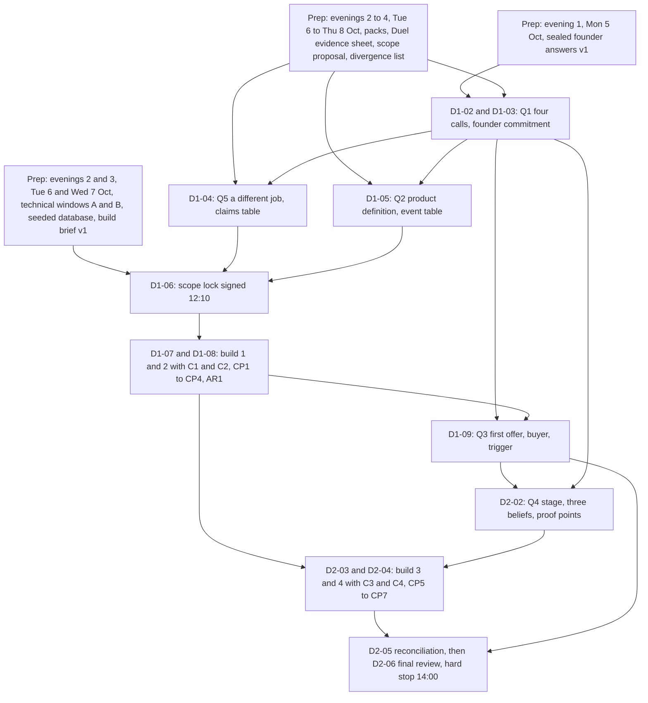

## 1. Success criteria and programme logic

The workshop succeeds if, by 14:00 on Sun 11 Oct, each of the five questions has one answer both founders would say to a stranger, every answer and log entry carries a trust label, and a prototype shows the decided journey on two phones without being mistaken for evidence of demand.

### 1.1 How the programme answers the five questions

Each question is decided in one named session; the last column is the test D2-06 applies.

| Question | Sessions that produce the answer | Preparation inputs (deadline) | Artefact that holds the answer | What "defensible" means |
|---|---|---|---|---|
| Q1 What is Sway? | D1-02; D1-03 | Sealed founder answers v1 (Mon 5 Oct 22:00 UK); divergence list (Thu 8 Oct 22:00 UK) | One-page company thesis (Q1 block under 120 words); four logged calls | Both would say it to a stranger; names a customer and a behaviour; ShopMy, LTK or Duel could not truthfully say it |
| Q2 What does it do? | D1-05; D1-06; D2-05 | Product prep pack (Thu 8 Oct 22:00 UK), including the journey strip with its event column and Tori's A, D and U marks; scope proposal (Thu 8 Oct 22:00 UK). The full attribution event table is not pre-drafted; it is built live at D1-05, which sets aside 14 of its 40 minutes for it | Product definition v1 with the event table; Q2 block under 150 words | One journey; eight or more exclusions; every event row fakeable and counts-once; matches the frozen prototype |
| Q3 How do we sell it? | C1 and C2; D1-09 | Commercial prep pack (Wed 7 Oct 22:00 UK); pricing and packaging hypotheses (Thu 8 Oct 22:00 UK) | Initial sales strategy v1 (Demonstrable / Hypothetical column); Q3 block under 150 words | One line each for user, buyer, budget holder, trigger, first offer; no unlabelled price; Provisional, because no customer conversation happens before the workshop, with the first three brand conversations due Fri 16 Oct 22:00 UK and the trigger checked Fri 23 Oct 22:00 UK, owner Tori; the launch city named or "not yet chosen"; a currency on every number |
| Q4 How do we raise capital? | C2; D2-02; C3 | Duel public evidence sheet (Tue 6 Oct 22:00 UK); commercial prep pack (Wed 7 Oct 22:00 UK) | Ten-line narrative and 14-slide deck draft; Q4 block under 150 words | No amount, valuation, traction or market size; every headline labelled with a dated gap; slide 11 dated facts only |
| Q5 Dramatically better than Duel? | D1-04; C2; D2-05 | Duel public evidence sheet (Tue 6 Oct 22:00 UK); one alternative desk test (Tue 6 Oct 22:00 UK) | Differentiation thesis (comparison set, ownership paragraph, claims table); Q5 block under 150 words | Three or more demonstrable claims tied to demo beats; Duel from public pages only; "not found publicly"; "better" only inside the question |

### 1.2 Programme logic

Preparation is four evenings, Mon 5 to Thu 8 Oct, with no weekend work and nothing required before Mon 5 Oct: it produces sealed positions and a seeded build environment, Saturday morning spends them on the hardest decisions before the first prompt at 12:55, and Sunday brings product, sales and investor story back into one audited record.

### 1.3 Minimum successful outcome, stretch goals and exclusions

The Saturday ladder (4A.14) and the Sunday ladder (4B.14) fix the floor; nothing below, and no break, dinner or reserve, is traded for time.

At 14:00 on Sun 11 Oct these must exist:

1. Five answers in one document, each labelled; Q1, Q2 and Q5 at least Provisional; Q3 and Q4 at least Draft with owner and date.
2. Decision log with no unlabelled entry and a three-part trigger on every Provisional decision and Open question; signed scope lock (the T9 form, `04_prototype/scope_lock.md`); cut list as struck.
3. The never-cut four on a phone, namely the QR to the recipient (Sam) page, one dominant action, the scan and click_out events, and the scan count for the advocate (Maya); or recording 2 plus the Supabase table; known limitations v1; demo script v2.
4. Product definition v1; differentiation paragraph and comparison set; sales strategy first offer, buyer and trigger; narrative and 14 headlines; product priorities (at least the MVP boundary plus the prototype as built).
5. Execution plan v1 for Mon 12 Oct to Sun 18 Oct with owner and date per action; a status against all eight outputs.

Stretch: six acceptance tests passing at CP5 (Sun 09:55); three clean cold runs at CP7 (11:15); the map, wallet sheet and "What is Sway?" page only while the fix list is empty. Q3 cannot be a Decision this weekend and no Validated finding is available, because the four preparation evenings observe no real users; the five-observation floor is first reachable in the follow-through week.

Out of scope: validating demand, retention, affiliate economics or brand interest; any amount, valuation, market size or traction number; real affiliate links, payouts, Wallet passes, sign-up, Sway Points, Collectives; the substance of either employment contract (legal advice booked Tue 13 Oct 22:00 UK); equity, vesting and the founder agreement (Sat 17 Oct 21:00 UK); anything about Duel not on a public page.

### 1.4 Deliverable maturity at the end of the workshop

Nothing leaves Barcelona above Decision and most deliverables sit at Draft, because preparation is four evenings that observe no real users and no customer conversation happens before the workshop. Follow-through deadlines fall at 22:00 UK on weekdays and 21:00 UK on Sat 17 and Sun 18 Oct; the Fri 16 Oct review call is at 20:00 UK and the Sat 17 Oct call at 10:00 UK (programme choice).

| Deliverable | Maturity at 14:00 Sun 11 Oct | What raises it after the workshop | Owner |
|---|---|---|---|
| 1 One-page company thesis | Decision on the Q1 block; "what we know" lines Draft | Six cold tests (Wed 14 Oct 22:00 UK; Sun 18 Oct 21:00 UK); hero-mechanic review (Sun 18 Oct 21:00 UK) | Tori |
| 2 Product definition | Decision on journey, exclusions and second screen; deferred event rows Draft | Recipient-page cold tests Wed 14 Oct 22:00 UK; Alpha outline Thu 15 Oct 22:00 UK | Blake |
| 3 Differentiation thesis | Draft; demonstrable claims are Demonstrations, the rest Hypothesis | Five community members asked "what does Sway let you do that these do not?" by Fri 20 Nov 22:00 UK (challenge_investor-skeptic.md section 3) | Tori |
| 4 Initial sales strategy | Provisional on the buyer and on the ICP, because no customer conversation happens before the workshop; the rest Draft | Three brand conversations by Fri 16 Oct 22:00 UK, notes in the conversation template, then the trigger checked Fri 23 Oct 22:00 UK; first-offer one-pager Wed 14 Oct 22:00 UK | Tori |
| 5 Fundraising narrative and deck draft | Decision on stage word, three beliefs, proof points, do-not-claim list; slides Draft | Deck v2 with screenshot-backed statistics Fri 16 Oct 22:00 UK | Tori |
| 6 Product priorities | Decision on three columns and the do-not-build list | Alpha outline Thu 15 Oct 22:00 UK; a contract engineer conversation | Blake |
| 7 Working prototype, demo script, known limitations | Demonstration; never evidence of demand | Six cold tests with strangers (Wed 14 Oct 22:00 UK; Sun 18 Oct 21:00 UK) | Blake (prototype); Tori (script); both (limitations) |
| 8 Execution plan | Decision on owners and dates; Open questions carry triggers | Fri 16 Oct review call (20:00 UK) checking each trigger; weekly cadence set Sun 18 Oct 21:00 UK | Tori |

### 1.5 The decision rule and how uncertain decisions are recorded

The rules card signed at D1-01 (Sat 10 Oct 09:00) fixes nine rules; rule 6 is how a disagreement leaves the room.

1. Positions are written before they are spoken; nothing is edited after the swap.
2. The timebox is the arbiter; a logged decision is not reopened the same day unless a new fact appears.
3. The domain owner decides provisionally after restating the other's objection: Blake on product definition, UX, journey, prototype scope, priorities and the do-not-build list (Q2); Tori on positioning, ICP, buyer, offer, pricing hypotheses, first customers and the deck's argument (Q3). Q1, Q4, Q5, the launch city, founder commitment and decision rights are joint, Tori's originator view recorded verbatim, Blake abstaining on non-public Duel content.
4. A joint item unresolved at the timebox takes the option cheaper to reverse with evidence sooner, or if tied the option closer to the source-of-truth documents, labelled Provisional with dissent verbatim.
5. One of six labels per entry: Decision, Provisional, Draft, Demonstration, Validated finding (count, date, founder's name; under five observations stays a Hypothesis), Open question; a working demo or founder agreement validates nothing.
6. Every Provisional decision or Open question carries a three-part trigger: observation in numbers, check date, reporting founder. Worked example: "Hero mechanic = Sway Pass. Provisional. Dissent: Tori expects the card in the chat to be used more. Trigger: reopen if the Pass is offered in fewer than one in five recommendation moments in the six post-workshop cold tests and the first cohort's first two weeks, or if median scan-to-page exceeds 15 seconds; check Sun 18 Oct 2026 21:00 UK and Fri 20 Nov 2026 22:00 UK; owner Blake." Other trigger forms the workshop should use: "reopen if fewer than 3 of 10 cold-test recipients tap the dominant action first, by Fri 20 Nov 22:00 UK, owner Blake"; "reopen if the first brand marketer to hear the offer names a different budget line, by Fri 23 Oct 22:00 UK, owner Tori".
7. The prototype wins in the room, the evidence afterwards: claims downgrade to Hypothesis and the scope lock is never reopened to rescue one.
8. No decisions by exhaustion: nothing strategic after 18:00 on Sat 10 Oct or inside a reserve; the Sunday hard stop is fixed.
9. Build tie-breakers: Tori strikes from the cut list, Blake cannot add; Blake decides whether a fix is attempted or moved to known limitations.

A provisional decision is one line in the log, in this exact form:

"[Topic] = [option chosen]. Provisional. Dissent: [founder] [position, verbatim]. Trigger: reopen if [observation, in numbers where possible]; check [Day DD Mon YYYY HH:MM UK]; owner [founder]."

### 1.6 The three tensions resolved first, and why

D1-02 settles four calls from sealed positions, hardest first, because every later session inherits them; three are the tensions below, and the fourth, the single-player value sentence, is the test each must pass (challenge_consumer-behaviour.md objection 3).

1. Sway Pass versus Sway Link as the hero (context_audit.md tension 5.2; challenge_consumer-behaviour.md objection 1). HYPOTHESIS: a personal QR gets scanned in real social moments, the audit's top-ranked untested assumption. FACT (search snippet, https://get.talkable.com/wallet-pass): brand-scoped QR referral exists, so only the person-owned, cross-brand version is, as far as found, unclaimed. First because it sets the D1-05 journey strip, the demo's first beat and the D1-04 comparison set, and the same routes serve either choice.

2. Who pays first and when brands enter (context_audit.md tension 5.1; challenge_brand-buyer.md objection 1; challenge_investor-skeptic.md objection 2). Current lean on paper: consumer-first (FOUNDER DECISION in 04_COMMERCIAL_AND_LAUNCH.md); treated as a HYPOTHESIS until D1-02 call (c) decides. The buyer's chair finds no budget line for "seeing" and cites a Duel reviewer's "difficulty in proving emotional advocacy's financial worth to the business" (search snippet, https://www.g2.com/products/duel/reviews); the investor's chair says Tori then has nothing to sell for months. Each option on the card changes Tori's C1 first-offer work, the D1-09 buyer and the D2-02 stage framing.

3. Money shown or hidden in the first cohort (context_audit.md tensions 5.4 and 5.14; challenge_consumer-behaviour.md objection 4). HOKA's programme is reported at 5 per cent full price and 3 per cent sale (https://www.hoka.com/en/us/hoka-affiliate-program.html, search snippet; conflicting third-party figures; [UNVERIFIED] until the affiliate coverage spot check, Wed 7 Oct 22:00 UK), so a GBP 100 purchase would leave about GBP 1 for Sway (ILLUSTRATIVE under the 80/20 HYPOTHESIS). A visible commission changes what a recommendation means between friends, and the disclosure line makes it visible regardless. First because it decides the Locker's first screen, the earnings label, the disclosure line in build brief v2 at 12:10 and the D2-02 do-not-claim list.

The divergence list excludes these calls, so each founder first reads the other's position at the D1-02 swap step.

### 1.7 The numbers, audited

Every clock chain, timebox and workload figure in the programme closes, and the sums below are the ones to check on the wall if a block moves.

Day totals:

| Schedule | Blocks in order (minutes) | Sum | Runs | Clock chain |
|---|---|---|---|---|
| Sat 10 Oct, primary | 10+50+15+15+40+40+20+45+120+15+125+5+30+10+30 | 570 (9h30) | 09:00 to 18:30 (18:00 if D1-CT is unused) | 09:10, 10:00, 10:15, 10:30, 11:10, 11:50, 12:10, 12:55, 14:55, 15:10, 17:15, 17:20, 17:50, 18:00, 18:30 |
| Sun 11 Oct, primary (18:30 departure) | 5+25+55+15+35+5+30+45+15+40+30+30 | 330 (5h30) | 09:00 to 14:30 | 09:05, 09:30, 10:25, 10:40, 11:15, 11:20, 11:50, 12:35, 12:50, 13:30, 14:00, 14:30 |
| Sun 11 Oct, extension (departure 20:00 or later) | 5+25+55+15+35+5+30+45+15+65+55+40+30 | 420 (7h00) | 09:00 to 16:00 | unchanged to 12:50, then 13:55, 14:50, 15:30, 16:00 |
| Sun 11 Oct, early flight (departure 17:00 to 18:00) | 5+20+50+15+25+20+45+30+30 | 240 (4h00) | 09:00 to 13:00 | 09:05, 09:25, 10:15, 10:30, 10:55, 11:15, 12:00, 12:30, 13:00 |

Hands-on build: 120 + 125 + 55 + 35 = 335 minutes (5h35) against the 5 hours 30 minutes floor in prototype_feasibility.md; 400 minutes (6h40) in the extension; 320 minutes (5h20) in the early-flight variant, below the floor, which is why the flight booking asks for 18:30 or later. Inside the 335, checkpoints, runs and the cheat test take 5 + 5 + 10 + 5 + 15 + 10 + 13 + 10 = 73 minutes (CP1, CP2, CP3, CP4, AR1, CP5, the three cold runs, the cheat test), leaving 262 minutes of pure prompting.

Checkpoint clock on hands-on minutes: CP1 at 0:25 (13:20); CP2 at 1:25 (14:20); build 1 ends at 2:00 (14:55); CP3 at 2:40 to 2:50 (15:50 to 16:00); CP4 at 3:45 to 3:50 (16:55 to 17:00); AR1 at 3:50 to 4:05 (17:00 to 17:15); CP5 at 4:30 to 4:40 (09:55 to 10:05); build 3 ends at 5:00 (10:25); CP6 at 5:00 (10:40); CP7 at 5:35 (11:15).

Internal timebox sums (every session closes at its block length):

| Session | Steps (minutes) | Sum |
|---|---|---|
| D1-01 | 3+3+2+2 | 10 |
| D1-02 | 6+6+28+6+4; the 28 is four calls at 7 (4 to state, 2 on the D marks, 1 to decide and write the trigger) | 50 |
| D1-03 | 3+3+6+3 | 15 |
| D1-04 | 5+15+8+8+4; the 15 is sheets A 3, B 3, C 4, D 2, E 2, close 1 | 40 |
| D1-05 | 5+6+14+9+6; the 14 is 4 to read the marks, 8 to resolve every D and U cell, 2 to confirm a counts-once rule on every row | 40 |
| D1-06 | 4+5+5+4+2 | 20 |
| D1-07 | Blake 25+5+55+5+30; Tori 25+5+25+30+5+20+10 | 120 |
| D1-08 | Blake 40+10+55+5+15; Tori 40+10+20+35+5+15 | 125 |
| D1-09 | 6+6+12+6 | 30 |
| D1-10 | 4+3+3 | 10 |
| D2-01 | 2+2+1 | 5 |
| D2-02 | 4+4+11+6; the 11 is stage word 1, beliefs 3, proof points 3, why us 3, do-not-claim 1 | 25 |
| D2-03 | Blake 25+10+20; Tori 25+10+20 | 55 |
| D2-04 | 2+13+10+10 (CP6; three cold runs; cheat test; reset re-run, exports, sync and CP7) | 35 |
| D2-05 | 4+12+7+7 | 30 |
| D2-06 | 6+14+12+8; the 14 is about 2 minutes 45 seconds per question (5 x 2.75 = 13.75) | 40 |
| D2-07 | 10+10+10 | 30 |
| D2-04X (extension only) | 30+20+15 | 65 |

Two people can do it: Blake's build minutes never overlap with a session he leads; Tori's checkpoint duties total 40 minutes on Saturday (CP1 5, CP2 5, CP3 10, CP4 5, AR1 15) and 45 minutes on Sunday (CP5 10 and the whole of D2-04, 35), all inside her commercial blocks; every checkpoint falls inside a build block where Blake is already at the laptop; no session needs a third person.

Dependencies: D1-02 (hero mechanic, single-player value, money default) precedes D1-05 (journey, event table), which precedes D1-06 (scope lock), which precedes the first build minute at 12:55; D1-03 (full-time date, owners) precedes D2-02 (why us) and D2-05 (execution plan); D1-04 (demonstrable claims) precedes D1-06 so the demo beats map to claims; D1-02 call (c) precedes D1-09 (first offer); D1-09 and D1-04 precede C2's narrative and headlines, which precede D2-02; D2-02 precedes C3 (slide table); CP4 precedes AR1, which precedes the Sunday fix list; CP7 and C3 precede D2-05; everything precedes D2-06; no session depends on a later one.

Preparation: Blake 435 minutes (7h15) and Tori 395 minutes (6h35) over four evenings, Mon 5 to Thu 8 Oct, each with a 22:00 UK deadline; no preparation falls on a weekend and nothing is required before Mon 5 Oct. Blake 90, 100, 120 and 125 minutes; Tori 90, 105, 105 and 95 minutes; longest evenings Blake Thu 8 Oct 125 minutes and Tori Tue 6 Oct and Wed 7 Oct 105 minutes each. The shared 30-minute call on Thu 8 Oct 21:00 UK sits inside both Thursday budgets, and the category breakdown is the table in section 3.1.

Follow-through week: Blake 540 minutes (9h00; 9h45 with the conditional recipient-page iteration) and Tori 690 minutes (11h30; 12h30 if brand calls 4 and 5 take the Wednesday evening and the offer moves to Sat 17 Oct 21:00 UK). Tori carries the customer conversations that moved out of preparation: 30 minutes of outreach on Mon 12 Oct and three conversations of about 40 minutes by Fri 16 Oct 22:00 UK. Both totals are a proposed workload, pending each founder's availability.
