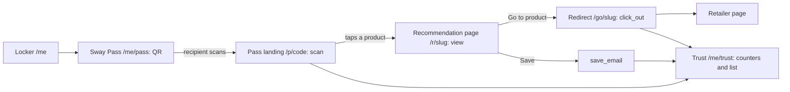

## 5. Prototype delivery plan

The prototype makes one decided journey run on two phones by 12:56 on Sun 11 Oct, inside 5 hours 35 minutes of hands-on build, with nothing added after the scope lock at 12:10 on Sat 10 Oct. Session IDs, times and checkpoint names are the skeleton's exactly. Journey roles are the advocate (Tori persona) and the recipient (Blake persona); the founders are Blake (builds) and Tory (tests, keeps the cut list, writes the demo script). Where the skeleton is silent the simplest option is chosen and marked "(programme choice)".

### 5.1 How the core journey is selected

One journey is chosen against seven criteria from three live candidates on one set of routes: the hero mechanic at D1-02, the journey detail at D1-05, the lock at D1-06, all on Sat 10 Oct.

The seven criteria, all required: (1) it shows the observable part of the attribution chain, advocate to product to recommendation to recipient to click_out, and the advocate seeing it (context_audit.md 1.10: the chain runs to purchase where visible; purchase is not shown); (2) two people can show it on two phones in one room with no third party, sign-up or network approval; (3) a non-engineer can build it with a chat-driven tool in 5 hours 35 minutes on seeded tables; (4) every demo beat maps to a claim marked demonstrable at D1-04; (5) it sits inside the MVP durable core (context_audit.md 1.6): no Sway Points, Collectives or brand screens; (6) it survives the cut list down to the never-cut four; (7) it serves whichever hero mechanic D1-02 call (a) chooses (Sway Pass, Sway Link, or a card sent into the chat) without a new screen.

| Candidate | Journey | Verdict |
|---|---|---|
| A Personal Sway Pass | The advocate builds My 5 into a Locker, opens the Sway Pass, the recipient scans, lands on the Pass landing then the recommendation page, acts, and the advocate sees the outcome on Trust | Recommended default; passes all seven; Blake's scope proposal (Sun 4 Oct 21:00 UK) is written on it |
| B Product-specific QR first | As A, but the advocate features one product on the Pass and the QR resolves straight to the recommendation page | Same routes; depends on cut-list item 4; closed at D1-05 (context_audit.md 5.10) |
| C Sway Link first | The advocate sends the Sway Link into a chat on the recipient's phone; same page and outcome; the Pass shown second | Same routes; applies if D1-02 picks the Link or the card; the demo opens with the Link on Tory's phone |

Rejected: advocate onboarding (sign-up, then My 5 into an empty Locker) fails criteria 2, 3 and 6; a brand view of a Trust Map or Collective fails 4, 5 and 6.

Where the choice is made, all FOUNDER DECISIONS: D1-02 (09:10 to 10:00) call (a) decides the hero mechanic from sealed positions, logged with its review trigger (Pass offered in fewer than one in five recommendation moments, or median scan-to-page over 15 seconds, reopens it). D1-05 (11:10 to 11:50) fixes the journey strip, the recipient's second screen, the sign-up moment (a design point, not built), the earnings label on or off, the disclosure line "[advocate persona] may earn if you buy" and the persona names, and closes the one open choice left after D1-02 (personal Pass or product-specific QR first; the hero mechanic itself is D1-02 call (a)); an unagreed second screen leaves the product page Provisional with the six cold tests (Sun 18 Oct 21:00 UK, interim read Wed 14 Oct) as trigger. D1-06 (11:50 to 12:10) locks it by signature, because the proposal and Tory's three written challenges (Tue 6 Oct 22:00 UK) exist before the room.

### 5.2 Scope lock: D1-06, Sat 10 Oct 11:50 to 12:10, signed at 12:10

Scope locks when Tory signs the lock sheet at 12:10; from then Blake may not add and Tory may only strike. The sheet is the T9 form (section 6.10), printed on Thu 8 Oct. The sheet, `04_prototype/scope_lock.md` (programme choice), is one page filled in this order:

1. Journey in one sentence; hero mechanic from D1-02 call (a); personal Pass or product QR first, from D1-05.
2. Persona names for the screens (placeholders: Maya recommends, Sam scans; no founder's name on a screen).
3. Disclosure line wording; earnings label wording, or "label off".
4. Six screens with routes: `/me`, `/me/pass`, `/p/<code>`, `/r/<slug>`, `/go/<slug>`, `/me/trust`.
5. Six acceptance tests, test 6 without the map: at least one scan, the event list with a city, "1 pending".
6. Must work / may be mocked / deferred (5.3, amended in the room), each demo beat mapped to a D1-04 claim.
7. Cut list 1 to 7 and the never-cut four (5.8).
8. Checkpoint times for the wall card: CP1 13:20, CP2 14:20, CP3 15:50, CP4 16:55, AR1 17:00, CP5 09:55, CP6 10:40, CP7 11:15.
9. Tory's three challenges answered in one line each; brief v2 pasted into the tool's project instructions, under 600 words; both signatures and the sentence said aloud: "No new features after 12:10; new ideas go to the parking lot."

Fallback: not signed by 12:10, the scope proposal as written is the scope with persona names updated; the build starts at 12:55 regardless; disagreements are logged Provisional with Tory's cut-list authority intact.

### 5.3 Must work, may be mocked, deferred

These three tables are the whole scope; anything in none of them is out. NC marks the never-cut four. Everything is checked on the published URL from a cleared tab, never the preview.

Must work:

| Item | Why | Acceptance test |
|---|---|---|
| `/me` Locker: five seeded products with image, brand, name, reason | The Locker is the product home (non-negotiable 4) | Test 1 |
| `/me/pass` QR encoding `/p/<code>` (NC) | "The real-world counterpart of an affiliate link" (non-negotiable 5) | Test 2: a second phone's camera opens `/p/<code>` within 3 seconds |
| `/p/<code>` inserting a `scan` event (NC) | The first attribution event | Test 2 plus a `scan` row with today's timestamp |
| `/r/<slug>`: product, who, why, one dominant button, disclosure line (NC) | Product, who, why, one action in five seconds; the honesty guardrail on screen | Test 3 plus Tory's five-second test at CP3 |
| `/go/<slug>` inserts `click_out` then redirects (NC) | Logged before the retailer loads, so a slow retailer cannot break the beat | Test 4 |
| `/me/trust`: scan count (NC), clicks, saves, the label "N pending, eligibility not yet confirmed", event list with time, type, city, product | The advocate must see it happened; counters derived from `events`, never stored | Test 6; counters change after Tory scans again at CP4 |

May be mocked (honest on screen, said aloud in the demo):

| Item | Why | Acceptance test |
|---|---|---|
| Advocate identity: one seeded `users` row, no login | Authentication is the commonest weekend time sink (prototype_feasibility.md section 0) | No page asks for a login |
| Wallet: the plain heading "Sway Pass" and one line "Wallet pass coming soon" | FACT (primary page fetched, https://developer.apple.com/documentation/walletpasses/building-a-pass): a real pass needs a pass type identifier, a signing certificate and a PKCS #7 signature; Apple's badge artwork may not be recreated; the mock sheet is cut-list item 1, built on Sunday only if the fix list is still empty at 10:15 | The line is visible; no Apple or Google artwork |
| Affiliate link: `/go/<slug>` redirects to `product_url` unchanged | Approvals take weeks; a pending earning on a non-commissionable product fabricates the mechanism (prototype_feasibility.md 4.2) | Redirect target equals the seeded URL |
| City: every live event gets "Barcelona", 41.3874, 2.1686 | Both phones in one city; carrier IP lookups are often wrong | The list shows "Barcelona" on a live scan |
| Earnings label "N pending, eligibility not yet confirmed", no currency | Honest placeholder for pending, confirmed, reversed states that cannot exist yet; D1-05 may turn it off | Test 6 shows "1 pending" after one click |
| Seeded history: 6 to 10 `events` rows, `is_demo_seed` true, captioned "Demo data plus live scans" | The outcome screen must not be empty before the first live scan | Seeded rows survive the reset |
| Product images in the founders' own Storage bucket; save by email with a founder-controlled test address only (programme choice) | Hotlinked images fail; a real recipient email is personal data | Images load in under 3 seconds; test 5 with the test address |

Deferred (a spoken line in the demo at most):

| Item | Why | Acceptance test |
|---|---|---|
| Sign-up, login, recipient-to-member join flow | Outside the loop; the sign-up moment is a D1-05 design point | No route offers it |
| Sway Points, Progress | Two currencies to explain; the Alpha "may test" them | "Sway Points" on no screen |
| Founding Member Collective, Brand Collective, brand screens | Later layers (context_audit.md 1.6 and 3.9) | Not present |
| Real affiliate parameters, purchase attribution, commission amounts, real wallet passes | Approvals, reversal states and issuer accounts are weeks away; a currency figure would be invented | No currency symbol; wallet mocked only |
| IP geolocation; the Leaflet map | Stretch only; the map is cut-list item 2, built only if the fix list is empty at CP5 | If built, a dot; if not, the list |
| Image scraping, search, discovery, notifications, payments, native apps, dark mode; a separate Sway Link screen | Not needed to prove the loop; discovery is outside the MVP boundary (context_audit.md 3.12); the same routes serve the Link as a URL sent by message | Not present; the URL sent as text opens the same page |

### 5.4 Build brief v2 for the AI coding tool (copy-ready)

The brief is pasted into the tool's project instructions at D1-06 and driven one screen per prompt ("Now build screen 2 as described"). Tool: Lovable Pro connected to the founders' own Supabase project `sway-proto`, published to the lovable.app address; fallback Bolt.new (free tier, upgraded only if the Sun 27 Sep test needs it; plan per the checkout page, search snippet) on the same Supabase project, deployed to Netlify; last resort the existing clickable prototype plus a static recommendation page with the printed QR (prototype_feasibility.md section 0; ASSUMPTION until technical windows 1 and 2 on Sun 20 Sep and Sun 27 Sep confirm both connections). Angle-bracket fields come from the lock sheet. If D1-05 turns the label off, screen 6 drops the "Earnings" line and test 6 loses "1 pending"; if item 4 is struck before the build, the "Feature a product" sentence goes.

---

**Sway build brief v2**

**Goal.** Build "Sway", a mobile-first web app demonstrating one journey. An advocate has a Locker of five products, each with an image and a reason. She opens her Sway Pass, a QR code. A recipient scans it with a phone camera and lands on a recommendation page. The advocate then sees the outcome: a scan count, an event list and a pending label. Every step must work on a phone over mobile data. Build the screens in order; nothing else.

**Users.** One seeded advocate: the single row in `users`. Show her `display_name` wherever a name is needed; never hard-code a name. No login anywhere; her pages live under `/me`. Recipients are anonymous phone visitors.

**Screens.**

1. `/me` Locker. Title "<display_name>'s Locker". Her five `locker_items` (`is_my5` true, ordered by `position`): large image, brand, name, reason. Buttons "View my Sway Pass" and "Add a product" (sheet: pick from `products` or enter details).
2. `/me/pass` Sway Pass. Heading "Sway Pass", her name, and a QR (qrcode.react, SVG, 260 px, level M) encoding `https://<app-url>/p/<pass code>`. Below, "Feature a product": tapping one of her five creates a `recommendations` row (8-character slug, `reason_snapshot`, `pass_id`) and switches the QR to `/r/<slug>`. Under the QR, one line: "Wallet pass coming soon".
3. `/p/<code>` Pass landing (recipient). On load insert an `events` row: type `scan`, `user_id`, `pass_id`, city "Barcelona", lat 41.3874, lng 2.1686. Show "<display_name> recommends" and her five products; tapping one opens `/r/<slug>`, creating the recommendation if none exists.
4. `/r/<slug>` Recommendation page (recipient). Insert a `view` event. Show product image, brand, name, "Recommended by <display_name>", her reason, one dominant button "Go to product" linking to `/go/<slug>`, a secondary "Save to my email" field that inserts a `save_email` event, the line "<display_name> may earn if you buy", and one line of text: "Sway: recommendations from people you know". Fits one phone screen above the fold.
5. `/go/<slug>` Redirect. Insert a `click_out` event, then redirect to the product's `product_url` unchanged.
6. `/me/trust` Trust. Three counters from `events` for the advocate: scans, product clicks, saves. Under them a list (time, type, city, product). The line "Earnings: N pending, eligibility not yet confirmed", N being the `click_out` count. Caption "Demo data plus live scans". No map (a map is added on Sunday only if the fix list is empty at CP5; that prompt overrides this line).

**Data.** Use the connected Supabase project. The tables `users`, `products`, `locker_items`, `passes`, `recommendations` and `events` exist and are seeded. Do not rename or recreate them. Allow anonymous reads on all six and anonymous inserts on `events`, `locker_items` and `recommendations`. Add no authentication.

**Must work.** The QR scans from a phone camera and opens over mobile data. Events are inserted for `scan`, `view`, `click_out` and `save_email`. Trust counters change after a refresh.

**Mocked.** Wallet (one line, no sheet). Affiliate link (plain redirect with our logging). City (fixed default). Earnings (label only, no amounts).

**Out of scope.** Sign-up, login, Sway Points, Collectives, brand screens, notifications, payments, native apps, dark mode, maps (see screen 6), geolocation, image scraping.

**Style.** Clean and product-forward: white background, one accent colour, large product images, system font, big touch targets, short human copy.

**Acceptance tests.**

1. `/me` on a phone shows five products with images and reasons.
2. Scanning the QR on `/me/pass` with a second phone opens `/p/<code>` within 3 seconds.
3. Tapping a product opens `/r/<slug>` with product, "Recommended by <display_name>", the reason, one dominant button and the "may earn" line.
4. "Go to product" reaches the retailer page and a `click_out` row exists.
5. Saving with the test email creates a `save_email` row.
6. `/me/trust` shows at least one scan, the event list with a city, and "1 pending".

---

### 5.5 Blake's implementation responsibilities and Tory's parallel work

Blake builds in four blocks totalling 5 hours 35 minutes (6 hours 40 minutes in the extension variant) while Tory works the commercial track at the same table and stops only for checkpoints.

| Block and time | Blake builds (minutes) | Tory in parallel | Tory's output |
|---|---|---|---|
| D1-07, Sat 12:55 to 14:55 (120) | (25) screen 1 `/me` from the seeded tables, publish; (5) CP1 13:20; (55) screen 2 `/me/pass` ("Feature a product" only while item 4 holds) and screen 3 `/p/<code>` with the scan insert, publish; (5) CP2 14:20; (30) start screen 4 `/r/<slug>` | C1: buyer map for two archetypes (footwear or apparel with retail distribution; DTC supplement); ICP in five lines; user, buyer, budget holder, trigger; first-offer options against D1-02 call (c); objections with the best honest answer; thesis scaffold from the Q1, Q5 and Q2 blocks; CP1 and CP2 (5 min each) | Sales strategy fields T4.1 to T4.6 and T4.9 in `03_commercial`; thesis scaffold; checkpoint log rows |
| D1-08, Sat 15:10 to 17:15 (125) | (40) screen 4 with the disclosure line and screen 5 `/go/<slug>`, publish; (10) CP3 15:50 to 16:00, recording 1, GitHub sync; (55) screen 6 `/me/trust` (counters, list, earnings label, default city): the first 5 minutes one batched prompt for Tory's CP3 copy suggestions; the last 2 minutes `reset_note.md` written and run once; publish; (5) CP4 16:55; (15) AR1 17:00 to 17:15: fix list v1 in demo-impact order from Tory's calls, sync, save | C2: pricing and packaging hypotheses labelled; acquisition through community nodes; first-customer plan as three brand types; the D1-04 claims table completed; fundraising narrative in ten lines and 14 headlines with evidence label and gap, no amounts; CP3 with the five-second test (10 min); CP4 (5 min); AR1 (15 min) running the six tests and writing one demo beat per test | Sales strategy fields T4.7, T4.8, T4.10; claims table; narrative and headlines; demo script v1 |
| D2-03, Sun 09:30 to 10:25 (55) | (25) fix list v2 top down, publish after each, nothing new; (10) CP5 09:55 to 10:05; (20) remaining fixes; the Leaflet map only if the list is empty at CP5 (revert to the list within 10 minutes if it breaks the page); wallet sheet and "What is Sway?" page only if still empty at 10:15; else copy tidy on the recipient page | C3: deck draft v1, the 14-slide table from the D2-02 decisions (slide 11 dated facts only; slide 13 milestone thresholds, no amounts); demo script v2 skeleton against the real screens; CP5 (10 min) with screenshots of failures | Deck draft v1; demo script v2 skeleton; fix list v2 status |
| D2-04, Sun 10:40 to 11:15 (35) | (2) CP6 freeze logged; (13) three cold runs, each after the reset, fixing and restarting once at most, run 3 recorded as recording 2; (10) cheat test; (10) reset re-run, seed CSVs, GitHub sync, CP7 | C4: recipient in the runs with the stopwatch from "can I see that?"; cheat test; known limitations v1 under five headings; demo script v2 timed under four minutes, leading with the D1-02 hero | Known limitations v1; demo script v2 timed |
| D2-04X, extension only, Sun 12:50 to 13:55 (65) | (0 to 30) remaining fixes, publish after each; (30 to 50) one cut-list item only if the list is empty (the map, else the wallet sheet, else the "What is Sway?" page, else the "Add a product" sheet); (50 to 65) two more cold runs, recording 3; anything that breaks a run reverted with Lovable's version history within 10 minutes | Deck v1 tidy and the nine-prompt self-check during minutes 0 to 50; recipient in the runs from minute 50; limitations updated; script re-timed if the hero order changes | Recording 3; known limitations v1 updated |

Around the blocks: at D1-TR (Sat 17:15 to 17:20) and D2-TR (Sun 11:15 to 11:20) Blake saves, syncs and closes while Tory lays out her drafts; D1-CT (Sat 18:00 to 18:30) is drawn first by the build only if CP3 is still missing at 17:15 (a CP4 miss goes to Sunday build 3) and never for features; at D2-07 (Sun 14:00 to 14:30) Blake exports the prototype pack to `04_prototype` (URL, both recordings, reset note, seed CSVs, known limitations, demo script). Rules of the track: Tory writes to the templates in `03_commercial` and never edits the build brief; anything she wants changed in the prototype goes to the checkpoint log for the cut list to decide; she does not interrupt between checkpoints except for a tool outage; Blake does not read the commercial files until the session that reconciles them (D1-09, D2-02, D2-05).

### 5.6 Checkpoints

Tory leads every checkpoint on the published URL from a cleared tab, checks the product against her sales claims and the demo script at the same time, and logs Pass, Fix or Cut; the cuts each failure triggers are in 5.8.

| Time | What Blake shows | What Tory brings | What is checked (product; sales claims; demo script) | Pass criterion | If failed |
|---|---|---|---|---|---|
| CP1 Sat 13:20 to 13:25 | `/me` on the published URL | Buyer map draft | Product: five products with images and reasons on Tory's phone over mobile data; sales and script: nothing yet | Five products with images on Tory's phone | Data connection first (anonymous read prompt), up to 20 minutes; not fixed by 13:45: Bolt fallback (45 minutes) and CP2 moves to 15:10 |
| CP2 Sat 14:20 to 14:25 | The QR on `/me/pass`; `/p/<code>` | ICP; first-offer options | Product: Tory's camera opens `/p/<code>` and a `scan` row with today's timestamp appears; sales: no first-offer option assumes something the Pass does not do; script: the 5.7 beat 2 line ("Scan my Sway") matches the screen | Scan opens the landing and a row exists | "Allow anonymous inserts on events", 10 minutes maximum; still failing at 14:55: the QR points only to `/p/<code>` and CP2 is retried at 15:10 first |
| CP3 Sat 15:50 to 16:00 (minimum demo) | Scan to `/r/<slug>` to `/go/<slug>` to the retailer from a cold tab | Pricing and packaging draft; five-second test sheet | Product: rows for scan, view, click_out, save_email; recording 1; GitHub current; sales: every price labelled [HYPOTHESIS] or sourced, no claim needs a visible purchase; script: product, who, why, one action in five seconds; at most three copy suggestions, batched into one prompt at the start of the screen-6 slot | Whole recipient side works with four rows; recording exists | Everything to 17:00 on the recipient page, the scan and the click; AR1 still runs at 17:00; still missing at 17:15: the reserve 18:00 to 18:30 goes to the build |
| CP4 Sat 16:55 to 17:00 | `/me/trust` counters and list | Claims table complete; narrative in ten lines | Product: counters change after Tory scans again; list shows city and product; sales: each demonstrable claim points at a beat that has passed; script: the 5.7 beat 6 line names a count, not an earning | Counters change on refresh | AR1 runs tests 1 to 5 only; Sunday build 3 spends its first 25 minutes on counters and list |
| AR1 Sat 17:00 to 17:15 | All six routes | Demo script v1, one beat per test as she goes | Product: the six tests from a cleared tab, each called Pass, Fix or Cut; sales: any claim a failed test undermines is marked Hypothetical for D1-09; script: beats ordered to lead with the D1-02 hero | Fix list v1 in demo-impact order before dinner | Whatever exists is tested; never-cut failures go to the top of the list |
| CP5 Sun 09:55 to 10:05 | The fixed build | Deck draft v1 slides 1 to 7 | Product: six tests re-run on two phones, failures with screenshots; deck: no slide describes an unbuilt screen (checked again at D2-05); script: v2 skeleton matches the real screens | Six pass, or never-cut failures sit at the top of the list | A never-cut item failing: all remaining time in build 3 and the fix allowance in build 4 go to it; Tory's deck work continues |
| CP6 Sun 10:40 (freeze) | The build as it stands | Demo script v2 skeleton | Product: nothing new after this minute; script: written against the frozen screens only | Freeze declared aloud and logged | Cannot fail; unfixed items go to known limitations; never un-frozen |
| CP7 Sun 11:15 | Three clean cold runs (run 3 recorded as recording 2); reset re-run | Known limitations v1; demo script v2 timed | Product: three consecutive runs with no intervention, each under four minutes; cheat findings recorded; reset works; sales: the limitations list names every mocked item a claim leans on; script: timed, leads with the hero, ends with the "proves and does not" line | Three clean runs; five-heading limitations list; counts-once rule in the event table | Two of three runs fail (or the once-only restart fails again): D2-06 uses recording 2 plus the Supabase table as the outcome view, live scan shown to CP2 level only |

Two standing rules: the credit balance is read at every checkpoint and a top-up bought at once under 60; Lovable unusable for more than 20 minutes means the Bolt fallback, 45 minutes to return to the last checkpoint, and the next checkpoint treated as missed; on Sunday a Bolt rebuild is attempted only if the outage is known by 09:30.

### 5.7 Testing, fixes and the final demonstration

Testing is one script run the same way every time on two phones, fixes happen only in named windows, and the final demonstration is a timed cold run at 12:50 on Sun 11 Oct with a recording behind it.

The test script (AR1, CP5, the three CP7 runs and D2-06; about four minutes):

1. Blake runs the reset written at D1-08 (`reset_note.md`: delete `events` where `is_demo_seed` is false) and confirms `/me/trust` shows seeded values only. Tory closes every Sway tab and reopens her browser. Both phones on mobile data, Wi-Fi off, brightness at maximum.
2. Blake opens `/me` on the published URL. Test 1: five products with images and reasons.
3. Blake taps "View my Sway Pass". Tory says "can I see that?", starts the stopwatch, opens her camera 20 to 30 cm from Blake's screen and taps the link. Test 2: `/p/<code>` opens; the time is written down (over 15 seconds goes into known limitations and the demo leads with the Link).
4. Tory taps the first product. Test 3: product, who, why, one dominant button and the disclosure line; Tory says what she would tap first.
5. Tory taps "Go to product". Test 4: the retailer page loads, or fails with the click already logged; Blake reads the `click_out` row from the table editor.
6. Tory goes back and saves with the test address. Test 5: "Saved" and a `save_email` row.
7. Blake refreshes `/me/trust`. Test 6: the scan count is one higher, the list shows the scan with "Barcelona", the label reads "1 pending".
8. Tory calls each test Pass, Fix or Cut into the checkpoint log; Blake orders the fix list by demo impact (an item ranks higher if more people would notice it in the demo).

Fixes happen only in these windows: AR1 (the list is written, nothing built); D1-CT Sat 18:00 to 18:30 for CP3 items only (a CP4 miss goes to Sunday build 3); D2-03 Sun 09:30 to 09:55 top down with a publish after each, and 10:05 to 10:25 after CP5, polish only if the list is empty; D2-04 only what breaks a cold run; D2-04X in the extension variant, with anything that breaks a run reverted with Lovable's version history within 10 minutes.

The final demonstration runs inside D2-06 from 12:50 to 12:56 on Sun 11 Oct: Blake runs the reset, then the final cold run with a stopwatch, Blake as the advocate and Tory as the recipient from a cleared tab. The fallback is recording 2 plus the Supabase `events` table as the outcome view. In the extension variant D2-06 runs 13:55 to 14:50 and the demo runs twice, Pass first and Link first. The review's hard deadline is 14:00 (15:30 in the extension).

Demo script v2 template (`04_prototype/demo_script_v2.md`; Tory owns; timed under four minutes; leads with the D1-02 hero):

- Header: version; date and time; timed length of the last clean run; hero mechanic; persona names; "reset run: yes".
- Opening line (10 seconds): the Q1 answer sentence, then "What you are about to see demonstrates one journey. It is not evidence that anyone wants it."
- Six beats, one per acceptance test:

| Beat | Who acts | Line said | Test; D1-04 claim | Limitation said aloud |
|---|---|---|---|---|
| 1 Locker | Blake as the advocate | "Five things actually worth the money, with the reason for each" | Test 1; a consumer-owned Locker across brands | "Products are seeded" (if item 3 is cut) |
| 2 Sway Pass | Blake shows `/me/pass`; Tory says "can I see that?" and scans | "Scan my Sway" | Test 2; an in-person recommendation that is observed | "The Pass will live in the phone's wallet; today it lives on this screen" |
| 3 Recommendation page | Tory taps a product | "Product, who, why, one action, and the line that says [advocate persona] may earn if you buy" | Test 3; the recipient sees a person, not a brand | "The city is fixed to Barcelona" |
| 4 Action | Tory taps "Go to product" | "The click is logged before the retailer loads" | Test 4; an observable event, not a composite metric | "A plain redirect; no affiliate parameter; no purchase is visible" |
| 5 Save | Tory saves with the test address | "Saved for later" | Test 5; a second observable action | "Test address only; the join flow is not built" |
| 6 Outcome | Blake refreshes `/me/trust` | "She sees it happened: one scan, one click, one pending" | Test 6; the advocate sees the outcome | "Pending means eligibility not yet confirmed; nothing has been earned; no purchase is claimed" |

- Closing line (15 seconds): "This proves a person can hold a recommendation identity on a phone, another person can reach it with a camera in seconds, and the first person sees that it happened. It does not prove demand, retention, affiliate economics, purchase attribution, wallet distribution or brand interest."
- Known limitations, five headings, one line per item: what is mocked; what is seeded; what is not built; what the events do not prove; what the cheat test found (self-scan, same-pair repeat scans, refresh loops, back-button re-insert), with the counts-once rule per event as written into the D1-05 event table.
- Fallback line: "If the live run fails, recording 2 plays and the `events` table is the outcome view."

### 5.8 The ordered cut list and what triggers each cut

Items are cut from the top whenever a checkpoint is missed; Tory strikes and Blake cannot add; the never-cut four are protected to the end. A failed credit top-up cuts items 1 to 3 at once.

| Order | Item cut | What remains | Triggered by |
|---|---|---|---|
| 1 | Wallet-styled card polish and the wallet sheets | A plain "Sway Pass" heading over the QR and one line "Wallet pass coming soon" | CP1 not fixed by 13:45 (Bolt switch); CP2 still failing at 14:55; CP3 missed at 16:00; Tory at any checkpoint; never built as a sheet unless the fix list is still empty at 10:15 Sunday |
| 2 | The map | Counters and the event list with city names ("Scanned in Barcelona, 14:32") | Never built unless the fix list is empty at CP5; struck at the CP1 Bolt switch, CP4 missed at 17:00, a never-cut failure at CP5 |
| 3 | The "Add a product" sheet | Seeded products only, said in the demo | CP2 still failing at 14:55; CP3 missed at 16:00 |
| 4 | "Feature a product" on the Pass (product-specific QR) | The QR always points to `/p/<code>`; the recipient picks the product on the landing | CP2 still failing at 14:55; CP3 missed at 16:00; optional from the start if D1-05 chooses the personal Pass first |
| 5 | The "What is Sway?" page | One text line on the recipient page | CP3 missed at 16:00; CP4 missed at 17:00; never built unless the fix list is still empty at 10:15 Sunday |
| 6 | Save by email | A "Save" button that shows a toast and logs the event without an email field | CP4 missed at 17:00; a never-cut failure at CP5 |
| 7 | The pending earnings label | The click count only | A never-cut failure at CP5; D1-05 deciding "label off" |
| Never cut | The QR that opens the recipient page on a phone; the recommendation page with one dominant action; the `scan` and `click_out` events; the scan count on the advocate side | If the four are not working by CP4, stop adding and make exactly the four solid; the Supabase table on the laptop becomes the outcome view, still a true demonstration of event logging, not of purchase attribution | CP4 at 17:00; CP3 still missing at 18:30 puts Sunday in "never-cut four" mode |

Stretch, only in the extension variant's build 5 after CP7 with an empty fix list: one cut-list item in this order: the map (item 2) if not built, then the wallet mock sheet (item 1), then the "What is Sway?" page (item 5), then the "Add a product" sheet (item 3). Nothing outside the cut list's own items is ever added; IP city lookup and "Save as image" are not built.

### 5.9 Known risks and mitigations

Every risk below has a mitigation already in the calendar or the runbooks, and none is mitigated by working past a reserve.

| Risk | Likelihood | Mitigation | Owner and when |
|---|---|---|---|
| The tool adds sign-up and protected routes; the recipient page ends up behind a login | High if not prevented | The brief says no login; on first sight prompt "remove all authentication; all pages are public" | Blake, any prompt |
| Row-level security silently blocks inserts; counts stay at zero | High | Window 1 already exercised an anonymous insert; check the table editor, not the app | Blake, CP2 |
| The published URL is a stale snapshot while the preview looks right | High | Publish after every change; Tory tests only the published URL; close and reopen the tab | Both, every checkpoint |
| Lovable outage | Medium | FACT (search snippet, https://statusgator.com/services/lovable): incidents on 4 and 5 Sep 2026 including Supabase project creation failures. Own Supabase project; GitHub sync at CP3, AR1, CP7; Bolt fallback tested Sun 27 Sep; recordings at CP3 and CP7 | Blake; the 20-minute rule |
| Credits run out in a debugging loop | Medium | ASSUMPTION (search snippet, https://docs.lovable.dev/introduction/plans-and-credits): about one credit per screen-changing message; top-up if under 120 on Wed 7 Oct and under 60 at any checkpoint; one screen per prompt | Blake |
| Supabase free project paused | Medium | FACT (search snippet, https://supabase.com/pricing): pause after about seven idle days; `/hello` loads Wed 23 Sep, Wed 30 Sep, Sat 3 Oct, Wed 7 Oct and Fri 9 Oct; longest gap four days | Blake |
| QR will not scan: too dense, low brightness, glare, inverted colours, an in-app browser | Medium | 260 px, level M, white margin, brightness at maximum, 20 to 30 cm, tested screen-to-screen Sun 20 Sep; paper QR backup; FACT (search snippet, https://support.apple.com/en-us/102680): iPhone Camera reads QR codes natively and offers a tappable link | Both |
| Retailer page blocks the redirect or loads slowly; product images fail | Medium | The click is logged before the redirect; fast-loading URLs and own-bucket images under 500 KB chosen in preparation; show the row and move on | Blake, CP3 |
| No mobile data in the venue, roaming caps, venue Wi-Fi blocking a domain | Low to medium | Both phones on mobile data; laptop hotspot; roaming confirmed Thu 8 Oct [ASSUMPTION]; venue Wi-Fi tested Fri 9 Oct | Both |
| Test scans pollute the counts; Trust inflated by self-scan or repeat scans | Certain in this build | The reset procedure written and run once at D1-08 before AR1 and re-run before every scripted run; the cheat test at D2-04 with every working method in known limitations and the counts-once rule in the event table; not fixed in the prototype | Blake; both at D2-04 |
| Scope creep from the morning decisions; a good demo treated as validation | High | The lock at 12:10 and the parking lot (rules card rule 9); Demonstration label in the log and the "proves and does not" line in every script (rule 5) | Tory; both at D2-06 |

### 5.10 What the prototype is and is not

The prototype is a Demonstration and nothing more: it makes the decided journey tangible on two phones, shows which D1-04 claims can be seen rather than argued, and gives the six post-workshop cold tests something real to put in front of people. It does not validate demand, retention, affiliate economics, purchase attribution, wallet distribution or brand interest, and no log entry, sales claim or slide may cite it as evidence of any of those. HYPOTHESIS: that a recipient will scan a personal QR in a real social moment and act on the page; it stays a hypothesis until the cold tests on Wed 14 Oct and Sun 18 Oct and the first cohort produce counts, dates and a founder's name.
