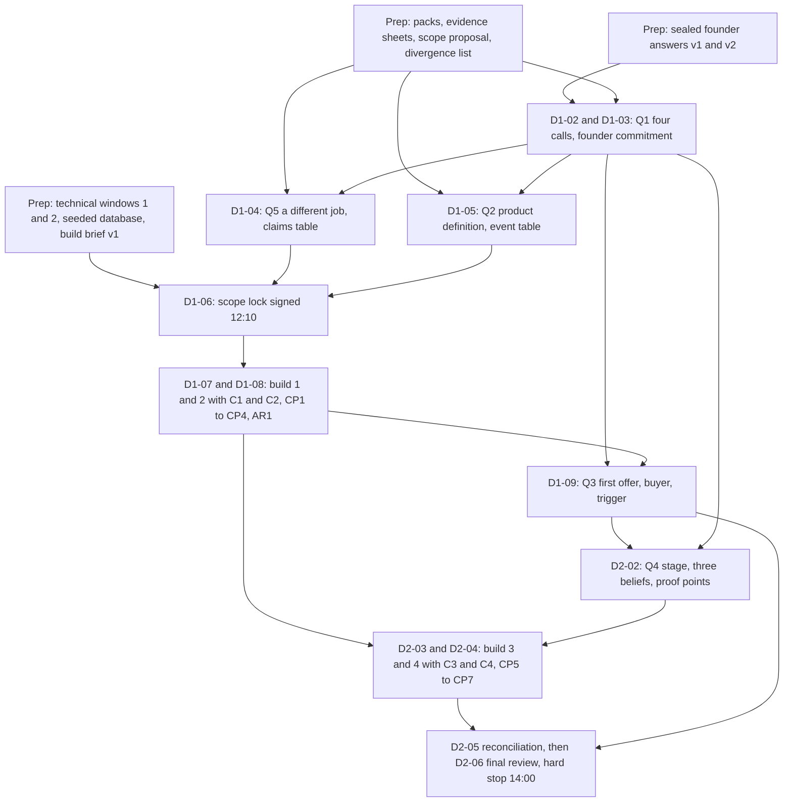

## 1. Success criteria and programme logic

The workshop succeeds if, by 14:00 on Sun 11 Oct, each of the five questions has one answer both founders would say to a stranger, every answer and log entry carries a trust label, and a prototype shows the decided journey on two phones without being mistaken for evidence of demand.

### 1.1 How the programme answers the five questions

Each question is decided in one named session; the last column is the test D2-06 applies.

| Question | Sessions that produce the answer | Preparation inputs (deadline) | Artefact that holds the answer | What "defensible" means |
|---|---|---|---|---|
| Q1 What is Sway? | D1-02; D1-03 | Sealed founder answers v2 (Sun 4 Oct 21:00 UK); divergence list (Tue 6 Oct 22:00 UK) | One-page company thesis (Q1 block under 120 words); four logged calls | Both would say it to a stranger; names a customer and a behaviour; ShopMy, LTK or Duel could not truthfully say it |
| Q2 What does it do? | D1-05; D1-06; D2-05 | Product prep pack (Sat 26 Sep 22:00 UK); scope proposal (Sun 4 Oct 21:00 UK) | Product definition v1 with the event table; Q2 block under 150 words | One journey; eight or more exclusions; every event row fakeable and counts-once; matches the frozen prototype |
| Q3 How do we sell it? | C1 and C2; D1-09 | Commercial prep pack (Sat 26 Sep 22:00 UK); brand notes v2 (Thu 8 Oct 22:00 UK) | Initial sales strategy v1 (Demonstrable / Hypothetical column); Q3 block under 150 words | One line each for user, buyer, budget holder, trigger, first offer; no unlabelled price; Provisional if fewer than two brand conversations (three by Fri 23 Oct, owner Tory) |
| Q4 How do we raise capital? | C2; D2-02; C3 | Evidence register (Sun 4 Oct 21:00 UK) | Ten-line narrative and 14-slide deck draft; Q4 block under 150 words | No amount, valuation, traction or market size; every headline labelled with a dated gap; slide 11 dated facts only |
| Q5 Dramatically better than Duel? | D1-04; C2; D2-05 | Two memos and replies (Sun 4 Oct 21:00 UK); Duel public evidence sheet (Sun 20 Sep 21:00 UK) | Differentiation thesis (comparison set, ownership paragraph, claims table); Q5 block under 150 words | Three or more demonstrable claims tied to demo beats; Duel from public pages only; "not found publicly"; "better" only inside the question |

### 1.2 Programme logic

Preparation produces sealed positions and a seeded build environment, Saturday morning spends them on the hardest decisions before the first prompt at 12:55, and Sunday brings product, sales and investor story back into one audited record.

### 1.3 Minimum successful outcome, stretch goals and exclusions

The recovery plan fixes the floor; nothing below, and no break, dinner or reserve, is traded for time.

At 14:00 on Sun 11 Oct these must exist:

1. Five answers in one document, each labelled; Q1, Q2 and Q5 at least Provisional; Q3 and Q4 at least Draft with owner and date.
2. Decision log with no unlabelled entry and a three-part trigger on every Provisional decision and Open question; signed scope lock sheet; cut list as struck.
3. The never-cut four on a phone (QR to the recipient (Blake persona) page; one dominant action; scan and click_out events; scan count for the advocate (Tori persona)), or recording 2 plus the Supabase table; known limitations v1; demo script v2.
4. Product definition v1; differentiation paragraph and comparison set; sales strategy first offer, buyer and trigger; narrative and 14 headlines; product priorities (at least the MVP boundary plus the prototype as built).
5. Execution plan v1 for Mon 12 Oct to Sun 18 Oct with owner and date per action; a status against all eight outputs.

Stretch: six acceptance tests passing at CP5 (Sun 09:55); three clean cold runs at CP7 (11:15); the map, wallet sheet and "What is Sway?" page only while the fix list is empty; Q3 as a Decision; any Validated finding (five or more observations).

Out of scope: validating demand, retention, affiliate economics or brand interest; any amount, valuation, market size or traction number; real affiliate links, payouts, Wallet passes, sign-up, Sway Points, Collectives; the substance of either employment contract (legal advice booked Tue 13 Oct); equity, vesting and the founder agreement (Sat 17 Oct); anything about Duel not on a public page.

### 1.4 Deliverable maturity at the end of the workshop

Nothing leaves Barcelona above Decision and most deliverables sit at Draft, because the required preparation observes no real users. Follow-through deadlines without a clock time fall at 22:00 UK (programme choice).

| Deliverable | Maturity at 14:00 Sun 11 Oct | What raises it after the workshop | Owner |
|---|---|---|---|
| 1 One-page company thesis | Decision on the Q1 block; "what we know" lines Draft | Six cold tests (Wed 14 Oct; Sun 18 Oct); hero-mechanic review | Tory |
| 2 Product definition | Decision on journey, exclusions and second screen; deferred event rows Draft | Recipient-page cold tests Wed 14 Oct; Alpha outline Thu 15 Oct | Blake |
| 3 Differentiation thesis | Draft; demonstrable claims are Demonstrations, the rest Hypothesis | Five community members asked "what does Sway let you do that these do not?" by Fri 20 Nov (challenge_investor-skeptic.md section 3) | Tory |
| 4 Initial sales strategy | Draft; first offer Provisional if fewer than two brand conversations | Three brand conversations by Fri 23 Oct; first-offer one-pager Wed 14 Oct | Tory |
| 5 Fundraising narrative and deck draft | Decision on stage word, three beliefs, proof points, do-not-claim list; slides Draft | Deck v2 with screenshot-backed statistics Fri 16 Oct | Tory |
| 6 Product priorities | Decision on three columns and the do-not-build list | Alpha outline Thu 15 Oct; a contract engineer conversation | Blake |
| 7 Working prototype, demo script, known limitations | Demonstration; never evidence of demand | Six cold tests with strangers (Wed 14 Oct; Sun 18 Oct) | Blake (prototype); Tory (script); both (limitations) |
| 8 Execution plan | Decision on owners and dates; Open questions carry triggers | Fri 16 Oct review call checking each trigger; weekly cadence set Sun 18 Oct | Tory |

### 1.5 The decision rule and how uncertain decisions are recorded

The rules card signed at D1-01 (Sat 10 Oct 09:00) fixes nine rules; rule 6 is how a disagreement leaves the room.

1. Positions are written before they are spoken; nothing is edited after the swap.
2. The timebox is the arbiter; a logged decision is not reopened the same day unless a new fact appears.
3. The domain owner decides provisionally after restating the other's objection: Blake on product definition, UX, journey, prototype scope, priorities and the do-not-build list (Q2); Tory on positioning, ICP, buyer, offer, pricing hypotheses, first customers and the deck's argument (Q3). Q1, Q4, Q5, the launch city, founder commitment and decision rights are joint, Tory's originator view recorded verbatim, Blake abstaining on non-public Duel content.
4. A joint item unresolved at the timebox takes the option cheaper to reverse with evidence sooner, or if tied the option closer to the source-of-truth documents, labelled Provisional with dissent verbatim.
5. One of six labels per entry: Decision, Provisional, Draft, Demonstration, Validated finding (count, date, founder's name; under five observations stays a Hypothesis), Open question; a working demo or founder agreement validates nothing.
6. Every Provisional decision or Open question carries a three-part trigger: observation in numbers, check date, reporting founder.
7. The prototype wins in the room, the evidence afterwards: claims downgrade to Hypothesis and the scope lock is never reopened to rescue one.
8. No decisions by exhaustion: nothing strategic after 18:00 on Sat 10 Oct or inside a reserve; the Sunday hard stop is fixed.
9. Build tie-breakers: Tory strikes from the cut list, Blake cannot add; Blake decides whether a fix is attempted or moved to known limitations.

A provisional decision is one line in the log, in this exact form:

"[Topic] = [option chosen]. Provisional. Dissent: [founder] [position, verbatim]. Trigger: reopen if [observation, in numbers where possible]; check [Day DD Mon YYYY]; owner [founder]."

### 1.6 The three tensions resolved first, and why

D1-02 settles four calls from sealed positions, hardest first, because every later session inherits them; three are the tensions below, and the fourth, the single-player value sentence, is the test each must pass (challenge_consumer-behaviour.md objection 3).

1. Sway Pass versus Sway Link as the hero (context_audit.md tension 5.2; challenge_consumer-behaviour.md objection 1). HYPOTHESIS: a personal QR gets scanned in real social moments, the audit's top-ranked untested assumption. FACT (search snippet, https://get.talkable.com/wallet-pass): brand-scoped QR referral exists, so only the person-owned, cross-brand version is unclaimed. First because it sets the D1-05 journey strip, the demo's first beat and the D1-04 comparison set, and the same routes serve either choice.

2. Who pays first and when brands enter (context_audit.md tension 5.1; challenge_brand-buyer.md objection 1; challenge_investor-skeptic.md objection 2). FOUNDER DECISION: consumer-first. The buyer's chair finds no budget line for "seeing" and cites a Duel reviewer's "difficulty in proving emotional advocacy's financial worth to the business" (search snippet, https://www.g2.com/products/duel/reviews); the investor's chair says Tory then has nothing to sell for months. Each option on the card changes Tory's C1 first-offer work, the D1-09 buyer and the D2-02 stage framing.

3. Money shown or hidden in the first cohort (context_audit.md tensions 5.4 and 5.14; challenge_consumer-behaviour.md objection 4). FACT (search snippet, https://www.hoka.com/en/us/hoka-affiliate-program.html): HOKA's programme is reported at 5 per cent full price and 3 per cent sale, so a GBP 100 purchase leaves about GBP 1 for Sway under the 80/20 HYPOTHESIS. A visible commission changes what a recommendation means between friends, and the disclosure line makes it visible regardless. First because it decides the Locker's first screen, the earnings label, the disclosure line in build brief v2 at 12:10 and the D2-02 do-not-claim list.

The divergence list excludes these calls, so each founder first reads the other's position at the D1-02 swap step.
